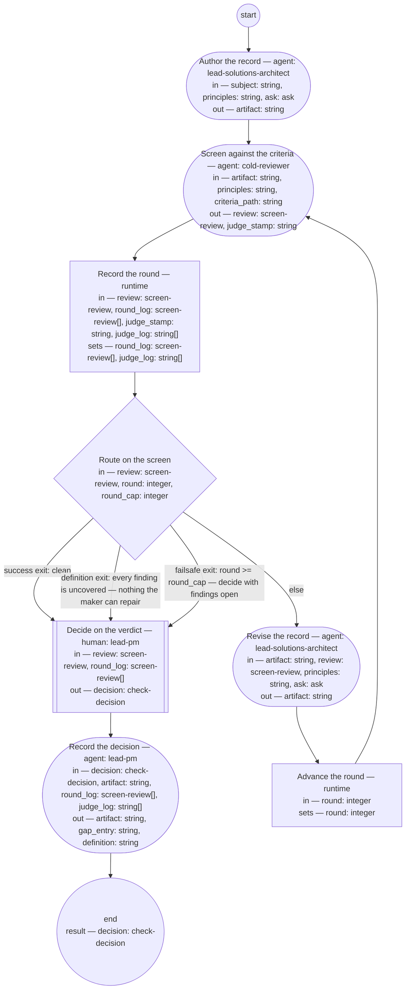

# Adr authoring (compiled from `adr-authoring-process`)

Author one architecture decision record from a decision the solutions architect role or the authority has taken, and check it against the adr fitness set and the architecture principle set, so that the PM role rules from a screen verdict — pass, fail with the criterion named, or a definition change — and the decision bounds nothing until the record is checked.

**The record is the decision made durable, not the discussion transcribed. A finding the criteria cannot name is a missing criterion, and the decision that follows is a definition change, not a verdict on the maker.**

Result of a run: `decision` (check-decision).



## author — Author the record

Run by an agent in role `lead-solutions-architect`. reads: subject, principles, ask · writes: artifact.
- may ask: `lead-pm` — return an `ask` (with default and checkpoint) in place of outputs; at most one per run.
- then: `screen`

Prompt:

```text
Author one architecture decision record for the decision the
subject names, through the adr typedef and guideline. Read the
pre-state only as your role's admissible evidence allows —
lead-shop-held records, never a context's internals. Exactly one
decision: if the subject bundles more, record the first and
return the rest in your output as named candidates for their own
runs. Screen the decision against the architecture principle set
at principles and state the result in the record — conformance,
or the principle it cannot satisfy with the escalation that
carries the exception; never absorb a deviation. If something
the subject does not say is needed — whether a decision is
in scope, another role's domain — return an ask to lead-pm
instead of guessing: the question, its kind, the default you
will apply if unanswered, and a checkpoint holding the draft so
far. On the first pass ask is absent; if it carries an answer or
resolved defaulted, act on it and finish the draft. Return the
record's path as artifact.
```

## screen — Screen against the criteria

Run by an agent in role `cold-reviewer` (fresh context every run). reads: artifact, principles, criteria_path · writes: review, judge_stamp.
- then: `log-round`

Prompt:

```text
State, as judge_stamp, the model and prompt version you judge
as. Read the criteria set at criteria_path, the architecture
principle set at principles, and the record at artifact —
nothing else. Judge the record against every criterion and
against the principle set: does the record's stated screen
result hold when you read the set yourself? Report every finding
with the criterion it fails by name — "principles" for a
conflict with the architecture principle set the record does not
carry as an escalated exception — the quoted text, the change,
and whether you could decide it (confident) or not (wobbly); for
a wobbly finding quote the whole passage, since the PM role
decides from the review alone. A defect no criterion names is a
finding with criterion "uncovered". Verdict "clean" only if
there are no findings; otherwise "findings" with the top three
changes.
```

## log-round — Record the round

Run by the runtime — no agent, no prose. reads: review, round_log, judge_stamp, judge_log · writes: round_log, judge_log.

```yaml
set:
  round_log: round_log + [review]
  judge_log: judge_log + [judge_stamp]
next: route-screen
```

## route-screen — Route on the screen

Run by the runtime — no agent, no prose. reads: review, round, round_cap · writes: —.

```yaml
branches:
- label: 'success exit: clean'
  when: review.verdict == "clean"
  next: decide
- label: "definition exit: every finding is uncovered \u2014 nothing the maker can\
    \ repair"
  when: size(review.findings) > 0 && review.findings.all(f, f.criterion == "uncovered")
  next: decide
- label: "failsafe exit: round >= round_cap \u2014 decide with findings open"
  when: round >= round_cap
  next: decide
- else: revise
```

## revise — Revise the record

Run by an agent in role `lead-solutions-architect`. reads: artifact, review, principles, ask · writes: artifact.
- may ask: `lead-pm` — return an `ask` (with default and checkpoint) in place of outputs; at most one per run.
- then: `advance-round`

Prompt:

```text
Repair every finding whose criterion is named, "principles"
included; leave findings marked "uncovered" as they are — they
are the PM role's to decide. A "principles" finding is repaired
by changing the record's screen statement or escalating the
exception, never by absorbing the deviation. If a repair needs
something the subject does not say, return an ask to lead-pm
instead of guessing: the question, its kind, the default you
will apply if unanswered, and a checkpoint holding the repairs
made so far. On the first pass ask is absent; if it carries an
answer or resolved defaulted, act on it and finish the repairs.
```

## advance-round — Advance the round

Run by the runtime — no agent, no prose. reads: round · writes: round.

```yaml
set:
  round: round + 1
next: screen
```

## decide — Decide on the verdict

Run by a human holding role `lead-pm`. reads: review, round_log · writes: decision.
- then: `record`

Prompt:

```text
From the final review and the round log, decide. Rule first on
the right: whether the role named in the record's decided-by
held the right it exercised is yours to rule, from the roles'
definitions; a record whose decider is the authority is checked
for form only. Then: "pass" — the screen is clean, or its only
findings are uncovered and you judge none of them needs a
criterion — say so in the reasons. "fail" — a named criterion,
"principles" included, is still missed at the round cap, or the
named role did not hold the right — name it.
"definition-change" — an uncovered finding should have been a
criterion, or a criterion the record met produced something
wrong — name the definition and what it lacks. Where both a
missed named criterion and an open uncovered finding stand at
the cap, "fail" takes precedence and the reasons carry the
uncovered finding. Decide from the quotes in the review. Record
your reasons.
```

## record — Record the decision

Run by an agent in role `lead-pm`. reads: decision, artifact, round_log, judge_log · writes: artifact, gap_entry, definition.
- then: `end`

Prompt:

```text
Write into the record's Document History one review entry per
round with its verdict and, from judge_log, the screening
judge's model and prompt version, then a state entry carrying
the decision and its reasons. Set the record's status: "checked"
on pass, "returned" on fail with the criterion named,
"pending-definition" on definition-change. On
"definition-change", write a review entry stating the gap into
the Document History of the definition the decision names;
return that file's path as definition and the entry's text as
gap_entry. Otherwise return both empty. Return the artifact.
```
