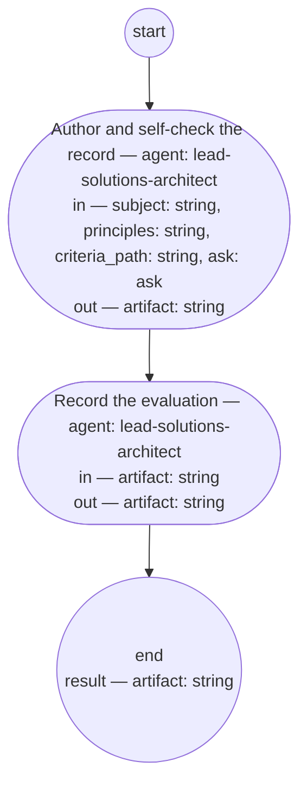

# Adr authoring (compiled from `adr-authoring-process`)

Author one architecture decision record from a decision the solutions architect role or the authority has taken: the architect writes the record, evaluates it against the adr fitness set and the architecture principle set, states that evaluation in the record, and sets it recorded. Runs after the feature whose constraint names the decision, never before a bet.

**The record is the decision made durable, not the discussion transcribed. The architect's own evaluation is the record's last word; a decision this role cannot make under its rights is escalated, never absorbed as a deviation.**

Result of an execution: `artifact` (string).



## author — Author and self-check the record

Run by an agent in role `lead-solutions-architect`. reads: subject, principles, criteria_path, ask · writes: artifact.
- may ask: `lead-pm` — return an `ask` (with default and checkpoint) in place of outputs; at most one per run.
- then: `record`

Prompt:

```text
Author one architecture decision record for the decision subject
names, per the adr typedef. Read the pre-state only as your
evidence rules allow. One decision: if subject bundles more,
record the first and return the rest as candidates. State the
principles screen — conformance, or the principle you cannot
satisfy with its escalation; never absorb a deviation. Evaluate
the record against criteria_path and state that in the Context.
If something subject omits, ask lead-pm: question, kind,
default. First pass, ask is absent; if answered or defaulted,
act and finish. Return the record's path.

Return each declared output on its own line as `<name>: <value>` — artifact — a list as a JSON array, a value with line breaks as a JSON string; these lines close your reply. In place of the outputs, an ask: a line `ask:` then, each on its own line, `to`, `kind`, `question`, `default`, and `checkpoint` as `<field>: <value>`.

Do not use these words: ratif, disposition, rebaseline bill, surface, seat
```

## record — Record the evaluation

Run by an agent in role `lead-solutions-architect`. reads: artifact · writes: artifact.
- then: `end`

Prompt:

```text
Write one Document History row stating your evaluation against
the adr fitness set and the architecture principle set, and set
the record's status to recorded. Return the record.

Return each declared output on its own line as `<name>: <value>` — artifact — a list as a JSON array, a value with line breaks as a JSON string; these lines close your reply.

Do not use these words: ratif, disposition, rebaseline bill, surface, seat
```
