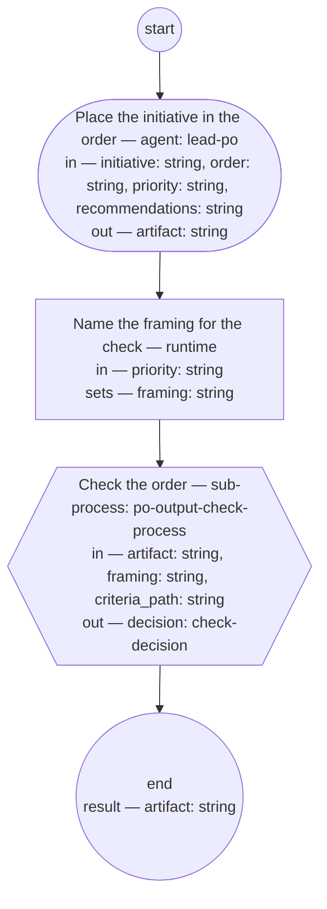

# Backlog ordering (compiled from `backlog-ordering-process`)

Place a planned initiative's features-to-be in the backlog order: the PO role writes the superseding order against the PM role's recorded priority — enabler recommendations placed or declined with reasons — and the PO output check sets its status.

**The order is the PO role's exclusive decision, made within the priority and defended in the document itself; the check judges only what the order states.**

Result of a run: `artifact` (string).



## place — Place the initiative in the order

Run by an agent in role `lead-po`. reads: initiative, order, priority, recommendations · writes: artifact.
- then: `prepare`

Prompt:

```text
Write the new backlog order per its typedef, superseding the
order at order and linking it: place the planned initiative's
features-to-be against the roadmap priority at priority; state
the priority in the first section and reason every exception to
it; place or decline each enabler recommendation recorded at
recommendations, with reasons; name each item's owning Bounded Context, marking a
cross-context item and naming its escalation; state the first
untaken item's readiness. Set the order's status to draft and
link the priority in its frontmatter. Return the new order's
path.
```

## prepare — Name the framing for the check

Run by the runtime — no agent, no prose. reads: priority · writes: framing.

```yaml
set:
  framing: priority
next: check
```

## check — Check the order

Run by the runtime — no agent, no prose. reads: artifact, framing, criteria_path · writes: decision.

```yaml
next: end
```
