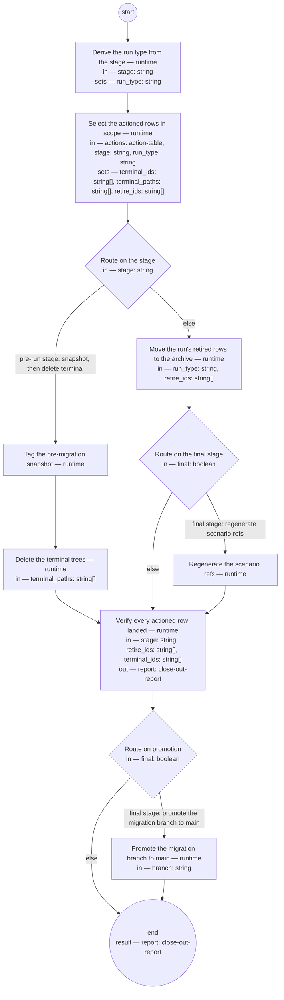

# Corpus close out (compiled from `corpus-close-out-process`)

Execute the migration plan's pre-decided retire and terminal actions mechanically, at cut-over: snapshot the corpus, delete the terminal trees, move each run's retired rows to the archive, regenerate the scenario refs, verify every actioned row landed where its action says, and finally promote the migration branch to `main`.

**The decisions were made at the review; this process only carries them out. Mass moves are mechanical or they do not happen — no judgment, no review loop, and no silent completion: a row not where it should be fails the run loudly, by id.**

Result of a run: `report` (close-out-report).



## derive-run-type — Derive the run type from the stage

Run by the runtime — no agent, no prose. reads: stage · writes: run_type.

```yaml
set:
  run_type: 'stage == "pre-run" ? "" : stage.replace("post-run:", "")'
next: select-rows
```

## select-rows — Select the actioned rows in scope

Run by the runtime — no agent, no prose. reads: actions, stage, run_type · writes: terminal_ids, terminal_paths, retire_ids.

```yaml
set:
  terminal_ids: actions.filter(r, r.action == "terminal").map(r, r.id)
  terminal_paths: actions.filter(r, r.action == "terminal").map(r, r.path)
  retire_ids: 'stage == "pre-run" ? [] : actions.filter(r, r.action == "retire" &&
    r.id.startsWith(run_type + "-")).map(r, r.id)'
next: route-stage
```

## route-stage — Route on the stage

Run by the runtime — no agent, no prose. reads: stage · writes: —.

```yaml
branches:
- label: 'pre-run stage: snapshot, then delete terminal'
  when: stage == "pre-run"
  next: snapshot-tag
- else: archive-retire
```

## snapshot-tag — Tag the pre-migration snapshot

Run by the runtime — no agent, no prose. reads: — · writes: —.

```yaml
run: 'git tag -a pre-migration -m "Safety snapshot: full corpus before migration close-out"

  git push origin pre-migration

  '
next: delete-terminal
```

## delete-terminal — Delete the terminal trees

Run by the runtime — no agent, no prose. reads: terminal_paths · writes: —.

```yaml
run: 'git rm -r ${terminal_paths}

  git commit -m "Close-out pre-run: delete terminal trees (recoverable via pre-migration
  tag only)"

  '
next: post-check
```

## archive-retire — Move the run's retired rows to the archive

Run by the runtime — no agent, no prose. reads: run_type, retire_ids · writes: —.

```yaml
run: 'archive-move --type ${run_type} --ids ${retire_ids}

  '
next: route-final
```

## route-final — Route on the final stage

Run by the runtime — no agent, no prose. reads: final · writes: —.

```yaml
branches:
- label: 'final stage: regenerate scenario refs'
  when: final
  next: regen-scenario-refs
- else: post-check
```

## regen-scenario-refs — Regenerate the scenario refs

Run by the runtime — no agent, no prose. reads: — · writes: —.

```yaml
run: 'bin/gen-scenario-refs

  '
next: post-check
```

## post-check — Verify every actioned row landed

Run by the runtime — no agent, no prose. reads: stage, retire_ids, terminal_ids · writes: report.

```yaml
run: 'archive-move --verify --stage ${stage} --retire ${retire_ids} --terminal ${terminal_ids}

  '
next: route-promote
```

## route-promote — Route on promotion

Run by the runtime — no agent, no prose. reads: final · writes: —.

```yaml
branches:
- label: 'final stage: promote the migration branch to main'
  when: final
  next: promote-branch
- else: end
```

## promote-branch — Promote the migration branch to main

Run by the runtime — no agent, no prose. reads: branch · writes: —.

```yaml
run: 'git checkout main

  git reset --hard ${branch}

  git push --force-with-lease origin main

  '
next: end
```
