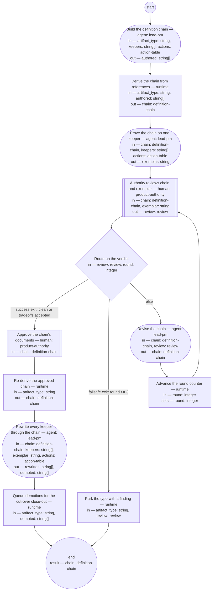

# Definition chain migration (compiled from `definition-chain-migration-process`)

Convert one artifact type from the frozen corpus into the new baseline: build its definition chain, prove the chain on a real keeper, approve it, rewrite every keeper through it, and move what does not survive to the archive.

**Nothing enters the new baseline except through a approved definition. A document in an undefined format is source material for a rewrite, never a usable artifact.**

Result of a run: `chain` (definition-chain).



## build-chain — Build the definition chain

Run by an agent in role `lead-pm`. reads: artifact_type, keepers, actions · writes: authored.
- check: `size(authored) >= 6`
- then: `derive-chain`

Prompt:

```text
Draft every link of the definition chain for this artifact type:
typedef, quality guideline, fitness set, authoring process, roles,
and the compiled skill. Source the content from the authority's
recorded decisions and verbatim anchors, an autopsy of the best and
worst existing instances among the keepers, and established
external standards; name every adopted form in each document's
Sources section. A document in an undefined format is source
material only — nothing is used as-is. Per-keeper directives and
family nominations come only from `actions` — the governed channel
— never from retired documents. Family codes in `actions` are
nominations: the chain review decides final record granularity, so
do not pre-commit a collapse.

Do not use these words: ratif, disposition, rebaseline bill, surface, seat
```

## derive-chain — Derive the chain from references

Run by the runtime — no agent, no prose. reads: artifact_type, authored · writes: chain.

```yaml
run: 'python3 tools/lint_basis.py --derive-chain ${artifact_type}

  '
next: exemplar-rewrite
```

## exemplar-rewrite — Prove the chain on one keeper

Run by an agent in role `lead-pm`. reads: chain, keepers, actions · writes: exemplar.
- then: `authority-review`

Prompt:

```text
Rewrite one real keeper through the drafted chain's authoring
process, exactly as mass rewriting would run it. Pick a keeper of median size
among the type's keepers, preferring the most recently active —
representative by measure, not by ease. The keeper's per-keeper
directives come only from its `actions` row — the governed channel
— never from retired documents; a family code there is a
nomination, not a commitment, since the chain review decides final
record granularity. Record
every point where the chain failed to decide something — that
friction is a finding about the chain, and it goes to the authority
with the exemplar.

Do not use these words: ratif, disposition, rebaseline bill, surface, seat
```

## authority-review — Authority reviews chain and exemplar

Run by a human holding role `product-authority`. reads: chain, exemplar · writes: review.
- then: `route-review`

Prompt:

```text
One review, one type: the chain and the exemplar rewritten through
it, side by side. Rule on both — the chain's definitions and what
they actually produced. Findings land as decisions; verdict "clean"
or "tradeoffs-accepted" approves, "findings" sends the chain back.
```

## route-review — Route on the verdict

Run by the runtime — no agent, no prose. reads: review, round · writes: —.

```yaml
branches:
- label: 'success exit: clean or tradeoffs accepted'
  when: review.verdict in ["clean", "tradeoffs-accepted"]
  next: approve-chain
- label: 'failsafe exit: round >= 3'
  when: round >= 3
  next: park
- else: revise-chain
```

## revise-chain — Revise the chain

Run by an agent in role `lead-pm`. reads: chain, review · writes: chain.
- then: `advance-round`

Prompt:

```text
Repair every finding in the review across the chain's links, then
re-run the exemplar through any link that changed. A finding
repaired in one link is checked against the others — the chain is
one definition in six parts, not six documents.

Do not use these words: ratif, disposition, rebaseline bill, surface, seat
```

## advance-round — Advance the round counter

Run by the runtime — no agent, no prose. reads: round · writes: round.

```yaml
set:
  round: round + 1
next: authority-review
```

## approve-chain — Approve the chain's documents

Run by a human holding role `product-authority`. reads: chain · writes: —.
- then: `rederive-chain`

Prompt:

```text
Approval stamps every linked document: status approved, approved
date, owner. The chain's own status is derived — it reads approved
only when every link does. From this point the chain is the
standard the mass rewrite is checked against, and changes to any
link go through you.
```

## rederive-chain — Re-derive the approved chain

Run by the runtime — no agent, no prose. reads: artifact_type · writes: chain.

```yaml
run: 'python3 tools/lint_basis.py --derive-chain ${artifact_type}

  '
next: rewrite-keepers
```

## rewrite-keepers — Rewrite every keeper through the chain

Run by an agent in role `lead-pm`. reads: chain, keepers, exemplar, actions · writes: rewritten, demoted.
- check: `size(rewritten) + size(demoted) == size(keepers)`
- then: `queue-demoted`

Prompt:

```text
Run the type's approved authoring process once per keeper: author
role and fresh reviewer role per the chain, authority spot-checks
at the rate the authority sets. Each keeper's per-keeper
directives and family nomination come only from its `actions` row
— the governed channel — never from retired documents; family
codes are nominations, and the chain review's decision on record
granularity governs, not a pre-committed collapse. A keeper that
cannot reach the bar
after two attempts is nominated for demotion: file the nomination
with a note naming the failing check; the authority decides it at
the close-out. Never lower a check to pass a keeper.

Do not use these words: ratif, disposition, rebaseline bill, surface, seat
```

## queue-demoted — Queue demotions for the cut-over close-out

Run by the runtime — no agent, no prose. reads: artifact_type, demoted · writes: —.

```yaml
run: 'archive-move --queue --type ${artifact_type} --ids ${demoted}

  '
next: end
```

## park — Park the type with a finding

Run by the runtime — no agent, no prose. reads: artifact_type, review · writes: —.

```yaml
run: "bd create --title \"Chain parked: ${artifact_type} after 3 review rounds\" \\\
  \n  --body \"${review.top_changes}\"\n"
next: end
```
