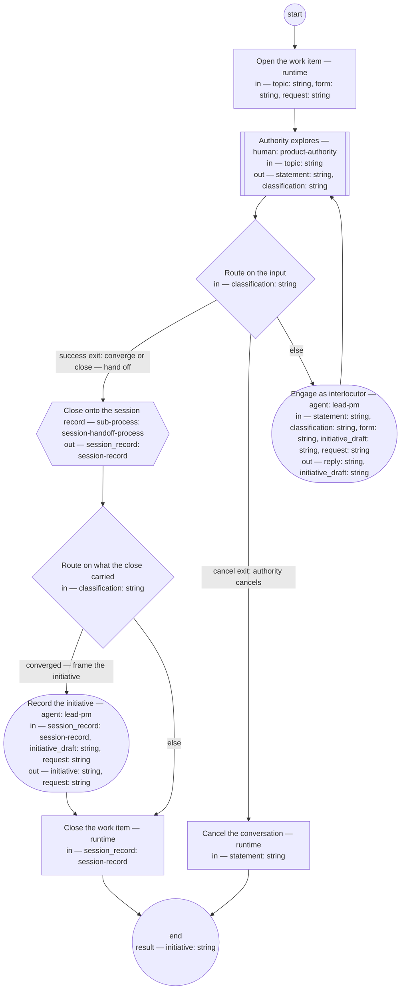

# Discovery conversation (compiled from `discovery-conversation-process`)

Conduct a bounded discovery dialogue in a declared form — brainstorm (the first form), interview, or review of evidence — opened on a topic, or on a request routed to it: the authority explores direction with the lead-pm as interlocutor, nothing is operationalized before convergence, the session record anchors the conversation, and a converged discovery leaves an initiative recorded `planned` — the bet, taken on the authority's own word — or `proposed` and then `cancelled` in the same document when what was asked is declined, so the record of the decline survives. This is the one human step past which the flow runs with no other human step.

**Engage the authority's statements as an interlocutor; record and launch only after convergence.**

Result of an execution: `initiative` (string).



## open — Open the work item

Run by the runtime — no agent, no prose. reads: topic, form, request · writes: —.

```yaml
run: "title=\"Discovery conversation (${form}): ${topic}\"\nif [ -n \"${request}\"\
  \ ]; then\n  title=\"$title \u2014 request $(sed -n 's/^id: //p' \"${request}\"\
  )\"\nfi\nbd create --title \"$title\"\n"
next: observe
```

## observe — Authority explores

Run by a human holding role `product-authority`. reads: topic · writes: statement, classification.
- then: `route`

Prompt:

```text
Think out loud. Your message is one of: a direction or exploration
to engage, a question, a convergence naming the bet — say "bet":
the framing is done, and the initiative is planned on that word
— a close, or a cancel. Silence holds the conversation after the
declared window; the draft record carries the resume point.
```

## route — Route on the input

Run by the runtime — no agent, no prose. reads: classification · writes: —.

```yaml
branches:
- label: "success exit: converge or close \u2014 hand off"
  when: classification in ["converge", "close"]
  next: handoff
- label: 'cancel exit: authority cancels'
  when: classification == "cancel"
  next: cancel-out
- else: engage
```

## engage — Engage as interlocutor

Run by an agent in role `lead-pm`. reads: statement, classification, form, initiative_draft, request · writes: reply, initiative_draft.
- check: `reply != ""`
- then: `observe`

Prompt:

```text
Engage the statement as an interlocutor, shaped to the form —
brainstorm: diverge before convergence; interview: draw out and
quote the originator; review of evidence: read the record
against its sources. Probe, reflect back, name tensions, offer
options with a recommendation near a decision. Do not
operationalize — no work, no definitions, no dispatches —
before convergence. Capture quotes into the draft record, and
maintain initiative_draft — Framing, For whom, Appetite — as
the dialogue moves. When request is set, Framing sources the
request's section 1, quoted with its id as reference, not the
transcript.

Return each declared output on its own line as `<name>: <value>` — reply, initiative_draft — a list as a JSON array, a value with line breaks as a JSON string; these lines close your reply.

Do not use these words: ratif, disposition, rebaseline bill, surface, seat
```

## handoff — Close onto the session record

Run by the runtime — no agent, no prose. reads: — · writes: session_record.

```yaml
next: route-frame
```

## route-frame — Route on what the close carried

Run by the runtime — no agent, no prose. reads: classification · writes: —.

```yaml
branches:
- label: "converged \u2014 frame the initiative"
  when: classification == "converge"
  next: frame
- else: close-out
```

## frame — Record the initiative

Run by an agent in role `lead-pm`. reads: session_record, initiative_draft, request · writes: initiative, request.
- then: `close-out`

Prompt:

```text
Assist step. From the session record and initiative_draft,
write the initiative per its typedef: Framing quoting the
originator, For whom with one measure, Appetite with its
no-gos; Feasibility and usability and Decomposition left
absent; Features empty; owner lead-pm. Status "planned" on the
authority's word "bet". When request is set: link it as
`request`; quote the Framing from its section 1, each
quotation referencing the request's id; record on the request
its route — `routed-to`, section 4, status "done". Where the
conversation declined what was asked: status "proposed" then
"cancelled" with the authority's reason in the same document;
note the decline's product decision record is the PO role's to
make, linked once made. Return the initiative's path.

Return each declared output on its own line as `<name>: <value>` — initiative, request — a list as a JSON array, a value with line breaks as a JSON string; these lines close your reply.

Do not use these words: ratif, disposition, rebaseline bill, surface, seat
```

## close-out — Close the work item

Run by the runtime — no agent, no prose. reads: session_record · writes: —.

```yaml
run: 'bd close --reason "Discovery closed onto ${session_record.id}"

  '
next: end
```

## cancel-out — Cancel the conversation

Run by the runtime — no agent, no prose. reads: statement · writes: —.

```yaml
run: 'bd close --reason "Discovery cancelled: ${statement}"

  '
next: end
```
