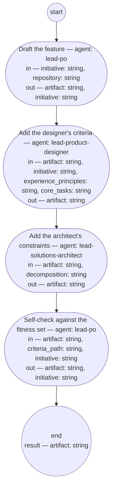

# Feature authoring (compiled from `feature-authoring-process`)

Author one feature from a planned initiative: the PO role writes it alone from the initiative's framing, the product designer and solutions architect roles add the criteria that ride on its scenarios, and the PO records its own evaluation against the feature fitness set and sets the feature checked.

**One feature per run, authored alone: scope and wording are the PO role's; the criteria ride on the scenarios; the maker's self-check is the last word, not a second checker's. Conflicts with behavior already specified are the repository sweep's to catch at assignment, never a question to a shop during authoring.**

Result of a run: `artifact` (string).



## draft — Draft the feature

Run by an agent in role `lead-po`. reads: initiative, repository · writes: artifact, initiative.
- then: `add-usability`

Prompt:

```text
From the initiative's Framing and For whom, write one feature
into repository, per its typedef. Feature line and narrative:
the framing's words. Scenarios: at most ten, steps included,
one line each, tagged @feature: and @hash:. Contributors:
owning shop per scenario from the Decomposition; each
contributor's criteria one line. Interaction types: For whom's
types, or "none" with reason. Edges: at most ten rows, from
the framing's cases, covered or excluded with reason. One
Document History row. Author alone, no shop asked. Status
draft; link the initiative; add the id to its Features
section. A returned feature already listed: revise in place —
id stays, a changed scenario is a new hash, no duplicate.
Return the feature's path.

Return each declared output on its own line as `<name>: <value>` — artifact, initiative — a list as a JSON array, a value with line breaks as a JSON string; these lines close your reply.

Do not use these words: ratif, disposition, rebaseline bill, surface, seat
```

## add-usability — Add the designer's criteria

Run by an agent in role `lead-product-designer`. reads: artifact, initiative, experience_principles, core_tasks · writes: artifact.
- then: `add-constraints`

Prompt:

```text
Where For whom names an interaction type, write the usability
and accessibility criteria for the feature's scenarios into
Contributors, one line each, judged against
experience_principles and core_tasks. Add to Edges any failure
or boundary case those criteria name. Where For whom says
"none", record that no criteria are due, with the reason.
Return the feature.

Return each declared output on its own line as `<name>: <value>` — artifact — a list as a JSON array, a value with line breaks as a JSON string; these lines close your reply.

Do not use these words: ratif, disposition, rebaseline bill, surface, seat
```

## add-constraints — Add the architect's constraints

Run by an agent in role `lead-solutions-architect`. reads: artifact, decomposition · writes: artifact.
- then: `self-check`

Prompt:

```text
Read decomposition. Where it names non-functional constraints
on this feature's scenarios, write them into Contributors as
criteria, one line each, riding by name on the scenarios they
bound. Where a constraint needs a decision not yet recorded,
write "needs decision: <what>" on its line, so product-flow
routes it to adr-authoring. Add to Edges any failure or
boundary case those constraints name. Where none apply, record
that decomposition names none for this feature. Return the
feature.

Return each declared output on its own line as `<name>: <value>` — artifact — a list as a JSON array, a value with line breaks as a JSON string; these lines close your reply.

Do not use these words: ratif, disposition, rebaseline bill, surface, seat
```

## self-check — Self-check against the fitness set

Run by an agent in role `lead-po`. reads: artifact, criteria_path, initiative · writes: artifact, initiative.
- then: `end`

Prompt:

```text
Evaluate the feature against the fitness set at criteria_path
— every scenario, the Contributors criteria, the Edges table,
the Interaction types section. Write one Document History row
recording that evaluation and any gap you accept rather than
fix. Set the feature's status to checked. If the initiative's
status is planned, set it to active with a one-line entry
naming this feature's pass — the only status this step writes
over. Return the feature.

Return each declared output on its own line as `<name>: <value>` — artifact, initiative — a list as a JSON array, a value with line breaks as a JSON string; these lines close your reply.

Do not use these words: ratif, disposition, rebaseline bill, surface, seat
```
