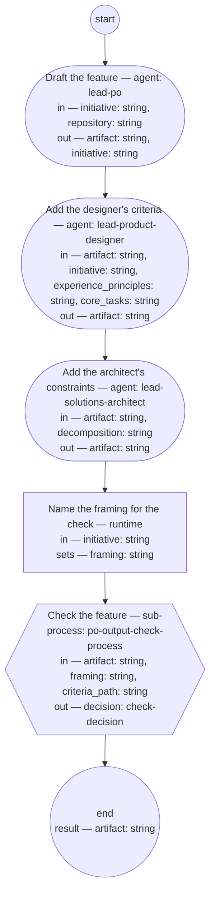

# Feature authoring (compiled from `feature-authoring-process`)

Author one feature from a planned initiative and take it through its check: the PO role writes it alone from the initiative's framing, the product designer and solutions architect roles add the criteria that ride on its scenarios, and the PO output check sets its status.

**One feature per run, authored alone: scope and wording are the PO role's; the criteria ride on the scenarios; the check, not the author, sets the status. Conflicts with behavior already specified are the repository sweep's to catch at assignment, never a question to a shop during authoring.**

Result of a run: `artifact` (string).



## draft — Draft the feature

Run by an agent in role `lead-po`. reads: initiative, repository · writes: artifact, initiative.
- then: `add-usability`

Prompt:

```text
From the initiative's Framing and For whom sections, write one
feature per its typedef into the feature repository at
repository: the Feature line and narrative in the framing's
words; the scenarios, steps included, each tagged @feature: and
@hash:; the Contributors section naming each scenario's owning
shop from the initiative's Decomposition section; the
Interaction types section stating the types the initiative's
For whom section names, or "none" with the reason; the Edges
table from the cases the framing names, covered or excluded
with a reason. You author alone — no shop is asked. Set the
feature's status to draft and link the initiative in its
frontmatter; add the feature's id to the initiative's Features
section — the typedef's list of features as they are made.
Where the Features section already lists a feature standing
returned in the repository, author that feature again instead:
revise its own document — the id stays, and a changed scenario
text is a new scenario by hash — and add no duplicate id.
Return the feature's path.
```

## add-usability — Add the designer's criteria

Run by an agent in role `lead-product-designer`. reads: artifact, initiative, experience_principles, core_tasks · writes: artifact.
- then: `add-constraints`

Prompt:

```text
Where the initiative's For whom section names an interaction
type, write into the feature's Contributors section the
usability acceptance criteria and the accessibility criteria
for its scenarios, judged against the experience principle set
at experience_principles and the core-task list at core_tasks —
and add to the Edges table any failure or boundary case those
criteria name. Where the section says "none", record that no
criteria are due, with its reason. Return the feature.
```

## add-constraints — Add the architect's constraints

Run by an agent in role `lead-solutions-architect`. reads: artifact, decomposition · writes: artifact.
- then: `prepare`

Prompt:

```text
Read the decomposition at decomposition. Where it names
non-functional constraints bounding the behaviors this
feature's scenarios state, write them into the Contributors
section as criteria riding on the scenarios they bound — and
add to the Edges table any failure or boundary case those
constraints name. Where none apply, record that the
decomposition names none for this feature. Return the feature.
```

## prepare — Name the framing for the check

Run by the runtime — no agent, no prose. reads: initiative · writes: framing.

```yaml
set:
  framing: initiative + "#framing"
next: check
```

## check — Check the feature

Run by the runtime — no agent, no prose. reads: artifact, framing, criteria_path · writes: decision.

```yaml
next: end
```
