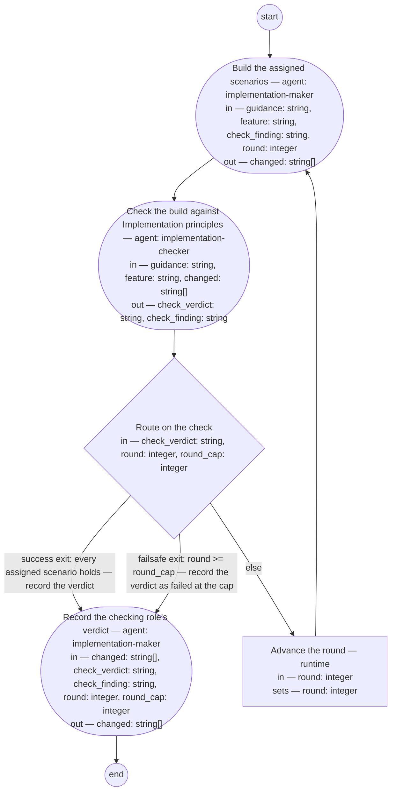

# Implementation (compiled from `implementation-process`)

Take one assignment's scenarios to a checked implementation: the maker role builds every scenario assigned, the checking role evaluates the build against [Implementation principles](../implementation-principles.md), and a failed check repairs under a round cap until it passes or the cap is reached. One process for every shop that implements; every step here runs by a fixed role or the runtime alone, so a lead-shop execution needs no dispatch and no mailbox call.

**Implementation principles is the whole of what good looks like for the build: the maker builds to it and the checking role judges by it alone, never by the maker's account of the work and never by a mechanism no design element names.**



## make — Build the assigned scenarios

Run by an agent in role `implementation-maker`. reads: guidance, feature, check_finding, round · writes: changed.
- then: `check`

Prompt:

```text
Read guidance and, by the @hash: values it assigns, the
feature's scenarios — nothing else; guidance is written to be
actionable with the assigned scenarios alone. Build every
assigned scenario so it holds, through each changed artifact's
own producing rules: amended under its own type's rules, a
rendering re-rendered by its own tool and never edited by hand,
its Document History gaining one update row citing guidance by
path and this round, its version bumped. Add no behavior that no
assigned scenario and no design element calls for. Where a
scenario cannot hold without a design change guidance does not
cover, stop and report that rather than building it unrecorded.
When check_finding is not empty this is a repair round: repair
what it quotes, and show that every scenario that held before
this round still holds. Evaluate what you built against
Implementation principles yourself before you return, and add
that evaluation to the same update row. Return changed, the
paths you touched this round.

Return each declared output on its own line as `<name>: <value>` — changed — a list as a JSON array, a value with line breaks as a JSON string; these lines close your reply.

Do not use these words: ratif, disposition, rebaseline bill, surface, seat
```

## check — Check the build against Implementation principles

Run by an agent in role `implementation-checker`. reads: guidance, feature, changed · writes: check_verdict, check_finding.
- then: `route-check`

Prompt:

```text
Read guidance, the feature's assigned scenarios, and the
artifacts at changed — nothing else. You are not the maker: your
verdict is judged against Implementation principles alone, never
against the maker's account. For each assigned scenario, per
adr-2026-09-16-scenario-evidence-form: where it carries an
executable test, read the shop's presented pass/fail status as
its evidence; where it does not, mark it yourself from what you
read. Verdict fail on a scenario that does not hold, on a change
in changed that traces to no assigned scenario and no design
element, on a scenario that held before this round and does not
hold after it, or on a changed artifact whose record does not
suffice for the next maker. Verdict pass only when every
assigned scenario holds and every change conforms; otherwise
fail, with check_finding the statement or rule that fails,
quoted, and what fails it. Return the verdict and the finding —
empty on pass.

Return each declared output on its own line as `<name>: <value>` — check_verdict, check_finding — a list as a JSON array, a value with line breaks as a JSON string; these lines close your reply.

Do not use these words: ratif, disposition, rebaseline bill, surface, seat
```

## route-check — Route on the check

Run by the runtime — no agent, no prose. reads: check_verdict, round, round_cap · writes: —.

```yaml
branches:
- label: "success exit: every assigned scenario holds \u2014 record the verdict"
  when: check_verdict == "pass"
  next: record
- label: "failsafe exit: round >= round_cap \u2014 record the verdict as failed at\
    \ the cap"
  when: round >= round_cap
  next: record
- else: advance-round
```

## advance-round — Advance the round

Run by the runtime — no agent, no prose. reads: round · writes: round.

```yaml
set:
  round: round + 1
next: make
```

## record — Record the checking role's verdict

Run by an agent in role `implementation-maker`. reads: changed, check_verdict, check_finding, round, round_cap · writes: changed.
- then: `end`

Prompt:

```text
For each path in changed, write one review-kind Document History
row citing the version reviewed, the checking role, the round,
and the verdict as check_verdict and check_finding give it,
transcribed as given — you do not rejudge it. Where check_verdict
is fail and round is at round_cap, the row also states the
scenario stands unresolved at the cap. Return changed.

Return each declared output on its own line as `<name>: <value>` — changed — a list as a JSON array, a value with line breaks as a JSON string; these lines close your reply.

Do not use these words: ratif, disposition, rebaseline bill, surface, seat
```
