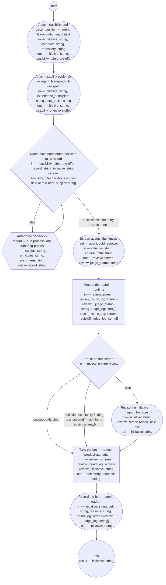

# Initiative check (compiled from `initiative-check-process`)

Take a proposed initiative to the bet: the solutions architect and product designer roles attach the sections they own, each decision the solutions architect role's offer leaves unrecorded is recorded through the ADR authoring process before the screen, the cold reviewer screens the whole against the initiative fitness set — the check of record on the PM role's framing — and the authority decides, from the verdict, whether to spend the appetite.

**The bet is taken on the screen's verdict and the initiative's own first three sections, never on advocacy; a finding in another role's attachment is that role's to answer, not the reviser's to rewrite.**

Result of a run: `initiative` (string).



## attach-architecture — Attach feasibility and decomposition

Run by an agent in role `lead-solutions-architect`. reads: initiative, contracts, repository · writes: initiative, feasibility_offer.
- then: `attach-usability`

Prompt:

```text
Read the initiative at initiative and add your attachment —
your offer, the role-offer type this step outputs, rendered
into the initiative as its typedef states — or ask questions.

Do not use these words: ratif, disposition, rebaseline bill, surface, seat
```

## attach-usability — Attach usability evidence

Run by an agent in role `lead-product-designer`. reads: initiative, experience_principles, core_tasks · writes: initiative, usability_offer.
- then: `route-decisions`

Prompt:

```text
Read the initiative at initiative and add your attachment —
your offer, the role-offer type this step outputs, rendered
into the initiative as its typedef states — or ask questions.

Do not use these words: ratif, disposition, rebaseline bill, surface, seat
```

## route-decisions — Route each unrecorded decision to its record

Run by the runtime — no agent, no prose. reads: feasibility_offer, record, initiative · writes: feasibility_offer.decisions.entries, subject.

```yaml
set:
  feasibility_offer.decisions.entries: 'record == "" ? feasibility_offer.decisions.entries
    : feasibility_offer.decisions.entries.map(e, e.record == "none" && e.decision
    == feasibility_offer.decisions.entries.filter(n, n.record == "none")[0].decision
    ? {"decision": e.decision, "record": record_id(record)} : e)'
  subject: '!feasibility_offer.decisions.entries.exists(e, e.record == "none") ? ""
    : "Decision: " + feasibility_offer.decisions.entries.filter(e, e.record == "none")[0].decision
    + ". Decided by: " + feasibility_offer.role + ", under a right it holds, or by
    the authority under escalation where no listed right covers it. Trigger: the bet
    on the initiative at " + initiative + ". Evidence: the offer as rendered into
    that initiative''s Document History."'
run: '[ -z "${record}" ] || sed -i "0,/record: none/s//record: $(sed -n ''s/^id: //p''
  ${record})/" ${initiative}

  '
branches:
- label: 'success exit: no entry reads none'
  when: '!feasibility_offer.decisions.entries.exists(e, e.record == "none")'
  next: screen
- else: author-decision-record
```

## author-decision-record — Author the decision's record

Run by the runtime — no agent, no prose. reads: subject, principles, adr_criteria · writes: record.

```yaml
next: route-decisions
```

## screen — Screen against the fitness set

Run by an agent in role `cold-reviewer` (fresh context every run). reads: initiative, criteria_path · writes: review, judge_stamp.
- then: `log-round`

Prompt:

```text
State, as judge_stamp, the model and prompt version you judge
as. Read the criteria set at criteria_path and the initiative at
initiative — nothing else. Judge the initiative against every
scenario. Report every finding with the criterion it fails by
name, the quoted text, the change, and whether you could decide
it (confident) or not (wobbly); for a wobbly finding quote the
whole passage, since the authority decides from the review. A
defect no criterion names is a finding with criterion
"uncovered". Verdict "clean" only if there are no findings;
otherwise "findings" with the top three changes.

Do not use these words: ratif, disposition, rebaseline bill, surface, seat
```

## log-round — Record the round

Run by the runtime — no agent, no prose. reads: review, round_log, judge_stamp, judge_log · writes: round_log, judge_log.

```yaml
set:
  round_log: round_log + [review]
  judge_log: judge_log + [judge_stamp]
next: route-screen
```

## route-screen — Route on the screen

Run by the runtime — no agent, no prose. reads: review · writes: —.

```yaml
branches:
- label: 'success exit: clean'
  when: review.verdict == "clean"
  next: decide
- label: "definition exit: every finding is uncovered \u2014 nothing a repair can\
    \ reach"
  when: size(review.findings) > 0 && review.findings.all(f, f.criterion == "uncovered")
  next: decide
- else: revise
```

## revise — Revise the initiative

Run by an agent in role `lead-pm`. reads: initiative, review, ask · writes: initiative.
- may ask: `lead-solutions-architect`, `lead-product-designer` — return an `ask` (with default and checkpoint) in place of outputs; at most one per run.
- then: `decide`

Prompt:

```text
Assist step. Repair every finding whose criterion is named and
whose passage the PM role owns — the Framing, For whom,
Appetite, and Features sections. A finding in the Feasibility
and usability or Decomposition sections is another role's
attachment: return an ask to the role that owns it — the
solutions architect for feasibility and decomposition, the
product designer for usability — with the question, the default
you will apply if unanswered, and a checkpoint of the repairs
made so far; never rewrite another role's verdict. Leave
findings marked "uncovered" as they are — they are the decide
step's. On the first pass ask is absent; if it carries an answer
or resolved defaulted, apply it and finish the repairs.

Do not use these words: ratif, disposition, rebaseline bill, surface, seat
```

## decide — Take the bet

Run by a human holding role `product-authority`. reads: review, round_log, initiative · writes: bet, reasons.
- then: `record`

Prompt:

```text
From the one review and the initiative as revised — its
Framing, For whom, and Appetite sections, read against the
review's findings — take the go/no-go on spending the appetite.
"bet": spend it — the initiative becomes planned and features
are made from it; available when the screen is clean, or when
every named finding is repaired in the revision and the only
findings still open are uncovered and you judge none of them
needs a criterion — say so in the reasons. An initiative still
failing a named criterion after the one revision cannot be bet
on — the typedef's commitment: it stays proposed with the
criterion named. "hold": it stays proposed —
say what would change your mind. "cancel": with the reason —
the record of the decline survives. Record your reasons.
```

## record — Record the bet

Run by an agent in role `lead-pm`. reads: initiative, bet, reasons, round_log, judge_log · writes: initiative.
- then: `end`

Prompt:

```text
Assist step. Write into the initiative's Document History one
review entry per round with its verdict and, from judge_log,
the screening judge's model and prompt version — the record the
fitness set promises — then a state entry
carrying the decision and its reasons. Set the status: "planned"
on bet, written only over "proposed"; leave "proposed" on hold;
"cancelled" on cancel with the reason. On bet or cancel, the typedef requires a product
decision record: state in the entry that the record is the PO
role's to make and the PO output check screens it, and that the
entry links it once made. Return the initiative.

Do not use these words: ratif, disposition, rebaseline bill, surface, seat
```
