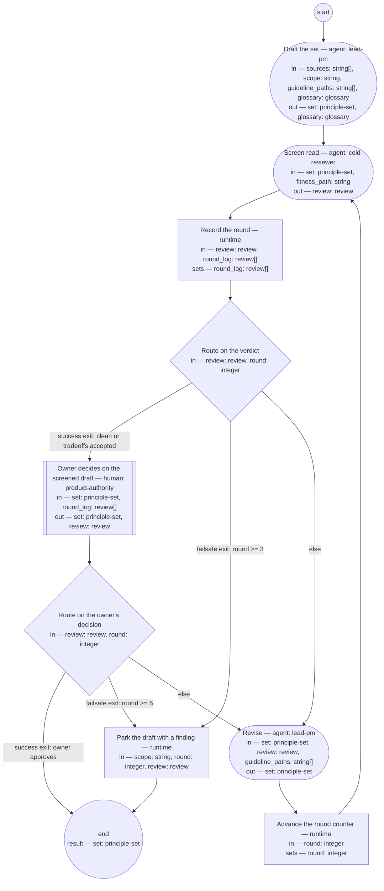

# Principle set authoring (compiled from `principle-set-authoring-process`)

Author or amend a principle set: the author drafts through the guideline, an independent fresh-context judge scores the draft against the fitness set, and the set enters force only by the owner's approval.

**Define good before governing with it. A principle enters the set only through the written definition of a good principle — the statement decides, the rationale evidences, the implications price — never on taste.**

Result of a run: `set` (principle-set).



## draft — Draft the set

Run by an agent in role `lead-pm`. reads: sources, scope, guideline_paths, glossary · writes: set, glossary.
- check: `set.scope == scope`
- then: `screen-read`

Prompt:

```text
Author the set, or amend the existing one, from the listed sources
only — the owner's stated directions, autopsies of prior
instances, named external standards, and, when amending, the
existing set listed among the sources. Content in an undefined
format is source material for a rewrite, never pasted. Open by
defining what a good principle looks like; then write each
principle in the four parts — slugged name, statement, rationale,
implications — through the guideline files listed in
guideline_paths. Close with the fitness screen applying the
opening's tests to every principle. Every new or changed term
goes to the glossary before the draft leaves this step.
```

## screen-read — Screen read

Run by an agent in role `cold-reviewer` (fresh context every run). reads: set, fitness_path · writes: review.
- then: `log-round`

Prompt:

```text
Read the set alone, fresh — you have seen no earlier round, and
that is the point. Score it against every scenario in the fitness
set at fitness_path, in order; for each fail cite the
principle and quote the failing text. Report stumbles in reading
order and your top three changes. Verdict "clean" only if every
scenario passes; "tradeoffs-accepted" only if every remaining
finding is marked in the text as an accepted tradeoff; otherwise
"findings".
```

## log-round — Record the round

Run by the runtime — no agent, no prose. reads: review, round_log · writes: round_log.

```yaml
set:
  round_log: round_log + [review]
next: route-verdict
```

## route-verdict — Route on the verdict

Run by the runtime — no agent, no prose. reads: review, round · writes: —.

```yaml
branches:
- label: 'success exit: clean or tradeoffs accepted'
  when: review.verdict in ["clean", "tradeoffs-accepted"]
  next: authority-approve
- label: 'failsafe exit: round >= 3'
  when: round >= 3
  next: park
- else: revise
```

## revise — Revise

Run by an agent in role `lead-pm`. reads: set, review, guideline_paths · writes: set.
- then: `advance-round`

Prompt:

```text
Repair every finding in the review, through the guideline files
listed in guideline_paths. Re-check
the screen table for every principle you changed — the screen is
the author's self-check and must match the text it sits under.
Mark any finding you will not repair as an accepted tradeoff, in
the text, with one sentence saying why.
```

## advance-round — Advance the round counter

Run by the runtime — no agent, no prose. reads: round · writes: round.

```yaml
set:
  round: round + 1
next: screen-read
```

## authority-approve — Owner decides on the screened draft

Run by a human holding role `product-authority`. reads: set, round_log · writes: set, review.
- then: `route-approval`

Prompt:

```text
The screened draft and its round log are in front of you. Your
decision is the review's verdict. "clean" or "tradeoffs-accepted"
approves: the set is stamped — status approved, the approval date,
your role as owner — and from that point it is the standard
activities are checked against, amendable only through this
process by your decision. "findings" returns the draft to the author
with your findings; the round counter keeps running, so a draft
that cannot satisfy you within the cap parks instead of looping.
Silence holds the run after the declared window — `hold-after` in
this definition's frontmatter — per the process-definition
typedef's run lifecycle; the held run keeps its resume point.
```

## route-approval — Route on the owner's decision

Run by the runtime — no agent, no prose. reads: review, round · writes: —.

```yaml
branches:
- label: 'success exit: owner approves'
  when: review.verdict in ["clean", "tradeoffs-accepted"]
  next: end
- label: 'failsafe exit: round >= 6'
  when: round >= 6
  next: park
- else: revise
```

## park — Park the draft with a finding

Run by the runtime — no agent, no prose. reads: scope, round, review · writes: —.

```yaml
run: "bd create --title \"Principle set parked: ${scope} scope after ${round} rounds\"\
  \ \\\n  --body \"${review.top_changes}\"\n"
next: end
```
