# Product flow (compiled from `product-flow-process`)

Carry one problem from discovery to assigned work: a discovery conversation frames an initiative, the initiative check takes it to the authority's bet, the backlog ordering places it, and the flow then loops — one feature authored, checked, and its scenarios assigned — until the PO role judges the initiative's features done. The shop's operating process; every sub-process is defined in its own document.

**One initiative per run, one feature per pass; every hand-off is a recorded status, and no step reaches the next except through the status the last one wrote.**

Result of a run: `initiative` (string).

```mermaid
flowchart TD
  discover{{"Discover the problem — sub-process: discovery-conversation-process<br/>in — topic: string, form: string<br/>out — initiative: string"}}
  route_discover{"Route on the discovery<br/>in — initiative: string"}
  read_framed["Read the framed initiative's status — runtime<br/>in — initiative: string<br/>out — initiative_status: string"]
  route_framed{"Route on the framing<br/>in — initiative_status: string"}
  check{{"Check the initiative and take the bet — sub-process: initiative-check-process<br/>in — initiative: string, initiative_criteria: string, contracts: string, repository: string, experience_principles: string, core_tasks: string<br/>out — initiative: string"}}
  read_bet["Read the initiative's status — runtime<br/>in — initiative: string<br/>out — initiative_status: string"]
  route_bet{"Route on the bet<br/>in — initiative_status: string"}
  place{{"Place the initiative in the backlog order — sub-process: backlog-ordering-process<br/>in — initiative: string, order: string, priority: string, recommendations: string, order_criteria: string<br/>out — new_order: string"}}
  read_order["Read the order's status — runtime<br/>in — new_order: string<br/>out — order_status: string"]
  route_order{"Route on the order's check<br/>in — order_status: string"}
  author{{"Author and check one feature — sub-process: feature-authoring-process<br/>in — initiative: string, repository: string, decomposition: string, experience_principles: string, core_tasks: string, feature_criteria: string<br/>out — feature: string"}}
  read_feature["Read the feature's status — runtime<br/>in — feature: string<br/>out — feature_status: string"]
  route_checked{"Route on the check<br/>in — feature_status: string"}
  assign{{"Assign the feature's scenarios — sub-process: scenario-assignment-process<br/>in — feature: string, decomposition: string, contracts: string, repository: string<br/>out — feature: string"}}
  read_assigned["Read the feature's status after assignment — runtime<br/>in — feature: string<br/>out — feature_status: string"]
  more_features(["Judge whether the initiative needs another feature — agent: lead-po<br/>in — initiative: string, new_order: string, repository: string, feature_status: string<br/>out — more: string"])
  advance_feature["Advance the feature count — runtime<br/>in — feature_count: integer<br/>sets — feature_count: integer"]
  route_more{"Route on the PO role's judgment<br/>in — more: string, feature_count: integer, feature_cap: integer"}
  __end(("end<br/>result — initiative: string"))
  __start(("start")) --> discover
  discover --> route_discover
  route_discover -->|a document stands — read its status| read_framed
  route_discover -->|else| __end
  read_framed --> route_framed
  route_framed -->|proposed — the check begins| check
  route_framed -->|else| __end
  check --> read_bet
  read_bet --> route_bet
  route_bet -->|bet — the initiative is planned| place
  route_bet -->|else| __end
  place --> read_order
  read_order --> route_order
  route_order -->|checked — proceed to authoring| author
  route_order -->|else| __end
  author --> read_feature
  read_feature --> route_checked
  route_checked -->|checked — assign its scenarios| assign
  route_checked -->|returned — back through the PO role's judgment for another pass| more_features
  route_checked -->|else| __end
  assign --> read_assigned
  read_assigned --> more_features
  more_features --> advance_feature
  advance_feature --> route_more
  route_more -->|success exit: the initiative's features are done and assigned| __end
  route_more -->|failsafe exit: feature_count >= feature_cap — the run ends with the initiative's state recorded| __end
  route_more -->|else| author
```



## discover — Discover the problem

Run by the runtime — no agent, no prose. reads: topic, form · writes: initiative.

```yaml
next: route-discover
```

## route-discover — Route on the discovery

Run by the runtime — no agent, no prose. reads: initiative · writes: —.

```yaml
branches:
- label: "a document stands \u2014 read its status"
  when: initiative != ""
  next: read-framed
- else: end
```

## read-framed — Read the framed initiative's status

Run by the runtime — no agent, no prose. reads: initiative · writes: initiative_status.

```yaml
run: 'sed -n ''s/^status: //p'' ${initiative}

  '
next: route-framed
```

## route-framed — Route on the framing

Run by the runtime — no agent, no prose. reads: initiative_status · writes: —.

```yaml
branches:
- label: "proposed \u2014 the check begins"
  when: initiative_status == "proposed"
  next: check
- else: end
```

## check — Check the initiative and take the bet

Run by the runtime — no agent, no prose. reads: initiative, initiative_criteria, contracts, repository, experience_principles, core_tasks · writes: initiative.

```yaml
next: read-bet
```

## read-bet — Read the initiative's status

Run by the runtime — no agent, no prose. reads: initiative · writes: initiative_status.

```yaml
run: 'sed -n ''s/^status: //p'' ${initiative}

  '
next: route-bet
```

## route-bet — Route on the bet

Run by the runtime — no agent, no prose. reads: initiative_status · writes: —.

```yaml
branches:
- label: "bet \u2014 the initiative is planned"
  when: initiative_status == "planned"
  next: place
- else: end
```

## place — Place the initiative in the backlog order

Run by the runtime — no agent, no prose. reads: initiative, order, priority, recommendations, order_criteria · writes: new_order.

```yaml
next: read-order
```

## read-order — Read the order's status

Run by the runtime — no agent, no prose. reads: new_order · writes: order_status.

```yaml
run: 'sed -n ''s/^status: //p'' ${new_order}

  '
next: route-order
```

## route-order — Route on the order's check

Run by the runtime — no agent, no prose. reads: order_status · writes: —.

```yaml
branches:
- label: "checked \u2014 proceed to authoring"
  when: order_status == "checked"
  next: author
- else: end
```

## author — Author and check one feature

Run by the runtime — no agent, no prose. reads: initiative, repository, decomposition, experience_principles, core_tasks, feature_criteria · writes: feature.

```yaml
next: read-feature
```

## read-feature — Read the feature's status

Run by the runtime — no agent, no prose. reads: feature · writes: feature_status.

```yaml
run: 'sed -n ''s/^status: //p'' ${feature}

  '
next: route-checked
```

## route-checked — Route on the check

Run by the runtime — no agent, no prose. reads: feature_status · writes: —.

```yaml
branches:
- label: "checked \u2014 assign its scenarios"
  when: feature_status == "checked"
  next: assign
- label: "returned \u2014 back through the PO role's judgment for another pass"
  when: feature_status == "returned"
  next: more-features
- else: end
```

## assign — Assign the feature's scenarios

Run by the runtime — no agent, no prose. reads: feature, decomposition, contracts, repository · writes: feature.

```yaml
next: read-assigned
```

## read-assigned — Read the feature's status after assignment

Run by the runtime — no agent, no prose. reads: feature · writes: feature_status.

```yaml
run: 'sed -n ''s/^status: //p'' ${feature}

  '
next: more-features
```

## more-features — Judge whether the initiative needs another feature

Run by an agent in role `lead-po`. reads: initiative, new_order, repository, feature_status · writes: more.
- then: `advance-feature`

Prompt:

```text
Read the initiative's Features section — the features this and
earlier passes made, by id — the backlog order at new_order,
the status feature_status of the feature just processed, and,
for the listed features, their statuses in the feature
repository at repository. Judge whether the initiative needs
another feature — a behavior its framing serves that no feature
yet states, or a returned feature to author again — or whether
its features are done and every one is assigned. Return
"another" or "done". This is your backlog accountability, not a
check: the framing decides what is needed, the appetite bounds
it.

Do not use these words: ratif, disposition, rebaseline bill, surface, seat
```

## advance-feature — Advance the feature count

Run by the runtime — no agent, no prose. reads: feature_count · writes: feature_count.

```yaml
set:
  feature_count: feature_count + 1
next: route-more
```

## route-more — Route on the PO role's judgment

Run by the runtime — no agent, no prose. reads: more, feature_count, feature_cap · writes: —.

```yaml
branches:
- label: 'success exit: the initiative''s features are done and assigned'
  when: more == "done"
  next: end
- label: "failsafe exit: feature_count >= feature_cap \u2014 the run ends with the\
    \ initiative's state recorded"
  when: feature_count >= feature_cap
  next: end
- else: author
```
