# Product flow (compiled from `product-flow-process`)

Carry one problem from discovery to a verified build: a discovery conversation frames the initiative and the authority bets on it in that same run's human step; one feature is authored and self-checked; a flagged constraint's decision is recorded; the feature's scenarios are assigned to their owning shops; and each shop's delivery is verified. The shop's operating process; every sub-process is defined in its own document.

**One initiative per run, one feature per pass; no human step stands after the frame; a run holds only when a sub-process's own ask reaches outside that sub-process's scope.**

Result of a run: `initiative` (string).

```mermaid
flowchart TD
  discover{{"Discover and bet the problem — sub-process: discovery-conversation-process<br/>in — topic: string, form: string<br/>out — initiative: string"}}
  route_discover{"Route on the discovery<br/>in — initiative: string"}
  read_status["Read the initiative's status — runtime<br/>in — initiative: string<br/>out — initiative_status: string"]
  route_status{"Route on the bet<br/>in — initiative_status: string"}
  author{{"Author and self-check one feature — sub-process: feature-authoring-process<br/>in — initiative: string, repository: string, decomposition: string, experience_principles: string, core_tasks: string, feature_criteria: string<br/>out — feature: string"}}
  read_feature["Read the feature's status — runtime<br/>in — feature: string<br/>out — feature_status: string"]
  route_checked{"Route on the self-check<br/>in — feature_status: string"}
  find_decision["Find a flagged decision — runtime<br/>in — feature: string<br/>out — decision_text: string"]
  route_decision{"Route on the flag<br/>in — decision_text: string"}
  compose_subject["Compose the decision's subject — runtime<br/>in — decision_text: string, feature: string<br/>sets — subject: string"]
  author_decision_record{{"Author the decision's record — sub-process: adr-authoring-process<br/>in — subject: string, principles: string, adr_criteria: string<br/>out — adr_record: string"}}
  resolve_decision["Mark the flag recorded — runtime<br/>in — feature: string, adr_record: string"]
  assign{{"Assign the feature's scenarios — sub-process: scenario-assignment-process<br/>in — feature: string, decomposition: string, contracts: string, repository: string<br/>out — feature: string"}}
  build["Read the feature's status after dispatch — runtime<br/>in — feature: string<br/>out — feature_status: string"]
  route_build{"Route on the dispatch<br/>in — feature_status: string"}
  verify{{"Verify the shop's delivery — sub-process: reconcile-and-close-process<br/>in — response: work-done-response, work_item: work-item, register: scenario-register<br/>out — verification: verification"}}
  more_features(["Judge whether the initiative needs another feature — agent: lead-po<br/>in — initiative: string, feature: string, feature_status: string<br/>out — more: string"])
  advance_feature["Advance the feature count — runtime<br/>in — feature_count: integer<br/>sets — feature_count: integer"]
  route_more{"Route on the PO role's judgment<br/>in — more: string, feature_count: integer, feature_cap: integer"}
  __end(("end<br/>result — initiative: string"))
  __start(("start")) --> discover
  discover --> route_discover
  route_discover -->|a document stands — read its status| read_status
  route_discover -->|else| __end
  read_status --> route_status
  route_status -->|planned — author its features| author
  route_status -->|else| __end
  author --> read_feature
  read_feature --> route_checked
  route_checked -->|checked — route its constraints| find_decision
  route_checked -->|else| __end
  find_decision --> route_decision
  route_decision -->|found — record it| compose_subject
  route_decision -->|else| assign
  compose_subject --> author_decision_record
  author_decision_record --> resolve_decision
  resolve_decision --> assign
  assign --> build
  build --> route_build
  route_build -->|assigned — dispatched to the shop's build| verify
  route_build -->|returned — back through the PO role's judgment| more_features
  route_build -->|else| __end
  verify --> more_features
  more_features --> advance_feature
  advance_feature --> route_more
  route_more -->|success exit: the initiative's features are done| __end
  route_more -->|failsafe exit: feature_count >= feature_cap| __end
  route_more -->|else| author
```



## discover — Discover and bet the problem

Run by the runtime — no agent, no prose. reads: topic, form · writes: initiative.

```yaml
next: route-discover
```

## route-discover — Route on the discovery

Run by the runtime — no agent, no prose. reads: initiative · writes: —.

```yaml
branches:
- label: "a document stands \u2014 read its status"
  when: initiative != ""
  next: read-status
- else: end
```

## read-status — Read the initiative's status

Run by the runtime — no agent, no prose. reads: initiative · writes: initiative_status.

```yaml
run: 'sed -n ''s/^status: //p'' ${initiative}

  '
next: route-status
```

## route-status — Route on the bet

Run by the runtime — no agent, no prose. reads: initiative_status · writes: —.

```yaml
branches:
- label: "planned \u2014 author its features"
  when: initiative_status == "planned"
  next: author
- else: end
```

## author — Author and self-check one feature

Run by the runtime — no agent, no prose. reads: initiative, repository, decomposition, experience_principles, core_tasks, feature_criteria · writes: feature.

```yaml
next: read-feature
```

## read-feature — Read the feature's status

Run by the runtime — no agent, no prose. reads: feature · writes: feature_status.

```yaml
run: 'sed -n ''s/^status: //p'' ${feature}

  '
next: route-checked
```

## route-checked — Route on the self-check

Run by the runtime — no agent, no prose. reads: feature_status · writes: —.

```yaml
branches:
- label: "checked \u2014 route its constraints"
  when: feature_status == "checked"
  next: find-decision
- else: end
```

## find-decision — Find a flagged decision

Run by the runtime — no agent, no prose. reads: feature · writes: decision_text.

```yaml
run: 'grep -m1 ''needs decision:'' ${feature} | sed ''s/.*needs decision: *//'' ||
  true

  '
next: route-decision
```

## route-decision — Route on the flag

Run by the runtime — no agent, no prose. reads: decision_text · writes: —.

```yaml
branches:
- label: "found \u2014 record it"
  when: decision_text != ""
  next: compose-subject
- else: assign
```

## compose-subject — Compose the decision's subject

Run by the runtime — no agent, no prose. reads: decision_text, feature · writes: subject.

```yaml
set:
  subject: '"Decision: " + decision_text + ". Decided by: lead-solutions-architect,
    under a right it holds, or by the authority under escalation. Trigger: a constraint
    on " + feature + ". Evidence: the feature''s Contributors section."'
next: author-decision-record
```

## author-decision-record — Author the decision's record

Run by the runtime — no agent, no prose. reads: subject, principles, adr_criteria · writes: adr_record.

```yaml
next: resolve-decision
```

## resolve-decision — Mark the flag recorded

Run by the runtime — no agent, no prose. reads: feature, adr_record · writes: —.

```yaml
run: "id=$(sed -n 's/^id: //p' ${adr_record} | head -1)\nsed -i \"0,/needs decision:/s//decision\
  \ recorded: ${id} \u2014/\" ${feature}\n"
next: assign
```

## assign — Assign the feature's scenarios

Run by the runtime — no agent, no prose. reads: feature, decomposition, contracts, repository · writes: feature.

```yaml
next: build
```

## build — Read the feature's status after dispatch

Run by the runtime — no agent, no prose. reads: feature · writes: feature_status.

```yaml
run: 'sed -n ''s/^status: //p'' ${feature}

  '
next: route-build
```

## route-build — Route on the dispatch

Run by the runtime — no agent, no prose. reads: feature_status · writes: —.

```yaml
branches:
- label: "assigned \u2014 dispatched to the shop's build"
  when: feature_status == "assigned"
  next: verify
- label: "returned \u2014 back through the PO role's judgment"
  when: feature_status == "returned"
  next: more-features
- else: end
```

## verify — Verify the shop's delivery

Run by the runtime — no agent, no prose. reads: response, work_item, register · writes: verification.

```yaml
next: more-features
```

## more-features — Judge whether the initiative needs another feature

Run by an agent in role `lead-po`. reads: initiative, feature, feature_status · writes: more.
- then: `advance-feature`

Prompt:

```text
Read the initiative's Features section and, for each listed
feature, its status in the feature repository. Judge whether
the initiative needs another feature — a behavior its framing
serves that no feature yet states, or a returned feature to
author again — or whether its features are done. Return
"another" or "done". This is your backlog accountability, not a
check.

Return each declared output on its own line as `<name>: <value>` — more — a list as a JSON array, a value with line breaks as a JSON string; these lines close your reply.

Do not use these words: ratif, disposition, rebaseline bill, surface, seat
```

## advance-feature — Advance the feature count

Run by the runtime — no agent, no prose. reads: feature_count · writes: feature_count.

```yaml
set:
  feature_count: feature_count + 1
next: route-more
```

## route-more — Route on the PO role's judgment

Run by the runtime — no agent, no prose. reads: more, feature_count, feature_cap · writes: —.

```yaml
branches:
- label: 'success exit: the initiative''s features are done'
  when: more == "done"
  next: end
- label: 'failsafe exit: feature_count >= feature_cap'
  when: feature_count >= feature_cap
  next: end
- else: author
```
