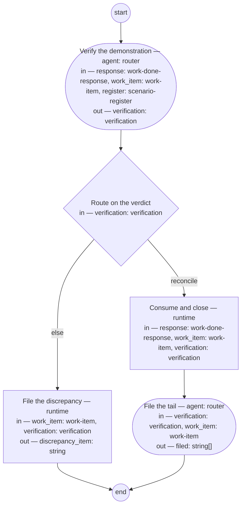

# Reconcile and close (compiled from `reconcile-and-close-process`)

Convert a BC's completed dispatch into reconciled shop state: the response consumed, the work item closed with a traceable reason, the scenario contract confirmed, and follow-ups filed.



## verify — Verify the demonstration

Run by an agent in role `router`. reads: response, work_item, register · writes: verification.
- check: `size(verification.scenario_status) == size(work_item.scenarios)`
- then: `route`

Prompt:

```text
Read the response. Check the demonstration against every dispatched
scenario and record a status for each: done, blocked, or explicitly
deferred. Silence on a scenario is a discrepancy, not a pass.
Compare the pinned hashes in the response to the register. Verdict
"reconcile" only if every scenario has a status and the hashes
match; otherwise verdict "discrepancy", with the evidence stating
exactly what differs.
```

## route — Route on the verdict

Run by the runtime — no agent, no prose. reads: verification · writes: —.

```yaml
branches:
- label: reconcile
  when: verification.verdict == "reconcile"
  next: consume-close
- else: escalate
```

## consume-close — Consume and close

Run by the runtime — no agent, no prose. reads: response, work_item, verification · writes: —.

```yaml
run: 'shop-msg consume outbox --bc ${response.bc} --work-id ${response.work_id}

  bd close ${work_item.id} --reason "${verification.evidence}"

  '
atomic: true
next: file-tail
```

## escalate — File the discrepancy

Run by the runtime — no agent, no prose. reads: work_item, verification · writes: discrepancy_item.

```yaml
run: "bd create --type task --assign lead-solutions-architect \\\n  --title \"Register\
  \ discrepancy on ${work_item.id}\" \\\n  --body \"${verification.evidence}\" --link\
  \ ${work_item.id}\n"
next: end
```

## file-tail — File the tail

Run by an agent in role `router`. reads: verification, work_item · writes: filed.
- check: `size(filed) == size(verification.reported_items)`
- then: `end`

Prompt:

```text
File a follow-up work item for every entry in the reported items —
each defect, observation, and deferred scenario — and link each new
item to the closed work item.
```
