# Request intake (compiled from `request-intake-process`)

Take an ask — one expression of intent brought to the lead shop by an originator — from the words it arose in to a request recorded in the repository and routed by the lead-pm role: the originator confirms that the words make an ask before anything is recorded, the request records the words verbatim with the date, the lead-pm decides the route — a discovery conversation, the small-change lane, or a decline settled with the product authority — and says it with its reason before it is acted on, and the run returns the request carrying its route and, once the destination exists, where the route led.

**The request is the record and the route is said before it is acted on: nothing the originator did not confirm is recorded, nothing the originator has not answered is acted on, and what was asked is read from the request — never restated to the originator and never from a transcript.**

Result of a run: `request` (string).

```mermaid
flowchart TD
  enter{"Enter on the words or on a recorded request<br/>in — request: string"}
  recognize(["Read the words and say the reading — agent: lead-pm<br/>in — statement: string, originator: string, arose_in: string<br/>out — reading: string, words: string"])
  route_reading{"Route on the reading<br/>in — reading: string"}
  confirm[["Originator confirms the reading — human: originator<br/>in — reading: string, words: string<br/>out — confirmation: string"]]
  route_confirm{"Route on the confirmation<br/>in — confirmation: string"}
  record(["Record the request — agent: lead-pm<br/>in — words: string, originator: string, arose_in: string<br/>out — request: string"])
  decide_route(["Decide and say the route — agent: lead-pm<br/>in — request: string, objection: string, reason: string, ask: ask<br/>out — route: string, reason: string, form: string, topic: string"])
  route_decided{"Route on whether a route was decided<br/>in — route: string"}
  observe[["Originator answers the route — human: originator<br/>in — request: string<br/>out — answer: string, objection: string"]]
  route_answer{"Route on the originator's answer<br/>in — answer: string, round: integer, round_cap: integer"}
  advance_round["Advance the round — runtime<br/>in — round: integer<br/>sets — round: integer"]
  land(["Land the answer and anchor the route — agent: lead-pm<br/>in — request: string, answer: string, objection: string, route: string, reason: string<br/>out — request: string, work_item: string"])
  dispatch{"Dispatch to the route's destination<br/>in — route: string"}
  open_discovery{{"Open the discovery conversation on the request — sub-process: discovery-conversation-process<br/>in — topic: string, form: string, request: string<br/>out — initiative: string"}}
  land_outcome(["Land what the discovery returned — agent: lead-pm<br/>in — request: string, initiative: string<br/>out — request: string"])
  open_lane{{"Hand the request to the small-change lane — sub-process: small-change-process<br/>in — request: string<br/>out — change: string"}}
  read_route["Read the route the lane left — runtime<br/>in — request: string<br/>out — route: string"]
  read_reason["Read the reason the lane left — runtime<br/>in — request: string<br/>out — reason: string"]
  route_after_lane{"Route on what the lane left<br/>in — route: string, round: integer, round_cap: integer"}
  clear_objection["Clear the objection for a re-decision — runtime<br/>in — objection: string<br/>sets — objection: string"]
  land_result(["Record where the route led — agent: lead-pm<br/>in — request: string, change: string<br/>out — request: string"])
  decline(["Settle the declined record — agent: lead-pm<br/>in — request: string, reason: string<br/>out — request: string"])
  __end(("end<br/>result — request: string"))
  __start(("start")) --> enter
  enter -->|a recorded request awaits its route — route it| decide_route
  enter -->|else| recognize
  recognize --> route_reading
  route_reading -->|no-request exit: the words make no ask — nothing recorded| __end
  route_reading -->|else| confirm
  confirm --> route_confirm
  route_confirm -->|success exit: the originator confirms — record the request| record
  route_confirm -->|no-request exit: the originator's no leaves no request| __end
  route_confirm -->|else| __end
  record --> decide_route
  decide_route --> route_decided
  route_decided -->|held exit: the decline awaits the authority's ruling — the request stays recorded, its route awaiting| __end
  route_decided -->|else| observe
  observe --> route_answer
  route_answer -->|success exit: accepted — land the answer and act on the route| land
  route_answer -->|failsafe exit: round >= round_cap — the route stands, the objection recorded| land
  route_answer -->|objected — decide again with the objection| advance_round
  route_answer -->|held exit — hold-after caps the wait| observe
  route_answer -->|else| observe
  advance_round --> decide_route
  land --> dispatch
  dispatch -->|discovery — open the conversation on the request| open_discovery
  dispatch -->|small-change — the lane takes the request| open_lane
  dispatch -->|else| decline
  open_discovery --> land_outcome
  land_outcome --> __end
  open_lane --> read_route
  read_route --> read_reason
  read_reason --> route_after_lane
  route_after_lane -->|success exit: done — record where the route led| land_result
  route_after_lane -->|at the cap — the lane's route stands; the originator answers it| observe
  route_after_lane -->|not simple — decide again from the request| clear_objection
  route_after_lane -->|failed exit — returned to awaiting| __end
  route_after_lane -->|else| __end
  clear_objection --> advance_round
  land_result --> __end
  decline --> __end
```



## enter — Enter on the words or on a recorded request

Run by the runtime — no agent, no prose. reads: request · writes: —.

```yaml
branches:
- label: "a recorded request awaits its route \u2014 route it"
  when: request != ""
  next: decide-route
- else: recognize
```

## recognize — Read the words and say the reading

Run by an agent in role `lead-pm`. reads: statement, originator, arose_in · writes: reading, words.
- check: `reading == "none" || words != ""`
- then: `route-reading`

Prompt:

```text
Read statement — the words as they arose, from originator, in
arose_in. Decide whether they make an ask: an expression of
intent the lead shop could act on. Say your reading to the
originator before anything is recorded, in text. "ask": quote
the words you read as the ask, verbatim, into words, and say
that a request will record them once the originator confirms.
"unclear": say you cannot tell and put the question in one
turn, with the words you would record in words. "none": say the
words make no ask and nothing will be recorded. Do not record;
silence is not a yes. When asked what this process can do, say
that an ask is recorded on arrival as a request and takes one of
three routes: discovery — the ask is large enough to frame an
initiative and bet on, so a discovery conversation opens on the
request; small-change — a simple change, one the lead shop makes
within its own definitions or one instance of them, demonstrable
in one session, spending no appetite worth a bet; declined — the
lead shop will not act, on the product authority's ruling, and
the record survives.

Do not use these words: ratif, disposition, rebaseline bill, surface, seat
```

## route-reading — Route on the reading

Run by the runtime — no agent, no prose. reads: reading · writes: —.

```yaml
branches:
- label: "no-request exit: the words make no ask \u2014 nothing recorded"
  when: reading == "none"
  next: end
- else: confirm
```

## confirm — Originator confirms the reading

Run by a human holding role `originator`. reads: reading, words · writes: confirmation.
- then: `route-confirm`

Prompt:

```text
The lead-pm's reading is in front of you with the words it would
record. If the reading is "ask": yes records those words as a
request; no leaves no request. If the reading is "unclear": say
whether you are making an ask — yes records the words, no leaves
no request. Nothing is recorded until you answer; silence holds
the run after the declared window and records nothing.
```

## route-confirm — Route on the confirmation

Run by the runtime — no agent, no prose. reads: confirmation · writes: —.

```yaml
branches:
- label: "success exit: the originator confirms \u2014 record the request"
  when: confirmation == "yes"
  next: record
- label: 'no-request exit: the originator''s no leaves no request'
  when: confirmation == "no"
  next: end
- else: end
```

## record — Record the request

Run by an agent in role `lead-pm`. reads: words, originator, arose_in · writes: request.
- check: `request != ""`
- then: `decide-route`

Prompt:

```text
Write the request as a file in requests/, id
req-YYYY-MM-DD-<slug> — today's date, then a short slug of what
was asked — with this frontmatter: type request; id; status
recorded; version 1; date today; reader lead-pm; owner lead-pm;
created and updated today; originator from originator, by role
or by name; received-through operational-contract, with the
note that the lead shop's operational contract has no artifact
yet (lead-4kymc); arose-in from arose_in when it names a process
run or a conversation, omitted when the ask arrived directly;
route awaiting; route-reason empty; routed-to empty; no
work-item. Sections: 1 What is requested — the words verbatim,
quoted and dated, never a paraphrase; 2 From whom — the lead-pm
role as reader and the originator; 3 Route and 4 Result empty.
Write nothing of what was asked anywhere else. Confirm to the
originator in one turn, in text: the words as recorded, with the
request's id alongside them and never in place of them, and that
the route follows. When arose_in names a process run, say in the
same turn that that run continues without acting on the ask.
Return the request's path.

Do not use these words: ratif, disposition, rebaseline bill, surface, seat
```

## decide-route — Decide and say the route

Run by an agent in role `lead-pm`. reads: request, objection, reason, ask · writes: route, reason, form, topic.
- may ask: `product-authority` — return an `ask` (with default and checkpoint) in place of outputs; at most one per run.
- check: `reason != ""`
- check: `topic != ""`
- then: `route-decided`

Prompt:

```text
Read the request only — what was asked is its section 1, never
restated to the originator and never read from a transcript;
what the lane, a conversation, or an earlier run left on it is
in its sections 3 and 4. When objection is empty and reason is
non-empty, reason is the lane's reason for changing the route;
when objection is non-empty, reason is your own last reason,
which the objection answers. Decide the route.
small-change: the change is simple — it stays within the lead
shop's own definitions or one instance of them, touches no
Bounded Context, its effect is demonstrable in the running
system in one session, and it spends no appetite worth a bet.
discovery: the ask is larger than that, or its shape needs the
authority's exploration; name in form the form the conversation
takes. On every decision, whatever the route, name in topic a
one-line topic for the request, from its words, with its id —
afresh each time. declined: only
with the product authority's ruling. On a run entered with the
request, the ruling is read from the request's section 3, where
the resumed ask wrote it; when none stands there, and on the
first pass, ask is absent: to decline, return an ask to
product-authority, kind reserved-decision, the question carrying
the request's id, its words, and your reason to decline, default
"hold as recorded — the request stays recorded, its route
awaiting, for the authority's ruling", checkpoint the route and
reason drafted; returning it again on a later run is intended.
If ask carries an answer, write it to the request's section 3
as the authority's ruling, the route is as the authority ruled,
and reason is the ruling's reason. If ask resolved defaulted,
write on the request that the decline awaits the authority's
ruling, leave status recorded and route awaiting, output route
awaiting with that as reason, and say so to the originator. When
objection is non-empty this is a re-decision: answer it — the
route standing after it is yours to decide, and reason answers
the objection; a decline already ruled stands, its reason the
ruling's. Write the route and its reason on the request as said
— section 3 with the originator's answer "not yet answered",
frontmatter route and route-reason, status routed, a history
row — and say the route and its reason to the originator in
natural language before any action is taken: which of the three
routes, what it means, why; for a decline, that the ask was
declined, that the authority ruled, the reason, and what the
originator can do next — never a code, a work-item id, or a
route name alone. Return route, reason, form, and topic.

Do not use these words: ratif, disposition, rebaseline bill, surface, seat
```

## route-decided — Route on whether a route was decided

Run by the runtime — no agent, no prose. reads: route · writes: —.

```yaml
branches:
- label: "held exit: the decline awaits the authority's ruling \u2014 the request\
    \ stays recorded, its route awaiting"
  when: route == "awaiting"
  next: end
- else: observe
```

## observe — Originator answers the route

Run by a human holding role `originator`. reads: request · writes: answer, objection.
- then: `route-answer`

Prompt:

```text
The request is in front of you with its route and the reason, as
the lead-pm said them or, at the lane's cap, as the lane wrote
them. Accept: the route is acted on. Object: say
why in objection; the lead-pm decides again and answers you
before anything is acted on, and the route standing after that
is the one recorded. Not answered: the route stands as said and
nothing is acted on until you answer. Silence holds the run after
the declared window; the request carries the route as said and
nothing is acted on.
```

## route-answer — Route on the originator's answer

Run by the runtime — no agent, no prose. reads: answer, round, round_cap · writes: —.

```yaml
branches:
- label: "success exit: accepted \u2014 land the answer and act on the route"
  when: answer == "accept"
  next: land
- label: "failsafe exit: round >= round_cap \u2014 the route stands, the objection\
    \ recorded"
  when: answer == "object" && round >= round_cap
  next: land
- label: "objected \u2014 decide again with the objection"
  when: answer == "object"
  next: advance-round
- label: "held exit \u2014 hold-after caps the wait"
  when: answer == "not-answered"
  next: observe
- else: observe
```

## advance-round — Advance the round

Run by the runtime — no agent, no prose. reads: round · writes: round.

```yaml
set:
  round: round + 1
next: decide-route
```

## land — Land the answer and anchor the route

Run by an agent in role `lead-pm`. reads: request, answer, objection, route, reason · writes: request, work_item.
- check: `route != "small-change" || work_item != ""`
- then: `dispatch`

Prompt:

```text
Write the originator's answer in the request's section 3: when
answer is accept, "accepted"; when it is object — the objection
loop reached its cap — "objected", with objection as the answer
given and the route standing as said with reason, and say to the
originator in natural language that the route stands, why, and
what they can do next — bring the question to the product
authority. A history row. When route is small-change, open the
register work item the lane runs on — run `bd create --title
"Request <id>: <slug>"` with the request's id and slug — and
write the item's id in the request's work-item field, replacing
the id of an item an earlier run closed; the item points at the
request and carries nothing of what was asked. Return the
request and, on the small-change route, the item's id; otherwise
an empty work_item.

Do not use these words: ratif, disposition, rebaseline bill, surface, seat
```

## dispatch — Dispatch to the route's destination

Run by the runtime — no agent, no prose. reads: route · writes: —.

```yaml
branches:
- label: "discovery \u2014 open the conversation on the request"
  when: route == "discovery"
  next: open-discovery
- label: "small-change \u2014 the lane takes the request"
  when: route == "small-change"
  next: open-lane
- else: decline
```

## open-discovery — Open the discovery conversation on the request

Run by the runtime — no agent, no prose. reads: topic, form, request · writes: initiative.

```yaml
next: land-outcome
```

## land-outcome — Land what the discovery returned

Run by an agent in role `lead-pm`. reads: request, initiative · writes: request.
- then: `end`

Prompt:

```text
The discovery conversation returned. When initiative is set, its
frame step wrote on the request where the route led — routed-to
linking the initiative, section 4 naming it, status done:
confirm they stand and write nothing twice. When initiative is
empty — the conversation closed without convergence or was
cancelled — write on the request that the conversation framed
nothing, set route awaiting with that as route-reason and status
recorded, so the request is again visible as awaiting its route,
with a history row. Return the request.

Do not use these words: ratif, disposition, rebaseline bill, surface, seat
```

## open-lane — Hand the request to the small-change lane

Run by the runtime — no agent, no prose. reads: request · writes: change.

```yaml
next: read-route
```

## read-route — Read the route the lane left

Run by the runtime — no agent, no prose. reads: request · writes: route.

```yaml
run: 'sed -n ''s/^route: //p'' ${request} | head -1 | grep .

  '
next: read-reason
```

## read-reason — Read the reason the lane left

Run by the runtime — no agent, no prose. reads: request · writes: reason.

```yaml
run: 'sed -n ''s/^route-reason: //p'' ${request} | head -1

  '
next: route-after-lane
```

## route-after-lane — Route on what the lane left

Run by the runtime — no agent, no prose. reads: route, round, round_cap · writes: —.

```yaml
branches:
- label: "success exit: done \u2014 record where the route led"
  when: route == "small-change"
  next: land-result
- label: "at the cap \u2014 the lane's route stands; the originator answers it"
  when: route == "discovery" && round >= round_cap
  next: observe
- label: "not simple \u2014 decide again from the request"
  when: route == "discovery"
  next: clear-objection
- label: "failed exit \u2014 returned to awaiting"
  when: route == "awaiting"
  next: end
- else: end
```

## clear-objection — Clear the objection for a re-decision

Run by the runtime — no agent, no prose. reads: objection · writes: objection.

```yaml
set:
  objection: '""'
next: advance-round
```

## land-result — Record where the route led

Run by an agent in role `lead-pm`. reads: request, change · writes: request.
- check: `change != ""`
- then: `end`

Prompt:

```text
The lane returned change — the request's Result section by
fragment, where the definition, the check, and the verified
result stand — and left the request done. Write change into the
request's routed-to, with a history row; write nothing the lane
wrote twice. Return the request.

Do not use these words: ratif, disposition, rebaseline bill, surface, seat
```

## decline — Settle the declined record

Run by an agent in role `lead-pm`. reads: request, reason · writes: request.
- then: `end`

Prompt:

```text
The route on the request is declined with the authority's ruling
and reason, said and answered. Write status declined and section
4: that the ask was declined, that the product authority ruled,
the reason in the originator's natural language, and what the
originator can do next; routed-to the request's own section 4,
which carries the ruling; a history row. Remove nothing — the
request remains readable as the record of the decline. Return
the request.

Do not use these words: ratif, disposition, rebaseline bill, surface, seat
```
