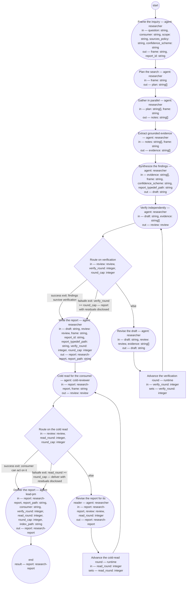

# Research inquiry (compiled from `research-inquiry-process`)

Answer a question with a research report: the researcher frames and plans, gathers in parallel, extracts grounded evidence, synthesizes findings with confidence and alternatives, verifies the claims in a fresh context, and delivers a report the consumer can act on — stored on the `research` branch and registered in the research index.

**Every claim is grounded or marked. A reference the run did not open is not a source; a number without a checkable quote is not a finding; a persona is not evidence.**

Result of a run: `report` (research-report).



## frame — Frame the inquiry

Run by an agent in role `researcher`. reads: question, consumer, scope, sources_policy, confidence_scheme · writes: frame, report_id.
- then: `plan`

Prompt:

```text
Assign the report id — a slug of the topic and the date — then
write the frame before reading any source: the question
verbatim, who consumes the answer and what decision it serves,
the scope boundary, the sources policy as it applies here, and
the confidence scheme with each label's meaning. State the
assumptions the question carries. If the answer would rest
mainly on knowledge the run cannot verify, say so here — that
returns to the consumer as a scoping question.
```

## plan — Plan the search

Run by an agent in role `researcher`. reads: frame · writes: plan.
- check: `size(plan) > 0`
- then: `gather`

Prompt:

```text
Decompose the framed question into sub-questions, and each
sub-question into search tasks that can run independently: the
query, the source kinds expected, and what a good result looks
like. Cover more than one angle per sub-question so a single
search path cannot decide the answer alone.
```

## gather — Gather in parallel

Run by an agent in role `researcher`. reads: plan, frame · writes: notes.
- then: `extract`

Prompt:

```text
Run the plan's search tasks, in parallel where the runtime
allows, each in a fresh worker context. A worker returns
distilled notes, not raw pages: for each source, its identifier
(URL, DOI, or repository path), whether it was opened in full or
as an abstract, and the passages relevant to its task, quoted.
A source that could not be opened is recorded as unopened, never
summarized from memory.
```

## extract — Extract grounded evidence

Run by an agent in role `researcher`. reads: notes, frame · writes: evidence.
- then: `synthesize`

Prompt:

```text
From the notes, extract the evidence: one entry per claim the
sources support, carrying the quote or close paraphrase, the
source identifier, and whether the source is primary or
secondary. Quotes come before claims — no claim enters the
evidence without the passage it rests on. Note where sources
conflict.
```

## synthesize — Synthesize the findings

Run by an agent in role `researcher`. reads: evidence, frame, confidence_scheme, report_typedef_path · writes: draft.
- then: `verify`

Prompt:

```text
Write the draft report in the form the typedef at
report_typedef_path requires: executive
summary answer-first; method; findings each with a confidence
label from the scheme and its sources; alternatives considered
and why the findings stand; limitations; sources with their
opened status. Keep facts, assumptions, and judgments
distinguishable. State confidence and likelihood in separate
phrases, never one. Mark any claim resting on model knowledge
as knowledge-only with lowered confidence.
```

## verify — Verify independently

Run by an agent in role `researcher` (fresh context every run). reads: draft, evidence · writes: review.
- then: `route-verify`

Prompt:

```text
You have not seen how this draft was reasoned — that is the
point. For each finding, write the verification question it
must survive, answer it from the evidence entries and by
reopening the sources those entries identify, and check every
reference exists
and says what the finding claims. A finding whose source does
not exist, does not say it, or was never opened is a finding:
it must be retracted or marked UNVERIFIED. Verdict "clean" only
if every finding survives; otherwise "findings", with the top
changes.
```

## route-verify — Route on verification

Run by the runtime — no agent, no prose. reads: review, verify_round, round_cap · writes: —.

```yaml
branches:
- label: 'success exit: findings survive verification'
  when: review.verdict == "clean"
  next: report
- label: "failsafe exit: verify_round >= round_cap \u2014 report with residuals disclosed"
  when: verify_round >= round_cap
  next: report
- else: revise
```

## revise — Revise the draft

Run by an agent in role `researcher`. reads: draft, review, evidence · writes: draft.
- then: `advance-round`

Prompt:

```text
Repair every finding in the review: retract claims whose sources
failed, mark UNVERIFIED what could not be checked, lower
confidence where the evidence thinned, and add the reviewer's
unanswered verification questions to Limitations. Do not add
new sources here — a new source is a new gather.
```

## advance-round — Advance the verification round

Run by the runtime — no agent, no prose. reads: verify_round · writes: verify_round.

```yaml
set:
  verify_round: verify_round + 1
next: verify
```

## report — Write the report

Run by an agent in role `researcher`. reads: draft, review, frame, report_id, report_typedef_path, verify_round, round_cap · writes: report, report_path.
- then: `cold-read`

Prompt:

```text
Finalize the draft as the research report: frontmatter per the
typedef at report_typedef_path, id set to report_id, Document
History opened, and — when verify_round reached round_cap — the
review's open findings stated in Limitations as residuals. Write
it to the research branch at research/ followed by report_id
and .md, and return that path.
```

## cold-read — Cold read for the consumer

Run by an agent in role `cold-reviewer` (fresh context every run). reads: report, frame · writes: review.
- then: `route-read`

Prompt:

```text
Read the report alone, as its consumer named in the frame. Can
you act on the executive summary without the body? Report
stumbles in reading order with quotes, every term that arrives
before the report explains it, and whether each finding's
confidence label is reproducible from its stated sources.
Verdict "clean" if the consumer can act on it; otherwise
"findings" with the top three changes.
```

## route-read — Route on the cold read

Run by the runtime — no agent, no prose. reads: review, read_round, round_cap · writes: —.

```yaml
branches:
- label: 'success exit: consumer can act on it'
  when: review.verdict == "clean"
  next: deliver
- label: "failsafe exit: read_round >= round_cap \u2014 deliver with residuals disclosed"
  when: read_round >= round_cap
  next: deliver
- else: revise-report
```

## revise-report — Revise the report for its reader

Run by an agent in role `researcher`. reads: report, review, read_round · writes: report.
- then: `advance-round-read`

Prompt:

```text
Repair the cold read's findings in the report's presentation —
wording, ordering, unintroduced terms, confidence labels the
reader could not reproduce — without changing any finding's
substance; a finding the reader could not reproduce is recorded
as a residual in Limitations. Record read_round in the report's
Document History.
```

## advance-round-read — Advance the cold-read round

Run by the runtime — no agent, no prose. reads: read_round · writes: read_round.

```yaml
set:
  read_round: read_round + 1
next: cold-read
```

## deliver — Deliver the report

Run by an agent in role `lead-pm`. reads: report, report_path, consumer, verify_round, read_round, round_cap, index_path · writes: report.
- then: `end`

Prompt:

```text
Set the report's status to delivered, push the research branch,
and add or update the report's row in the research index at
index_path (id, question, date, status, location). Deliver the executive summary
to the consumer with report_path; if verify_round or read_round
reached round_cap, say so first and point at the Limitations
section that discloses the residuals.
```
