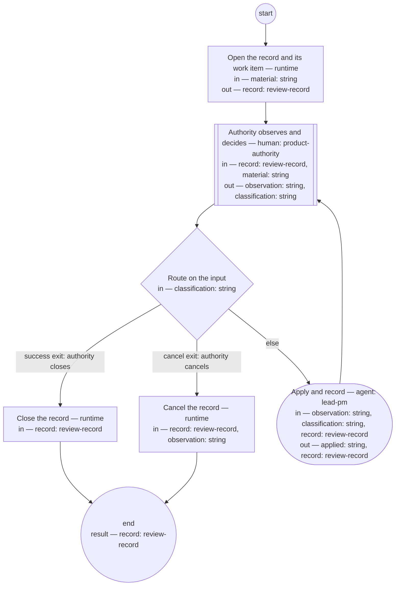

# Review conversation (compiled from `review-conversation-process`)

Conduct a bounded review: the authority examines material and issues decisions; each decision is applied as changes to the affected artifacts before the next exchange; the conversation ends only when the authority closes or cancels it, and parks itself on inactivity.

**Everything binding lands in the governed artifacts it changes; nothing binding lives only in the transcript or the record.**

Result of a run: `record` (review-record).



## open — Open the record and its work item

Run by the runtime — no agent, no prose. reads: material · writes: record.

```yaml
run: 'bd create --title "Review conversation: ${material}"

  '
next: observe
```

## observe — Authority observes and decides

Run by a human holding role `product-authority`. reads: record, material · writes: observation, classification.
- then: `route`

Prompt:

```text
The material and the record's current state are in front of you.
Your message is one of: a decision to apply, a question to answer,
a close (the review is complete), or a cancel (the review is
abandoned). Silence holds the conversation after the declared
window — nothing is lost; the record carries the resume point.
```

## route — Route on the input

Run by the runtime — no agent, no prose. reads: classification · writes: —.

```yaml
branches:
- label: 'success exit: authority closes'
  when: classification == "close"
  next: close-record
- label: 'cancel exit: authority cancels'
  when: classification == "cancel"
  next: cancel-record
- else: apply
```

## apply — Apply and record

Run by an agent in role `lead-pm`. reads: observation, classification, record · writes: applied, record.
- check: `applied != ""`
- then: `observe`

Prompt:

```text
Apply the observation. A decision lands as the changes it demands
in the affected artifacts — each with a Document History entry —
and the record's Outcomes section links where it landed. A
question gets an answer grounded in the corpus; a decision the
answer would imply is offered to the authority as the next
observation, never applied here. Update the record's
State to name the next ready action. Nothing binding stays only in
the transcript or the record.
```

## close-record — Close the record

Run by the runtime — no agent, no prose. reads: record · writes: —.

```yaml
run: 'bd close ${record.work_item} --reason "Review closed: ${record.id}"

  '
next: end
```

## cancel-record — Cancel the record

Run by the runtime — no agent, no prose. reads: record, observation · writes: —.

```yaml
run: 'bd close ${record.work_item} --reason "Review cancelled: ${observation}"

  '
next: end
```
