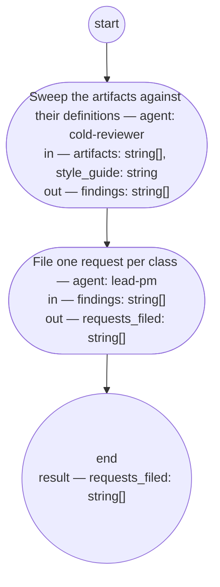

# Review sweep (compiled from `review-sweep-process`)

Read a set of delivered artifacts against their own definitions and the base writing style, and write one request per finding class — never a repair to one artifact. Runs only when the authority asks for it.

**A class, not an instance. A rule that fails once is that artifact's to fix on its own next pass; a rule that fails across artifacts is the definition's gap, and only that gap is worth a request.**

Result of an execution: `requests_filed` (string[]).



## sweep — Sweep the artifacts against their definitions

Run by an agent in role `cold-reviewer` (fresh context every run). reads: artifacts, style_guide · writes: findings.
- then: `file`

Prompt:

```text
Read every path in artifacts and the definition each one's own
type points to — its typedef, process definition, fitness set,
or guideline — and the style guide at style_guide. Judge each
artifact against its own definition and the style guide's word
targets and plain-voice rules. Group what you find into finding
classes: one class per distinct definition gap (the definition
is wrong or missing something) or prompt gap (a prompt exceeds
its word target or reads unclear) — never one class per
instance. Name each class, the rule it fails, and every artifact
it touches. Return the classes as findings.

Return each declared output on its own line as `<name>: <value>` — findings — a list as a JSON array, a value with line breaks as a JSON string; these lines close your reply.

Do not use these words: ratif, disposition, rebaseline bill, surface, seat
```

## file — File one request per class

Run by an agent in role `lead-pm`. reads: findings · writes: requests_filed.
- then: `end`

Prompt:

```text
For each class in findings, write one request into requests/
per the request typedef: originator "review-sweep", the class
and the artifacts it touches in section 1, status "received",
route left open for a later discovery or small-change
conversation to take up. Never write a request that repairs one
artifact instance. Return the paths written.

Return each declared output on its own line as `<name>: <value>` — requests_filed — a list as a JSON array, a value with line breaks as a JSON string; these lines close your reply.

Do not use these words: ratif, disposition, rebaseline bill, surface, seat
```
