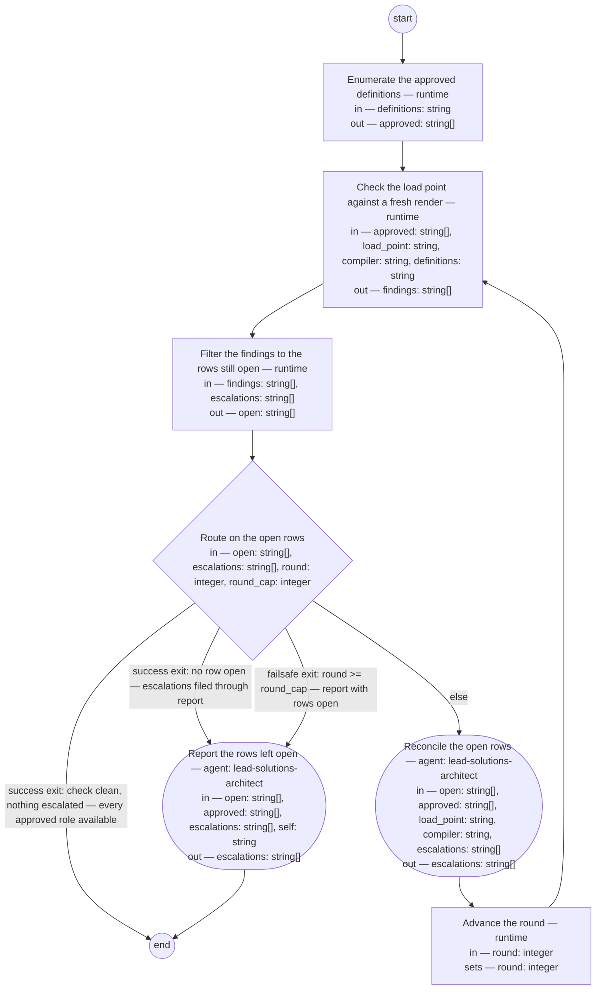

# Role rendering (compiled from `role-rendering-process`)

Make every approved role definition of the lead shop available at the agent's load point — the `.claude/agents/` directory the harness instantiates subagents from — by checking what stands there against a fresh render of each approved definition and reconciling every difference through the compiler, so that an agent filling a named role in a process step operates from the approved definition of that role: placement at the load point is what makes the role instantiable, and a clean check is the shop's evidence that every approved role is available.

**A rendering is never the source of truth. Whatever stands at the load point that a fresh render of an approved definition would not put there is a finding, and every finding resolves toward the definition — a re-render, a removal, or the owner's decision on the definition — never an edit to a rendered role.**



## enumerate — Enumerate the approved definitions

Run by the runtime — no agent, no prose. reads: definitions · writes: approved.

```yaml
run: "for def in ${definitions}/*.md; do\n  awk 'NR == 1 && !/^---$/ {exit 1} NR >\
  \ 1 && /^---$/ {exit} NR > 1 && /^status: approved$/ {f = 1} END {exit !f}' \"$def\"\
  \ \\\n    && printf '%s\\n' \"$def\"\ndone | sort\n"
next: check
```

## check — Check the load point against a fresh render

Run by the runtime — no agent, no prose. reads: approved, load_point, compiler, definitions · writes: findings.

```yaml
run: 'python3 ${compiler} --check ${load_point} --roles ${definitions} --findings
  ${approved}

  '
next: filter
```

## filter — Filter the findings to the rows still open

Run by the runtime — no agent, no prose. reads: findings, escalations · writes: open.

```yaml
run: "printf '%s\\n' \"${findings}\" | while IFS= read -r row; do\n  [ -n \"$row\"\
  \ ] || continue\n  subject=$(printf '%s\\n' \"$row\" | cut -d' ' -f2)\n  printf\
  \ '%s\\n' \"${escalations}\" | cut -d' ' -f1 | grep -qxF -- \"$subject\" \\\n  \
  \  || printf '%s\\n' \"$row\"\ndone\n"
next: route
```

## route — Route on the open rows

Run by the runtime — no agent, no prose. reads: open, escalations, round, round_cap · writes: —.

```yaml
branches:
- label: "success exit: check clean, nothing escalated \u2014 every approved role\
    \ available"
  when: size(open) == 0 && size(escalations) == 0
  next: end
- label: "success exit: no row open \u2014 escalations filed through report"
  when: size(open) == 0
  next: report
- label: "failsafe exit: round >= round_cap \u2014 report with rows open"
  when: round >= round_cap
  next: report
- else: reconcile
```

## reconcile — Reconcile the open rows

Run by an agent in role `lead-solutions-architect`. reads: open, approved, load_point, compiler, escalations · writes: escalations.
- then: `advance-round`

Prompt:

```text
Act on each row of open by its kind, the first word; the second
word is its subject. Every row you add to escalations begins with
that subject as its first word, then what you filed. "diverged"
or "missing": re-render — run `python3 ${compiler} <definition>
--agent <load_point>/<name>.md`, <definition> the row's third
word (the definition's path, listed in approved) and <name> the
subject; the render overwrites whatever stands, a hand edit
included — reconciliation is the re-render, never an edit to the
rendered role. "stale": remove the file at the row's third word
from the load point; nothing of a definition that does not stand
approved stays instantiable. "unrecognized": do not remove; add a
row to escalations — the subject (the file's path), then "for the
owner to decide". "will-not-compile": do not retry; write a
review entry into the Document History of the definition at the
subject — its path, listed in approved — naming this process and
the defect, and add a row to escalations — the subject, then the
entry. Return escalations.
```

## advance-round — Advance the round

Run by the runtime — no agent, no prose. reads: round · writes: round.

```yaml
set:
  round: round + 1
next: check
```

## report — Report the rows left open

Run by an agent in role `lead-solutions-architect`. reads: open, approved, escalations, self · writes: escalations.
- then: `end`

Prompt:

```text
This step files what leaves the run for the owner; it runs at
the round cap with rows open, or with no row open and
escalations standing. Every row you add to escalations begins
with the open row's subject — its second word — as its first
word, then what you filed. For each row of open whose subject is
a path in approved, write a review entry into that definition's
Document History naming this process and the row, and add to
escalations the subject then the entry; a row whose subject is a
role name or a path at the load point goes to escalations as the
subject then the row's kind. Then confirm every row of
escalations stands in a governed record the owner reads: a row
naming a definition, as the review entry in that definition's
Document History; every other row, in a Document History entry
for this run written into the definition at self. The resulting
action on each escalated row is the owner's decision. Return
escalations.
```
