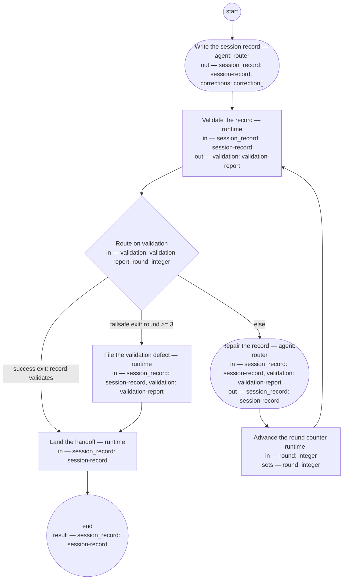

# Session handoff (compiled from `session-handoff-process`)

Close a conversation so later work starts from governed records alone — no memory channel, no chat summary, and no transcript as the carrier.

**State crosses sessions only inside governed artifacts. A fact worth remembering has a governed home; a durable correction amends the definition it corrects, never a memory.**

Result of a run: `session_record` (session-record).



## collect — Write the session record

Run by an agent in role `router`. reads: — · writes: session_record, corrections.
- check: `corrections.all(c, c.target != "" && c.bead != "")`
- then: `validate`

Prompt:

```text
Write or update the session record: outcome first; the produced and
revised lists complete; every open thread names its next ready
action. For each durable correction met this session — a rule,
preference, or mode change that should outlive the session — file a
bead targeting the definition it amends and list the pair here. The
record points; the definition carries. Nothing goes to a memory
channel: memory writes are frozen.
```

## validate — Validate the record

Run by the runtime — no agent, no prose. reads: session_record · writes: validation.

```yaml
run: 'shop-knowledge validate ${session_record.path}

  '
next: route-validation
```

## route-validation — Route on validation

Run by the runtime — no agent, no prose. reads: validation, round · writes: —.

```yaml
branches:
- label: 'success exit: record validates'
  when: validation.ok
  next: land
- label: 'failsafe exit: round >= 3'
  when: round >= 3
  next: file-defect
- else: repair
```

## repair — Repair the record

Run by an agent in role `router`. reads: session_record, validation · writes: session_record.
- then: `advance-round`

Prompt:

```text
Repair every named violation in the validation errors. Do not
remove content to pass validation — a section the schema demands is
written, not deleted.
```

## advance-round — Advance the round counter

Run by the runtime — no agent, no prose. reads: round · writes: round.

```yaml
set:
  round: round + 1
next: validate
```

## file-defect — File the validation defect

Run by the runtime — no agent, no prose. reads: session_record, validation · writes: —.

```yaml
run: "bd create --title \"Session record failed validation at handoff: ${session_record.id}\"\
  \ \\\n  --body \"${validation.errors}\"\n"
next: land
```

## land — Land the handoff

Run by the runtime — no agent, no prose. reads: session_record · writes: —.

```yaml
run: 'git add -A && git commit -m "Session handoff: ${session_record.id}"

  bd dolt push

  git push

  '
atomic: true
next: end
```
