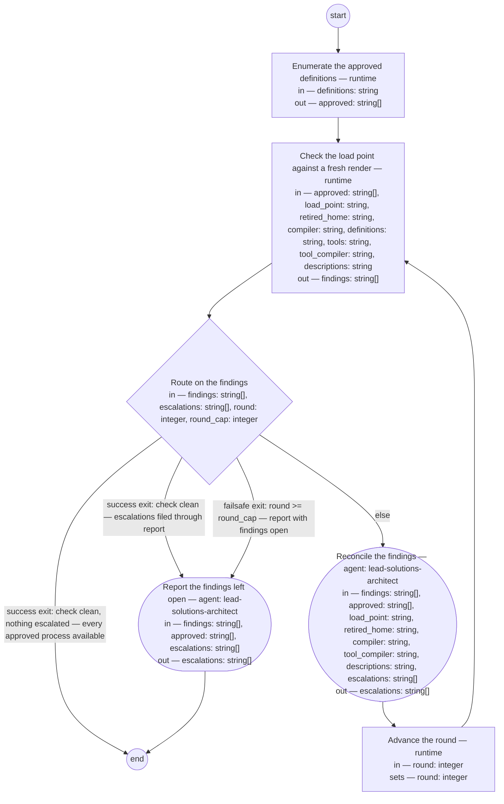

# Skill rendering (compiled from `skill-rendering-process`)

Make every approved process definition of the lead shop, every framework tool of the lead shop that answers the standard question, and every framework tool the shop runs that cannot answer and has a description beside it, available at the agent's load point — the `.claude/skills/` directory the harness loads skills from — by checking what stands there against a fresh render of each approved definition and a fresh production from what each tool says about itself — its answer, or the description beside it — and reconciling every difference through the compiler of that source kind, so that an agent beginning an activity operates from the approved definition of that activity and an agent running a tool operates from what the tool now says about itself: placement at the load point is what makes the skill load, and a clean check is the shop's evidence that every approved process and every framework tool is available.

**A rendering is never the source of truth. Whatever stands at the load point that a fresh render of an approved definition, or a fresh production from what a tool says about itself, would not put there is a finding, and every finding resolves toward the source — a re-render, a re-production, a removal, a repair to a description, or the owner's decision on the definition — never an edit to a skill.**



## enumerate — Enumerate the approved definitions

Run by the runtime — no agent, no prose. reads: definitions · writes: approved.

```yaml
run: 'grep -l ''^status: approved'' ${definitions}/*.md | sort

  '
next: check
```

## check — Check the load point against a fresh render

Run by the runtime — no agent, no prose. reads: approved, load_point, retired_home, compiler, definitions, tools, tool_compiler, descriptions · writes: findings.

```yaml
run: "scratch=$(mktemp -d)\nmkdir -p \"$scratch/defs\" \"$scratch/tools\" \"$scratch/descs\"\
  \nln -s \"$PWD/basis/types\" \"$scratch/types\"\nln -s \"$PWD/basis/artifacts\"\
  \ \"$scratch/artifacts\"\nfor def in ${approved}; do\n  pid=$(sed -n 's/^id: //p'\
  \ \"$def\" | head -1)\n  name=$(sed -n 's/^carried-by: //p' \"$def\" | sed 's/-skill$//')\n\
  \  if [ -z \"$name\" ]; then echo \"missing $pid no-skill-id\"; continue; fi\n \
  \ copy=\"$scratch/defs/$(basename \"$def\")\"\n  cp \"$def\" \"$copy\"\n  if ! python3\
  \ ${compiler} \"$copy\" --skill \"$scratch/$name/SKILL.md\" >/dev/null 2>&1; then\n\
  \    echo \"will-not-compile $pid\"; continue\n  fi\n  if [ ! -f \"${load_point}/$name/SKILL.md\"\
  \ ]; then echo \"missing $pid\"; continue; fi\n  diff -q \"$scratch/$name/SKILL.md\"\
  \ \"${load_point}/$name/SKILL.md\" >/dev/null 2>&1 || echo \"diverged $pid\"\ndone\n\
  for tool in ${tools}/*.py; do\n  out=$(python3 ${tool_compiler} \"$tool\" --load-point\
  \ \"$scratch/tools\" 2>/dev/null) || continue\n  name=$(printf '%s\\n' \"$out\"\
  \ | sed -n 's/.*: generated from \\([^ ]*\\) .*/\\1/p')\n  [ -n \"$name\" ] || continue\n\
  \  if [ ! -f \"${load_point}/$name/SKILL.md\" ]; then echo \"tool-missing $tool\"\
  ; continue; fi\n  diff -q \"$scratch/tools/$name/SKILL.md\" \"${load_point}/$name/SKILL.md\"\
  \ >/dev/null 2>&1 || echo \"tool-diverged $tool\"\ndone\nfor desc in ${descriptions}/*.json;\
  \ do\n  [ -f \"$desc\" ] || continue\n  if ! out=$(python3 ${tool_compiler} \"$desc\"\
  \ --load-point \"$scratch/descs\" 2>/dev/null); then\n    echo \"description-invalid\
  \ $desc\"; continue\n  fi\n  name=$(printf '%s\\n' \"$out\" | sed -n 's/.*: generated\
  \ from \\([^ ]*\\) .*/\\1/p')\n  [ -n \"$name\" ] || continue\n  if [ ! -f \"${load_point}/$name/SKILL.md\"\
  \ ]; then echo \"description-missing $desc\"; continue; fi\n  diff -q \"$scratch/descs/$name/SKILL.md\"\
  \ \"${load_point}/$name/SKILL.md\" >/dev/null 2>&1 || echo \"description-diverged\
  \ $desc\"\n  beside=$(sed -n 's/^stands-beside: //p' \"$scratch/descs/$name/SKILL.md\"\
  )\n  [ -n \"$beside\" ] || continue\n  python3 ${tool_compiler} \"$beside\" >/dev/null\
  \ 2>&1 && echo \"tool-answers $beside $desc\"\ndone\nfor f in \"${load_point}\"\
  /*/SKILL.md; do\n  [ -f \"$f\" ] || continue\n  src=$(sed -n 's/^source: //p' \"\
  $f\")\n  name=$(basename \"$(dirname \"$f\")\")\n  case \"$src\" in\n    ${definitions}/*)\n\
  \      printf '%s\\n' ${approved} | grep -qxF -- \"$src\" || echo \"stale $src $f\"\
  \ ;;\n    ${descriptions}/*)\n      [ -f \"$scratch/descs/$name/SKILL.md\" ] ||\
  \ echo \"no-description $src $f\" ;;\n    ${tools}/*)\n      [ -f \"$scratch/tools/$name/SKILL.md\"\
  \ ] || echo \"no-answer $src $f\" ;;\n    */*|\"\") echo \"unrecognized $f\" ;;\n\
  \    *)\n      if python3 ${tool_compiler} \"$src\" --load-point \"$scratch/tools\"\
  \ >/dev/null 2>&1 \\\n         && [ -f \"$scratch/tools/$name/SKILL.md\" ]; then\n\
  \        diff -q \"$scratch/tools/$name/SKILL.md\" \"$f\" >/dev/null 2>&1 || echo\
  \ \"tool-diverged $src\"\n      else\n        echo \"no-answer $src $f\"\n     \
  \ fi ;;\n  esac\ndone\nif [ -d \"${retired_home}\" ]; then echo \"second-home ${retired_home}\"\
  ; fi\nrm -rf \"$scratch\"\n"
next: route
```

## route — Route on the findings

Run by the runtime — no agent, no prose. reads: findings, escalations, round, round_cap · writes: —.

```yaml
branches:
- label: "success exit: check clean, nothing escalated \u2014 every approved process\
    \ available"
  when: size(findings) == 0 && size(escalations) == 0
  next: end
- label: "success exit: check clean \u2014 escalations filed through report"
  when: size(findings) == 0
  next: report
- label: "failsafe exit: round >= round_cap \u2014 report with findings open"
  when: round >= round_cap
  next: report
- else: reconcile
```

## reconcile — Reconcile the findings

Run by an agent in role `lead-solutions-architect`. reads: findings, approved, load_point, retired_home, compiler, tool_compiler, descriptions, escalations · writes: escalations.
- then: `advance-round`

Prompt:

```text
Act on each row of findings by kind, skipping any definition,
tool, or description already named in escalations. "diverged", or "missing"
with a skill id: re-render — run
`python3 ${compiler} <definition> --skill
<load_point>/<name>/SKILL.md`, the definition's path from
approved and <name> its carried-by id without the -skill suffix;
the render overwrites whatever stands, a hand-edit included —
reconciliation is the re-render, never an edit to the skill.
"tool-diverged" or "tool-missing": re-produce — run
`python3 ${tool_compiler} <tool> --load-point <load_point>`, the
tool's path from the row; the compiler asks the tool again and
writes the skill from the fresh answer over whatever stands, a
hand-edit included — never edit the skill, never edit the
tool's answer to agree with a skill. "no-answer": do not remove;
the tool named no longer produces a skill of that name — it
cannot answer, or answers under another name — so add the row's
tool and path to escalations as the owner's to decide.
"description-diverged" or "description-missing": re-produce —
run `python3 ${tool_compiler} <description> --load-point
<load_point>`, the description's path from the row; the
compiler reads the file again and writes the skill from it over
whatever stands, a hand-edit included — never edit the skill.
"description-invalid": run `python3 ${tool_compiler}
<description>` to read the report naming the tool and the part
the description lacks; repair the description at that part —
never a skill — and re-produce; if the repair is not yours to
make in this round, add the description's path with the report
to escalations. "tool-answers": the tool the description stands
beside now answers the standard question, so the description is
a second home — run `python3 ${tool_compiler} <tool>
--load-point <load_point>`, the tool from the row, so the skill
is produced from the answer; remove the description file from
<descriptions>; write into the tool's gap request (the request
under requests/ that names the tool) the closing event in its
Result section and Document History — the check observed the
answer, the skill was produced from it, the description was
retired — and add that request's path to escalations for the
lead-pm role to set its status. Never edit the answer or the
description to agree with a skill. "no-description": do not
remove; the description named no longer produces a skill of
that name — the file is gone or not in the shape — so add the
row's source and path to escalations as the owner's to decide.
"stale": remove that skill's directory from the load point — its
source names a process definition that does not stand approved,
so nothing of it stays loadable. "unrecognized": do not remove;
the skill is no rendering of any process definition, so add its
path to escalations as the owner's to decide. "second-home":
remove the retired home directory, then add to escalations the
fixed notice: "the retired home is removed; the owner is to
amend the basis index's skills/ entry and sweep for any Carried
by reference still naming the retired home" — no sweep by this
step. "will-not-compile", or "missing"
marked no-skill-id: do not retry; write a review entry into that
definition's Document History naming this process and the
defect, and add the definition's path with the entry to
escalations. Return escalations.

Return each declared output on its own line as `<name>: <value>` — escalations — a list as a JSON array, a value with line breaks as a JSON string; these lines close your reply.

Do not use these words: ratif, disposition, rebaseline bill, surface, seat
```

## advance-round — Advance the round

Run by the runtime — no agent, no prose. reads: round · writes: round.

```yaml
set:
  round: round + 1
next: check
```

## report — Report the findings left open

Run by an agent in role `lead-solutions-architect`. reads: findings, approved, escalations · writes: escalations.
- then: `end`

Prompt:

```text
This step files what leaves the run for the owner; it runs at
the round cap with findings open, or on a clean check with
escalations standing. For each row of findings still open whose
definition is not yet named in escalations, write a review entry
into that definition's Document History — the definition's path
from approved — naming this process and the finding, and add the
path with the entry to escalations; a row naming no definition —
an unrecognized skill — goes to escalations by its path alone.
Then confirm every escalation row stands in a governed record
the owner reads: a row naming a definition, as the review entry
in that definition's Document History; a path-only row — an
unrecognized skill, the second-home notice — lands in this
process definition's Document History entry for the run. The
resulting action on each escalated row is the owner's decision.
Return escalations.

Return each declared output on its own line as `<name>: <value>` — escalations — a list as a JSON array, a value with line breaks as a JSON string; these lines close your reply.

Do not use these words: ratif, disposition, rebaseline bill, surface, seat
```
