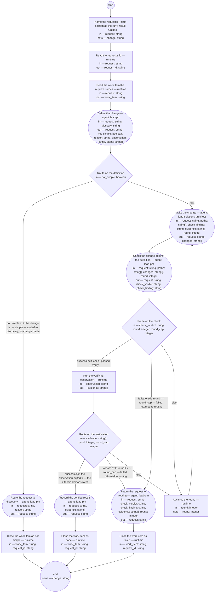

# Small change (compiled from `small-change-process`)

Take a request whose route is the small-change lane to a verified result. No bet is taken and no check of record is run in this process: both protect the appetite an initiative's bet spends (the [initiative typedef](../artifacts/initiative.md)'s term), and a simple change — the glossary's term — spends none of it worth a bet.

**The definition on the request is the whole of what good looks like for the change: every role in the run judges by it, and nothing outside it is made or counts as verified. Everything the run decides lands on the request or in the changed artifacts' own histories; nothing binding lives only in the transcript.**

Result of a run: `change` (string).



## name-result — Name the request's Result section as the run's result

Run by the runtime — no agent, no prose. reads: request · writes: change.

```yaml
set:
  change: request + "#result"
next: read-id
```

## read-id — Read the request's id

Run by the runtime — no agent, no prose. reads: request · writes: request_id.

```yaml
run: 'sed -n ''s/^id: //p'' ${request} | head -1 | grep .

  '
next: read-anchor
```

## read-anchor — Read the work item the request names

Run by the runtime — no agent, no prose. reads: request · writes: work_item.

```yaml
run: 'sed -n ''s/^work-item: //p'' ${request} | head -1 | grep .

  '
next: define
```

## define — Define the change

Run by an agent in role `lead-po`. reads: request, glossary · writes: request, not_simple, reason, observation, paths.
- then: `route-definition`

Prompt:

```text
Read the request — its sections 1 to 3: the originator's words,
the reader, the route and its reason — and the entry for simple
change in the glossary at glossary; nothing else. First judge
the change by that entry. If it is not a simple change, return
not_simple true with the reason, observation and paths empty,
and write nothing on the request: the lane makes no change for it.
Otherwise write the change's definition into the request's
Result section under the heading Definition, opening with the
request's id: what will be different when the change is done, as
one or more Given/When/Then acceptance statements a checker can
decide against the changed artifacts; the artifacts the change
touches, by path — where one is a rendering, its source and the
rendering tool listed with it, since the maker reads what paths
names and nothing else; the maker role — lead-solutions-architect, the
role the make step runs by; and the verifying observation — one
command, run from the repository root, whose exit 0 shows the
effect in the running system and whose output is the evidence.
The definition says what, never how, and stands before any
change: you touch no artifact but the request. Bump the
request's version with the history row. Return the request,
not_simple false, reason empty, observation as the command
exactly as written, and paths as the artifacts the definition
names.

Do not use these words: ratif, disposition, rebaseline bill, surface, seat
```

## route-definition — Route on the definition

Run by the runtime — no agent, no prose. reads: not_simple · writes: —.

```yaml
branches:
- label: "not-simple exit: the change is not simple \u2014 routed to discovery, no\
    \ change made"
  when: not_simple
  next: reroute
- else: make
```

## make — Make the change

Run by an agent in role `lead-solutions-architect`. reads: request, paths, check_finding, evidence, round · writes: request, changed.
- then: `check`

Prompt:

```text
Read the Definition in the request's Result section and the
artifacts at paths — nothing else; the definition is not yours
to edit, and paths is the whole of what you may change. Make
the change so that every acceptance statement holds, through
each artifact's own producing rules: a definition or typedef
amended under the decision the request records, with its
Document History row citing the request by id and its version
bumped; its schema changed where the definition names one; a
tool changed together with the definition that names it; a
rendering never edited by hand — re-rendered by the tool paths
names from the source paths names. Make nothing the definition
does not cover. When
check_finding is not empty this is a repair round: repair what
it quotes. When evidence is not empty and check_finding is, the
verifying observation failed: read the evidence and repair the
cause. Write under Change made in the request's Result section,
one entry for this round: your role as maker, every path
changed with its version before and after, and round. Return
the request and changed — the paths you changed this round.

Do not use these words: ratif, disposition, rebaseline bill, surface, seat
```

## check — Check the change against the definition

Run by an agent in role `lead-pm`. reads: request, paths, changed, round · writes: request, check_verdict, check_finding.
- then: `route-check`

Prompt:

```text
Read the Definition and the Change made entry for round in the
request's Result section, and the artifacts at paths and at
changed — nothing else. You are not the maker: the make step runs by
another role, and your verdict is judged against the definition
alone, not against what you would have made. For each acceptance
statement, decide whether the changed artifacts satisfy it; for
each change, whether it went through the artifact's own
producing rules — the history row citing the request, the
version bumped, no rendering edited by hand, nothing made that
the definition does not cover — a path in changed that is not in
paths fails this rule. Verdict pass only when every
statement holds and every change conforms; otherwise fail, with
check_finding the statement or rule that fails, quoted, and what
fails it. Write under Check in the Result section: the verdict,
your role, round, and the finding. Return the request, the
verdict, and the finding — empty on pass.

Do not use these words: ratif, disposition, rebaseline bill, surface, seat
```

## route-check — Route on the check

Run by the runtime — no agent, no prose. reads: check_verdict, round, round_cap · writes: —.

```yaml
branches:
- label: "success exit: check passed \u2014 verify"
  when: check_verdict == "pass"
  next: verify
- label: "failsafe exit: round >= round_cap \u2014 failed, returned to routing"
  when: round >= round_cap
  next: hand-back
- else: advance-round
```

## verify — Run the verifying observation

Run by the runtime — no agent, no prose. reads: observation · writes: evidence.

```yaml
run: '( ${observation} ) 2>&1

  printf ''exit %s\n'' "$?"

  '
next: route-verify
```

## route-verify — Route on the verification

Run by the runtime — no agent, no prose. reads: evidence, round, round_cap · writes: —.

```yaml
branches:
- label: "success exit: the observation exited 0 \u2014 the effect is demonstrated"
  when: size(evidence) > 0 && evidence[size(evidence) - 1] == "exit 0"
  next: record
- label: "failsafe exit: round >= round_cap \u2014 failed, returned to routing"
  when: round >= round_cap
  next: hand-back
- else: advance-round
```

## advance-round — Advance the round

Run by the runtime — no agent, no prose. reads: round · writes: round.

```yaml
set:
  round: round + 1
next: make
```

## record — Record the verified result

Run by an agent in role `lead-pm`. reads: request, evidence · writes: request.
- then: `close-done`

Prompt:

```text
Read the request's Result section and evidence. Write under
Verified result: the verifying observation the Definition named,
its evidence — the output lines and the closing exit 0 — the
date, and your role; state that the Definition, the Check's
verdict by your role, and this result stand, and that between
the request and this result no bet was taken and no check of
record was run. Set the request's status to done; bump its
version with the history row. Return the request.

Do not use these words: ratif, disposition, rebaseline bill, surface, seat
```

## close-done — Close the work item as done

Run by the runtime — no agent, no prose. reads: work_item, request_id · writes: —.

```yaml
run: 'bd close ${work_item} --reason "done: ${request_id}"

  '
next: end
```

## reroute — Route the request to discovery

Run by an agent in role `lead-pm`. reads: request, reason · writes: request.
- then: `close-not-simple`

Prompt:

```text
Change the request's route to discovery, with reason as its
route-reason — the status unchanged; write under the Result
section that the lane defined no change and made none, with the
reason. The originator reads the changed route and its reason
from the request, as the first route was read. Bump the
request's version with the history row. Return the request.

Do not use these words: ratif, disposition, rebaseline bill, surface, seat
```

## close-not-simple — Close the work item as not simple

Run by the runtime — no agent, no prose. reads: work_item, request_id · writes: —.

```yaml
run: "bd close ${work_item} --reason \"not simple: routed to discovery \u2014 ${request_id}\"\
  \n"
next: end
```

## hand-back — Return the request to routing

Run by an agent in role `lead-pm`. reads: request, check_verdict, check_finding, evidence, round · writes: request.
- then: `close-failed`

Prompt:

```text
The lane reached its round cap with the change unverified. Write
under the Result section the findings standing at the cap — the
last check_verdict with check_finding, and evidence from the
last round in which the observation ran, with that round named;
where the cap fell on a check, evidence is from an earlier round
or empty, and you say which — and round; set the request's route to
awaiting with the reason "small-change lane failed at the round
cap" and its status to recorded, so the request is again visible
as awaiting its route. Revert nothing: the changed artifacts'
histories stand as the maker wrote them, and the request records
what stands. Bump the request's version with the history row.
Return the request.

Do not use these words: ratif, disposition, rebaseline bill, surface, seat
```

## close-failed — Close the work item as failed

Run by the runtime — no agent, no prose. reads: work_item, request_id · writes: —.

```yaml
run: "bd close ${work_item} --reason \"failed at the cap: returned to routing \u2014\
  \ ${request_id}\"\n"
next: end
```
