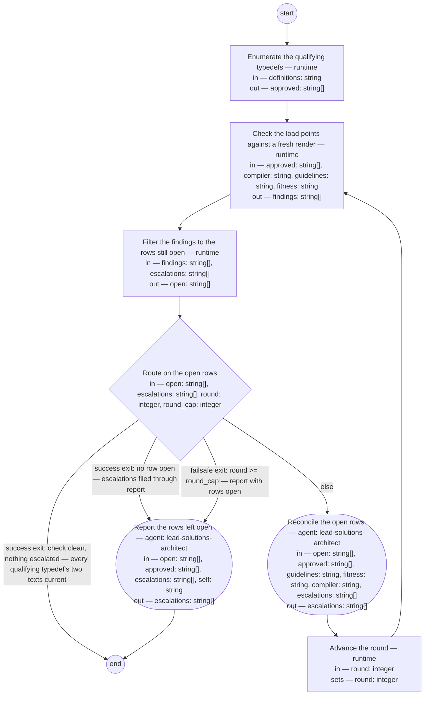

# Typedef rendering (compiled from `typedef-rendering-process`)

Keep the two texts of every artifact type current with the type's one standard. The process checks what stands at the two load points against a fresh render of each qualifying typedef by the *compiler* — the tool of the *lead shop*, this repository, the shop that owns the product's definitions — that produces both texts from a typedef, and reconciles every difference through the compiler — so that a maker and a checker of the type work from the same words, a change to the typedef reaches both texts, and a clean check is the shop's evidence that they do.

**A rendering is never the source of truth. Whatever stands at a qualifying typedef's output path, or names a typedef not in `approved` as its source, that a fresh render would not put there is a finding, and every finding resolves toward the typedef — a re-render by the compiler, a removal, or the owner's decision on the typedef — never an edit to a rendered text, and never an edit to the typedef made to match one.**



## enumerate — Enumerate the qualifying typedefs

Run by the runtime — no agent, no prose. reads: definitions · writes: approved.

```yaml
run: "for def in ${definitions}/*.md; do\n  awk 'NR == 1 && !/^---$/ {exit 1} NR >\
  \ 1 && !body && /^---$/ {body = 1; next} !body && /^status: approved$/ {a = 1} body\
  \ && /^## Writing rules$/ {w = 1} body && /^## Fitness scenarios$/ {s = 1} END {exit\
  \ !(a && w && s)}' \"$def\" \\\n    && printf '%s\\n' \"$def\"\ndone | sort\n"
next: check
```

## check — Check the load points against a fresh render

Run by the runtime — no agent, no prose. reads: approved, compiler, guidelines, fitness · writes: findings.

```yaml
run: "for def in ${approved}; do\n  type=$(awk 'NR == 1 && !/^---$/ {exit} NR > 1\
  \ && /^---$/ {exit} NR > 1 && sub(/^defines: */, \"\") {print; exit}' \"$def\")\n\
  \  [ -n \"$type\" ] || { printf 'will-not-compile %s no defines key\\n' \"$def\"\
  ; continue; }\n  rows=$(python3 ${compiler} \"$def\" --check --guideline ${guidelines}/$type.md\
  \ --fitness ${fitness}/$type.fitness.md) \\\n    || { rc=$?; [ -n \"$rows\" ] ||\
  \ exit $rc; }\n  [ -z \"$rows\" ] || printf '%s\\n' \"$rows\" | awk -v def=\"$def\"\
  \ '$1 == \"missing\" || $1 == \"diverged\" { $2 = $2 \" \" def } { print }'\n  printf\
  \ '%s\\n' \"$rows\" | grep -q '^will-not-compile ' && continue\n  for file in ${guidelines}/$type.md\
  \ ${fitness}/$type.fitness.md; do\n    [ -f \"$file\" ] || continue\n    awk 'NR\
  \ == 1 && !/^---$/ {exit} NR > 1 && /^---$/ {exit} NR > 1 && /^generated:/ {g =\
  \ 1; exit} END {exit !g}' \"$file\" \\\n      || printf 'hand-written %s %s\\n'\
  \ \"$file\" \"$def\"\n  done\ndone\nfor file in ${guidelines}/*.md ${fitness}/*.md;\
  \ do\n  [ -f \"$file\" ] || continue\n  src=$(awk 'NR == 1 && !/^---$/ {exit} NR\
  \ > 1 && /^---$/ {exit} NR > 1 && sub(/^source: */, \"\") {print; exit}' \"$file\"\
  )\n  [ -z \"$src\" ] && continue\n  printf '%s\\n' \"${approved}\" | grep -qxF --\
  \ \"$src\" \\\n    || printf 'stale %s %s\\n' \"$src\" \"$file\"\ndone\n"
next: filter
```

## filter — Filter the findings to the rows still open

Run by the runtime — no agent, no prose. reads: findings, escalations · writes: open.

```yaml
run: "printf '%s\\n' \"${findings}\" | while IFS= read -r row; do\n  [ -n \"$row\"\
  \ ] || continue\n  subject=$(printf '%s\\n' \"$row\" | cut -d' ' -f2)\n  printf\
  \ '%s\\n' \"${escalations}\" | cut -d' ' -f1 | grep -qxF -- \"$subject\" \\\n  \
  \  || printf '%s\\n' \"$row\"\ndone\n"
next: route
```

## route — Route on the open rows

Run by the runtime — no agent, no prose. reads: open, escalations, round, round_cap · writes: —.

```yaml
branches:
- label: "success exit: check clean, nothing escalated \u2014 every qualifying typedef's\
    \ two texts current"
  when: size(open) == 0 && size(escalations) == 0
  next: end
- label: "success exit: no row open \u2014 escalations filed through report"
  when: size(open) == 0
  next: report
- label: "failsafe exit: round >= round_cap \u2014 report with rows open"
  when: round >= round_cap
  next: report
- else: reconcile
```

## reconcile — Reconcile the open rows

Run by an agent in role `lead-solutions-architect`. reads: open, approved, guidelines, fitness, compiler, escalations · writes: escalations.
- then: `advance-round`

Prompt:

```text
Act on each row of open by its kind, the first word; the second
word is its subject. Every row you add to escalations begins with
that subject as its first word, then what you filed. "missing",
"diverged", or "hand-written": re-render — run `python3
${compiler} <typedef> --guideline ${guidelines}/<type>.md
--fitness ${fitness}/<type>.fitness.md`, <typedef> the row's third
word (the typedef's path, listed in approved) and <type> the
value of `defines` in that typedef's front-matter; one run produces the type's two texts together
and overwrites whatever stands at either path, a hand edit
included — reconciliation is the re-render by the compiler, never
an edit to a rendered text, and never an edit to the typedef made
to match one. "stale": remove the file at the row's third word
from its load point; nothing produced from a typedef that does
not qualify stays where a maker or a check reads it.
"will-not-compile": do not retry; write a review entry into the
Document History of the typedef at the subject — its path,
listed in approved — naming this process and the row, and add a
row to escalations — the subject, then the entry. Return
escalations.
```

## advance-round — Advance the round

Run by the runtime — no agent, no prose. reads: round · writes: round.

```yaml
set:
  round: round + 1
next: check
```

## report — Report the rows left open

Run by an agent in role `lead-solutions-architect`. reads: open, approved, escalations, self · writes: escalations.
- then: `end`

Prompt:

```text
This step files what leaves the run for the owner. Every row
you add to escalations begins
with the open row's subject — its second word — as its first
word, then what you filed. For each row of open that names a
path in approved — as its subject or as its third word — write a
review entry into that typedef's Document History naming this
process and the row, and add to escalations the subject then the
entry; a row that names no path in approved goes to escalations
as the subject then the row's kind. Then confirm every row of
escalations stands in a governed record the owner reads: a row
filed into a typedef, as the review entry in that typedef's
Document History; every other row, in a Document History entry
for this run written into the definition at self. The resulting
action on each escalated row is the owner's decision. Return
escalations.
```
