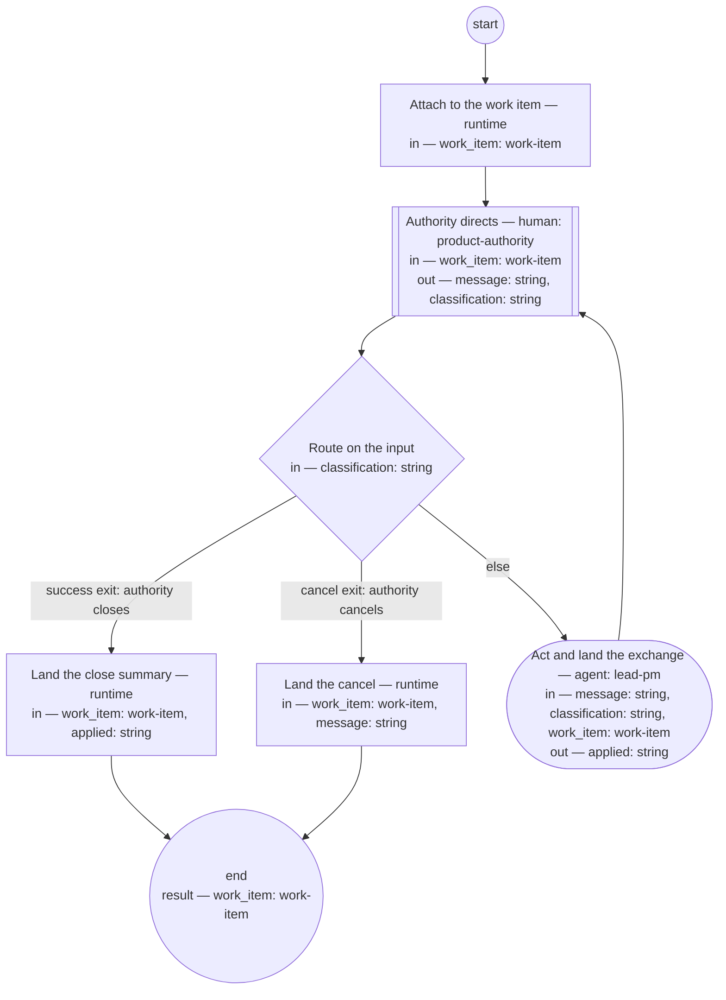

# Work conversation (compiled from `work-conversation-process`)

Conduct a bounded operational discussion scoped to one work item: every exchange lands on the item, so the discussion is containable, findable, and survives the transcript.

**The work item carries the discussion; a conversation that cannot name its work item does not start.**

Result of a run: `work_item` (work-item).



## attach — Attach to the work item

Run by the runtime — no agent, no prose. reads: work_item · writes: —.

```yaml
run: 'bd comment ${work_item.id} "Work conversation opened"

  '
next: observe
```

## observe — Authority directs

Run by a human holding role `product-authority`. reads: work_item · writes: message, classification.
- then: `route`

Prompt:

```text
The work item and its history are in front of you. Your message is
one of: an instruction to act on, a question, a close (a summary
lands on the item; the item's own life continues), or a cancel.
Silence holds the conversation after the declared window; the work
item carries the resume point.
```

## route — Route on the input

Run by the runtime — no agent, no prose. reads: classification · writes: —.

```yaml
branches:
- label: 'success exit: authority closes'
  when: classification == "close"
  next: close-out
- label: 'cancel exit: authority cancels'
  when: classification == "cancel"
  next: cancel-out
- else: act
```

## act — Act and land the exchange

Run by an agent in role `lead-pm`. reads: message, classification, work_item · writes: applied.
- check: `applied != ""`
- then: `observe`

Prompt:

```text
Act on the message within the work item's scope; answer questions
from the item's history and the corpus. Land the exchange as a
comment on the work item — what was asked, what was done, with
links. Work that outgrows the item's scope is not absorbed: file it
as its own item and say so. Nothing binding stays only in the
transcript.

Do not use these words: ratif, disposition, rebaseline bill, surface, seat
```

## close-out — Land the close summary

Run by the runtime — no agent, no prose. reads: work_item, applied · writes: —.

```yaml
run: 'bd comment ${work_item.id} "Work conversation closed: ${applied}"

  '
next: end
```

## cancel-out — Land the cancel

Run by the runtime — no agent, no prose. reads: work_item, message · writes: —.

```yaml
run: 'bd comment ${work_item.id} "Work conversation cancelled: ${message}"

  '
next: end
```
