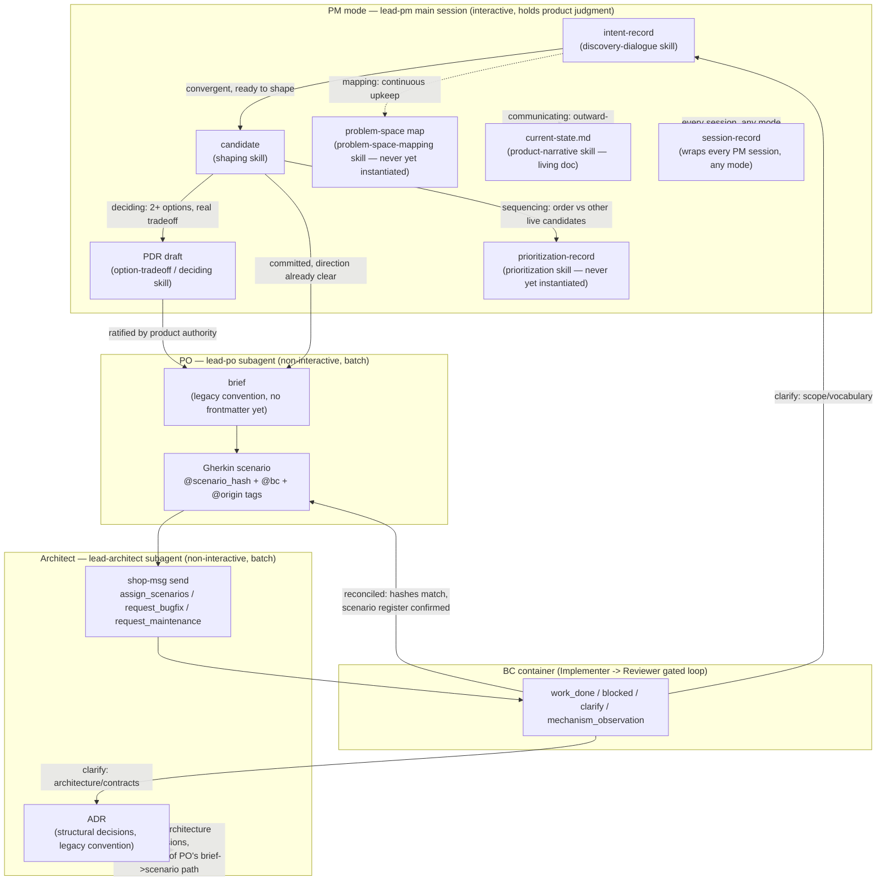
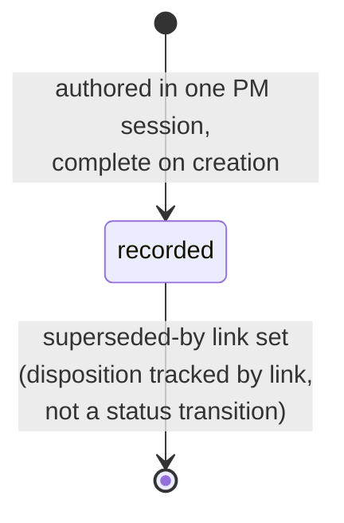
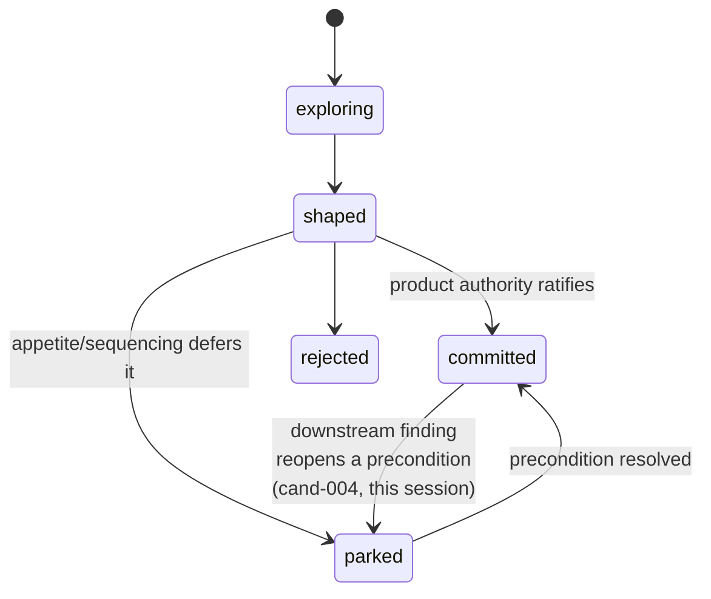
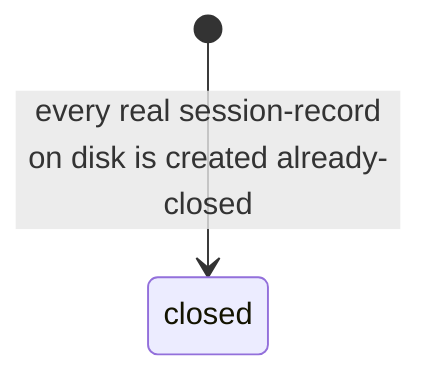
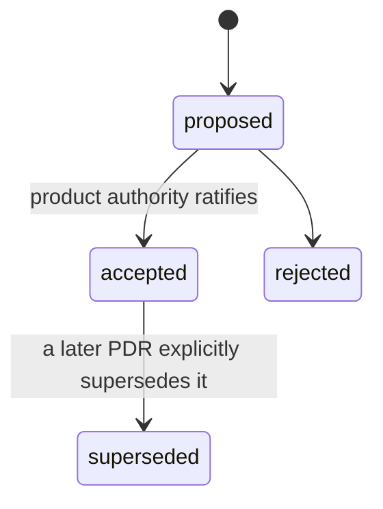

# Artifact lifecycle — shopsystem-product

A living reference for how a piece of product intent moves through this
repo's artifacts, and what state each artifact type can be in. Written to
answer `cand-005`'s acceptance criterion 1 ("a documented lifecycle flow
for artifacts") directly — this document did not exist before 2026-07-16;
its absence was part of what `cand-005` found broken.

**Status caveats, stated up front rather than hidden:** the flow diagram
below reflects how this repo actually operates today (verified against
real session history, not aspirational). The per-type lifecycle diagrams
are split into **pinned** (a Gherkin scenario in
`features/shopsystem-knowledge/` asserts this shape — the schema checker
enforces it) and **observed-only** (this is what practice has
consistently done, but nothing yet enforces it — see `cand-005` Phase 1
remainder / Phase 5). Treat observed-only sections as provisional.

**Ownership note, stated honestly:** this document is hand-authored and
lives in the lead repo for immediate human/LLM readability. The
authoritative source of artifact *shape* is `shopsystem-knowledge`'s
typedef system (PDR-032/ADR-059); the authoritative source of artifact
*lifecycle rules* should eventually be the coherence gate `cand-005`
Phase 4 builds. A hand-maintained graph is exactly the kind of thing that
drifts the way the typedef/practice split did — this file should be
revisited (or ideally generated) once Phase 4 lands, not trusted as
permanent. Until then, it beats no documentation at all, which was the
prior state.

## The cross-type flow

**Reading this graph:** PM mode owns the *why* (intent → candidate →
optionally a PDR when a real decision needs ratifying); the PO owns the
*commitment* (brief → Gherkin scenarios, which are requirements, not
implementation); the Architect owns *dispatch and reconciliation*
(sends scenarios to a BC, closes the loop on `work_done`). A candidate
can reach a brief either directly (direction already convergent — most
of this repo's history) or via a PDR draft first (when there were
genuinely competing options needing the product authority to choose
between them — `PDR-034`, `PDR-... this doc` file's own genesis). ADRs
are architecture-only and don't require a candidate first; they record
structural decisions the Architect makes in the course of dispatch work.

## Per-type lifecycle

### intent-record — **pinned** (`features/shopsystem-knowledge/intent_record_status_lifecycle.feature`)

Only one status value exists: `recorded`. Confirmed 2026-07-16 against
all 7 real instances (`intent-001`–`intent-007`) — none was ever
authored incomplete or transitioned through other states on disk. The
previously-generated schema's `draft`/`active`/`fulfilled`/`abandoned`
enum was fictional — never used once — and has been retired.

### candidate — **pinned** (`features/shopsystem-knowledge/candidate_status_lifecycle_reconciliation.feature` + the pre-existing `frontmatter_schema_conformance.feature`)

`exploring`/`briefed`/`rejected` are pinned but not yet observed in this
repo's real history; `shaped`, `committed`, and `parked` are the states
actually exercised (`cand-001`–`cand-005`). `parked` is currently
recorded via the separate `parked-until` field rather than the status
literal in the one real instance that used it (`cand-004`) — worth a
future reconciliation, not done here.

### session-record — **observed-only**, not yet pinned

All session-records ever authored use `status: closed` — none has ever
used `open` or any other value. `cand-005` Phase 1's PO dispatch fixed
this type's id pattern and body sections but left status untouched
(flagged as a possible follow-up, not yet a scenario).

### pdr — **pinned**, confirmed no defect

Checked directly 2026-07-16 (Architect Phase 1 work): this enum already
matches real practice and is already enforced (`@scenario_hash:2363911877f9f657`
governs the `decision-makers` field requirement). `PDR-034`'s own
`status: draft` was a one-document content bug (should have been
`proposed`), not a typedef defect — fixed in that file directly, no
scenario change needed.

### adr, brief, prioritization-record, current-state — **not yet audited**

These four types have typedef schemas (`shop-knowledge schema <type>`
returns valid JSON for all of them — confirmed 2026-07-16) but their
status enums and body-structure requirements have not been checked
against real practice the way intent-record/candidate/session-record/pdr
were. `adr` and `brief` are further complicated by the legacy-corpus gap
(`cand-004`/`PDR-034`, `cand-005` Phase 5): ~97 files of these types
carry no frontmatter at all yet, so "real practice" for their *typed*
lifecycle has near-zero sample size until that migration runs.
`prioritization-record` has literally zero instances (`intent-005`).
`current-state` has exactly one instance (this repo's own
`current-state.md`), itself still partly seed content.

## Cross-references

- [`cand-005`](candidates/cand-005.md) / [`intent-007`](intents/intent-007.md)
  — the investigation that produced this document and the reconciliation
  work it documents.
- [PDR-032](pdrs/pdr-032.md) /
  [ADR-059](adrs/adr-059.md)
  — the typedef/schema system this document describes the practiced
  shape of.
- [ADR-064](adrs/adr-064.md)
  — the scenario-retirement convention referenced in the pinned sections
  above.
- `.claude/skills/{discovery-dialogue,shaping,option-tradeoff,prioritization,problem-space-mapping,product-narrative}/SKILL.md`
  — the PM-mode skill protocols the flow diagram's PM subgraph follows.

## Changelog

- 2026-07-16 authored, deriving from `cand-005`/`intent-007`, in direct
  response to the product authority's request for a documented,
  graph-form artifact lifecycle.
