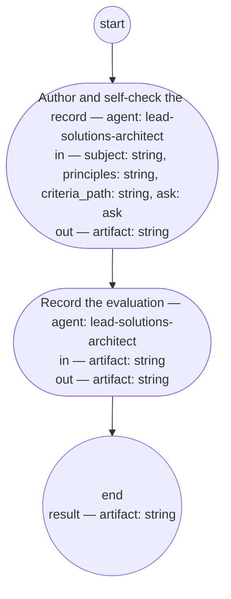

# Process: ADR authoring

**Purpose:** Author one architecture decision record from a decision
the solutions architect role or the authority has taken: the architect
writes the record, evaluates it against the adr fitness set and the
architecture principle set, states that evaluation in the record, and
sets it recorded. Runs after the feature whose constraint names the
decision, never before a bet.

**Guiding statement:** The record is the decision made durable, not
the discussion transcribed. The architect's own evaluation is the
record's last word; a decision this role cannot make under its rights
is escalated, never absorbed as a deviation.

**Outcomes:**
- O1. The record is authored from the pre-state as the solutions
  architect role's evidence rules admit it, through the adr typedef
  and guideline — witnessed by `author`'s prompt and inputs.
- O2. The record states the decision's screen against the architecture
  principle set — conformance, or the principle it cannot satisfy with
  the escalation that carries the exception — witnessed by `author`'s
  prompt.
- O3. The architect evaluates the record against the adr fitness set
  and states that evaluation in it — witnessed by `author`'s output.
- O4. The record is set recorded, with one Document History row
  carrying the evaluation — witnessed by `record`'s prompt and output.
- O5. A question the subject cannot answer leaves the execution as an ask to
  the PM role, with a default, and the execution resumes — witnessed by
  `author`'s `asks` and the `ask` value.

**Roles:** maker —
[`../roles/lead-solutions-architect.md`](../roles/lead-solutions-architect.md)
(authors, self-checks, and records; never a separate decider).

**Carried by:**
[`../../.claude/skills/adr-authoring/SKILL.md`](../../.claude/skills/adr-authoring/SKILL.md)
— generated from this definition by
[`../tools/compile_process.py`](../tools/compile_process.py), never
edited by hand.

## Flow (compiled)

Generated from the steps below by `tools/compile_process.py`; do not
edit by hand.




## Data

Each entry names a process-local value. The *subject* is the decision
to record: what was decided or must be decided, by whom, and where its
evidence sits. `principles` is the
[architecture principle set](../architecture-principles.md);
`criteria_path` names the [adr fitness set](../fitness/adr.fitness.md).
The status values this process sets — `recorded` on `record`,
`superseded` per the [adr typedef](../artifacts/adr.md) — are that
typedef's.

```yaml
data:
  subject: {type: string}
  artifact: {type: string, format: uri-reference}
  principles: {type: string, format: uri-reference}
  criteria_path: {type: string, format: uri-reference}
  ask: {$ref: ask, from: ../types/ask.md, initial: null}
```

## Steps

```yaml
start: author
parameters: [subject, principles, criteria_path]
result: artifact
steps:
  - id: author
    name: Author and self-check the record
    run-by: {role: lead-solutions-architect, execution: agent}
    inputs: [subject, principles, criteria_path, ask]
    outputs: [artifact]
    asks: [lead-pm]
    prompt: |
      Author one architecture decision record for the decision subject
      names, per the adr typedef. Read the pre-state only as your
      evidence rules allow. One decision: if subject bundles more,
      record the first and return the rest as candidates. State the
      principles screen — conformance, or the principle you cannot
      satisfy with its escalation; never absorb a deviation. Evaluate
      the record against criteria_path and state that in the Context.
      If something subject omits, ask lead-pm: question, kind,
      default. First pass, ask is absent; if answered or defaulted,
      act and finish. Return the record's path.
    next: record

  - id: record
    name: Record the evaluation
    run-by: {role: lead-solutions-architect, execution: agent}
    inputs: [artifact]
    outputs: [artifact]
    prompt: |
      Write one Document History row stating your evaluation against
      the adr fitness set and the architecture principle set, and set
      the record's status to recorded. Return the record.
    next: end
```

## Derived checks

| Outcome | Check | Kind | Where |
|---|---|---|---|
| O1 | `author` reads only `subject`, `principles`, `criteria_path`, `ask`; evidence rule in prompt | judged | `author.prompt` and inputs |
| O2 | `author` states the principles screen in the record | judged | `author.prompt` |
| O3 | `author` evaluates against `criteria_path` and states it in the record | judged | `author.prompt` |
| O4 | `record` writes one row and sets status `recorded` | judged | `record.prompt` |
| O5 | `author` carries `asks`; process carries `ask-cap`; `ask` listed in inputs | mechanical | `author`, frontmatter |

## Document History

| Version | Date | Kind | Entry |
|---|---|---|---|
| 1 | 2026-09-02 | update | Authored through the definition-chain-migration process as the adr chain's producing process, by the owner's ruling that the check mirrors the PO output check — cold screen against the fitness set, verdict to the PM role — with the solutions architect role as maker and the architecture principle set as the standing criterion `principles`; no dedicated architect-output-check process is created. |
| 1 | 2026-09-02 | state | draft → approved by the owner with the chain (brief-033 ask 1). |
| 2 | 2026-09-05 | update | Single review cycle, per req-2026-09-05-single-review-cycle: the screen runs once; revise runs once and continues to decide; the advance-round step, the round and round_cap data, and route-screen's failsafe branch removed; decide reads the one review and the revised record. |
| 3 | 2026-09-06 | update | Under req-2026-09-06-pre-bet-route: `result` is `artifact`, so a sub-process caller receives the record and reads its id; the PM role's decision stands in the record's status and Document History. |
| 4 | 2026-09-08 | update | Rewritten under feat-flow-simplification: the cold-reviewer screen and the PM role's decide step removed; the architect authors and self-checks the record against the fitness set and the architecture principle set in one pass, then records the evaluation and sets it recorded — no screen, no revise, no decide; runs from a checked feature's flagged constraint, not before a bet. |
| 5 | 2026-09-09 | update | `run` propagated to `execution` as the noun for a process instance, under req-2026-09-08-definition-vs-instance / feat-execution-vocabulary (shopsystem-product): mechanical, determiner-adjacent occurrences only (`a/the/this/one/another/each/no/any run(s)`); `run-by`, `run` as a schema field or step key, and compound/heading uses (e.g. `run-cost`, `run list`, `Run lifecycle`) left unchanged, that residue disclosed as not done in this pass. Self-check against define-good-up-front: diffed against the file's pre-edit text; no requirement, field name, or heading changed. Made by the lead-solutions-architect role. |
