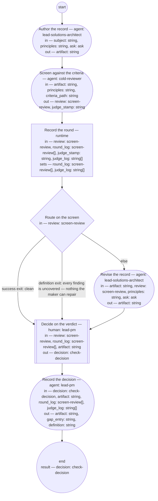

# Process: ADR authoring

**Purpose:** Author one architecture decision record from a decision
the solutions architect role or the authority has taken, and check it
against the adr fitness set and the architecture principle set, so
that the PM role rules from a screen verdict — pass, fail with the
criterion named, or a definition change — and the decision bounds
nothing until the record is checked.

**Guiding statement:** The record is the decision made durable, not
the discussion transcribed. A finding the criteria cannot name is a
missing criterion, and the decision that follows is a definition
change, not a verdict on the maker.

**Outcomes:**
- O1. The record is authored from the pre-state as the solutions
  architect role's evidence rules admit it, through the adr typedef
  and guideline — witnessed by `author`'s prompt and inputs.
- O2. The record is screened against the adr fitness set and the
  architecture principle set — witnessed by `screen`'s inputs and the
  `screen-review` it returns.
- O3. The PM role decides from the one review and the revised record,
  reading the record where the findings' quotes point — witnessed by
  `decide`'s inputs.
- O4. The one screen is recorded; a clean verdict, or findings no
  criterion names, goes straight to the decision, and any other
  finding is revised once before the decision follows — witnessed by
  `log-round`, `route-screen`, and `revise`'s `next`.
- O5. A fail names the criterion missed; a definition change names the
  gap, and the gap is filed in the named definition's Document History
  — witnessed by the `check-decision` fields and `record`'s
  `definition` and `gap_entry` outputs.
- O6. A question the subject cannot answer leaves the run as an ask to
  the PM role, with a default, and the run resumes — witnessed by
  `author`'s and `revise`'s `asks` and the `ask` value.

**Roles:** maker —
[`../roles/lead-solutions-architect.md`](../roles/lead-solutions-architect.md)
(authors and revises; never decides its own pass). screener —
[`../roles/cold-reviewer.md`](../roles/cold-reviewer.md) (fresh
context for the one screen; judges against the criteria). the PM role —
[`../roles/lead-pm.md`](../roles/lead-pm.md) (accountable for the
decision; a human-held role that decides from the verdict; its
assisting agent prepares the record entries and the gap entry).

**Carried by:**
[`../../.claude/skills/adr-authoring/SKILL.md`](../../.claude/skills/adr-authoring/SKILL.md)
— generated from this definition by
[`../tools/compile_process.py`](../tools/compile_process.py), never
edited by hand.

## Flow (compiled)

Generated from the steps below by `tools/compile_process.py`; do not
edit by hand.




## Data

Each entry names a process-local value. Simple types use JSON Schema
names inline; every structured shape is a `$ref` to a defined type
with an explicit source. Conditions are CEL expressions over these
names. The *subject* is the decision to record: what was decided or
must be decided, by whom, and where its evidence sits — a work item,
a review record, or the maker's own pre-state reading. The criteria
set is the approved
[adr fitness set](../fitness/adr.fitness.md); the
[architecture principle set](../architecture-principles.md) is always
a criterion, named `principles`. The artifact status values this
process sets — `checked` on pass, `returned` on fail,
`pending-definition` on definition change — are the
[adr typedef](../artifacts/adr.md)'s.

```yaml
data:
  subject: {type: string}
  artifact: {type: string, format: uri-reference}
  principles: {type: string, format: uri-reference}
  criteria_path: {type: string, format: uri-reference}
  review: {$ref: screen-review, from: ../types/screen-review.md}
  round_log: {type: array, items: {$ref: screen-review}, initial: []}
  judge_stamp: {type: string}
  judge_log: {type: array, items: {type: string}, initial: []}
  ask: {$ref: ask, from: ../types/ask.md, initial: null}
  decision: {$ref: check-decision, from: ../types/check-decision.md}
  gap_entry: {type: string}
  definition: {type: string, format: uri-reference}
```

## Steps

```yaml
start: author
parameters: [subject, principles, criteria_path]
result: decision
steps:
  - id: author
    name: Author the record
    run-by: {role: lead-solutions-architect, execution: agent}
    inputs: [subject, principles, ask]
    outputs: [artifact]
    asks: [lead-pm]
    prompt: |
      Author one architecture decision record for the decision the
      subject names, through the adr typedef and guideline. Read the
      pre-state only as your role's admissible evidence allows —
      lead-shop-held records, never a context's internals. Exactly one
      decision: if the subject bundles more, record the first and
      return the rest in your output as named candidates for their own
      runs. Screen the decision against the architecture principle set
      at principles and state the result in the record — conformance,
      or the principle it cannot satisfy with the escalation that
      carries the exception; never absorb a deviation. If something
      the subject does not say is needed — whether a decision is
      in scope, another role's domain — return an ask to lead-pm
      instead of guessing: the question, its kind, the default you
      will apply if unanswered, and a checkpoint holding the draft so
      far. On the first pass ask is absent; if it carries an answer or
      resolved defaulted, act on it and finish the draft. Return the
      record's path as artifact.
    next: screen

  - id: screen
    name: Screen against the criteria
    run-by: {role: cold-reviewer, execution: agent, fresh-context: true}
    inputs: [artifact, principles, criteria_path]
    outputs: [review, judge_stamp]
    prompt: |
      State, as judge_stamp, the model and prompt version you judge
      as. Read the criteria set at criteria_path, the architecture
      principle set at principles, and the record at artifact —
      nothing else. Judge the record against every criterion and
      against the principle set: does the record's stated screen
      result hold when you read the set yourself? Report every finding
      with the criterion it fails by name — "principles" for a
      conflict with the architecture principle set the record does not
      carry as an escalated exception — the quoted text, the change,
      and whether you could decide it (confident) or not (wobbly); for
      a wobbly finding quote the whole passage, since the PM role
      decides from the review alone. A defect no criterion names is a
      finding with criterion "uncovered". Verdict "clean" only if
      there are no findings; otherwise "findings" with the top three
      changes.
    next: log-round
    annotations:
      fabro: {model: high-reasoning, node: separate-context-per-round}

  - id: log-round
    name: Record the round
    run-by: {execution: runtime}
    inputs: [review, round_log, judge_stamp, judge_log]
    set:
      round_log: round_log + [review]
      judge_log: judge_log + [judge_stamp]
    next: route-screen

  - id: route-screen
    name: Route on the screen
    run-by: {execution: runtime}
    inputs: [review]
    branches:
      - label: "success exit: clean"
        when: review.verdict == "clean"
        next: decide
      - label: "definition exit: every finding is uncovered — nothing the maker can repair"
        when: size(review.findings) > 0 && review.findings.all(f, f.criterion == "uncovered")
        next: decide
      - else: revise

  - id: revise
    name: Revise the record
    run-by: {role: lead-solutions-architect, execution: agent}
    inputs: [artifact, review, principles, ask]
    outputs: [artifact]
    asks: [lead-pm]
    prompt: |
      Repair every finding whose criterion is named, "principles"
      included; leave findings marked "uncovered" as they are — they
      are the PM role's to decide. A "principles" finding is repaired
      by changing the record's screen statement or escalating the
      exception, never by absorbing the deviation. If a repair needs
      something the subject does not say, return an ask to lead-pm
      instead of guessing: the question, its kind, the default you
      will apply if unanswered, and a checkpoint holding the repairs
      made so far. On the first pass ask is absent; if it carries an
      answer or resolved defaulted, act on it and finish the repairs.
    next: decide

  - id: decide
    name: Decide on the verdict
    run-by: {role: lead-pm, execution: human}
    inputs: [review, round_log, artifact]
    outputs: [decision]
    prompt: |
      From the one review and the record as revised, decide. Rule
      first on the right: whether the role named in the record's
      decided-by held the right it exercised is yours to rule, from
      the roles' definitions; a record whose decider is the authority
      is checked for form only. Then: "pass" — the screen is clean, or
      every named finding is repaired in the revision and the only
      findings still open are uncovered and you judge none of them
      needs a criterion — say so in the reasons. "fail" — a named
      criterion, "principles" included, is still missed after the one
      revision, or the named role did not hold the right — name it.
      "definition-change" — an uncovered finding should have been a
      criterion, or a criterion the record met produced something
      wrong — name the definition and what it lacks. Where both a
      missed named criterion and an open uncovered finding stand
      after the revision, "fail" takes precedence and the reasons
      carry the uncovered finding. Decide from the quotes in the
      review, read against the revised record at the places they
      point to. Record your reasons.
    next: record

  - id: record
    name: Record the decision
    run-by: {role: lead-pm, execution: agent}
    inputs: [decision, artifact, round_log, judge_log]
    outputs: [artifact, gap_entry, definition]
    prompt: |
      Write into the record's Document History one review entry per
      round with its verdict and, from judge_log, the screening
      judge's model and prompt version, then a state entry carrying
      the decision and its reasons. Set the record's status: "checked"
      on pass, "returned" on fail with the criterion named,
      "pending-definition" on definition-change. On
      "definition-change", write a review entry stating the gap into
      the Document History of the definition the decision names;
      return that file's path as definition and the entry's text as
      gap_entry. Otherwise return both empty. Return the artifact.
    next: end
```

## Derived checks

| Outcome | Check | Kind | Where |
|---|---|---|---|
| O1 | author reads only subject, principles, ask; evidence rule in prompt | judged | `author.prompt` and inputs |
| O2 | screen reads only criteria, principles, artifact | judged | `screen.prompt` and inputs |
| O3 | `review` and `artifact` present in `decide.inputs` | mechanical | `decide.inputs` |
| O4 | the one review logged; two labeled exits to `decide` and an else to `revise`; `revise.next` is `decide` | mechanical | `log-round`, `route-screen`, `revise.next` |
| O5 | `criterion` present on fail, `gap` on definition-change; `definition` and `gap_entry` non-empty on definition-change | judged | `check-decision`, `record` outputs |
| O6 | `author` and `revise` carry `asks`; process carries `ask-cap`; `ask` listed in inputs | mechanical | `author`, `revise`, frontmatter |

## Document History

| Version | Date | Kind | Entry |
|---|---|---|---|
| 1 | 2026-09-02 | update | Authored through the definition-chain-migration process as the adr chain's producing process, by the owner's ruling that the check mirrors the PO output check — cold screen against the fitness set, verdict to the PM role — with the solutions architect role as maker and the architecture principle set as the standing criterion `principles`; no dedicated architect-output-check process is created. |
| 1 | 2026-09-02 | state | draft → approved by the owner with the chain (brief-033 ask 1). |
| 2 | 2026-09-05 | update | Single review cycle, per req-2026-09-05-single-review-cycle on the authority's words of 2026-09-05 — "I want all of the processes limited to a single review cycle, so author -> review -> revise -> continue to next step": the screen runs once; revise runs once and continues to decide; the advance-round step, the round and round_cap data, and route-screen's failsafe branch removed; decide reads the one review and the revised record, so the PM role can see whether the one revision repaired what the findings quote. |
