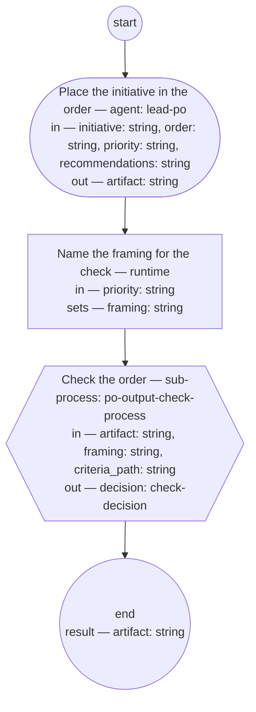

# Process: Backlog ordering

**Purpose:** Place a planned initiative's features-to-be in the
backlog order: the PO role writes the superseding order against the
PM role's recorded priority — enabler recommendations placed or
declined with reasons — and the PO output check sets its status.

**Guiding statement:** The order is the PO role's exclusive decision,
made within the priority and defended in the document itself; the
check judges only what the order states.

**Outcomes:**
- O1. The new order is placed by the PO role alone, against the
  priority named in its own first section — witnessed by `place`'s
  run-by and declared inputs.
- O2. Every enabler recommendation received is placed or declined
  with a reason in the order itself — witnessed by `place`'s prompt
  and the backlog-order typedef's second required section, which the
  check screens.
- O3. The order's check statuses — checked, returned,
  pending-definition — are set only by the PO output check; draft is
  the maker's own initial status — witnessed by `place`'s prompt and
  `check`, the run's only other status-writing step.

**Roles:** maker — [`../roles/lead-po.md`](../roles/lead-po.md)
(orders the backlog; its exclusive domain). the check — the
[PO output check](po-output-check.md) as a sub-process, with its own
roles.

**Carried by:**
[`../skills/backlog-ordering/SKILL.md`](../skills/backlog-ordering/SKILL.md)
— generated from this definition by
[`../tools/compile_process.py`](../tools/compile_process.py), never
edited by hand.

## Flow (compiled)

Generated from the steps below by `tools/compile_process.py`; do not
edit by hand.




## Data

Each entry names a process-local value. Simple types use JSON Schema
names inline; every structured shape is a `$ref` to a defined type
with an explicit source. Conditions are CEL expressions over these
names. `order` is the path of the order being superseded;
`recommendations` the path where the solutions architect role's
enabler recommendations are recorded — the interface the
backlog-order typedef's second section answers;
`priority` the path of the PM role's recorded roadmap priority;
`criteria_path` names the
[backlog-order fitness set](../fitness/backlog-order.fitness.md). The
`framing` the check reads is the priority: an order serves the PM
role's recorded priority as a whole, and each item's own framing is
stated inside the order, where the fitness set judges it — set by the
`prepare` step.

```yaml
data:
  initiative: {type: string, format: uri-reference}
  order: {type: string, format: uri-reference}
  priority: {type: string, format: uri-reference}
  recommendations: {type: string, format: uri-reference}
  criteria_path: {type: string, format: uri-reference}
  artifact: {type: string, format: uri-reference}
  framing: {type: string, format: uri-reference}
  decision: {$ref: check-decision, from: ../types/check-decision.md}
```

## Steps

```yaml
start: place
parameters: [initiative, order, priority, recommendations, criteria_path]
result: artifact
steps:
  - id: place
    name: Place the initiative in the order
    run-by: {role: lead-po, execution: agent}
    inputs: [initiative, order, priority, recommendations]
    outputs: [artifact]
    prompt: |
      Write the new backlog order per its typedef, superseding the
      order at order and linking it: place the planned initiative's
      features-to-be against the roadmap priority at priority; state
      the priority in the first section and reason every exception to
      it; place or decline each enabler recommendation recorded at
      recommendations, with reasons; name each item's owning Bounded Context, marking a
      cross-context item and naming its escalation; state the first
      untaken item's readiness. Set the order's status to draft and
      link the priority in its frontmatter. Return the new order's
      path.
    next: prepare

  - id: prepare
    name: Name the framing for the check
    run-by: {execution: runtime}
    inputs: [priority]
    set:
      framing: priority
    next: check

  - id: check
    name: Check the order
    run-by: {execution: sub-process, process: po-output-check-process, from: po-output-check.md}
    inputs: [artifact, framing, criteria_path]
    outputs: [decision]
    next: end
```

## Derived checks

| Outcome | Check | Kind | Where |
|---|---|---|---|
| O1 | `place` run by `lead-po`, reading only `initiative`, `order`, `priority`, `recommendations` | mechanical | `place` |
| O2 | the recommendations section required and screened | judged | `place.prompt`, backlog-order typedef §2, `check` |
| O3 | `place` writes only the initial draft status; the check statuses come from the child | mechanical | `place.prompt`, `check` |

## Document History

| Version | Date | Kind | Entry |
|---|---|---|---|
| 1 | 2026-08-31 | update | Authored as batch C of brief-032's plan: the one-step placing process the model names — the PO role supersedes the order against the PM role's recorded priority and the PO output check screens it as sub-process. |
| 2 | 2026-08-31 | review | Batch C screen round 1: O3 no longer denies the maker's own draft status; the enabler recommendations declared as a parameter and input, so place acts on no undeclared context. |
| 2 | 2026-08-31 | state | draft → approved with batch C as one block (brief-032 ask 2, default accepted). |
