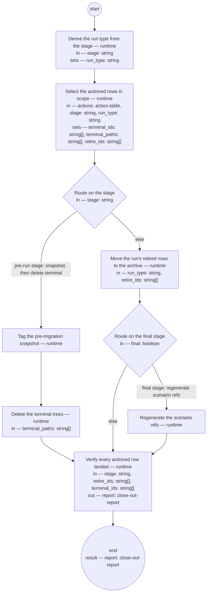

# Process: Corpus close-out

> Authored 2026-08-22 (R24 remediation: F3 — the pre-decided
> retire/terminal mass had no process); pending authority approval.

**Purpose:** Execute the migration plan's pre-decided retire and
terminal actions mechanically: snapshot the corpus, delete the terminal
trees, move each run's retired rows to the archive, regenerate the
scenario refs at the end, and verify every actioned row landed where its
action says.

**Guiding statement:** The rulings were made at the review; this process
only carries them out. Mass moves are mechanical or they do not happen —
no judgment, no review loop, and no silent completion: a row not where
it should be fails the run loudly, by id.

**Outcomes:**
- O1. The `pre-migration` snapshot tag exists before any terminal
  deletion — witnessed by the step order `snapshot-tag` →
  `delete-terminal`.
- O2. Every actioned row in scope is where its action says: retire rows
  absent from the active tree and present verbatim on the archive
  branch; terminal rows in the snapshot tag only — witnessed by the
  check on `post-check`.
- O3. At the final stage the scenario refs are regenerated — witnessed
  by the `regen-scenario-refs` run.
- O4. A misplaced row fails the run loudly, listed by id in the
  close-out report, never silently — witnessed by the check on
  `post-check`.

**Declared exits:** the flow is a straight line — no review loop, so no
round cap. The reached-state success exit is `post-check` passing:
every actioned row verifiably absent from the active tree and present
on the archive branch (retire) or in the snapshot tag only (terminal).
The failure exit is the same step's check failing, which halts the run
with the `failed` list naming every misplaced row.

**Roles:** runtime (every step is mechanical — no agent seat, no
judgment in the run). product-authority (human seat — owns and approves
this definition and rules on the archive contract below; takes no step
in a run).

**Scope note:** one run executes one close-out stage of the approved
migration plan: the `pre-run` stage once before any migration run, then
one `post-run:<run-id>` stage after each completed per-type migration
run. Actions come from the approved action table; a row carrying the
`authority-call` row marker has no action yet and is out of scope until
ruled.

## Archive contract (recommended — pending authority ruling)

This is the single statement of the archive contract; every other
document references it instead of restating it (see the Steps intro of
[`definition-chain-migration.md`](definition-chain-migration.md)). The
contract below is **recommended, pending the authority's ruling**:

- One parentless orphan branch **`archive/migration-2026-08`** — the
  same pattern as the memory archive `archive/memory-2026-08` — never
  merged to `main`.
- One commit on that branch per close-out stage, preserving the moved
  files **verbatim at their original paths**.
- One annotated snapshot tag **`pre-migration`** on `main`'s
  pre-execution commit, for terminal-recovery: after close-out a
  terminal row exists there and nowhere else.

`archive-move` semantics against this contract:

- `archive-move --type <t> --ids <ids>` — *move*: commit verbatim
  copies of each id's files to the archive branch at their original
  paths (one commit, its message naming the close-out stage), then
  delete them from the working tree on `main`. An id already on the
  archive branch and already absent from the tree is a no-op success.
- `archive-move --verify --stage <s> --retire <ids> --terminal <ids>` —
  *verify*: check each retire id is absent from the active tree and
  present at its original path on the archive branch, and each terminal
  id is absent from both and present in the `pre-migration` tag; emit a
  close-out-report on stdout; exit non-zero when `failed` is non-empty.

The tool does not exist yet — this is a spec, not a build. The steps
that call it block until the tool exists and this contract is approved.

## Flow (compiled)

Generated from the steps below by `tools/compile_process.py`; do not
edit by hand.




## Data

Each entry names a process-local value. Simple types use JSON Schema
names inline; every structured shape is a `$ref` to a defined type with
an explicit source — `from:` links the defining file, or names the owning
package as `pkg:<package>/<type>` (fetched through that package's
contract tool).

`stage` is `pre-run` or `post-run:<run-id>`, where the run-id is the
artifact type the completed migration run converted (one run migrates
one artifact type). `final` is true only on the close-out of the plan's
last run.

```yaml
data:
  actions: {$ref: action-table, from: ../types/action-table.md}
  stage: {type: string}
  final: {type: boolean, initial: false}
  run_type: {type: string}
  terminal_ids: {type: array, items: {type: string}}
  terminal_paths: {type: array, items: {type: string}}
  retire_ids: {type: array, items: {type: string}}
  report: {$ref: close-out-report, from: ../types/close-out-report.md}
```

## Steps

The `archive-move` calls in `archive-retire` and `post-check` are
against the archive contract stated once above. Until the tool exists
and the contract is approved those steps block — which is correct: mass
moves are mechanical or they do not happen.

```yaml
start: derive-run-type
parameters: [actions, stage, final]
result: report
steps:
  - id: derive-run-type
    name: Derive the run type from the stage
    run-by: {execution: runtime}
    inputs: [stage]
    set:
      run_type: 'stage == "pre-run" ? "" : stage.replace("post-run:", "")'
    next: select-rows

  - id: select-rows
    name: Select the actioned rows in scope
    run-by: {execution: runtime}
    inputs: [actions, stage, run_type]
    set:
      terminal_ids: actions.filter(r, r.action == "terminal").map(r, r.id)
      terminal_paths: actions.filter(r, r.action == "terminal").map(r, r.path)
      retire_ids: >-
        stage == "pre-run" ? [] : actions.filter(r, r.action == "retire"
        && r.id.startsWith(run_type + "-")).map(r, r.id)
    next: route-stage

  - id: route-stage
    name: Route on the stage
    run-by: {execution: runtime}
    inputs: [stage]
    branches:
      - label: "pre-run stage: snapshot, then delete terminal"
        when: stage == "pre-run"
        next: snapshot-tag
      - else: archive-retire

  - id: snapshot-tag
    name: Tag the pre-migration snapshot
    run-by: {execution: runtime}
    inputs: []
    run: |
      git tag -a pre-migration -m "Safety snapshot: full corpus before migration close-out"
      git push origin pre-migration
    next: delete-terminal

  - id: delete-terminal
    name: Delete the terminal trees
    run-by: {execution: runtime}
    inputs: [terminal_paths]
    run: |
      git rm -r ${terminal_paths}
      git commit -m "Close-out pre-run: delete terminal trees (recoverable via pre-migration tag only)"
    next: post-check

  - id: archive-retire
    name: Move the run's retired rows to the archive
    run-by: {execution: runtime}
    inputs: [run_type, retire_ids]
    run: |
      archive-move --type ${run_type} --ids ${retire_ids}
    next: route-final

  - id: route-final
    name: Route on the final stage
    run-by: {execution: runtime}
    inputs: [final]
    branches:
      - label: "final stage: regenerate scenario refs"
        when: final
        next: regen-scenario-refs
      - else: post-check

  - id: regen-scenario-refs
    name: Regenerate the scenario refs
    run-by: {execution: runtime}
    inputs: []
    run: |
      bin/gen-scenario-refs
    next: post-check

  - id: post-check
    name: Verify every actioned row landed
    run-by: {execution: runtime}
    inputs: [stage, retire_ids, terminal_ids]
    outputs: [report]
    checks:
      - size(report.failed) == 0
    run: |
      archive-move --verify --stage ${stage} --retire ${retire_ids} --terminal ${terminal_ids}
    next: end
```

## Derived checks

| Outcome | Check | Kind | Where |
|---|---|---|---|
| O1 | snapshot tag exists before any terminal deletion | mechanical | step order `snapshot-tag` → `delete-terminal` |
| O2 | retire rows on the archive branch, terminal rows in the tag only, none in the active tree | mechanical | `post-check.run` and `post-check.checks` |
| O3 | scenario refs regenerated at the final stage | mechanical | `regen-scenario-refs.run` |
| O4 | a non-empty `failed` list halts the run naming every misplaced row | mechanical | `post-check.checks` |
| all | this definition compiles and screens against the principle set | mechanical + judged | the compiler; the principles screen |
