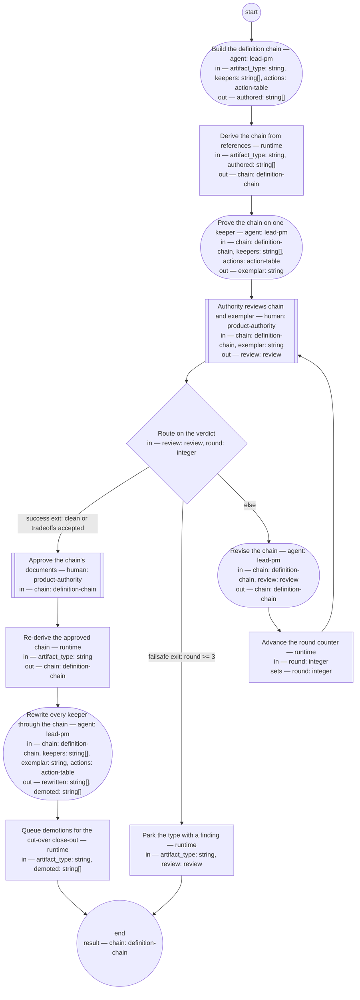

# Process: Definition-chain migration

> Amended 2026-08-22 (R24 remediation: flow fix F2, actions channel F4,
> archive-contract reference F1/F16; R27: demotions queue to cut-over).
> Re-approved by the authority 2026-08-22 (R30, brief-028 ask 2).

**Purpose:** Convert one artifact type from the frozen corpus into the new
baseline: build its definition chain, prove the chain on a real keeper,
approve it, rewrite every keeper through it, and move what does not survive
to the archive.

**Guiding statement:** Nothing enters the new baseline except through a
approved definition. A document in an undefined format is source material
for a rewrite, never a usable artifact.

**Outcomes:**
- O1. The type's definition chain is approved by the authority — witnessed
  by the check on `approve-chain`.
- O2. Every keeper is rewritten or demoted, none silently dropped —
  witnessed by the check on `rewrite-keepers`.
- O3. Retired and demoted records leave the active tree — witnessed by
  the `queue-demoted` run and the cut-over close-out's post-check.
- O4. A chain the authority cannot approve parks with a filed finding
  instead of looping — witnessed by the failsafe branch of
  `route-review` and the `park` step.

**Roles:** product-authority (human seat — reviews, approves,
spot-checks). lead-pm (author seat — drafts the chain, runs rewrites).
The per-instance reviewer seats come from the chain itself once approved.

**Scope note:** one run migrates one artifact type. The order of runs
comes from the approved migration plan; keepers for the run are the
rows in `actions` whose action is keep-rewrite for that type. The
retire and terminal mass is not this process's work — it closes out
mechanically through
[`corpus-close-out.md`](corpus-close-out.md).

## Flow (compiled)

Generated from the steps below by `tools/compile_process.py`; do not
edit by hand.




## Data

Each entry names a process-local value. Simple types use JSON Schema
names inline; every structured shape is a `$ref` to a defined type with
an explicit source — `from:` links the defining file, or names the owning
package as `pkg:<package>/<type>` (fetched through that package's
contract tool).

```yaml
data:
  artifact_type: {type: string}
  keepers: {type: array, items: {type: string}}
  actions: {$ref: action-table, from: ../types/action-table.md}
  authored: {type: array, items: {type: string}}
  chain: {$ref: definition-chain, from: ../types/definition-chain.md}
  exemplar: {type: string}
  review: {$ref: review, from: ../types/review.md}
  round: {type: integer, initial: 1}
  rewritten: {type: array, items: {type: string}}
  demoted: {type: array, items: {type: string}}
```

## Steps

The `archive-move` command in `queue-demoted` follows the archive
contract stated once in [`corpus-close-out.md`](corpus-close-out.md)
(§Archive contract — recommended, pending authority ruling); it is not
restated here. Under the R27 cut-over model no archive move happens
per run: a demoted keeper's file lives on frozen `main`, so the run
only QUEUES the demotion (`--queue` flips the keeper's action-table
row to retire, recording the failing check); the actual move runs once,
at the Phase 3 cut-over close-out. Until the tool exists and the
contract is approved the step blocks — which is correct: mass moves
are mechanical or they do not happen.

```yaml
start: build-chain
parameters: [artifact_type, keepers, actions]
result: chain
steps:
  - id: build-chain
    name: Build the definition chain
    run-by: {role: lead-pm, execution: agent}
    inputs: [artifact_type, keepers, actions]
    outputs: [authored]
    checks:
      - size(authored) >= 6
    prompt: |
      Draft every link of the definition chain for this artifact type:
      typedef, quality guideline, fitness set, authoring process, roles,
      and the compiled skill. Source the content from the authority's
      recorded rulings and verbatim anchors, an autopsy of the best and
      worst existing instances among the keepers, and established
      external standards; name every adopted form in each document's
      Sources section. A document in an undefined format is source
      material only — nothing is used as-is. Per-keeper directives and
      family nominations come only from `actions` — the governed channel
      — never from retired documents. Family codes in `actions` are
      nominations: the chain review decides final record granularity, so
      do not pre-commit a collapse.
    next: derive-chain

  - id: derive-chain
    name: Derive the chain from references
    run-by: {execution: runtime}
    inputs: [artifact_type, authored]
    outputs: [chain]
    checks:
      - chain.typedef != "" && chain.guideline != "" && chain.fitness != ""
      - chain.process != "" && chain.skill != ""
    run: |
      python3 tools/lint_basis.py --derive-chain ${artifact_type}
    next: exemplar-rewrite

  - id: exemplar-rewrite
    name: Prove the chain on one keeper
    run-by: {role: lead-pm, execution: agent}
    inputs: [chain, keepers, actions]
    outputs: [exemplar]
    prompt: |
      Rewrite one real keeper through the drafted chain's authoring
      process, exactly as mass rewriting would run it. Pick a keeper of median size
      among the type's keepers, preferring the most recently active —
      representative by measure, not by ease. The keeper's per-keeper
      directives come only from its `actions` row — the governed channel
      — never from retired documents; a family code there is a
      nomination, not a commitment, since the chain review decides final
      record granularity. Record
      every point where the chain failed to decide something — that
      friction is a finding about the chain, and it goes to the authority
      with the exemplar.
    next: authority-review

  - id: authority-review
    name: Authority reviews chain and exemplar
    run-by: {role: product-authority, execution: human}
    inputs: [chain, exemplar]
    outputs: [review]
    prompt: |
      One review, one type: the chain and the exemplar rewritten through
      it, side by side. Rule on both — the chain's definitions and what
      they actually produced. Findings land as rulings; verdict "clean"
      or "tradeoffs-accepted" approves, "findings" sends the chain back.
    next: route-review

  - id: route-review
    name: Route on the verdict
    run-by: {execution: runtime}
    inputs: [review, round]
    branches:
      - label: "success exit: clean or tradeoffs accepted"
        when: review.verdict in ["clean", "tradeoffs-accepted"]
        next: approve-chain
      - label: "failsafe exit: round >= 3"
        when: round >= 3
        next: park
      - else: revise-chain

  - id: revise-chain
    name: Revise the chain
    run-by: {role: lead-pm, execution: agent}
    inputs: [chain, review]
    outputs: [chain]
    prompt: |
      Repair every finding in the review across the chain's links, then
      re-run the exemplar through any link that changed. A finding
      repaired in one link is checked against the others — the chain is
      one definition in six parts, not six documents.
    next: advance-round

  - id: advance-round
    name: Advance the round counter
    run-by: {execution: runtime}
    inputs: [round]
    set:
      round: round + 1
    next: authority-review

  - id: approve-chain
    name: Approve the chain's documents
    run-by: {role: product-authority, execution: human}
    inputs: [chain]
    outputs: []
    prompt: |
      Approval stamps every linked document: status approved, approved
      date, owner. The chain's own status is derived — it reads approved
      only when every link does. From this point the chain is the
      standard the mass rewrite is checked against, and changes to any
      link go through you.
    next: rederive-chain

  - id: rederive-chain
    name: Re-derive the approved chain
    run-by: {execution: runtime}
    inputs: [artifact_type]
    outputs: [chain]
    checks:
      - chain.status == "approved"
    run: |
      python3 tools/lint_basis.py --derive-chain ${artifact_type}
    next: rewrite-keepers

  - id: rewrite-keepers
    name: Rewrite every keeper through the chain
    run-by: {role: lead-pm, execution: agent}
    inputs: [chain, keepers, exemplar, actions]
    outputs: [rewritten, demoted]
    checks:
      - size(rewritten) + size(demoted) == size(keepers)
    prompt: |
      Run the type's approved authoring process once per keeper: author
      seat and fresh reviewer seat per the chain, authority spot-checks
      per the attention architecture. Each keeper's per-keeper
      directives and family nomination come only from its `actions` row
      — the governed channel — never from retired documents; family
      codes are nominations, and the chain review's ruling on record
      granularity governs, not a pre-committed collapse. A keeper that
      cannot reach the bar
      after two attempts is demoted: file it for retirement with a note
      naming the failing check. Never lower a check to pass a keeper.
    next: queue-demoted

  - id: queue-demoted
    name: Queue demotions for the cut-over close-out
    run-by: {execution: runtime}
    inputs: [artifact_type, demoted]
    run: |
      archive-move --queue --type ${artifact_type} --ids ${demoted}
    next: end

  - id: park
    name: Park the type with a finding
    run-by: {execution: runtime}
    inputs: [artifact_type, review]
    run: |
      bd create --title "Chain parked: ${artifact_type} after 3 review rounds" \
        --body "${review.top_changes}"
    next: end
```

## Derived checks

| Outcome | Check | Kind | Where |
|---|---|---|---|
| O1 | chain status approved before any mass rewrite | mechanical | `approve-chain.checks` |
| O2 | rewritten + demoted counts equal keepers | mechanical | `rewrite-keepers.checks` |
| O3 | every demoted id is queued as a retire row; it leaves the active tree at cut-over | mechanical — `queue-demoted.run` now, close-out post-check at cut-over | `queue-demoted.run` |
| O4 | parked types carry a filed finding | mechanical | `park.run` |
| all | this definition compiles and screens against the principle set | mechanical + judged | the compiler; the principles screen |

## Document History

| Version | Date | Kind | Entry |
|---|---|---|---|
| 1 | 2026-08-20 | update | Authored (seed layer); earlier history, if any, in the review record ledger on `main`. |
| 1 | 2026-08-22 | state | draft → approved. |
