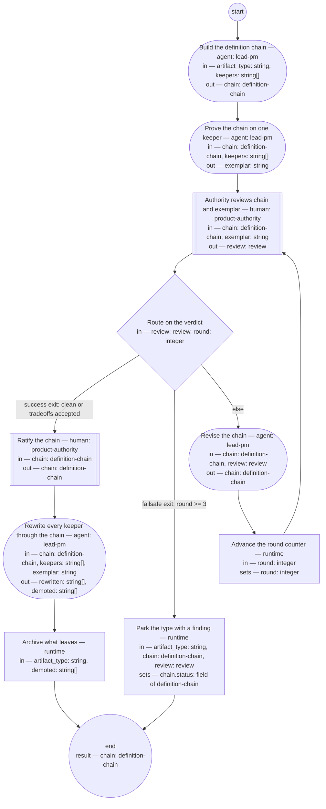

# Process: Definition-chain migration

**Purpose:** Convert one artifact type from the frozen corpus into the new
baseline: build its definition chain, prove the chain on a real keeper,
ratify it, rewrite every keeper through it, and move what does not survive
to the archive.

**Guiding statement:** Nothing enters the new baseline except through a
ratified definition. A document in an undefined format is source material
for a rewrite, never a usable artifact.

**Outcomes:**
- O1. The type's definition chain is ratified by the authority — witnessed
  by the check on `ratify-chain`.
- O2. Every keeper is rewritten or demoted, none silently dropped —
  witnessed by the check on `rewrite-keepers`.
- O3. Retired and demoted records leave the active tree — witnessed by
  the `archive-retired` run.
- O4. A chain the authority cannot ratify parks with a filed finding
  instead of looping — witnessed by the failsafe branch of
  `route-review` and the `park` step.

**Roles:** product-authority (human seat — reviews, ratifies,
spot-checks). lead-pm (author seat — drafts the chain, runs rewrites).
The per-instance reviewer seats come from the chain itself once ratified.

**Scope note:** one run migrates one artifact type. The order of runs
comes from the ratified rebaseline bill at its sitting; keepers for the
run are the bill's keep-rewrite records of that type.

## Flow (compiled)

Generated from the steps below by `tools/compile_process.py`; do not
edit by hand.




## Data

Each entry names a process-local value. Simple types use JSON Schema
names inline; every structured shape is a `$ref` to a defined type.

```yaml
data:
  artifact_type: {type: string}
  keepers: {type: array, items: {type: string}}
  chain: {$ref: definition-chain}
  exemplar: {type: string}
  review: {$ref: review}
  round: {type: integer, initial: 1}
  rewritten: {type: array, items: {type: string}}
  demoted: {type: array, items: {type: string}}
```

## Steps

The `archive-move` command in `archive-retired` is the archive contract
tool the bill's mechanism sitting must ratify (in-repo archive branch
plus snapshot tag). Until it exists the step blocks — which is correct:
mass moves are mechanical or they do not happen.

```yaml
start: build-chain
parameters: [artifact_type, keepers]
result: chain
steps:
  - id: build-chain
    name: Build the definition chain
    run-by: {role: lead-pm, execution: agent}
    inputs: [artifact_type, keepers]
    outputs: [chain]
    checks:
      - chain.artifact_type == artifact_type
      - chain.status == "draft"
    prompt: |
      Draft every link of the definition chain for this artifact type:
      typedef, quality guideline, fitness set, authoring process, roles,
      and the compiled skill. Source the content from the authority's
      recorded rulings and verbatim anchors, an autopsy of the best and
      worst existing instances among the keepers, and established
      external standards; name every adopted form in each document's
      Sources section. A document in an undefined format is source
      material only — nothing is used as-is.
    next: exemplar-rewrite

  - id: exemplar-rewrite
    name: Prove the chain on one keeper
    run-by: {role: lead-pm, execution: agent}
    inputs: [chain, keepers]
    outputs: [exemplar]
    prompt: |
      Rewrite one real keeper through the drafted chain's authoring
      process, exactly as mass rewriting would run it. Pick a keeper of median size
      among the type's keepers, preferring the most recently active —
      representative by measure, not by ease. Record
      every point where the chain failed to decide something — that
      friction is a finding about the chain, and it goes to the authority
      with the exemplar.
    next: authority-review

  - id: authority-review
    name: Authority reviews chain and exemplar
    run-by: {role: product-authority, execution: human}
    inputs: [chain, exemplar]
    outputs: [review]
    prompt: |
      One sitting, one type: the chain and the exemplar rewritten through
      it, side by side. Rule on both — the chain's definitions and what
      they actually produced. Findings land as rulings; verdict "clean"
      or "tradeoffs-accepted" ratifies, "findings" sends the chain back.
    next: route-review

  - id: route-review
    name: Route on the verdict
    run-by: {execution: runtime}
    inputs: [review, round]
    branches:
      - label: "success exit: clean or tradeoffs accepted"
        when: review.verdict in ["clean", "tradeoffs-accepted"]
        next: ratify-chain
      - label: "failsafe exit: round >= 3"
        when: round >= 3
        next: park
      - else: revise-chain

  - id: revise-chain
    name: Revise the chain
    run-by: {role: lead-pm, execution: agent}
    inputs: [chain, review]
    outputs: [chain]
    prompt: |
      Repair every finding in the review across the chain's links, then
      re-run the exemplar through any link that changed. A finding
      repaired in one link is checked against the others — the chain is
      one definition in six parts, not six documents.
    next: advance-round

  - id: advance-round
    name: Advance the round counter
    run-by: {execution: runtime}
    inputs: [round]
    set:
      round: round + 1
    next: authority-review

  - id: ratify-chain
    name: Ratify the chain
    run-by: {role: product-authority, execution: human}
    inputs: [chain]
    outputs: [chain]
    checks:
      - chain.status == "ratified"
    prompt: |
      Ratification stamps every link: status ratified, ratified date,
      owner. From this point the chain is the standard the mass rewrite
      is checked against, and changes to it go through you.
    next: rewrite-keepers

  - id: rewrite-keepers
    name: Rewrite every keeper through the chain
    run-by: {role: lead-pm, execution: agent}
    inputs: [chain, keepers, exemplar]
    outputs: [rewritten, demoted]
    checks:
      - size(rewritten) + size(demoted) == size(keepers)
    prompt: |
      Run the type's ratified authoring process once per keeper: author
      seat and fresh reviewer seat per the chain, authority spot-checks
      per the attention architecture. A keeper that cannot reach the bar
      after two attempts is demoted: file it for retirement with a note
      naming the failing check. Never lower a check to pass a keeper.
    next: archive-retired

  - id: archive-retired
    name: Archive what leaves
    run-by: {execution: runtime}
    inputs: [artifact_type, demoted]
    run: |
      archive-move --type ${artifact_type} --ids ${demoted}
    next: end

  - id: park
    name: Park the type with a finding
    run-by: {execution: runtime}
    inputs: [artifact_type, chain, review]
    set:
      chain.status: '"parked"'
    run: |
      bd create --title "Chain parked: ${artifact_type} after 3 review rounds" \
        --body "${review.top_changes}"
    next: end
```

## Derived checks

| Outcome | Check | Kind | Where |
|---|---|---|---|
| O1 | chain status ratified before any mass rewrite | mechanical | `ratify-chain.checks` |
| O2 | rewritten + demoted counts equal keepers | mechanical | `rewrite-keepers.checks` |
| O3 | after the run no demoted id remains in the active tree | mechanical post-run audit | `archive-retired.run` |
| O4 | parked types carry a filed finding | mechanical | `park.run` |
| all | this definition compiles and screens against the principle set | mechanical + judged | the compiler; the principles screen |
