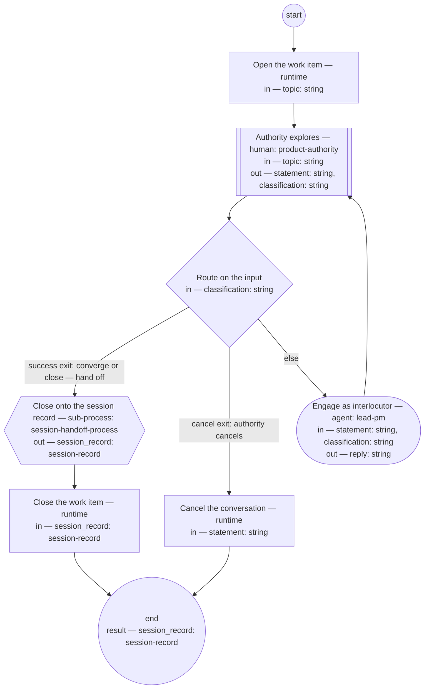

# Process: Discovery conversation

**Purpose:** Conduct a bounded discovery dialogue: the authority explores
direction with the lead-pm as interlocutor, nothing is operationalized
before convergence, and the session record anchors the conversation and
carries what it produced.

**Guiding statement:** Engage the authority's statements as an
interlocutor; record and launch only after convergence.

**Outcomes:**
- O1. No work is launched and no definition is written before the
  authority converges — witnessed by the `route` branches: the handoff
  is reachable only from the authority's own classification.
- O2. The conversation closes onto a validated session record carrying
  its produced and revised lists — witnessed by the `handoff`
  sub-process, whose child validates the record before landing it.
- O3. Only the authority converges, closes, or cancels — witnessed by
  the `route` branches.
- O4. An inactive conversation holds instead of dangling — witnessed by
  `hold-after` and the run lifecycle.

**Roles:** product-authority (human seat — explores, converges, and owns
the exclusive right to close or cancel). lead-pm (interlocutor; keeps
the draft record's quotes and state current).

## Flow (compiled)

Generated from the steps below by `tools/compile_process.py`; do not
edit by hand.




## Data

Each entry names a process-local value. Simple types use JSON Schema
names inline; every structured shape is a `$ref` to a defined type with
an explicit source.

```yaml
data:
  topic: {type: string}
  session_record: {$ref: session-record, from: pkg:shopsystem-knowledge/session-record}
  statement: {type: string}
  classification: {type: string, enum: [direction, question, converge, close, cancel]}
  reply: {type: string}
```

## Steps

```yaml
start: open
parameters: [topic]
result: session_record
steps:
  - id: open
    name: Open the work item
    run-by: {execution: runtime}
    inputs: [topic]
    outputs: []
    run: |
      bd create --title "Discovery conversation: ${topic}"
    next: observe

  - id: observe
    name: Authority explores
    run-by: {role: product-authority, execution: human}
    inputs: [topic]
    outputs: [statement, classification]
    prompt: |
      Think out loud. Your message is one of: a direction or exploration
      to engage, a question, a convergence (the direction is settled —
      record and route it), a close, or a cancel. Silence holds the
      conversation after the declared window; the draft record carries
      the resume point.
    next: route

  - id: route
    name: Route on the input
    run-by: {execution: runtime}
    inputs: [classification]
    branches:
      - label: "success exit: converge or close — hand off"
        when: classification in ["converge", "close"]
        next: handoff
      - label: "cancel exit: authority cancels"
        when: classification == "cancel"
        next: cancel-out
      - else: engage

  - id: engage
    name: Engage as interlocutor
    run-by: {role: lead-pm, execution: agent}
    inputs: [statement, classification]
    outputs: [reply]
    checks:
      - reply != ""
    prompt: |
      Engage the statement as an interlocutor: probe it, reflect it back,
      name tensions with what is already decided, and offer options with
      a recommendation when a decision is near. Do not operationalize —
      no launching work, no writing definitions, no dispatches — before
      the authority converges. Capture select quotes into the draft
      session record as the dialogue moves.
    next: observe

  - id: handoff
    name: Close onto the session record
    run-by: {execution: sub-process, process: session-handoff-process, from: session-handoff.md}
    inputs: []
    outputs: [session_record]
    next: close-out

  - id: close-out
    name: Close the work item
    run-by: {execution: runtime}
    inputs: [session_record]
    run: |
      bd close --reason "Discovery closed onto ${session_record.id}"
    next: end

  - id: cancel-out
    name: Cancel the conversation
    run-by: {execution: runtime}
    inputs: [statement]
    run: |
      bd close --reason "Discovery cancelled: ${statement}"
    next: end
```

A close without convergence still routes through the handoff: a
discovery that produced nothing durable is recorded as exactly that,
never released silently.

## Derived checks

| Outcome | Check | Kind | Where |
|---|---|---|---|
| O1 | `handoff` reachable only via the authority's classification | mechanical | `route.branches` |
| O2 | the child process validates the record before landing | mechanical | `handoff` sub-process (session-handoff O1) |
| O3 | close and cancel reachable only from the authority's input | mechanical | `route.branches` |
| O4 | inactivity holds the run | mechanical | `hold-after` + run lifecycle |
