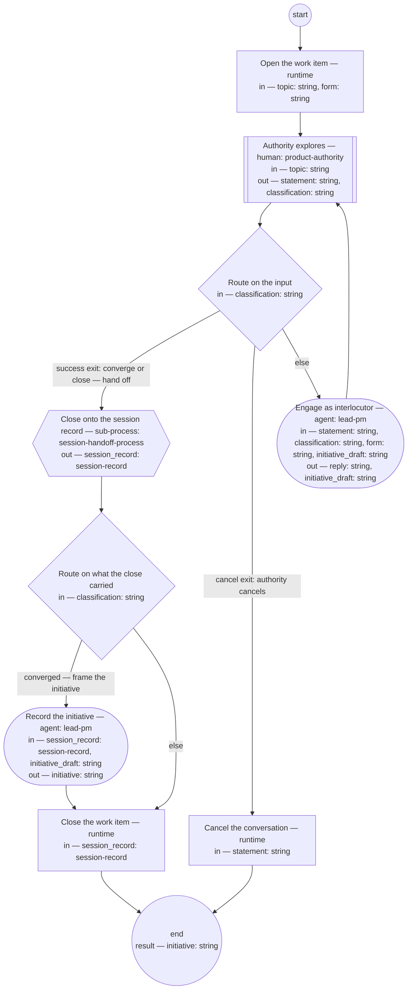

# Process: Discovery conversation

**Purpose:** Conduct a bounded discovery dialogue in a declared form —
brainstorm (the first form), interview, or review of evidence: the
authority explores direction with the lead-pm as interlocutor, nothing
is operationalized before convergence, the session record anchors the
conversation, and a converged discovery leaves an initiative recorded
`proposed` — or `proposed` and then `cancelled` in the same document
when the request is declined, so the record of the decline survives.

**Guiding statement:** Engage the authority's statements as an
interlocutor; record and launch only after convergence.

**Outcomes:**
- O1. No work is launched and no definition is written before the
  authority converges — witnessed by the `route` branches: the handoff
  is reachable only from the authority's own classification.
- O2. The conversation closes onto a validated session record carrying
  its produced and revised lists — witnessed by the `handoff`
  sub-process, whose child validates the record before landing it.
- O3. Only the authority converges, closes, or cancels — witnessed by
  the `route` branches.
- O4. An inactive conversation holds instead of dangling — witnessed by
  `hold-after` and the run lifecycle.
- O5. A converged discovery returns an initiative recorded `proposed`
  (or `proposed` then `cancelled` with the authority's reason when the
  request is declined); a close without convergence lands the session
  record and frames nothing — witnessed by `route-frame`, which
  reaches `frame` only from the authority's converge classification.

**Roles:** product-authority (human-held role — explores, converges, and owns
the exclusive right to close or cancel). lead-pm — held by the same
person; its agent steps assist: `engage` prepares the reflection —
probes, names tensions, offers options with a recommendation, keeps the
draft record's quotes and state current — and the authority decides
what converges. The agent operationalizes nothing.

## Flow (compiled)

Generated from the steps below by `tools/compile_process.py`; do not
edit by hand.




## Data

Each entry names a process-local value. Simple types use JSON Schema
names inline; every structured shape is a `$ref` to a defined type with
an explicit source.

```yaml
data:
  topic: {type: string}
  form: {type: string, enum: [brainstorm, interview, review-of-evidence]}
  initiative: {type: string, format: uri-reference, initial: ""}
  initiative_draft: {type: string, initial: ""}
  session_record: {$ref: session-record, from: pkg:shopsystem-knowledge/session-record}
  statement: {type: string}
  classification: {type: string, enum: [direction, question, converge, close, cancel]}
  reply: {type: string}
```

## Steps

```yaml
start: open
parameters: [topic, form]
result: initiative
steps:
  - id: open
    name: Open the work item
    run-by: {execution: runtime}
    inputs: [topic, form]
    outputs: []
    run: |
      bd create --title "Discovery conversation (${form}): ${topic}"
    next: observe

  - id: observe
    name: Authority explores
    run-by: {role: product-authority, execution: human}
    inputs: [topic]
    outputs: [statement, classification]
    prompt: |
      Think out loud. Your message is one of: a direction or exploration
      to engage, a question, a convergence (the direction is settled —
      record and route it), a close, or a cancel. Silence holds the
      conversation after the declared window; the draft record carries
      the resume point.
    next: route

  - id: route
    name: Route on the input
    run-by: {execution: runtime}
    inputs: [classification]
    branches:
      - label: "success exit: converge or close — hand off"
        when: classification in ["converge", "close"]
        next: handoff
      - label: "cancel exit: authority cancels"
        when: classification == "cancel"
        next: cancel-out
      - else: engage

  - id: engage
    name: Engage as interlocutor
    run-by: {role: lead-pm, execution: agent}
    inputs: [statement, classification, form, initiative_draft]
    outputs: [reply, initiative_draft]
    checks:
      - reply != ""
    prompt: |
      Engage the statement as an interlocutor, shaped to the declared
      form — brainstorm: diverge into options before any convergence;
      interview: draw out and quote the originator's own words; review
      of evidence: read the record against its sources. Probe, reflect
      back, name tensions with what is already decided, and offer
      options with a recommendation when a decision is near. Do not
      operationalize — no launching work, no writing definitions, no
      dispatches — before the authority converges. Capture select
      quotes into the draft session record, and maintain
      initiative_draft — the initiative's Framing, For whom, and
      Appetite sections, drafted from the authority's words — as the
      dialogue moves.
    next: observe

  - id: handoff
    name: Close onto the session record
    run-by: {execution: sub-process, process: session-handoff-process, from: session-handoff.md}
    inputs: []
    outputs: [session_record]
    next: route-frame

  - id: route-frame
    name: Route on what the close carried
    run-by: {execution: runtime}
    inputs: [classification]
    branches:
      - label: "converged — frame the initiative"
        when: classification == "converge"
        next: frame
      - else: close-out

  - id: frame
    name: Record the initiative
    run-by: {role: lead-pm, execution: agent}
    inputs: [session_record, initiative_draft]
    outputs: [initiative]
    prompt: |
      Assist step. From the session record and initiative_draft,
      write the initiative per its typedef: the
      Framing with the originator quoted, For whom with one measure,
      Appetite with its no-gos; Feasibility and usability and
      Decomposition "not yet"; Features empty; status "proposed",
      owner lead-pm. Where the conversation declined the request,
      record the initiative "proposed" and cancel it in the same
      document with the authority's reason, so the record of the
      decline survives; state in the cancellation entry that the
      product decision record for the decline is the PO role's to
      make and the PO output check screens it, linked once made — the
      initiative typedef's rule. Return the initiative's path.
    next: close-out

  - id: close-out
    name: Close the work item
    run-by: {execution: runtime}
    inputs: [session_record]
    run: |
      bd close --reason "Discovery closed onto ${session_record.id}"
    next: end

  - id: cancel-out
    name: Cancel the conversation
    run-by: {execution: runtime}
    inputs: [statement]
    run: |
      bd close --reason "Discovery cancelled: ${statement}"
    next: end
```

A close without convergence still routes through the handoff: a
discovery that produced nothing durable is recorded as exactly that,
never released silently.

## Derived checks

| Outcome | Check | Kind | Where |
|---|---|---|---|
| O1 | `handoff` reachable only via the authority's classification | mechanical | `route.branches` |
| O2 | the child process validates the record before landing | mechanical | `handoff` sub-process (session-handoff O1) |
| O3 | close and cancel reachable only from the authority's input | mechanical | `route.branches` |
| O4 | inactivity holds the run | mechanical | `hold-after` + run lifecycle |
| O5 | `frame` reachable only from `converge`; a converged run returns an initiative recorded `proposed` | mechanical, judged | `route-frame.branches`, `frame` |

## Document History

| Version | Date | Kind | Entry |
|---|---|---|---|
| 1 | 2026-08-22 | update | Authored (seed layer); earlier history, if any, in the repository history. |
| 1 | 2026-08-22 | state | draft → approved. |
| 2 | 2026-08-23 | update | Owner direction: decision-ledger references removed — changes stand on their own; history entries and text no longer cite numbered decisions. |
| 3 | 2026-08-25 | update | Owner direction: a near-synonym of "role" retired and banned. |
| 4 | 2026-08-26 | update | Owner decision: lead-pm is held by the authority in person; the Roles header now names what the role's agent steps prepare and what the authority decides, per the lead-pm role's Interfaces. |
| 4 | 2026-08-26 | review | Assist re-basing screened: clean; a timing phrase polished in place. |
| 5 | 2026-08-31 | update | Batch B of brief-032's plan, on the authority's approval of the model (ask 1): a `form` parameter (brainstorm first, interview, review of evidence) shapes the engagement; `engage` drafts the initiative's first three sections as the dialogue moves; a `frame` step records the initiative `proposed` — or `proposed` then `cancelled` when declined — and the run's result is the initiative. |
| 6 | 2026-08-31 | review | Batch screen round 1: the drafted sections travel as initiative_draft, a declared value engage maintains and frame reads; the decline path states the product decision record obligation the initiative typedef's rule requires. |
| 7 | 2026-08-31 | review | Batch screen round 2: a close without convergence no longer reaches frame — route-frame sends only the converge classification there, so the run lands the session record and frames nothing, matching the close-without-convergence paragraph. |
| 8 | 2026-08-31 | review | Round-3 screen (final): frame's unread topic input dropped — the declared list is the context load list. Repair after the last screening round; the next screen covers it. |
| 9 | 2026-08-31 | review | Batch E screen round 2: initiative given initial empty, so a run ending on the cancel or close-without-convergence path returns a defined empty result the parent can route on. Post-approval repair from the end-to-end screen. |
