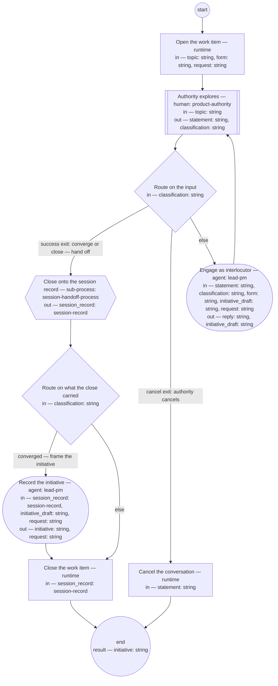

# Process: Discovery conversation

**Purpose:** Conduct a bounded discovery dialogue in a declared form —
brainstorm (the first form), interview, or review of evidence — opened
on a topic, or on a request routed to it: the
authority explores direction with the lead-pm as interlocutor, nothing
is operationalized before convergence, the session record anchors the
conversation, and a converged discovery leaves an initiative recorded
`planned` — the bet, taken on the authority's own word — or `proposed`
and then `cancelled` in the same document when what was asked is
declined, so the record of the decline survives. This is the one
human step past which the flow runs with no other human step.

**Guiding statement:** Engage the authority's statements as an
interlocutor; record and launch only after convergence.

**Outcomes:**
- O1. No work is launched and no definition is written before the
  authority converges — witnessed by the `route` branches: the handoff
  is reachable only from the authority's own classification.
- O2. The conversation closes onto a validated session record carrying
  its produced and revised lists — witnessed by the `handoff`
  sub-process, whose child validates the record before landing it.
- O3. Only the authority converges, closes, or cancels — witnessed by
  the `route` branches.
- O4. An inactive conversation holds instead of dangling — witnessed by
  `hold-after` and the run lifecycle.
- O5. A converged discovery returns an initiative recorded `planned` —
  the bet, taken directly on the authority's word — or `proposed` then
  `cancelled` with the authority's reason when what was asked is
  declined; a close without convergence lands the session record and
  frames nothing — witnessed by `route-frame`, which reaches `frame`
  only from the authority's converge classification.
- O6. A conversation opened on a request reads what was asked from the
  request — never from the transcript it arose in — and the initiative
  it frames references the request, which records that initiative as
  where its route led — witnessed by the `request` input declared on
  `engage` and `frame` (no transcript is declared) and by `frame`'s
  prompt.

**Roles:** product-authority (human-held role — explores, converges, and owns
the exclusive right to close or cancel). lead-pm — held by the same
person; its agent steps assist: `engage` prepares the reflection —
probes, names tensions, offers options with a recommendation, keeps the
draft record's quotes and state current — and the authority decides
what converges. The agent operationalizes nothing.

## Flow (compiled)

Generated from the steps below by `tools/compile_process.py`; do not
edit by hand.




## Data

Each entry names a process-local value. Simple types use JSON Schema
names inline; every structured shape is a `$ref` to a defined type with
an explicit source. `request` is the path of a
[request](../artifacts/request.md) in `requests/` — the record of the
ask the conversation is opened on — or empty. Both are admitted: the
authority's own direct conversation remains a door until every ask
enters through the request-intake process, and that process dispatches
into this one with `request` set. When set, the request is the source
of what was asked, read in its section 1 (What is requested — the
originator's words); the transcript the ask arose in is never loaded.

```yaml
data:
  topic: {type: string}
  form: {type: string, enum: [brainstorm, interview, review-of-evidence]}
  request: {type: string, format: uri-reference, initial: ""}
  initiative: {type: string, format: uri-reference, initial: ""}
  initiative_draft: {type: string, initial: ""}
  session_record: {$ref: session-record, from: pkg:shopsystem-knowledge/session-record}
  statement: {type: string}
  classification: {type: string, enum: [direction, question, converge, close, cancel]}
  reply: {type: string}
```

## Steps

```yaml
start: open
parameters: [topic, form, request]
result: initiative
steps:
  - id: open
    name: Open the work item
    run-by: {execution: runtime}
    inputs: [topic, form, request]
    outputs: []
    run: |
      title="Discovery conversation (${form}): ${topic}"
      if [ -n "${request}" ]; then
        title="$title — request $(sed -n 's/^id: //p' "${request}")"
      fi
      bd create --title "$title"
    next: observe

  - id: observe
    name: Authority explores
    run-by: {role: product-authority, execution: human}
    inputs: [topic]
    outputs: [statement, classification]
    prompt: |
      Think out loud. Your message is one of: a direction or exploration
      to engage, a question, a convergence naming the bet — say "bet":
      the framing is done, and the initiative is planned on that word
      — a close, or a cancel. Silence holds the conversation after the
      declared window; the draft record carries the resume point.
    next: route

  - id: route
    name: Route on the input
    run-by: {execution: runtime}
    inputs: [classification]
    branches:
      - label: "success exit: converge or close — hand off"
        when: classification in ["converge", "close"]
        next: handoff
      - label: "cancel exit: authority cancels"
        when: classification == "cancel"
        next: cancel-out
      - else: engage

  - id: engage
    name: Engage as interlocutor
    run-by: {role: lead-pm, execution: agent}
    inputs: [statement, classification, form, initiative_draft, request]
    outputs: [reply, initiative_draft]
    checks:
      - reply != ""
    prompt: |
      Engage the statement as an interlocutor, shaped to the form —
      brainstorm: diverge before convergence; interview: draw out and
      quote the originator; review of evidence: read the record
      against its sources. Probe, reflect back, name tensions, offer
      options with a recommendation near a decision. Do not
      operationalize — no work, no definitions, no dispatches —
      before convergence. Capture quotes into the draft record, and
      maintain initiative_draft — Framing, For whom, Appetite — as
      the dialogue moves. When request is set, Framing sources the
      request's section 1, quoted with its id as reference, not the
      transcript.
    next: observe

  - id: handoff
    name: Close onto the session record
    run-by: {execution: sub-process, process: session-handoff-process, from: session-handoff.md}
    inputs: []
    outputs: [session_record]
    next: route-frame

  - id: route-frame
    name: Route on what the close carried
    run-by: {execution: runtime}
    inputs: [classification]
    branches:
      - label: "converged — frame the initiative"
        when: classification == "converge"
        next: frame
      - else: close-out

  - id: frame
    name: Record the initiative
    run-by: {role: lead-pm, execution: agent}
    inputs: [session_record, initiative_draft, request]
    outputs: [initiative, request]
    prompt: |
      Assist step. From the session record and initiative_draft,
      write the initiative per its typedef: Framing quoting the
      originator, For whom with one measure, Appetite with its
      no-gos; Feasibility and usability and Decomposition left
      absent; Features empty; owner lead-pm. Status "planned" on the
      authority's word "bet". When request is set: link it as
      `request`; quote the Framing from its section 1, each
      quotation referencing the request's id; record on the request
      its route — `routed-to`, section 4, status "done". Where the
      conversation declined what was asked: status "proposed" then
      "cancelled" with the authority's reason in the same document;
      note the decline's product decision record is the PO role's to
      make, linked once made. Return the initiative's path.
    next: close-out

  - id: close-out
    name: Close the work item
    run-by: {execution: runtime}
    inputs: [session_record]
    run: |
      bd close --reason "Discovery closed onto ${session_record.id}"
    next: end

  - id: cancel-out
    name: Cancel the conversation
    run-by: {execution: runtime}
    inputs: [statement]
    run: |
      bd close --reason "Discovery cancelled: ${statement}"
    next: end
```

A close without convergence still routes through the handoff: a
discovery that produced nothing durable is recorded as exactly that,
never released silently.

## Derived checks

| Outcome | Check | Kind | Where |
|---|---|---|---|
| O1 | `handoff` reachable only via the authority's classification | mechanical | `route.branches` |
| O2 | the child process validates the record before landing | mechanical | `handoff` sub-process (session-handoff O1) |
| O3 | close and cancel reachable only from the authority's input | mechanical | `route.branches` |
| O4 | inactivity holds the run | mechanical | `hold-after` + run lifecycle |
| O5 | `frame` reachable only from `converge`; a converged run returns an initiative recorded `proposed` | mechanical, judged | `route-frame.branches`, `frame` |
| O6 | `request` declared on `engage` and `frame` and no transcript is; a run opened on a request returns an initiative whose `request` links it, the request's `routed-to` linking back | mechanical, judged | `engage.inputs`, `frame.inputs`, `frame.prompt` |

## Document History

| Version | Date | Kind | Entry |
|---|---|---|---|
| 1 | 2026-08-22 | update | Authored (seed layer); earlier history, if any, in the repository history. |
| 1 | 2026-08-22 | state | draft → approved. |
| 2 | 2026-08-23 | update | Owner direction: decision-ledger references removed — changes stand on their own; history entries and text no longer cite numbered decisions. |
| 3 | 2026-08-25 | update | Owner direction: a near-synonym of "role" retired and banned. |
| 4 | 2026-08-26 | update | Owner decision: lead-pm is held by the authority in person; the Roles header now names what the role's agent steps prepare and what the authority decides, per the lead-pm role's Interfaces. |
| 4 | 2026-08-26 | review | Assist re-basing screened: clean; a timing phrase polished in place. |
| 5 | 2026-08-31 | update | Batch B of brief-032's plan, on the authority's approval of the model (ask 1): a `form` parameter (brainstorm first, interview, review of evidence) shapes the engagement; `engage` drafts the initiative's first three sections as the dialogue moves; a `frame` step records the initiative `proposed` — or `proposed` then `cancelled` when declined — and the run's result is the initiative. |
| 6 | 2026-08-31 | review | Batch screen round 1: the drafted sections travel as initiative_draft, a declared value engage maintains and frame reads; the decline path states the product decision record obligation the initiative typedef's rule requires. |
| 7 | 2026-08-31 | review | Batch screen round 2: a close without convergence no longer reaches frame — route-frame sends only the converge classification there, so the run lands the session record and frames nothing, matching the close-without-convergence paragraph. |
| 8 | 2026-08-31 | review | Round-3 screen (final): frame's unread topic input dropped — the declared list is the context load list. Repair after the last screening round; the next screen covers it. |
| 9 | 2026-08-31 | review | Batch E screen round 2: initiative given initial empty, so a run ending on the cancel or close-without-convergence path returns a defined empty result the parent can route on. Post-approval repair from the end-to-end screen. |
| 9 | 2026-09-02 | review | Skill rendering run (skill-rendering-process): the definition stands approved with no carried-by skill id, so no loadable skill renders at the agent’s load point — finding "missing discovery-conversation-process no-skill-id" escalated; the owner decides the amendment. |
| 10 | 2026-09-02 | update | Owner decision, resolving the skill-rendering first run's no-skill-id escalation: carried-by discovery-conversation-skill added, so the process renders to the agent's load point like every approved definition; the prose Carried-by paragraph left to the consistency pass (lead-dyz0o). |
| 11 | 2026-09-04 | update | The hinge, under init-request-routing / feat-request-routing on the authority's standing direction of 2026-09-04, per adr-2026-09-04-request-front-end: the process accepts a request as its input — parameter `request` (path of a request in `requests/`, empty for a conversation opened without one; both admitted while the authority's direct conversation remains a door and the request-intake process dispatches with it set); when set, `open` titles the work item with the request id, `engage` drafts the Framing from the request's section 1 instead of the transcript, `frame` writes the initiative's `request` link, quotes the originator from the request with its id as reference (the quoting rule unchanged — its refinement is lead-ghulb), and records on the request where the route led (`routed-to`, Result, status `done` — the request typedef's writer rule). Outcome O6 and its derived check added; "the request is declined" reworded to "what was asked is declined" now that `request` names the artifact. Made by the architect role; the owner's approval of the amendment is pending. |
| 12 | 2026-09-08 | update | Under feat-flow-simplification, on the authority's word ("the framing is done" is the bet): `frame` writes the initiative `planned` directly on convergence — the word "bet" is the bet — instead of `proposed`, leaving Feasibility and usability and Decomposition absent as optional sections feature authoring fills; a decline still records `proposed` then `cancelled` in the same document; the product decision record note no longer cites the retired PO output check. `observe`'s prompt names "bet" as the converging word. Initiative-check retired; this is now the only human step in product-flow. |
