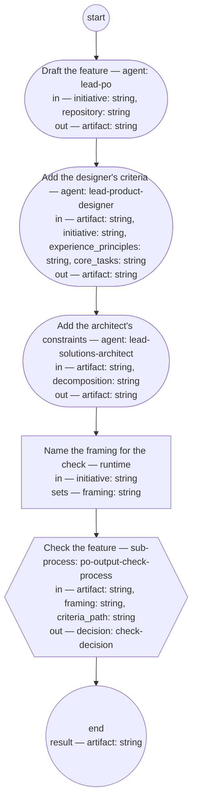

# Process: Feature authoring

**Purpose:** Author one feature from a planned initiative and take it
through its check: the PO role writes it alone from the initiative's
framing, the product designer and solutions architect roles add the
criteria that ride on its scenarios, and the PO output check sets its
status.

**Guiding statement:** One feature per run, authored alone: scope and
wording are the PO role's; the criteria ride on the scenarios; the
check, not the author, sets the status. Conflicts with behavior
already specified are the repository sweep's to catch at assignment,
never a question to a shop during authoring.

**Outcomes:**
- O1. The feature is authored by the PO role alone, from the
  initiative's Framing and For whom sections, with each scenario's
  owning shop named from the initiative's Decomposition section —
  witnessed by `draft`'s run-by and declared inputs.
- O2. Where the initiative names an interaction type, the designer's
  usability and accessibility criteria are on the feature before the
  check; where the decomposition names non-functional constraints,
  the architect's constraints are — witnessed by `add-usability` and
  `add-constraints` preceding `check`, each outputting the feature.
- O3. The feature's check statuses — checked, returned,
  pending-definition — are set only by the PO output check; draft is
  the maker's own initial status, the typedef's writer list followed
  — witnessed by `draft`'s prompt and `check`, the run's only other
  status-writing step.
- O4. A run returns the feature with the check's decision recorded in
  its Document History — witnessed by `check`'s output and the child's
  record step, whose prompt writes the review rounds and the decision
  into the artifact's Document History.

**Roles:** maker — [`../roles/lead-po.md`](../roles/lead-po.md)
(authors the feature alone; its feature-authoring accountability).
criteria — [`../roles/lead-product-designer.md`](../roles/lead-product-designer.md)
(usability and accessibility criteria where an interaction type is
named) and
[`../roles/lead-solutions-architect.md`](../roles/lead-solutions-architect.md)
(non-functional constraints where the decomposition names them). the
check — the [PO output check](po-output-check.md) as a sub-process,
with its own roles.

**Carried by:**
[`../skills/feature-authoring/SKILL.md`](../skills/feature-authoring/SKILL.md)
— generated from this definition by
[`../tools/compile_process.py`](../tools/compile_process.py), never
edited by hand.

## Flow (compiled)

Generated from the steps below by `tools/compile_process.py`; do not
edit by hand.




## Data

Each entry names a process-local value. Simple types use JSON Schema
names inline; every structured shape is a `$ref` to a defined type with
an explicit source. Conditions are CEL expressions over these names.
`repository` is the path of the feature repository the draft is
written into; `decomposition` the path of the solutions architect's
structural model; `experience_principles` and `core_tasks` the
experience principle set and core-task list — each a lead-shop-held
record, declared so no step loads undeclared context. `criteria_path`
names the [feature fitness set](../fitness/feature.fitness.md). The
`framing` the check reads is the initiative's Framing section — the
`prepare` step names it by fragment, since the
[initiative typedef](../artifacts/initiative.md) rules that a check
naming the framing as a criterion reads §1, not the whole document.

```yaml
data:
  initiative: {type: string, format: uri-reference}
  repository: {type: string, format: uri-reference}
  decomposition: {type: string, format: uri-reference}
  experience_principles: {type: string, format: uri-reference}
  core_tasks: {type: string, format: uri-reference}
  criteria_path: {type: string, format: uri-reference}
  artifact: {type: string, format: uri-reference}
  framing: {type: string, format: uri-reference}
  decision: {$ref: check-decision, from: ../types/check-decision.md}
```

## Steps

```yaml
start: draft
parameters: [initiative, repository, decomposition, experience_principles, core_tasks, criteria_path]
result: artifact
steps:
  - id: draft
    name: Draft the feature
    run-by: {role: lead-po, execution: agent}
    inputs: [initiative, repository]
    outputs: [artifact]
    prompt: |
      From the initiative's Framing and For whom sections, write one
      feature per its typedef into the feature repository at
      repository: the Feature line and narrative in the framing's
      words; the scenarios, steps included, each tagged @feature: and
      @hash:; the Contributors section naming each scenario's owning
      shop from the initiative's Decomposition section; the
      Interaction types section stating the types the initiative's
      For whom section names, or "none" with the reason; the Edges
      table from the cases the framing names, covered or excluded
      with a reason. You author alone — no shop is asked. Set the
      feature's status to draft and link the initiative in its
      frontmatter. Return the feature's path.
    next: add-usability

  - id: add-usability
    name: Add the designer's criteria
    run-by: {role: lead-product-designer, execution: agent}
    inputs: [artifact, initiative, experience_principles, core_tasks]
    outputs: [artifact]
    prompt: |
      Where the initiative's For whom section names an interaction
      type, write into the feature's Contributors section the
      usability acceptance criteria and the accessibility criteria
      for its scenarios, judged against the experience principle set
      at experience_principles and the core-task list at core_tasks —
      and add to the Edges table any failure or boundary case those
      criteria name. Where the section says "none", record that no
      criteria are due, with its reason. Return the feature.
    next: add-constraints

  - id: add-constraints
    name: Add the architect's constraints
    run-by: {role: lead-solutions-architect, execution: agent}
    inputs: [artifact, decomposition]
    outputs: [artifact]
    prompt: |
      Read the decomposition at decomposition. Where it names
      non-functional constraints bounding the behaviors this
      feature's scenarios state, write them into the Contributors
      section as criteria riding on the scenarios they bound — and
      add to the Edges table any failure or boundary case those
      constraints name. Where none apply, record that the
      decomposition names none for this feature. Return the feature.
    next: prepare

  - id: prepare
    name: Name the framing for the check
    run-by: {execution: runtime}
    inputs: [initiative]
    set:
      framing: initiative + "#framing"
    next: check

  - id: check
    name: Check the feature
    run-by: {execution: sub-process, process: po-output-check-process, from: po-output-check.md}
    inputs: [artifact, framing, criteria_path]
    outputs: [decision]
    next: end
```

## Derived checks

| Outcome | Check | Kind | Where |
|---|---|---|---|
| O1 | `draft` run by `lead-po`, reading only `initiative` and `repository`; no shop in any step | mechanical | `draft`, step list |
| O2 | both criteria steps precede `check` and output `artifact` | mechanical | step order, outputs |
| O3 | `draft` writes only the initial draft status; the check statuses come from the child | mechanical | `draft.prompt`, `check` |
| O4 | `check` outputs `decision`; the child's record step writes the rounds and decision into the artifact's Document History | mechanical | `check`, po-output-check `record.prompt` |

## Document History

| Version | Date | Kind | Entry |
|---|---|---|---|
| 1 | 2026-08-31 | update | Authored as batch C of brief-032's plan: the making step the system read found missing — the PO role authors one feature from the initiative alone (co-production removed by owner decision; the repository sweep at assignment is the check on specified behavior), the designer's and architect's criteria ride on the scenarios, and the PO output check sets the status as sub-process. |
| 2 | 2026-08-31 | review | Batch C screen round 1: O3 no longer denies the maker's own draft status (the typedef's writer list followed); the framing named by fragment as §1; the Interaction types section enumerated in the draft prompt; the use-when's criteria named. |
| 3 | 2026-08-31 | review | Batch C screen round 2: O4's witness cites the child's record step prompt, which writes the artifact's Document History — po-output-check O4 covers the definition-change gap, not this. Round 2's other finding — the feature fitness set standing draft against the check's approved-criteria rule — is resolved by this batch's block approval. Repair after round 2; the end-to-end screen (batch E) covers it. |
| 3 | 2026-08-31 | state | draft → approved with batch C as one block (brief-032 ask 2, default accepted). |
