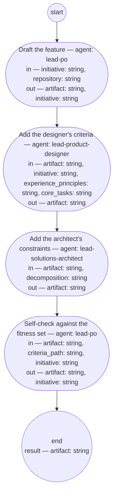

# Process: Feature authoring

**Purpose:** Author one feature from a planned initiative: the PO role
writes it alone from the initiative's framing, the product designer
and solutions architect roles add the criteria that ride on its
scenarios, and the PO records its own evaluation against the feature
fitness set and sets the feature checked.

**Guiding statement:** One feature per run, authored alone: scope and
wording are the PO role's; the criteria ride on the scenarios; the
maker's self-check is the last word, not a second checker's. Conflicts
with behavior already specified are the repository sweep's to catch at
assignment, never a question to a shop during authoring.

**Outcomes:**
- O1. The feature is authored by the PO role alone, from the
  initiative's Framing and For whom sections, with each scenario's
  owning shop named from the initiative's Decomposition section —
  witnessed by `draft`'s run-by and declared inputs.
- O2. Where the initiative names an interaction type, the designer's
  usability and accessibility criteria are on the feature before the
  self-check; where the decomposition names non-functional
  constraints, the architect's constraints are — witnessed by
  `add-usability` and `add-constraints` preceding `self-check`, each
  outputting the feature.
- O3. The PO records its evaluation of the feature against the fitness
  set in one Document History row and sets the feature checked, and
  activates a planned initiative on its first feature's pass —
  witnessed by `self-check`'s prompt and output.

**Roles:** maker — [`../roles/lead-po.md`](../roles/lead-po.md)
(authors and self-checks the feature; its feature-authoring
accountability). criteria — [`../roles/lead-product-designer.md`](../roles/lead-product-designer.md)
(usability and accessibility criteria where an interaction type is
named) and
[`../roles/lead-solutions-architect.md`](../roles/lead-solutions-architect.md)
(non-functional constraints where the decomposition names them; where
a constraint needs a decision not yet recorded, names it so
product-flow can route it to adr-authoring).

**Carried by:**
[`../../.claude/skills/feature-authoring/SKILL.md`](../../.claude/skills/feature-authoring/SKILL.md)
— generated from this definition by
[`../tools/compile_process.py`](../tools/compile_process.py), never
edited by hand.

## Flow (compiled)

Generated from the steps below by `tools/compile_process.py`; do not
edit by hand.




## Data

Each entry names a process-local value. `repository` is the feature
repository's path; `decomposition` the solutions architect's
structural model; `experience_principles` and `core_tasks` the
experience principle set and core-task list. `criteria_path` names the
[feature fitness set](../fitness/feature.fitness.md), the self-check's
one criterion.

```yaml
data:
  initiative: {type: string, format: uri-reference}
  repository: {type: string, format: uri-reference}
  decomposition: {type: string, format: uri-reference}
  experience_principles: {type: string, format: uri-reference}
  core_tasks: {type: string, format: uri-reference}
  criteria_path: {type: string, format: uri-reference}
  artifact: {type: string, format: uri-reference}
```

## Steps

```yaml
start: draft
parameters: [initiative, repository, decomposition, experience_principles, core_tasks, criteria_path]
result: artifact
steps:
  - id: draft
    name: Draft the feature
    run-by: {role: lead-po, execution: agent}
    inputs: [initiative, repository]
    outputs: [artifact, initiative]
    prompt: |
      From the initiative's Framing and For whom, write one feature
      into repository, per its typedef. Feature line and narrative:
      the framing's words. Scenarios: at most ten, steps included,
      one line each, tagged @feature: and @hash:. Contributors:
      owning shop per scenario from the Decomposition; each
      contributor's criteria one line. Interaction types: For whom's
      types, or "none" with reason. Edges: at most ten rows, from
      the framing's cases, covered or excluded with reason. One
      Document History row. Author alone, no shop asked. Status
      draft; link the initiative; add the id to its Features
      section. A returned feature already listed: revise in place —
      id stays, a changed scenario is a new hash, no duplicate.
      Return the feature's path.
    next: add-usability

  - id: add-usability
    name: Add the designer's criteria
    run-by: {role: lead-product-designer, execution: agent}
    inputs: [artifact, initiative, experience_principles, core_tasks]
    outputs: [artifact]
    prompt: |
      Where For whom names an interaction type, write the usability
      and accessibility criteria for the feature's scenarios into
      Contributors, one line each, judged against
      experience_principles and core_tasks. Add to Edges any failure
      or boundary case those criteria name. Where For whom says
      "none", record that no criteria are due, with the reason.
      Return the feature.
    next: add-constraints

  - id: add-constraints
    name: Add the architect's constraints
    run-by: {role: lead-solutions-architect, execution: agent}
    inputs: [artifact, decomposition]
    outputs: [artifact]
    prompt: |
      Read decomposition. Where it names non-functional constraints
      on this feature's scenarios, write them into Contributors as
      criteria, one line each, riding by name on the scenarios they
      bound. Where a constraint needs a decision not yet recorded,
      write "needs decision: <what>" on its line, so product-flow
      routes it to adr-authoring. Add to Edges any failure or
      boundary case those constraints name. Where none apply, record
      that decomposition names none for this feature. Return the
      feature.
    next: self-check

  - id: self-check
    name: Self-check against the fitness set
    run-by: {role: lead-po, execution: agent}
    inputs: [artifact, criteria_path, initiative]
    outputs: [artifact, initiative]
    prompt: |
      Evaluate the feature against the fitness set at criteria_path
      — every scenario, the Contributors criteria, the Edges table,
      the Interaction types section. Write one Document History row
      recording that evaluation and any gap you accept rather than
      fix. Set the feature's status to checked. If the initiative's
      status is planned, set it to active with a one-line entry
      naming this feature's pass — the only status this step writes
      over. Return the feature.
    next: end
```

## Derived checks

| Outcome | Check | Kind | Where |
|---|---|---|---|
| O1 | `draft` run by `lead-po`, reading only `initiative` and `repository`; no shop in any step | mechanical | `draft`, step list |
| O2 | both criteria steps precede `self-check` and output `artifact` | mechanical | step order, outputs |
| O3 | `self-check` writes one Document History row and sets status `checked`; on a planned initiative's first pass, sets it `active` | judged | `self-check.prompt` |

## Document History

| Version | Date | Kind | Entry |
|---|---|---|---|
| 1 | 2026-08-31 | update | Authored as batch C of brief-032's plan: the making step the system read found missing — the PO role authors one feature from the initiative alone (co-production removed by owner decision; the repository sweep at assignment is the check on specified behavior), the designer's and architect's criteria ride on the scenarios, and the PO output check sets the status as sub-process. |
| 2 | 2026-08-31 | review | Batch C screen round 1: O3 no longer denies the maker's own draft status (the typedef's writer list followed); the framing named by fragment as §1; the Interaction types section enumerated in the draft prompt; the use-when's criteria named. |
| 3 | 2026-08-31 | review | Batch C screen round 2: O4's witness cites the child's record step prompt, which writes the artifact's Document History — po-output-check O4 covers the definition-change gap, not this. Round 2's other finding — the feature fitness set standing draft against the check's approved-criteria rule — is resolved by this batch's block approval. Repair after round 2; the end-to-end screen (batch E) covers it. |
| 3 | 2026-08-31 | state | draft → approved with batch C as one block (brief-032 ask 2, default accepted). |
| 4 | 2026-08-31 | review | Batch E end-to-end screen round 1: the draft step writes the feature's id into the initiative's Features section — the §6 writer the product-flow loop's judgment reads. Post-approval repair from the end-to-end screen. |
| 5 | 2026-08-31 | review | Batch E screen round 2: the re-author pass defined — a returned feature listed in the Features section is revised in place, its id kept, no duplicate id added. Post-approval repair from the end-to-end screen. |
| 6 | 2026-09-02 | update | Carried-by reference repointed to the load point (.claude/skills/) — the skill-rendering process's first run removed the retired home basis/skills/; the owner's sweep per its second-home escalation. |
| 7 | 2026-09-08 | update | The draft, add-usability, and add-constraints prompts tightened to the plain-voice rule under feat-plain-voice: each under 120 words, stating what to write; draft caps scenarios and Edges rows at ten, one line per step, one line per contributor's criteria. |
| 8 | 2026-09-08 | update | Rewritten under feat-flow-simplification: the po-output-check sub-process removed; a self-check step has the PO evaluate the feature against the fitness set, record that evaluation in one Document History row, set it checked, and activate the initiative on the first feature's pass (carried over from po-output-check's O6) — no screen, no revise, no decide. |
