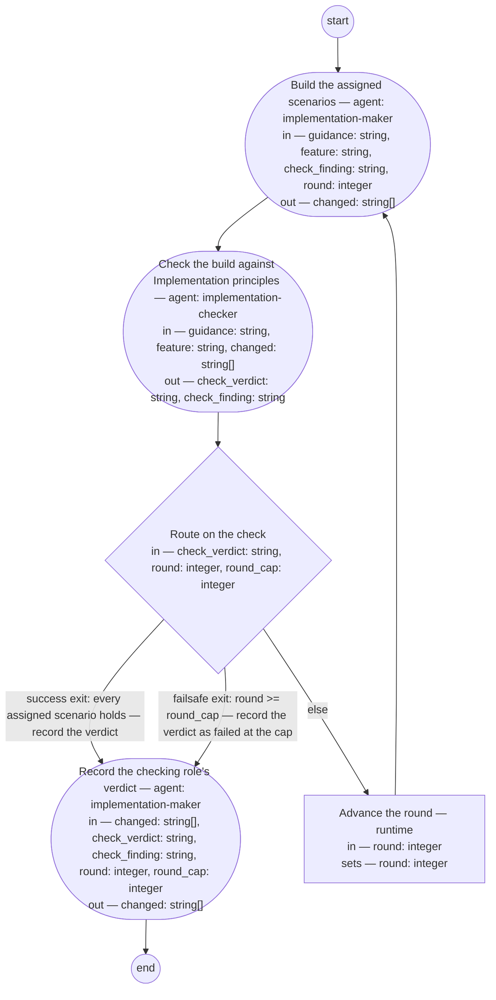

# Process: Implementation

**Purpose:** Take one assignment's scenarios to a checked
implementation: the maker role builds every scenario assigned, the
checking role evaluates the build against
[Implementation principles](../implementation-principles.md), and a
failed check repairs under a round cap until it passes or the cap is
reached. One process for every shop that implements; every step here
runs by a fixed role or the runtime alone, so a lead-shop execution
needs no dispatch and no mailbox call.

**Guiding statement:** Implementation principles is the whole of what
good looks like for the build: the maker builds to it and the checking
role judges by it alone, never by the maker's account of the work and
never by a mechanism no design element names.

**Outcomes:**
- O1. A shop looking for how to execute an implementation finds this
  one process, not an approach chosen anew per build — witnessed by
  this definition's frontmatter, the one `use-when` for building or
  repairing an assignment, and by its carried skill, rendered at the
  agent's load point by `compile_process.py`; no second definition
  covers the same job.
- O2. The maker role produces the implementation and the checking role
  evaluates it before an execution counts done — witnessed by `make`'s
  and `check`'s `run-by`, two fixed, different role ids, and by
  `route-check`: the only path to `record`'s pass verdict runs through
  `check`, and `check` runs only after `make`.
- O3. The lead shop executes this process on what it owns with no step
  requiring dispatch to a Bounded Context shop or mailbox work —
  witnessed by the step list: every step runs by a fixed role, agent
  or runtime, and none names `shop-msg`, a Bounded Context shop, or a
  mailbox call.
- O4. A completed execution's cost lands on the initiative whose
  feature the executed scenario belongs to — witnessed by this
  definition naming no cost step: an execution's bead already records
  the initiative it serves
  ([feat-initiative-cost-rollup](../../features/feat-initiative-cost-rollup.md),
  delivered) and its cost rows write at session close
  ([feat-run-measurement](../../features/feat-run-measurement.md),
  delivered), both independent of this definition.

**Roles:** the maker —
[`../roles/implementation-maker.md`](../roles/implementation-maker.md)
(builds the assignment's scenarios and leaves what changed, and why,
in each changed artifact's own record; fixed in `make`'s and
`record`'s `run-by`). The checking role —
[`../roles/implementation-checker.md`](../roles/implementation-checker.md)
(gives the pass/fail verdict from evidence read, never from the
maker's account; fixed in `check`'s `run-by`, and held to no write
tool, so it never records its own verdict). Fixing both `make`'s and
`check`'s `run-by` to literal role ids, on small-change.md's
precedent, is what makes "the checker is never the maker" a mechanical
fact of this definition rather than a value a caller could set to the
same role. A change whose checking role must be another role is a
change to this definition, filed as the gap it is, never substituted
when the execution starts.

**Carried by:** `.claude/skills/implementation/SKILL.md` — generated
from this definition by
[`../tools/compile_process.py`](../tools/compile_process.py), never
edited by hand.

## Flow (compiled)

Generated from the steps below by `tools/compile_process.py`; do not
edit by hand.




## Data

`feature` is the path of the feature the assignment's scenarios belong
to (typedef: [`../artifacts/feature.md`](../artifacts/feature.md));
`guidance` is the path of the implementation guidance record for this
assignment (typedef:
[`../artifacts/implementation-guidance.md`](../artifacts/implementation-guidance.md)),
whose frontmatter names the `@hash:` values assigned and whose body is
written to be actionable alone — `make` and `check` read guidance and
feature and nothing else, per its own commitment. Neither carries a
Decomposition or a request: this process has no route, no bet, and no
check of record — every scenario it takes up already passed
feature-authoring and scenario-assignment, and the appetite and cost
disciplines the maker role owes are its own accountabilities under
[Implementation principles](../implementation-principles.md), not
restated here as steps.

`changed` is the paths `make` changed, returned each round and read by
`check`, which fails a path in `changed` that traces to no scenario
`guidance` assigns and no design element. `check_verdict` and
`check_finding` are the checking role's verdict and, on a fail, the
statement or rule that fails, quoted — the evidence form
[adr-2026-09-16-scenario-evidence-form](../../decisions/adr-2026-09-16-scenario-evidence-form.md)
fixes: an assigned scenario's presented pass/fail status where one is
executable, the checking role's own mark where none is. `round` counts
make-then-check cycles; `round_cap` bounds them. This definition
declares no cost value: an execution's cost is carried by its bead and
its session's cost rows, delivered by feat-run-measurement and
feat-initiative-cost-rollup and unchanged by this process, per the
finding that no new cost mechanism is needed
(guidance/feat-implementation-process-shopsystem-product.md, item 4).

```yaml
data:
  feature: {type: string, format: uri-reference}
  guidance: {type: string, format: uri-reference}
  changed: {type: array, items: {type: string}, initial: []}
  check_verdict: {type: string, enum: [pass, fail]}
  check_finding: {type: string, initial: ""}
  round: {type: integer, initial: 1}
  round_cap: {type: integer, initial: 3}
```

## Steps

```yaml
start: make
parameters: [feature, guidance]
steps:
  - id: make
    name: Build the assigned scenarios
    run-by: {role: implementation-maker, execution: agent}
    inputs: [guidance, feature, check_finding, round]
    outputs: [changed]
    prompt: |
      Read guidance and, by the @hash: values it assigns, the
      feature's scenarios — nothing else; guidance is written to be
      actionable with the assigned scenarios alone. Build every
      assigned scenario so it holds, through each changed artifact's
      own producing rules: amended under its own type's rules, a
      rendering re-rendered by its own tool and never edited by hand,
      its Document History gaining one update row citing guidance by
      path and this round, its version bumped. Add no behavior that no
      assigned scenario and no design element calls for. Where a
      scenario cannot hold without a design change guidance does not
      cover, stop and report that rather than building it unrecorded.
      When check_finding is not empty this is a repair round: repair
      what it quotes, and show that every scenario that held before
      this round still holds. Evaluate what you built against
      Implementation principles yourself before you return, and add
      that evaluation to the same update row. Return changed, the
      paths you touched this round.
    next: check

  - id: check
    name: Check the build against Implementation principles
    run-by: {role: implementation-checker, execution: agent}
    inputs: [guidance, feature, changed]
    outputs: [check_verdict, check_finding]
    prompt: |
      Read guidance, the feature's assigned scenarios, and the
      artifacts at changed — nothing else. You are not the maker: your
      verdict is judged against Implementation principles alone, never
      against the maker's account. For each assigned scenario, per
      adr-2026-09-16-scenario-evidence-form: where it carries an
      executable test, read the shop's presented pass/fail status as
      its evidence; where it does not, mark it yourself from what you
      read. Verdict fail on a scenario that does not hold, on a change
      in changed that traces to no assigned scenario and no design
      element, on a scenario that held before this round and does not
      hold after it, or on a changed artifact whose record does not
      suffice for the next maker. Verdict pass only when every
      assigned scenario holds and every change conforms; otherwise
      fail, with check_finding the statement or rule that fails,
      quoted, and what fails it. Return the verdict and the finding —
      empty on pass.
    next: route-check

  - id: route-check
    name: Route on the check
    run-by: {execution: runtime}
    inputs: [check_verdict, round, round_cap]
    branches:
      - label: "success exit: every assigned scenario holds — record the verdict"
        when: check_verdict == "pass"
        next: record
      - label: "failsafe exit: round >= round_cap — record the verdict as failed at the cap"
        when: round >= round_cap
        next: record
      - else: advance-round

  - id: advance-round
    name: Advance the round
    run-by: {execution: runtime}
    inputs: [round]
    set:
      round: round + 1
    next: make

  - id: record
    name: Record the checking role's verdict
    run-by: {role: implementation-maker, execution: agent}
    inputs: [changed, check_verdict, check_finding, round, round_cap]
    outputs: [changed]
    prompt: |
      For each path in changed, write one review-kind Document History
      row citing the version reviewed, the checking role, the round,
      and the verdict as check_verdict and check_finding give it,
      transcribed as given — you do not rejudge it. Where check_verdict
      is fail and round is at round_cap, the row also states the
      scenario stands unresolved at the cap. Return changed.
    next: end
```

## Derived checks

| Outcome | Check | Kind | Where |
|---|---|---|---|
| O1 | this definition's `annotations.claude-code.use-when` names the one condition for building or repairing an assignment; `carried-by` names its rendered skill | mechanical | frontmatter |
| O2 | `make.run-by.role` and `check.run-by.role` are two different literal role ids; `check` reads `changed`, `make`'s output; `route-check`'s only path to `record` on a pass runs through `check_verdict` | mechanical | `make`, `check`, `route-check` branches |
| O3 | every step's `run-by` is `{role: implementation-maker\|implementation-checker, execution: agent}` or `{execution: runtime}`; no step's `run` or `prompt` names `shop-msg` or a Bounded Context shop | mechanical | step list |
| O4 | no data value or step here names a cost field; the bead-initiative and session-close mechanisms are cited in Data as the delivered features that carry it | mechanical | Data |
| O2 | the check step judges by Implementation principles and adr-2026-09-16-scenario-evidence-form, never by the maker's account | judged | `check` prompt |

## Document History

| Version | Date | Kind | Entry |
|---|---|---|---|
| 1 | 2026-09-17 | update | Authored by the lead-solutions-architect role, anchor lead-xbcrm, as the second half of init-implementation-process's bootstrap build, against feat-implementation-process's four assigned scenarios (`@hash:e996f2d086ab`, `@hash:afe74d3e9ff5`, `@hash:f90002450ad9`, `@hash:0e92f2731640`), guidance/feat-implementation-process-shopsystem-product.md (v1), the implementation-maker and implementation-checker role definitions (v1, approved), Implementation principles (v1, draft — cited, not represented as approved), adr-2026-09-16-scenario-evidence-form (v1, recorded), small-change.md (v7, read as precedent for fixed maker/checker role ids and a dispatch-free carrier, not copied from), and the process-definition typedef, guideline, and fitness set. No request, route, bet, or check of record: this process is not a sub-process of request-intake, and none of the four scenarios calls for one. No cost data or step, per the guidance's item 4 finding that feat-run-measurement and feat-initiative-cost-rollup already deliver it. The checking role's verdict is transcribed onto each changed artifact's own Document History by the maker role at `record`, as a review-kind row (the definition typedef's own Kind enum), since the checking role holds no write tool by its own definition; the maker does not rejudge the verdict there. Maker's evaluation against the process-definition fitness set: scenario 1 (renderings correspond) — the Flow section is a placeholder for `compile_process.py` to fill; not yet run at the time of this row, so not yet judged — see the next row. Scenario 2 (outcomes witnessed) pass: each of O1–O4 names a step, branch, or frontmatter/Data element that exists and that a reader can check directly. Scenario 3 (loop exits declared) pass: the one cycle (`route-check`'s else back through `advance-round` to `make`) carries a labeled success exit (`check_verdict == "pass"`) and a labeled cap exit (`round >= round_cap`), both routing to `record`; no unbounded path. Scenario 4 (declared reads only) pass: `make` reads `guidance, feature, check_finding, round`; `check` reads `guidance, feature, changed`; `record` reads `changed, check_verdict, check_finding, round, round_cap`; no prompt names an undeclared file. Scenario 5 (artifact result) pass by omission, on skill-rendering.md's precedent: no `result` is declared because `produces: [definition]` and the execution's value is the changed definitions themselves, plural and varying by assignment — O2's witness pins that a pass verdict, not a single named artifact, is what an execution returns. Scenario 6 (prose placement) pass: prose sits in `prompt` fields and the body text above the steps; the guiding statement states a cross-step judgment (build to the principles, judge by them alone), not a sequence. Not done here: the four scenarios' own holding is verified after compiling and linting, in the next row. |
| 1 | 2026-09-17 | update | Compiled: `compile_process.py` regenerated the Flow section (5 steps) and rendered `.claude/skills/implementation/SKILL.md`, closing fitness scenario 1 (renderings correspond) as pass — both declare `generated: true` and the skill's every step, prompt, and branch matches the Steps section with nothing added. `lint_basis.py --process` and the full `lint_basis.py` both ran clean (0 violations); the full run's vocabulary-residue count dropped by one after a "run-time" wording in the Roles section, caught by that report, was reworded — the corpus's `run`-to-`execution` propagation (feat-execution-vocabulary) applied to this new file rather than left as fresh residue. Made by the lead-solutions-architect role. |
