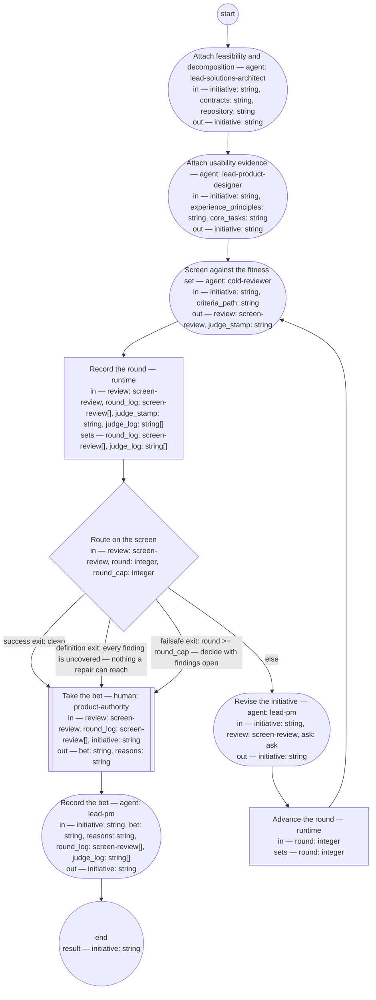

# Process: Initiative check

**Purpose:** Take a proposed initiative to the bet: the solutions
architect and product designer roles attach the sections they own, the
cold reviewer screens the whole against the initiative fitness set —
the check of record on the PM role's framing — and the authority
decides, from the verdict, whether to spend the appetite.

**Guiding statement:** The bet is taken on the screen's verdict and
the initiative's own first three sections, never on advocacy; a
finding in another role's attachment is that role's to answer, not the
reviser's to rewrite.

**Outcomes:**
- O1. The screen reads an initiative whose Feasibility and usability
  and Decomposition sections were written by the roles that own them —
  witnessed by `attach-architecture` and `attach-usability` preceding
  `screen`, each outputting the initiative.
- O2. Every round is screened in a fresh context against the
  initiative fitness set and logged — witnessed by `screen`'s
  `fresh-context` and inputs, and by `log-round`.
- O3. The screen loop exits on a clean verdict, on findings no
  criterion names, or at the round cap — witnessed by `route-screen`'s
  labeled branches.
- O4. The decision — bet, hold, or cancel — is the authority's alone,
  taken in a human step; a bet is available only on a screen the
  typedef's commitment admits, and the status the run writes follows
  the decision — witnessed by `decide`'s prompt and outputs and
  `record`'s inputs.
- O5. A repair that touches another role's attachment leaves the run
  as an ask to that role, with a default — witnessed by `revise`'s
  `asks` and the `ask` value.

**Roles:** attacher (architecture) —
[`../roles/lead-solutions-architect.md`](../roles/lead-solutions-architect.md)
(writes the feasibility verdict and the decomposition; its feasibility
accountability). attacher (usability) —
[`../roles/lead-product-designer.md`](../roles/lead-product-designer.md)
(writes the usability evidence or hypothesis where an interaction type
is named). screener —
[`../roles/cold-reviewer.md`](../roles/cold-reviewer.md) (fresh
context every round; the check of record — the
[initiative typedef](../artifacts/initiative.md) says why no other
role checks the PM role's framing). the authority —
product-authority (human-held; takes the bet). the PM role —
[`../roles/lead-pm.md`](../roles/lead-pm.md) (held by the authority in
person; its agent steps assist — `revise` repairs and asks, `record`
writes the outcome).

**Carried by:**
[`../skills/initiative-check/SKILL.md`](../skills/initiative-check/SKILL.md)
— generated from this definition by
[`../tools/compile_process.py`](../tools/compile_process.py), never
edited by hand.

## Flow (compiled)

Generated from the steps below by `tools/compile_process.py`; do not
edit by hand.




## Data

Each entry names a process-local value. Simple types use JSON Schema
names inline; every structured shape is a `$ref` to a defined type with
an explicit source. Conditions are CEL expressions over these names.
`criteria_path` names the
[initiative fitness set](../fitness/initiative.fitness.md) — the check
of record's criteria; the framing is the initiative's own first
section, so the screen carries no separate framing input.
`contracts` is the path under which each Bounded Context's contracts
are read, `repository` the path of the feature repository,
`experience_principles` the experience principle set, and `core_tasks`
the core-task list — each a lead-shop-held record, declared so the
attach steps load nothing undeclared. The status
values this process writes — `planned` on bet, `proposed` kept on
hold, `cancelled` on cancel — are the
[initiative typedef](../artifacts/initiative.md)'s, written by this
process as that typedef names.

```yaml
data:
  initiative: {type: string, format: uri-reference}
  criteria_path: {type: string, format: uri-reference}
  contracts: {type: string, format: uri-reference}
  repository: {type: string, format: uri-reference}
  experience_principles: {type: string, format: uri-reference}
  core_tasks: {type: string, format: uri-reference}
  review: {$ref: screen-review, from: ../types/screen-review.md}
  round: {type: integer, initial: 1}
  round_cap: {type: integer, initial: 3}
  round_log: {type: array, items: {$ref: screen-review}, initial: []}
  judge_stamp: {type: string}
  judge_log: {type: array, items: {type: string}, initial: []}
  ask: {$ref: ask, from: ../types/ask.md, initial: null}
  bet: {type: string, enum: [bet, hold, cancel]}
  reasons: {type: string}
```

## Steps

```yaml
start: attach-architecture
parameters: [initiative, criteria_path, contracts, repository, experience_principles, core_tasks]
result: initiative
steps:
  - id: attach-architecture
    name: Attach feasibility and decomposition
    run-by: {role: lead-solutions-architect, execution: agent}
    inputs: [initiative, contracts, repository]
    outputs: [initiative]
    prompt: |
      Read the initiative. Write into its Decomposition section the
      Bounded Contexts it touches, the relationship kind of each
      contract between them it relies on, and the cross-context flow —
      the saga or process manager that will carry it, or "none" when
      the contexts need no flow between them. Write into its
      Feasibility and usability section your feasibility verdict with
      its reasons. Judge from the contracts at contracts and the
      feature repository at repository — your role's admissible
      evidence, never a context's internals. Infeasible is a verdict:
      give it with reasons rather than withholding one. Return the
      initiative.
    next: attach-usability

  - id: attach-usability
    name: Attach usability evidence
    run-by: {role: lead-product-designer, execution: agent}
    inputs: [initiative, experience_principles, core_tasks]
    outputs: [initiative]
    prompt: |
      Read the initiative. Where its For whom section names an
      interaction type, write into the Feasibility and usability
      section the usability evidence for the outcome on those types,
      or the hypothesis it stands on, or "not yet" with the text of
      the ask that requests it — judged against the experience
      principle set at experience_principles and the core-task list at
      core_tasks, your role's standard. Where
      the For whom section says "none", write that no usability
      attachment is due, with the section's reason. Return the
      initiative.
    next: screen

  - id: screen
    name: Screen against the fitness set
    run-by: {role: cold-reviewer, execution: agent, fresh-context: true}
    inputs: [initiative, criteria_path]
    outputs: [review, judge_stamp]
    prompt: |
      State, as judge_stamp, the model and prompt version you judge
      as. Read the criteria set at criteria_path and the initiative at
      initiative — nothing else. Judge the initiative against every
      scenario. Report every finding with the criterion it fails by
      name, the quoted text, the change, and whether you could decide
      it (confident) or not (wobbly); for a wobbly finding quote the
      whole passage, since the authority decides from the review. A
      defect no criterion names is a finding with criterion
      "uncovered". Verdict "clean" only if there are no findings;
      otherwise "findings" with the top three changes.
    next: log-round
    annotations:
      fabro: {model: high-reasoning, node: separate-context-per-round}

  - id: log-round
    name: Record the round
    run-by: {execution: runtime}
    inputs: [review, round_log, judge_stamp, judge_log]
    set:
      round_log: round_log + [review]
      judge_log: judge_log + [judge_stamp]
    next: route-screen

  - id: route-screen
    name: Route on the screen
    run-by: {execution: runtime}
    inputs: [review, round, round_cap]
    branches:
      - label: "success exit: clean"
        when: review.verdict == "clean"
        next: decide
      - label: "definition exit: every finding is uncovered — nothing a repair can reach"
        when: size(review.findings) > 0 && review.findings.all(f, f.criterion == "uncovered")
        next: decide
      - label: "failsafe exit: round >= round_cap — decide with findings open"
        when: round >= round_cap
        next: decide
      - else: revise

  - id: revise
    name: Revise the initiative
    run-by: {role: lead-pm, execution: agent}
    inputs: [initiative, review, ask]
    outputs: [initiative]
    asks: [lead-solutions-architect, lead-product-designer]
    prompt: |
      Assist step. Repair every finding whose criterion is named and
      whose passage the PM role owns — the Framing, For whom,
      Appetite, and Features sections. A finding in the Feasibility
      and usability or Decomposition sections is another role's
      attachment: return an ask to the role that owns it — the
      solutions architect for feasibility and decomposition, the
      product designer for usability — with the question, the default
      you will apply if unanswered, and a checkpoint of the repairs
      made so far; never rewrite another role's verdict. Leave
      findings marked "uncovered" as they are — they are the decide
      step's. On the first pass ask is absent; if it carries an answer
      or resolved defaulted, apply it and finish the repairs.
    next: advance-round

  - id: advance-round
    name: Advance the round
    run-by: {execution: runtime}
    inputs: [round]
    set:
      round: round + 1
    next: screen

  - id: decide
    name: Take the bet
    run-by: {role: product-authority, execution: human}
    inputs: [review, round_log, initiative]
    outputs: [bet, reasons]
    prompt: |
      From the final review, the round log, and the initiative's
      Framing, For whom, and Appetite sections, take the go/no-go on
      spending the appetite. "bet": spend it — the initiative becomes
      planned and features are made from it; available when the
      screen is clean, or when its only findings are uncovered and
      you judge none of them needs a criterion — say so in the
      reasons. An initiative still failing a named criterion at the
      round cap cannot be bet on — the typedef's commitment: it stays
      proposed with the criterion named. "hold": it stays proposed —
      say what would change your mind. "cancel": with the reason —
      the record of the decline survives. Record your reasons.
    next: record

  - id: record
    name: Record the bet
    run-by: {role: lead-pm, execution: agent}
    inputs: [initiative, bet, reasons, round_log, judge_log]
    outputs: [initiative]
    prompt: |
      Assist step. Write into the initiative's Document History one
      review entry per round with its verdict and, from judge_log,
      the screening judge's model and prompt version — the record the
      fitness set promises — then a state entry
      carrying the decision and its reasons. Set the status: "planned"
      on bet, written only over "proposed"; leave "proposed" on hold;
      "cancelled" on cancel with the reason. On bet or cancel, the typedef requires a product
      decision record: state in the entry that the record is the PO
      role's to make and the PO output check screens it, and that the
      entry links it once made. Return the initiative.
    next: end
```

## Derived checks

| Outcome | Check | Kind | Where |
|---|---|---|---|
| O1 | both attach steps precede `screen` and output `initiative` | mechanical | step order, `attach-*` outputs |
| O2 | `screen` carries `fresh-context: true` and reads only `initiative` and `criteria_path`; every round appended | mechanical | `screen`, `log-round` |
| O3 | three labeled exits on the loop | mechanical | `route-screen.branches` |
| O4 | `decide` is a human step outputting `bet` and `reasons`, its prompt bounding the bet by the typedef's commitment; `record` reads them | mechanical, judged | `decide`, `record.inputs` |
| O5 | `revise` carries `asks`; process carries `ask-cap`; `ask` listed in inputs | mechanical | `revise`, frontmatter |

## Document History

| Version | Date | Kind | Entry |
|---|---|---|---|
| 1 | 2026-08-31 | update | Authored as batch A of brief-032's plan, on the authority's approval of the model (ask 1): the initiative typedef's pending check named and defined — attach by the owning roles, the cold reviewer's screen as the check of record, the bet taken inside the check by the authority in a human step, recorded with the product decision record obligation stated. |
| 2 | 2026-08-31 | review | Batch screen round 1: the attach steps' reads declared — contracts, repository, experience_principles, core_tasks as parameters and inputs, the prompts referencing only declared names; the record step writes the judge's model and prompt version from the run's anchor, keeping the fitness set's promise. |
| 3 | 2026-08-31 | review | Batch screen round 2: the bet bounded by the initiative typedef's commitment — no bet over a named-criterion failure at the cap (it stays proposed with the criterion named); O4's vocabulary aligned to the declared enum. |
| 4 | 2026-08-31 | review | Round-3 screen (final): the judge's model and prompt version travel as declared data — judge_stamp from the screen step, accumulated in judge_log, read by record — replacing the undeclared anchor read. Repair after the last screening round; the next screen of this file covers it. |
| 4 | 2026-08-31 | state | draft → approved with batch A+B as one block (brief-032 ask 2, default accepted). |
| 5 | 2026-08-31 | review | Batch E screen round 2: planned written only over proposed, matching the typedef's lifecycle. Post-approval repair from the end-to-end screen. |
