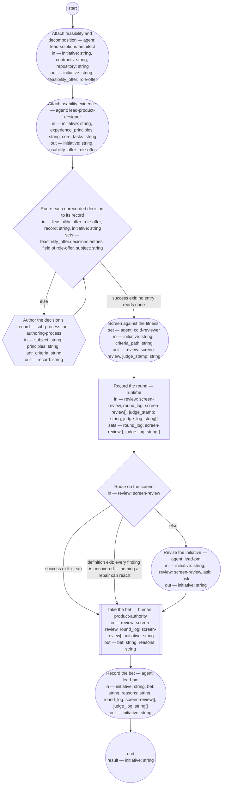

# Process: Initiative check

**Purpose:** Take a proposed initiative to the bet: the solutions
architect and product designer roles attach the sections they own,
each decision the solutions architect role's offer leaves unrecorded
is recorded through the ADR authoring process before the screen, the
cold reviewer screens the whole against the initiative fitness set —
the check of record on the PM role's framing — and the authority
decides, from the verdict, whether to spend the appetite.

**Guiding statement:** The bet is taken on the screen's verdict and
the initiative's own first three sections, never on advocacy; a
finding in another role's attachment is that role's to answer, not the
reviser's to rewrite.

**Outcomes:**
- O1. The screen reads an initiative whose Feasibility and usability
  and Decomposition sections were written by the roles that own them,
  each role's offer in the one shape its type defines — witnessed by
  `attach-architecture` and `attach-usability` preceding `screen`,
  each outputting the initiative and a `role-offer`.
- O2. The one screen runs in a fresh context against the initiative
  fitness set and is logged — witnessed by `screen`'s `fresh-context`
  and inputs, and by `log-round`.
- O3. The screen runs once: a clean verdict, or findings no criterion
  names, goes straight to the decision; any other finding is revised
  once and the decision follows — witnessed by `route-screen`'s
  labeled branches and `revise`'s `next`.
- O4. The decision — bet, hold, or cancel — is the authority's alone,
  taken in a human step; a bet is available only on a screen the
  typedef's commitment admits, and the status the run writes follows
  the decision — witnessed by `decide`'s prompt and outputs and
  `record`'s inputs.
- O5. A repair that touches another role's attachment leaves the run
  as an ask to that role, with a default — witnessed by `revise`'s
  `asks` and the `ask` value.
- O6. Every `none` in the solutions architect role's offer is a
  decision record before the screen, or the run goes straight to the
  screen — witnessed by `route-decisions`'s labeled branches and
  `author-decision-record`'s `run-by`.

**Roles:** attacher (architecture) —
[`../roles/lead-solutions-architect.md`](../roles/lead-solutions-architect.md)
(writes the feasibility verdict and the decomposition; its feasibility
accountability). attacher (usability) —
[`../roles/lead-product-designer.md`](../roles/lead-product-designer.md)
(writes the usability evidence or hypothesis where an interaction type
is named). screener —
[`../roles/cold-reviewer.md`](../roles/cold-reviewer.md) (fresh
context for the one screen; the check of record — the
[initiative typedef](../artifacts/initiative.md) says why no other
role checks the PM role's framing). the authority —
product-authority (human-held; takes the bet). the PM role —
[`../roles/lead-pm.md`](../roles/lead-pm.md) (held by the authority in
person; its agent steps assist — `revise` repairs and asks, `record`
writes the outcome). At `author-decision-record` the
[ADR authoring](adr-authoring.md) process's own roles run, unchanged
by this process.

**Carried by:**
[`../../.claude/skills/initiative-check/SKILL.md`](../../.claude/skills/initiative-check/SKILL.md)
— generated from this definition by
[`../tools/compile_process.py`](../tools/compile_process.py), never
edited by hand.

## Flow (compiled)

Generated from the steps below by `tools/compile_process.py`; do not
edit by hand.




## Data

Each entry names a process-local value. Simple types use JSON Schema
names inline; every structured shape is a `$ref` to a defined type with
an explicit source. Conditions are CEL expressions over these names.
`criteria_path` names the
[initiative fitness set](../fitness/initiative.fitness.md) — the check
of record's criteria; the framing is the initiative's own first
section, so the screen carries no separate framing input.
`contracts` is the path under which each Bounded Context's contracts
are read, `repository` the path of the feature repository,
`experience_principles` the experience principle set, and `core_tasks`
the core-task list — each a lead-shop-held record, declared so the
attach steps load nothing undeclared. `feasibility_offer` and
`usability_offer` are the attaching roles' offers, one
[role-offer](../types/role-offer.md) each — the shape of what the
attach steps produce, read by the screen and the authority through
its rendering into the initiative as the initiative typedef states.
The pre-bet route reads `feasibility_offer` only: a `none` in
`usability_offer` stays a claim the screen judges against the role's
domain, routed by hand by the PM role before the bet, because the
designer's side has no record type and no authoring process under
the adr typedef's rule. For the route, `principles` is the
[architecture principle set](../architecture-principles.md) and
`adr_criteria` the [adr fitness set](../fitness/adr.fitness.md) — the
two criteria the [ADR authoring](adr-authoring.md) sub-process needs,
each held at its `initial` value, not supplied at instantiation;
`subject` is what that sub-process's Data calls a subject — the
decision as the entry names it, the role whose offer raised it, the
trigger, and where the evidence sits — composed by `route-decisions`
for the first entry whose `record` reads `none`; `record` is the path
of the record the sub-process returned, empty before any pass.
`record_id(path)` is the one declared condition function: the `id` in
the frontmatter of the record at `path` — the value the type's
`record` field holds. `route-decisions`'s `run` and `set` are
independent of each other — each reads `record` and neither reads
what the other wrote — and its `set` assignments apply in the order
written; the `run` finds the entry in the initiative by the type's
field name and literal, `record: none`, the first such in the
document, which is the entry the subject was composed for since the
offer is rendered in the type's shape and order and the solutions
architect role's entry precedes the designer's; it writes the id and
nothing else. The status
values this process writes — `planned` on bet, `proposed` kept on
hold, `cancelled` on cancel — are the
[initiative typedef](../artifacts/initiative.md)'s, written by this
process as that typedef names.

```yaml
data:
  initiative: {type: string, format: uri-reference}
  criteria_path: {type: string, format: uri-reference}
  contracts: {type: string, format: uri-reference}
  repository: {type: string, format: uri-reference}
  experience_principles: {type: string, format: uri-reference}
  core_tasks: {type: string, format: uri-reference}
  feasibility_offer: {$ref: role-offer, from: ../types/role-offer.md}
  usability_offer: {$ref: role-offer, from: ../types/role-offer.md}
  principles: {type: string, format: uri-reference, initial: basis/architecture-principles.md}
  adr_criteria: {type: string, format: uri-reference, initial: basis/fitness/adr.fitness.md}
  subject: {type: string, initial: ""}
  record: {type: string, format: uri-reference, initial: ""}
  review: {$ref: screen-review, from: ../types/screen-review.md}
  round_log: {type: array, items: {$ref: screen-review}, initial: []}
  judge_stamp: {type: string}
  judge_log: {type: array, items: {type: string}, initial: []}
  ask: {$ref: ask, from: ../types/ask.md, initial: null}
  bet: {type: string, enum: [bet, hold, cancel]}
  reasons: {type: string}
```

## Steps

```yaml
start: attach-architecture
parameters: [initiative, criteria_path, contracts, repository, experience_principles, core_tasks]
result: initiative
steps:
  - id: attach-architecture
    name: Attach feasibility and decomposition
    run-by: {role: lead-solutions-architect, execution: agent}
    inputs: [initiative, contracts, repository]
    outputs: [initiative, feasibility_offer]
    prompt: |
      Read the initiative at initiative and add your attachment —
      your offer, the role-offer type this step outputs, rendered
      into the initiative as its typedef states — or ask questions.
    next: attach-usability

  - id: attach-usability
    name: Attach usability evidence
    run-by: {role: lead-product-designer, execution: agent}
    inputs: [initiative, experience_principles, core_tasks]
    outputs: [initiative, usability_offer]
    prompt: |
      Read the initiative at initiative and add your attachment —
      your offer, the role-offer type this step outputs, rendered
      into the initiative as its typedef states — or ask questions.
    next: route-decisions

  - id: route-decisions
    name: Route each unrecorded decision to its record
    run-by: {execution: runtime}
    inputs: [feasibility_offer, record, initiative]
    run: |
      [ -z "${record}" ] || sed -i "0,/record: none/s//record: $(sed -n 's/^id: //p' ${record})/" ${initiative}
    set:
      feasibility_offer.decisions.entries: >-
        record == "" ? feasibility_offer.decisions.entries
        : feasibility_offer.decisions.entries.map(e, e.record == "none" && e.decision == feasibility_offer.decisions.entries.filter(n, n.record == "none")[0].decision ? {"decision": e.decision, "record": record_id(record)} : e)
      subject: >-
        !feasibility_offer.decisions.entries.exists(e, e.record == "none") ? ""
        : "Decision: " + feasibility_offer.decisions.entries.filter(e, e.record == "none")[0].decision + ". Decided by: " + feasibility_offer.role + ", under a right it holds, or by the authority under escalation where no listed right covers it. Trigger: the bet on the initiative at " + initiative + ". Evidence: the offer as rendered into that initiative's Document History."
    branches:
      - label: "success exit: no entry reads none"
        when: "!feasibility_offer.decisions.entries.exists(e, e.record == \"none\")"
        next: screen
      - else: author-decision-record

  - id: author-decision-record
    name: Author the decision's record
    run-by: {execution: sub-process, process: adr-authoring-process, from: adr-authoring.md}
    inputs: [subject, principles, adr_criteria]
    outputs: [record]
    next: route-decisions

  - id: screen
    name: Screen against the fitness set
    run-by: {role: cold-reviewer, execution: agent, fresh-context: true}
    inputs: [initiative, criteria_path]
    outputs: [review, judge_stamp]
    prompt: |
      State, as judge_stamp, the model and prompt version you judge
      as. Read the criteria set at criteria_path and the initiative at
      initiative — nothing else. Judge the initiative against every
      scenario. Report every finding with the criterion it fails by
      name, the quoted text, the change, and whether you could decide
      it (confident) or not (wobbly); for a wobbly finding quote the
      whole passage, since the authority decides from the review. A
      defect no criterion names is a finding with criterion
      "uncovered". Verdict "clean" only if there are no findings;
      otherwise "findings" with the top three changes.
    next: log-round
    annotations:
      fabro: {model: high-reasoning, node: separate-context-per-round}

  - id: log-round
    name: Record the round
    run-by: {execution: runtime}
    inputs: [review, round_log, judge_stamp, judge_log]
    set:
      round_log: round_log + [review]
      judge_log: judge_log + [judge_stamp]
    next: route-screen

  - id: route-screen
    name: Route on the screen
    run-by: {execution: runtime}
    inputs: [review]
    branches:
      - label: "success exit: clean"
        when: review.verdict == "clean"
        next: decide
      - label: "definition exit: every finding is uncovered — nothing a repair can reach"
        when: size(review.findings) > 0 && review.findings.all(f, f.criterion == "uncovered")
        next: decide
      - else: revise

  - id: revise
    name: Revise the initiative
    run-by: {role: lead-pm, execution: agent}
    inputs: [initiative, review, ask]
    outputs: [initiative]
    asks: [lead-solutions-architect, lead-product-designer]
    prompt: |
      Assist step. Repair every finding whose criterion is named and
      whose passage the PM role owns — the Framing, For whom,
      Appetite, and Features sections. A finding in the Feasibility
      and usability or Decomposition sections is another role's
      attachment: return an ask to the role that owns it — the
      solutions architect for feasibility and decomposition, the
      product designer for usability — with the question, the default
      you will apply if unanswered, and a checkpoint of the repairs
      made so far; never rewrite another role's verdict. Leave
      findings marked "uncovered" as they are — they are the decide
      step's. On the first pass ask is absent; if it carries an answer
      or resolved defaulted, apply it and finish the repairs.
    next: decide

  - id: decide
    name: Take the bet
    run-by: {role: product-authority, execution: human}
    inputs: [review, round_log, initiative]
    outputs: [bet, reasons]
    prompt: |
      From the one review and the initiative as revised — its
      Framing, For whom, and Appetite sections, read against the
      review's findings — take the go/no-go on spending the appetite.
      "bet": spend it — the initiative becomes planned and features
      are made from it; available when the screen is clean, or when
      every named finding is repaired in the revision and the only
      findings still open are uncovered and you judge none of them
      needs a criterion — say so in the reasons. An initiative still
      failing a named criterion after the one revision cannot be bet
      on — the typedef's commitment: it stays proposed with the
      criterion named. "hold": it stays proposed —
      say what would change your mind. "cancel": with the reason —
      the record of the decline survives. Record your reasons.
    next: record

  - id: record
    name: Record the bet
    run-by: {role: lead-pm, execution: agent}
    inputs: [initiative, bet, reasons, round_log, judge_log]
    outputs: [initiative]
    prompt: |
      Assist step. Write into the initiative's Document History one
      review entry per round with its verdict and, from judge_log,
      the screening judge's model and prompt version — the record the
      fitness set promises — then a state entry
      carrying the decision and its reasons. Set the status: "planned"
      on bet, written only over "proposed"; leave "proposed" on hold;
      "cancelled" on cancel with the reason. On bet or cancel, the typedef requires a product
      decision record: state in the entry that the record is the PO
      role's to make and the PO output check screens it, and that the
      entry links it once made. Return the initiative.
    next: end
```

## Derived checks

| Outcome | Check | Kind | Where |
|---|---|---|---|
| O1 | both attach steps precede `screen` and output `initiative` and a `role-offer` | mechanical | step order, `attach-*` outputs |
| O2 | `screen` carries `fresh-context: true` and reads only `initiative` and `criteria_path`; the one review appended | mechanical | `screen`, `log-round` |
| O3 | two labeled exits to `decide` and an else to `revise`; `revise.next` is `decide` | mechanical | `route-screen.branches`, `revise.next` |
| O4 | `decide` is a human step outputting `bet` and `reasons`, its prompt bounding the bet by the typedef's commitment; `record` reads them | mechanical, judged | `decide`, `record.inputs` |
| O5 | `revise` carries `asks`; process carries `ask-cap`; `ask` listed in inputs | mechanical | `revise`, frontmatter |
| O6 | `route-decisions` stands between `attach-usability` and `screen` with a labeled success exit to `screen` and an else to `author-decision-record`, whose `run-by` names `adr-authoring-process` and whose `next` returns to `route-decisions`; each pass rewrites one `none` to an id, so the passes never exceed the offer's entries | mechanical | `route-decisions.branches`, `author-decision-record` |

## Document History

| Version | Date | Kind | Entry |
|---|---|---|---|
| 1 | 2026-08-31 | update | Authored as batch A of brief-032's plan, on the authority's approval of the model (ask 1): the initiative typedef's pending check named and defined — attach by the owning roles, the cold reviewer's screen as the check of record, the bet taken inside the check by the authority in a human step, recorded with the product decision record obligation stated. |
| 2 | 2026-08-31 | review | Batch screen round 1: the attach steps' reads declared — contracts, repository, experience_principles, core_tasks as parameters and inputs, the prompts referencing only declared names; the record step writes the judge's model and prompt version from the run's anchor, keeping the fitness set's promise. |
| 3 | 2026-08-31 | review | Batch screen round 2: the bet bounded by the initiative typedef's commitment — no bet over a named-criterion failure at the cap (it stays proposed with the criterion named); O4's vocabulary aligned to the declared enum. |
| 4 | 2026-08-31 | review | Round-3 screen (final): the judge's model and prompt version travel as declared data — judge_stamp from the screen step, accumulated in judge_log, read by record — replacing the undeclared anchor read. Repair after the last screening round; the next screen of this file covers it. |
| 4 | 2026-08-31 | state | draft → approved with batch A+B as one block (brief-032 ask 2, default accepted). |
| 5 | 2026-08-31 | review | Batch E screen round 2: planned written only over proposed, matching the typedef's lifecycle. Post-approval repair from the end-to-end screen. |
| 6 | 2026-09-02 | update | Carried-by reference repointed to the load point (.claude/skills/) — the skill-rendering process's first run removed the retired home basis/skills/; the owner's sweep per its second-home escalation. |
| 7 | 2026-09-05 | update | Single review cycle, per req-2026-09-05-single-review-cycle on the authority's words of 2026-09-05 — "I want all of the processes limited to a single review cycle, so author -> review -> revise -> continue to next step": the screen runs once; revise runs once and continues to decide; the advance-round step, the round and round_cap data, and route-screen's failsafe branch removed; decide reads the one review and the revised initiative. |
| 8 | 2026-09-06 | update | Under init-role-decisions / feat-role-decisions on the authority's bet of 2026-09-06, per adr-2026-09-05-role-offer (its Decision and fourth consequence) and the feature's constraints C1, C3, and C6: the two attach steps output the role-offer type beside the initiative — feasibility_offer and usability_offer, declared in Data with their source — and each attach prompt is cut to one sentence naming the initiative and asking for the role's attachment or its questions; what the prompts carried is the type's and the role definitions' now, and a shape gap is repaired there, never by an instruction at the step. O1 and its derived check name the offer. Nothing else changes: the screen still reads the initiative and the criteria set only; the pre-bet route on a "none" decision entry (the ADR's third candidate) is bounded, not added — until it lands the PM role routes such an entry by hand before decide. The skill re-produced by basis/tools/compile_process.py under skill-rendering. Maker's evaluation against the process-definition typedef's producing rules: every step's inputs and outputs declared in Data, the two $refs sourced; the prompts reference declared names only; no tool named that the repository lacks; the derived checks each name a step. Made by the lead-solutions-architect role; the owner's approval of the amendment is pending. |
| 9 | 2026-09-06 | update | Under req-2026-09-06-pre-bet-route at the small-change process's make step, on the authority's confirmation of brief-037 ask 2 — the third candidate of adr-2026-09-05-role-offer: the pre-bet route added between the attach steps and the screen. `route-decisions` (runtime) branches on `feasibility_offer` — success exit "no entry reads none" to `screen`, else to `author-decision-record`, which runs adr-authoring as a sub-process on the first entry whose `record` reads `none` and returns to the route; the loop's exit is the labeled success row and its bound the offer's entries, one rewritten per pass. The maker's choices under the Definition's "whichever step writes it": the id is written by `route-decisions` — its `run` into the initiative at the entry, its `set` into the offer's entry through the declared condition function `record_id`, the two independent of each other so their order does not bear; the subject composed by the same `set` in adr-authoring's terms; `principles` and `adr_criteria` declared with `initial` values, not parameters, so product-flow's `check` step maps as before; `produces` gains `adr`, the artifact a run now creates. Bound: the designer's offer is not read — one sentence in Data with the reason. O6 with its derived check. The skill re-rendered by basis/tools/compile_process.py. Maker's evaluation against the process-definition typedef's checklist and fitness set: compiles clean, the diagram and skill regenerated byte-stable (the verifying observation); no prose in a step outside `prompt`; the one new loop carries a labeled success exit; no step with `asks` added; every reference in the new step's `run` and `set` resolves to its declared inputs; `result` unchanged, the initiative; no tool named that the repository lacks — `sed` is the environment. Made by the lead-solutions-architect role; the owner's approval of the amendment is pending. |
