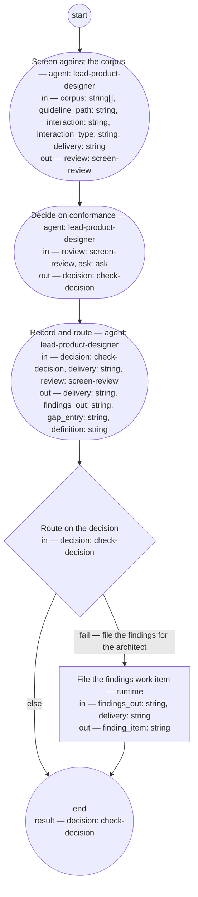

# Process: Interaction conformance check

**Purpose:** Screen a delivered interaction — the recording a Bounded
Context shop returns with its delivery — against the experience
guidance corpus — the experience principles, the common and per-type
guidelines, and the corpus records — so that the product designer role
decides from a screen verdict whether it conforms, returns findings to
the delivering shop, or changes the corpus; and so that a finding no
corpus record can decide is recorded against the corpus, never against
the delivery.

**Guiding statement:** The corpus applied, not the designer's taste. A
rule the corpus cannot decide because its record is absent is the
corpus's defect: the gap is filed against the corpus and the delivery
is not held for it.

**Outcomes:**
- O1. The interaction is screened against the corpus with the
  interaction fitness set — witnessed by `screen`'s inputs and the
  `screen-review` it returns.
- O2. The product designer role decides from the review — witnessed by
  `decide`'s inputs, which exclude the interaction.
- O3. Findings the shop can repair are filed as a work item for the
  solutions architect role, which carries them to the shop; a corpus
  gap is filed against the record or guideline named — witnessed by
  `file-findings`' `finding_item` and `record`'s `definition` and
  `gap_entry` outputs.
- O4. A question the corpus cannot answer leaves the run as an ask to
  the PM or solutions architect role, with a default — witnessed by
  `decide`'s `asks` and the `ask` value.

**Roles:** screener —
[`../roles/lead-product-designer.md`](../roles/lead-product-designer.md)
in a fresh context each run, judging the interaction fitness set as
its `judged-by` names. Decider — the same role, deciding from the
review alone; the check sits with this role, not with the delivering
shop, which is the separation `define-good-up-front` asks for.
Recorder — the same role's assisting agent. The [PM role](../roles/lead-pm.md) and the
[solutions architect role](../roles/lead-solutions-architect.md) —
answer asks; the architect receives the findings work item and
carries it to the shop.

**Carried by:**
`.claude/skills/interaction-conformance-check/SKILL.md` — not yet rendered: this definition stands draft, and the skill-rendering process renders only approved definitions; the carrier appears at the load point on approval
— generated from this definition by
[`../tools/compile_process.py`](../tools/compile_process.py), never
edited by hand.

## Flow (compiled)

Generated from the steps below by `tools/compile_process.py`; do not
edit by hand.




## Data

Each entry names a process-local value. Simple types use JSON Schema
names inline; every structured shape is a `$ref` to a defined type with
an explicit source. Conditions are CEL expressions over these names.
The *delivery* is the record a Bounded Context shop returns with an
interaction: it names the interaction, carries the accessibility
result, and — as `interaction` — a recording of the interaction
(transcript, screenshots, or session capture), never a running
instance; the delivery record's typedef is pending, and the status
values this process sets on it — `conforms`, `returned`,
`pending-corpus` — are this process's until then. The corpus the
screen reads is declared as `corpus` (its fixed paths) and
`guideline_path` (the per-type guideline: `experience-cli` for `cli`
and `tui`, `experience-api`, `experience-gui`, `experience-assistant`
for `conversational` and `voice`, `experience-document`).

```yaml
data:
  interaction: {type: string, format: uri-reference}
  interaction_type: {type: string, enum: [cli, tui, gui, api, conversational, voice, document]}
  delivery: {type: string, format: uri-reference}
  guideline_path: {type: string, format: uri-reference}
  corpus:
    type: array
    items: {type: string, format: uri-reference}
    initial: [../experience-principles.md, ../guidelines/experience-common.md, ../fitness/interaction.fitness.md, ../experience/vocabulary.md, ../experience/core-tasks.md, ../experience/patterns.md, ../experience/tokens.md, ../experience/hard-to-reverse.md, ../experience/persona-voice.md, ../experience/variations.md]
  review: {$ref: screen-review, from: ../types/screen-review.md}
  ask: {$ref: ask, from: ../types/ask.md, initial: null}
  decision: {$ref: check-decision, from: ../types/check-decision.md}
  findings_out: {type: string}
  finding_item: {type: string}
  gap_entry: {type: string}
  definition: {type: string, format: uri-reference}
```

## Steps

```yaml
start: screen
parameters: [interaction, interaction_type, delivery, guideline_path]
result: decision
steps:
  - id: screen
    name: Screen against the corpus
    run-by: {role: lead-product-designer, execution: agent, fresh-context: true}
    inputs: [corpus, guideline_path, interaction, interaction_type, delivery]
    outputs: [review]
    prompt: |
      Read every path in corpus and the per-type guideline at
      guideline_path, which is the guideline for interaction_type;
      then the delivery and the recording at interaction — nothing
      else. Judge the six
      fitness scenarios. Report every finding with the rule or scenario
      it fails by name, the quoted or described evidence, the change,
      and whether you could decide it (confident) or not (wobbly); for
      a wobbly finding describe the whole passage or behavior, since
      the decision is made from the review alone. Where a rule needs a
      corpus record that is absent, that lacks the entry, or whose
      entry is marked hypothesis, report the finding with the rule as
      its criterion and, as its change, "record absent:", "record
      empty:", or "entry is a hypothesis:" with the record's name — a
      finding against the corpus, never against the delivery.
      Verdict "clean" only if there are no findings; otherwise
      "findings" with the top three changes.
    next: decide
    annotations:
      fabro: {model: high-reasoning}

  - id: decide
    name: Decide on conformance
    run-by: {role: lead-product-designer, execution: agent}
    inputs: [review, ask]
    outputs: [decision]
    asks: [lead-pm, lead-solutions-architect]
    prompt: |
      From the review, decide. "pass": no findings, or only corpus
      findings (record absent, record empty, entry is a hypothesis) —
      the delivery conforms to every rule the corpus can decide; name
      each corpus finding and, for an absent record, the guideline
      whose rule needs it, in the reasons so the gap is filed. "fail": a named rule or scenario is not met — name
      it as the criterion; "fail" takes precedence where both stand.
      "definition-change": a rule the corpus should carry and does not
      — name the guideline and what it lacks as the gap. A question a corpus record
      could carry is a corpus finding, never an ask. An ask is for a
      decision no record will carry — whether the product should offer
      the interaction at all (kind: reserved-decision, to lead-pm), whether a contract change a repair needs is admissible
      (kind: contract, to lead-solutions-architect). Return it with
      the question, its kind,
      the default you will apply, and a checkpoint of the review; on
      the first pass ask is absent, and if it carries an answer or
      resolved defaulted, act on it. Decide from the review alone.
      Record your reasons.
    next: record

  - id: record
    name: Record and route
    run-by: {role: lead-product-designer, execution: agent}
    inputs: [decision, delivery, review]
    outputs: [delivery, findings_out, gap_entry, definition]
    prompt: |
      Write into the delivery's Document History a review entry with
      the screen verdict, then a state entry carrying the decision and
      its reasons. Set the delivery's status: "conforms" on pass,
      "returned" on fail, "pending-corpus" on definition-change. On
      "fail", write the findings the shop can repair — each with its
      rule, evidence, and change — as findings_out; otherwise return it
      empty. On "definition-change", or on "pass" whose reasons name
      corpus findings, write a review entry stating the gap into the
      Document History of the guideline or record named — for an
      absent record, of the guideline whose rule needs it; return that
      file's path as definition and the entry's text as gap_entry;
      otherwise return both empty. Return the delivery.
    next: route-findings

  - id: route-findings
    name: Route on the decision
    run-by: {execution: runtime}
    inputs: [decision]
    branches:
      - label: "fail — file the findings for the architect"
        when: decision.verdict == "fail"
        next: file-findings
      - else: end

  - id: file-findings
    name: File the findings work item
    run-by: {execution: runtime}
    inputs: [findings_out, delivery]
    outputs: [finding_item]
    run: |
      bd create --type task --assign lead-solutions-architect \
        --title "Interaction conformance findings on ${delivery}" \
        --body "${findings_out}" --link ${delivery}
    next: end
```

## Derived checks

| Outcome | Check | Kind | Where |
|---|---|---|---|
| O1 | screen reads only `corpus`, `guideline_path`, the delivery, and the recording | judged | `screen.prompt` and inputs |
| O2 | `interaction` absent from `decide.inputs` | mechanical | `decide.inputs` |
| O3 | `finding_item` set on fail; `definition` and `gap_entry` non-empty on definition-change or a pass naming corpus findings | mechanical (`route-findings`), judged (`record`) | `file-findings`, `record` outputs |
| O4 | `decide` carries `asks`; process carries `ask-cap`; `ask` listed in inputs | mechanical | `decide`, frontmatter |

## Document History

| Version | Date | Kind | Entry |
|---|---|---|---|
| 1 | 2026-08-26 | update | Authored by owner direction as the process that runs the interaction fitness set at delivery — the designer-side twin of the PO output check, without a revise loop because the delivering shop revises under isolation and receives findings through reconciliation. The delivery record's typedef is pending. |
| 1 | 2026-08-26 | review | Screened: findings — findings_out had no receiver; the screen loaded an undeclared corpus; decide was undecidable on a record-absent-only review and contradicted the guiding statement; the interaction input's form unstated; the two reused types not naming this producer; the enum not the glossary's; a stale annotation. |
| 2 | 2026-08-26 | update | Repairs: findings filed as a work item for the architect (finding_item); corpus and guideline_path declared; record-absent → pass with the gap filed, fail taking precedence; interaction defined as a recording in the delivery; enum aligned to the glossary; ask kinds named; annotation removed; the types amended to name both producers. |
| 2 | 2026-08-26 | review | Re-screened: findings — the record step filed a work item with tools the role lacks; one of three undecidable verdicts handled; an absent record has no history for its gap; the ask examples were corpus matters with a misnamed kind. |
| 3 | 2026-08-26 | update | Repairs: a runtime file-findings step with `run`, branched on fail; all three corpus verdicts named in screen and decide; an absent record's gap filed on the guideline that needs it; the ask/gap rule stated with examples outside the corpus; interaction_type dropped from decide's inputs. |
| 3 | 2026-08-26 | review | Final screen (round 3): one reference to a dropped input in decide's ask example; runtime steps conform; skill byte-derived. Repaired in place: example reworded; an unread input dropped from file-findings; interaction_type's use stated in screen; role sentences capitalized. |
| 4 | 2026-09-02 | update | Carried-by reference repointed to the load point (.claude/skills/) — the skill-rendering process's first run removed the retired home basis/skills/; the owner's sweep per its second-home escalation. |
