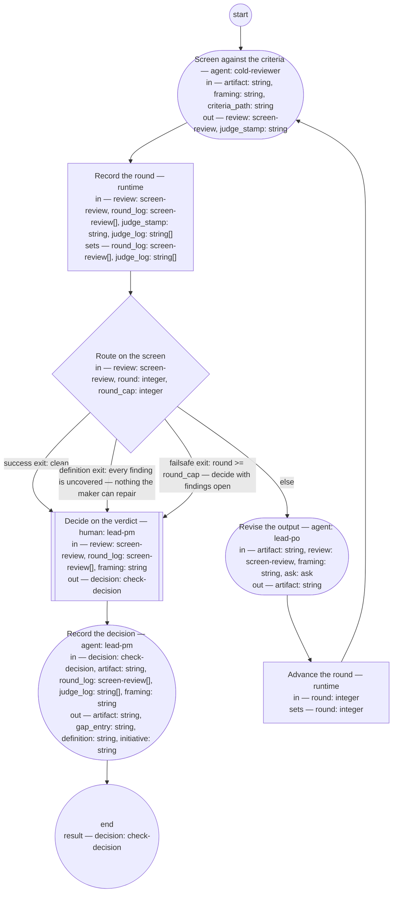

# Process: PO output check

**Purpose:** Check a piece of the PO role's output against the PM
role's framing under criteria the definitions state, so that the PM
role decides from a screen verdict — pass, fail with the criterion
named, or a definition change — and never by reading every artifact.

**Guiding statement:** The check is the criteria applied, not the
checker's reading. A finding the criteria cannot name is a missing
criterion, and the decision that follows is a definition change, not a
verdict on the maker.

**Outcomes:**
- O1. The output — a feature, a product decision record, or a backlog
  order — is screened against a named criteria set and the framing it
  claims to serve — witnessed by `screen`'s inputs and the
  `screen-review` it returns.
- O2. The PM role decides from the review and round log; the artifact
  reaches the PM role only through the findings' quotes — witnessed by
  `decide`'s inputs, which exclude the artifact.
- O3. Every screen round is recorded and the loop exits on a clean
  verdict, on findings no criterion names, or at the round cap —
  witnessed by `log-round` and `route-screen`.
- O4. A fail names the criterion missed; a definition change names the
  gap, and the gap is filed in the named definition's Document History
  — witnessed by the `check-decision` fields and `record`'s
  `definition` and `gap_entry` outputs.
- O5. A question the framing cannot answer leaves the run as an ask to
  the PM role, with a default, and the run resumes — witnessed by
  `revise`'s `asks` and the `ask` value.
- O6. A feature's first pass activates its planned initiative — the
  `active` status the initiative typedef assigns this process, written
  only over `planned` — witnessed by `record`'s `initiative` output
  and its prompt.

**Roles:** maker — [`../roles/lead-po.md`](../roles/lead-po.md)
(submits and revises; never decides its own pass). screener —
[`../roles/cold-reviewer.md`](../roles/cold-reviewer.md) (fresh
context every round; judges against the criteria). the PM role —
[`../roles/lead-pm.md`](../roles/lead-pm.md) (accountable for the
decision; a human-held role that decides from the verdict; its
assisting agent prepares the record and the gap entry).

**Carried by:**
[`../../.claude/skills/po-output-check/SKILL.md`](../../.claude/skills/po-output-check/SKILL.md)
— generated from this definition by
[`../tools/compile_process.py`](../tools/compile_process.py), never
edited by hand.

## Flow (compiled)

Generated from the steps below by `tools/compile_process.py`; do not
edit by hand.




## Data

Each entry names a process-local value. Simple types use JSON Schema
names inline; every structured shape is a `$ref` to a defined type with
an explicit source. Conditions are CEL expressions over these names. A
*criteria set* is the approved fitness set or guideline for the
artifact's type. The framing is always a criterion, named `framing`;
until a criteria set exists for a type, `criteria_path` names the
framing itself and `framing` is the only named criterion. The artifact
status values this process sets — `checked` on pass, `returned` on
fail, `pending-definition` on definition change — were this process's
until the artifact typedefs defined their own; the feature,
product-decision-record, and backlog-order typedefs now carry them,
and this process follows those definitions. The `active` status it
writes on a feature's first pass is the
[initiative typedef](../artifacts/initiative.md)'s, written by
`record` as that typedef names.

```yaml
data:
  artifact: {type: string, format: uri-reference}
  framing: {type: string, format: uri-reference}
  criteria_path: {type: string, format: uri-reference}
  review: {$ref: screen-review, from: ../types/screen-review.md}
  round: {type: integer, initial: 1}
  round_cap: {type: integer, initial: 3}
  round_log: {type: array, items: {$ref: screen-review}, initial: []}
  judge_stamp: {type: string}
  judge_log: {type: array, items: {type: string}, initial: []}
  ask: {$ref: ask, from: ../types/ask.md, initial: null}
  decision: {$ref: check-decision, from: ../types/check-decision.md}
  gap_entry: {type: string}
  definition: {type: string, format: uri-reference}
  initiative: {type: string, format: uri-reference}
```

## Steps

```yaml
start: screen
parameters: [artifact, framing, criteria_path]
result: decision
steps:
  - id: screen
    name: Screen against the criteria
    run-by: {role: cold-reviewer, execution: agent, fresh-context: true}
    inputs: [artifact, framing, criteria_path]
    outputs: [review, judge_stamp]
    prompt: |
      State, as judge_stamp, the model and prompt version you judge
      as. Read the criteria set at criteria_path, the framing at framing,
      and the artifact at artifact — nothing else. Judge the artifact
      against every criterion and against the framing: does each part
      of it trace to the framing, and does anything in it serve no
      framed outcome? Report every finding with the criterion it fails
      by name — "framing" for a part that does not trace to the framing
      or serves no framed outcome — the quoted text, the change, and
      whether you could decide it (confident) or not (wobbly); for a
      wobbly finding quote the whole passage, since the PM role decides
      from the review alone. A defect no criterion names is a finding
      with criterion "uncovered". Verdict "clean"
      only if there are no findings; otherwise "findings" with the top
      three changes.
    next: log-round
    annotations:
      fabro: {model: high-reasoning, node: separate-context-per-round}

  - id: log-round
    name: Record the round
    run-by: {execution: runtime}
    inputs: [review, round_log, judge_stamp, judge_log]
    set:
      round_log: round_log + [review]
      judge_log: judge_log + [judge_stamp]
    next: route-screen

  - id: route-screen
    name: Route on the screen
    run-by: {execution: runtime}
    inputs: [review, round, round_cap]
    branches:
      - label: "success exit: clean"
        when: review.verdict == "clean"
        next: decide
      - label: "definition exit: every finding is uncovered — nothing the maker can repair"
        when: size(review.findings) > 0 && review.findings.all(f, f.criterion == "uncovered")
        next: decide
      - label: "failsafe exit: round >= round_cap — decide with findings open"
        when: round >= round_cap
        next: decide
      - else: revise

  - id: revise
    name: Revise the output
    run-by: {role: lead-po, execution: agent}
    inputs: [artifact, review, framing, ask]
    outputs: [artifact]
    asks: [lead-pm]
    prompt: |
      Repair every finding whose criterion is named, "framing"
      included; leave findings marked "uncovered" as they are — they
      are the PM role's to decide. If a repair needs something the framing does not say —
      the originator's intent, whether a thing is in scope, a decision
      another role's domain holds — return an ask to lead-pm instead
      of guessing: the question, its kind, the default you will apply
      if unanswered, and a checkpoint holding the repairs made so far.
      On the first pass ask is absent; if it carries an answer or
      resolved defaulted, act on it and finish the repairs.
    next: advance-round

  - id: advance-round
    name: Advance the round
    run-by: {execution: runtime}
    inputs: [round]
    set:
      round: round + 1
    next: screen

  - id: decide
    name: Decide on the verdict
    run-by: {role: lead-pm, execution: human}
    inputs: [review, round_log, framing]
    outputs: [decision]
    prompt: |
      From the final review and the round log, decide. "pass": the
      screen is clean, or its only findings are uncovered and you judge
      none of them needs a criterion — say so in the reasons. "fail": a
      named criterion, "framing" included, is still missed at the round
      cap — name it.
      "definition-change": an uncovered finding should have been a
      criterion, or a criterion the output met produced something that
      does not serve the framing — name the definition and what it
      lacks. Where both a missed named criterion and an open uncovered finding
      stand at the cap, "fail" takes precedence and the reasons carry
      the uncovered finding. Decide from the quotes in the review.
      Record your reasons.
    next: record

  - id: record
    name: Record the decision
    run-by: {role: lead-pm, execution: agent}
    inputs: [decision, artifact, round_log, judge_log, framing]
    outputs: [artifact, gap_entry, definition, initiative]
    prompt: |
      Write into the artifact's Document History one review entry per
      round with its verdict and, from judge_log, the screening
      judge's model and prompt version, then a state entry carrying the decision
      and its reasons. Set the artifact's status: "checked" on pass,
      "returned" on fail with the criterion named, "pending-definition"
      on definition-change. On "definition-change", write a review
      entry stating the gap into the Document History of the definition
      the decision names; return that file's path as definition and the
      entry's text as gap_entry. Otherwise return both empty.
      Where the artifact is a feature, framing names a section of the
      initiative it was made from — the document at framing is the
      one declared input that carries it. If the decision is pass and
      that initiative's status is planned, set it to active with a
      state entry naming this feature's pass — the initiative
      typedef's writer, and planned is the only status it writes
      over — and return its path as initiative; otherwise return
      initiative empty. Return the artifact.
    next: end
```

## Derived checks

| Outcome | Check | Kind | Where |
|---|---|---|---|
| O1 | screen reads only criteria, framing, artifact | judged | `screen.prompt` and inputs |
| O2 | `artifact` absent from `decide.inputs` | mechanical | `decide.inputs` |
| O3 | every round logged; three labeled exits | mechanical | `log-round`, `route-screen` |
| O4 | `criterion` present on fail, `gap` on definition-change; `definition` and `gap_entry` non-empty on definition-change | judged | `check-decision`, `record` outputs |
| O5 | `revise` carries `asks`; process carries `ask-cap`; `ask` listed in inputs | mechanical | `revise`, frontmatter |
| O6 | `initiative` non-empty exactly on a feature's pass with a planned linked initiative | judged | `record` outputs and prompt |

## Document History

| Version | Date | Kind | Entry |
|---|---|---|---|
| 1 | 2026-08-25 | update | Authored by owner decision as the check the lead-pm role runs on the lead-po role's output — the maker/checker split's named process. First process to carry `asks` and `ask-cap`. Criteria sets per artifact type (brief, product decision record, acceptance scenarios, backlog order) are a filed gap: until each exists, `criteria_path` names the nearest approved fitness set or the framing alone. |
| 1 | 2026-08-25 | review | Screened against the process-definition chain: findings — an uncovered finding could never clear the screen; the `review` type lacked per-finding criterion, quote, and decidability; two prompts wrote to undeclared channels; `artifact_type` loaded and unread; one route-decision branch dead; status values and the gap's home undefined. |
| 2 | 2026-08-25 | update | Reworked: a `screen-review` type carries findings with criterion, quote, and decidability; route-screen gains a definition exit when every finding is uncovered; decide routes straight to record; the artifact leaves the decider's inputs; `artifact_type` dropped; the gap is filed as a review entry in the named definition's history and returned as `gap_entry`; status values declared as this process's pending the typedefs. |
| 2 | 2026-08-25 | review | Re-screened: findings — decide's prompt opened an undeclared artifact; a framing-trace failure had no criterion name and so was never repaired; record wrote a file outside its outputs; a vacuous all-uncovered branch on an empty list; ask without an initial. |
| 3 | 2026-08-25 | update | Repairs: the PM role decides from the review alone, wobbly findings quote the whole passage; `framing` is a named criterion the maker repairs; record returns the written definition's path; the definition exit guarded on a non-empty list; `ask` initial null; status vocabulary moved to Data prose. The v1 entry's "nearest approved fitness set or the framing alone" is superseded by Data's rule. |
| 3 | 2026-08-25 | review | Re-screened (round 3): clean — all six scenarios pass, six rules hold; both paths traced; stumbles polished in place (verdict precedence at the cap; the framing criterion named in the type). |
| 3 | 2026-08-26 | state | draft → approved by the owner. |
| 4 | 2026-08-28 | update | Owner decision: acceptance-scenarios re-formed as feature (product-level, scenarios assigned per Bounded Context by tag); the brief retired — shops receive their assigned scenarios. |
| 5 | 2026-08-31 | update | Batch D of brief-032's plan: the record step activates a feature's initiative on its first pass (the initiative typedef's active writer resolved); the screening judge's model and prompt version travel as declared data — judge_stamp from screen, accumulated in judge_log, recorded with each round — keeping the fitness sets' promise; the status vocabulary notes the typedefs now define their own. |
| 6 | 2026-08-31 | review | Batch D screen round 1: the initiative reached through the declared framing input, not an undeclared link-follow; active written only over planned, so a cancelled or unbet initiative is never activated. |
| 7 | 2026-09-02 | update | Carried-by reference repointed to the load point (.claude/skills/) — the skill-rendering process's first run removed the retired home basis/skills/; the owner's sweep per its second-home escalation. |
