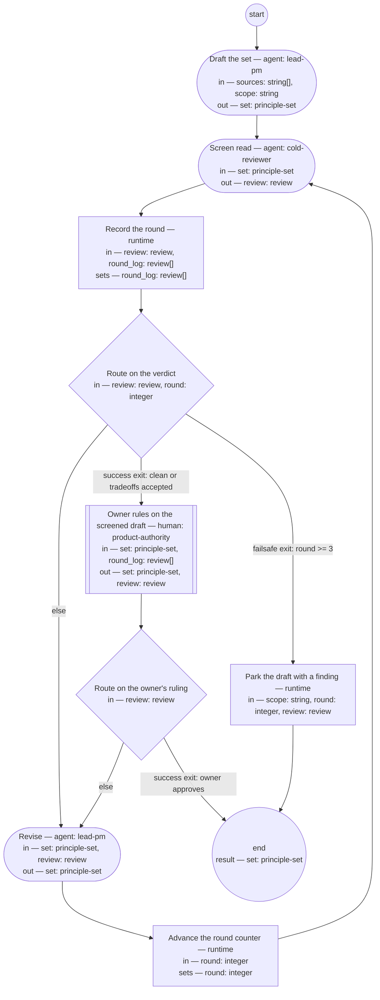

# Process: Principle-set authoring

**Purpose:** Author or amend a principle set: the author drafts through
the guideline, an independent fresh-context judge scores the draft
against the fitness set, and the set enters force only by the owner's
approval.

**Guiding statement:** Define good before governing with it. A principle
enters the set only through the written definition of a good principle —
the statement decides, the rationale evidences, the implications price —
never on taste.

**Outcomes:**
- O1. A draft in the four-part form with its screen exists, at the
  requested scope — witnessed by the check on `draft` and fitness
  scenarios 1 and 5.
- O2. An independent fresh-context judge has scored every round against
  the fitness set — witnessed by `screen-read` and the `round_log`.
- O3. The set enters force only by the owner's ruling — witnessed by
  `authority-approve` and the `route-approval` branches, which reach
  `end` on no other path.
- O4. A draft that cannot pass within the round cap parks with a filed
  finding instead of looping — witnessed by the failsafe branch of
  `route-verdict` and the `park` step; an inactive authority exchange
  holds per `hold-after` and the run lifecycle.

**Roles:** author — lead-pm (Accountable; drafts and revises; keeps new
terms flowing to the glossary). screen judge —
[`../roles/cold-reviewer.md`](../roles/cold-reviewer.md) (Verifier; a
fresh instance per round, never the author; scores the
[fitness set](../fitness/principle-set.fitness.md)). approver —
product-authority (human seat; the owner named in the set's frontmatter —
the only seat that moves the set to approved).

**Carried by:**
[`../skills/principle-set-authoring/SKILL.md`](../skills/principle-set-authoring/SKILL.md)
— generated from this definition by
[`../tools/compile_process.py`](../tools/compile_process.py), never
edited by hand.

## Flow (compiled)

Generated from the steps below by `tools/compile_process.py`; do not
edit by hand.




## Data

Each entry names a process-local value. Simple types use JSON Schema
names inline; every structured shape is a `$ref` to a defined type with
an explicit source — `from:` links the defining file, or names the owning
package as `pkg:<package>/<type>` (fetched through that package's
contract tool). Conditions are CEL (Common Expression Language)
expressions over these names. `sources` lists the paths of the run's
source material — the authority's rulings, autopsies of prior instances,
external standards; it is the step's declared context load list per
`least-context`.

```yaml
data:
  sources: {type: array, items: {type: string}}
  scope: {type: string, enum: [working, architecture]}
  set: {$ref: principle-set, from: ../artifacts/principle-set.md}
  review: {$ref: review, from: ../types/review.md}
  round: {type: integer, initial: 1}
  round_log: {type: array, items: {$ref: review}, initial: []}
```

## Steps

```yaml
start: draft
parameters: [sources, scope]
result: set
steps:
  - id: draft
    name: Draft the set
    run-by: {role: lead-pm, execution: agent}
    inputs: [sources, scope]
    outputs: [set]
    checks:
      - set.scope == scope
    prompt: |
      Author the set, or amend the existing one, from the listed sources
      only — the owner's rulings, autopsies of prior instances, and named
      external standards. Content in an undefined format is source
      material for a rewrite, never pasted. Open by defining what a good
      principle looks like; then write each principle in the four parts —
      slugged name, statement, rationale, implications — through
      guidelines/principle-set.md layered on
      guidelines/base-writing-style.md. Close with the fitness screen
      applying the opening's tests to every principle. Every new or
      changed term goes to the glossary before the draft leaves this
      step.
    next: screen-read

  - id: screen-read
    name: Screen read
    run-by: {role: cold-reviewer, execution: agent, fresh-context: true}
    inputs: [set]
    outputs: [review]
    prompt: |
      Read the set alone, fresh — you have seen no earlier round, and
      that is the point. Score it against every scenario in
      fitness/principle-set.fitness.md, in order; for each fail cite the
      principle and quote the failing text. Report stumbles in reading
      order and your top three changes. Verdict "clean" only if every
      scenario passes; "tradeoffs-accepted" only if every remaining
      finding is marked in the text as an accepted tradeoff; otherwise
      "findings".
    next: log-round

  - id: log-round
    name: Record the round
    run-by: {execution: runtime}
    inputs: [review, round_log]
    set:
      round_log: round_log + [review]
    next: route-verdict

  - id: route-verdict
    name: Route on the verdict
    run-by: {execution: runtime}
    inputs: [review, round]
    branches:
      - label: "success exit: clean or tradeoffs accepted"
        when: review.verdict in ["clean", "tradeoffs-accepted"]
        next: authority-approve
      - label: "failsafe exit: round >= 3"
        when: round >= 3
        next: park
      - else: revise

  - id: revise
    name: Revise
    run-by: {role: lead-pm, execution: agent}
    inputs: [set, review]
    outputs: [set]
    prompt: |
      Repair every finding in the review, through the guideline. Re-check
      the screen table for every principle you changed — the screen is
      the author's self-check and must match the text it sits under.
      Mark any finding you will not repair as an accepted tradeoff, in
      the text, with one sentence saying why.
    next: advance-round

  - id: advance-round
    name: Advance the round counter
    run-by: {execution: runtime}
    inputs: [round]
    set:
      round: round + 1
    next: screen-read

  - id: authority-approve
    name: Owner rules on the screened draft
    run-by: {role: product-authority, execution: human}
    inputs: [set, round_log]
    outputs: [set, review]
    prompt: |
      The screened draft and its round log are in front of you. Your
      ruling is the review's verdict. "clean" or "tradeoffs-accepted"
      approves: the set is stamped — status approved, the approval date,
      your seat as owner — and from that point it is the standard
      activities are checked against, amendable only through this
      process by your ruling. "findings" returns the draft to the author
      with your findings; the round counter keeps running, so a draft
      that cannot satisfy you within the cap parks instead of looping.
      Silence holds the run after the declared window; the anchor
      carries the resume point.
    next: route-approval

  - id: route-approval
    name: Route on the owner's ruling
    run-by: {execution: runtime}
    inputs: [review]
    branches:
      - label: "success exit: owner approves"
        when: review.verdict in ["clean", "tradeoffs-accepted"]
        next: end
      - else: revise

  - id: park
    name: Park the draft with a finding
    run-by: {execution: runtime}
    inputs: [scope, round, review]
    run: |
      bd create --title "Principle set parked: ${scope} scope after ${round} rounds" \
        --body "${review.top_changes}"
    next: end
```

## Derived checks

| Outcome | Check | Kind | Where |
|---|---|---|---|
| O1 | draft scope matches the requested scope | mechanical | `draft.checks` |
| O1 | four-part form; screen present and covering | judged | fitness scenarios 1 and 5, scored in `screen-read` |
| O2 | every round recorded; judge fresh per round | mechanical | `log-round` set; `screen-read` `fresh-context` |
| O3 | no path reaches `end` except the owner's approving verdict or `park` | mechanical | `route-approval` branches |
| O4 | parked drafts carry a filed finding | mechanical | `park.run` |
| all | this definition compiles and screens against the principle set | mechanical + judged | the compiler; the principles screen |

## Sources

The draft → fresh cold read → dual-exit route loop is the shop's
stakeholder-presentation shape, reapplied; the owner's terminal gate
composes the review-conversation model (the authority's ruling is the
only close). Deming grounds the seat separation: the author and the
judge read one definition, and the check sits with a different role.
Format provenance (ISO 24774 header, GitHub-Actions-shaped steps, CEL,
the dual-exit rule) lives in the process-definition typedef, not here.
