# Process: Product flow

**Purpose:** Carry one problem from discovery to assigned work: a
discovery conversation frames an initiative, the initiative check
takes it to the authority's bet, the backlog ordering places it, and
the flow then loops — one feature authored, checked, and its
scenarios assigned — until the PO role judges the initiative's
features done. The shop's operating process; every sub-process is
defined in its own document.

**Guiding statement:** One initiative per run, one feature per pass;
every hand-off is a recorded status, and no step reaches the next
except through the status the last one wrote.

**Outcomes:**
- O1. Work reaches the shops only through a bet initiative, a checked
  order, a checked feature, and an assignment — witnessed by
  `route-bet`, `route-order`, and `route-checked`, which read the
  statuses the sub-processes wrote, and by `assign` being the only
  dispatching step.
- O2. Each stage is its own defined sub-process with its own check;
  this process adds no judgment of its own — witnessed by every step
  being a sub-process, a runtime status read, route, or counter, or
  the PO role's continue decision.
- O3. The feature loop exits when the PO role judges the initiative's
  features done, or at the feature cap — witnessed by `route-more`'s
  labeled branches.
- O4. A run without a proposed initiative — a cancelled discovery, a
  close without convergence, or a request declined and cancelled at
  the framing — or without a bet ends with the records standing —
  witnessed by the else exits of `route-discover`, `route-framed`,
  and `route-bet`.

**Roles:** the sub-processes' own roles, unchanged by this process;
plus the [PO role](../roles/lead-po.md) at `more-features` (judges,
from the initiative's Features section and the backlog order, whether
the initiative needs another feature — an exercise of its backlog
accountability, not a check).

**Carried by:**
[`../../.claude/skills/product-flow/SKILL.md`](../../.claude/skills/product-flow/SKILL.md)
— generated from this definition by
[`../tools/compile_process.py`](../tools/compile_process.py), never
edited by hand.

## Flow (compiled)

Generated from the steps below by `tools/compile_process.py`; do not
edit by hand.

```mermaid
flowchart TD
  discover{{"Discover the problem — sub-process: discovery-conversation-process<br/>in — topic: string, form: string<br/>out — initiative: string"}}
  route_discover{"Route on the discovery<br/>in — initiative: string"}
  read_framed["Read the framed initiative's status — runtime<br/>in — initiative: string<br/>out — initiative_status: string"]
  route_framed{"Route on the framing<br/>in — initiative_status: string"}
  check{{"Check the initiative and take the bet — sub-process: initiative-check-process<br/>in — initiative: string, initiative_criteria: string, contracts: string, repository: string, experience_principles: string, core_tasks: string<br/>out — initiative: string"}}
  read_bet["Read the initiative's status — runtime<br/>in — initiative: string<br/>out — initiative_status: string"]
  route_bet{"Route on the bet<br/>in — initiative_status: string"}
  place{{"Place the initiative in the backlog order — sub-process: backlog-ordering-process<br/>in — initiative: string, order: string, priority: string, recommendations: string, order_criteria: string<br/>out — new_order: string"}}
  read_order["Read the order's status — runtime<br/>in — new_order: string<br/>out — order_status: string"]
  route_order{"Route on the order's check<br/>in — order_status: string"}
  author{{"Author and check one feature — sub-process: feature-authoring-process<br/>in — initiative: string, repository: string, decomposition: string, experience_principles: string, core_tasks: string, feature_criteria: string<br/>out — feature: string"}}
  read_feature["Read the feature's status — runtime<br/>in — feature: string<br/>out — feature_status: string"]
  route_checked{"Route on the check<br/>in — feature_status: string"}
  assign{{"Assign the feature's scenarios — sub-process: scenario-assignment-process<br/>in — feature: string, decomposition: string, contracts: string, repository: string<br/>out — feature: string"}}
  read_assigned["Read the feature's status after assignment — runtime<br/>in — feature: string<br/>out — feature_status: string"]
  more_features(["Judge whether the initiative needs another feature — agent: lead-po<br/>in — initiative: string, new_order: string, repository: string, feature_status: string<br/>out — more: string"])
  advance_feature["Advance the feature count — runtime<br/>in — feature_count: integer<br/>sets — feature_count: integer"]
  route_more{"Route on the PO role's judgment<br/>in — more: string, feature_count: integer, feature_cap: integer"}
  __end(("end<br/>result — initiative: string"))
  __start(("start")) --> discover
  discover --> route_discover
  route_discover -->|a document stands — read its status| read_framed
  route_discover -->|else| __end
  read_framed --> route_framed
  route_framed -->|proposed — the check begins| check
  route_framed -->|else| __end
  check --> read_bet
  read_bet --> route_bet
  route_bet -->|bet — the initiative is planned| place
  route_bet -->|else| __end
  place --> read_order
  read_order --> route_order
  route_order -->|checked — proceed to authoring| author
  route_order -->|else| __end
  author --> read_feature
  read_feature --> route_checked
  route_checked -->|checked — assign its scenarios| assign
  route_checked -->|returned — back through the PO role's judgment for another pass| more_features
  route_checked -->|else| __end
  assign --> read_assigned
  read_assigned --> more_features
  more_features --> advance_feature
  advance_feature --> route_more
  route_more -->|success exit: the initiative's features are done and assigned| __end
  route_more -->|failsafe exit: feature_count >= feature_cap — the run ends with the initiative's state recorded| __end
  route_more -->|else| author
```




## Data

Each entry names a process-local value. Simple types use JSON Schema
names inline; every structured shape is a `$ref` to a defined type
with an explicit source. Conditions are CEL expressions over these
names. A sub-process step's inputs map positionally to its child's
parameters, so each criteria set is declared under its own name here
— `initiative_criteria`, `feature_criteria`, `order_criteria` — and
mapped to the child's `criteria_path`. `contracts`, `repository`,
`decomposition`, `experience_principles`, `core_tasks`, `order`, `recommendations`, and
`priority` are the lead-shop-held records the sub-processes declare;
their meanings are those documents'. The status reads are `run`
steps: a stage's outcome is the status its own record step wrote, and
this process routes on that status, never on a judgment of its own.

```yaml
data:
  topic: {type: string}
  form: {type: string, enum: [brainstorm, interview, review-of-evidence]}
  initiative_criteria: {type: string, format: uri-reference}
  feature_criteria: {type: string, format: uri-reference}
  order_criteria: {type: string, format: uri-reference}
  contracts: {type: string, format: uri-reference}
  repository: {type: string, format: uri-reference}
  decomposition: {type: string, format: uri-reference}
  experience_principles: {type: string, format: uri-reference}
  core_tasks: {type: string, format: uri-reference}
  order: {type: string, format: uri-reference}
  priority: {type: string, format: uri-reference}
  recommendations: {type: string, format: uri-reference}
  initiative: {type: string, format: uri-reference, initial: ""}
  new_order: {type: string, format: uri-reference}
  feature: {type: string, format: uri-reference}
  initiative_status: {type: string}
  order_status: {type: string}
  feature_status: {type: string}
  more: {type: string, enum: [another, done]}
  feature_count: {type: integer, initial: 0}
  feature_cap: {type: integer, initial: 24}
```

## Steps

```yaml
start: discover
parameters: [topic, form, initiative_criteria, feature_criteria, order_criteria, contracts, repository, decomposition, experience_principles, core_tasks, order, priority, recommendations]
result: initiative
steps:
  - id: discover
    name: Discover the problem
    run-by: {execution: sub-process, process: discovery-conversation-process, from: discovery-conversation.md}
    inputs: [topic, form]
    outputs: [initiative]
    next: route-discover

  - id: route-discover
    name: Route on the discovery
    run-by: {execution: runtime}
    inputs: [initiative]
    branches:
      - label: "a document stands — read its status"
        when: initiative != ""
        next: read-framed
      - else: end

  - id: read-framed
    name: Read the framed initiative's status
    run-by: {execution: runtime}
    inputs: [initiative]
    outputs: [initiative_status]
    run: |
      sed -n 's/^status: //p' ${initiative}
    next: route-framed

  - id: route-framed
    name: Route on the framing
    run-by: {execution: runtime}
    inputs: [initiative_status]
    branches:
      - label: "proposed — the check begins"
        when: initiative_status == "proposed"
        next: check
      - else: end

  - id: check
    name: Check the initiative and take the bet
    run-by: {execution: sub-process, process: initiative-check-process, from: initiative-check.md}
    inputs: [initiative, initiative_criteria, contracts, repository, experience_principles, core_tasks]
    outputs: [initiative]
    next: read-bet

  - id: read-bet
    name: Read the initiative's status
    run-by: {execution: runtime}
    inputs: [initiative]
    outputs: [initiative_status]
    run: |
      sed -n 's/^status: //p' ${initiative}
    next: route-bet

  - id: route-bet
    name: Route on the bet
    run-by: {execution: runtime}
    inputs: [initiative_status]
    branches:
      - label: "bet — the initiative is planned"
        when: initiative_status == "planned"
        next: place
      - else: end

  - id: place
    name: Place the initiative in the backlog order
    run-by: {execution: sub-process, process: backlog-ordering-process, from: backlog-ordering.md}
    inputs: [initiative, order, priority, recommendations, order_criteria]
    outputs: [new_order]
    next: read-order

  - id: read-order
    name: Read the order's status
    run-by: {execution: runtime}
    inputs: [new_order]
    outputs: [order_status]
    run: |
      sed -n 's/^status: //p' ${new_order}
    next: route-order

  - id: route-order
    name: Route on the order's check
    run-by: {execution: runtime}
    inputs: [order_status]
    branches:
      - label: "checked — proceed to authoring"
        when: order_status == "checked"
        next: author
      - else: end

  - id: author
    name: Author and check one feature
    run-by: {execution: sub-process, process: feature-authoring-process, from: feature-authoring.md}
    inputs: [initiative, repository, decomposition, experience_principles, core_tasks, feature_criteria]
    outputs: [feature]
    next: read-feature

  - id: read-feature
    name: Read the feature's status
    run-by: {execution: runtime}
    inputs: [feature]
    outputs: [feature_status]
    run: |
      sed -n 's/^status: //p' ${feature}
    next: route-checked

  - id: route-checked
    name: Route on the check
    run-by: {execution: runtime}
    inputs: [feature_status]
    branches:
      - label: "checked — assign its scenarios"
        when: feature_status == "checked"
        next: assign
      - label: "returned — back through the PO role's judgment for another pass"
        when: feature_status == "returned"
        next: more-features
      - else: end

  - id: assign
    name: Assign the feature's scenarios
    run-by: {execution: sub-process, process: scenario-assignment-process, from: scenario-assignment.md}
    inputs: [feature, decomposition, contracts, repository]
    outputs: [feature]
    next: read-assigned

  - id: read-assigned
    name: Read the feature's status after assignment
    run-by: {execution: runtime}
    inputs: [feature]
    outputs: [feature_status]
    run: |
      sed -n 's/^status: //p' ${feature}
    next: more-features

  - id: more-features
    name: Judge whether the initiative needs another feature
    run-by: {role: lead-po, execution: agent}
    inputs: [initiative, new_order, repository, feature_status]
    outputs: [more]
    prompt: |
      Read the initiative's Features section — the features this and
      earlier passes made, by id — the backlog order at new_order,
      the status feature_status of the feature just processed, and,
      for the listed features, their statuses in the feature
      repository at repository. Judge whether the initiative needs
      another feature — a behavior its framing serves that no feature
      yet states, or a returned feature to author again — or whether
      its features are done and every one is assigned. Return
      "another" or "done". This is your backlog accountability, not a
      check: the framing decides what is needed, the appetite bounds
      it.
    next: advance-feature

  - id: advance-feature
    name: Advance the feature count
    run-by: {execution: runtime}
    inputs: [feature_count]
    set:
      feature_count: feature_count + 1
    next: route-more

  - id: route-more
    name: Route on the PO role's judgment
    run-by: {execution: runtime}
    inputs: [more, feature_count, feature_cap]
    branches:
      - label: "success exit: the initiative's features are done and assigned"
        when: more == "done"
        next: end
      - label: "failsafe exit: feature_count >= feature_cap — the run ends with the initiative's state recorded"
        when: feature_count >= feature_cap
        next: end
      - else: author

```

A discovery that cancels or closes without convergence leaves no
initiative — `route-discover` ends the run with the conversation's
record standing; a request declined at the framing leaves one
recorded `proposed` then `cancelled`, and `route-framed` ends the run
the same way. A `returned` feature goes back through the PO role's
judgment for another authoring pass; a `pending-definition` feature,
and an order that is not `checked`, end the run. The sub-processes
stand alone: the recovery is a fresh run of the one that stopped —
`backlog-ordering` for the order, `feature-authoring` with its check
for the feature — and a fresh `scenario-assignment` run carries the
checked feature on; this flow does not resume a bet initiative.

## Derived checks

| Outcome | Check | Kind | Where |
|---|---|---|---|
| O1 | `assign` reachable only through `route-framed` ("proposed"), `route-bet` ("planned"), `route-order` ("checked"), and `route-checked` ("checked") | mechanical | branch graph |
| O2 | every step is a sub-process, a runtime status read, route, or counter, or the `more-features` judgment | mechanical | step list |
| O3 | `route-more` carries the success and failsafe exits, labeled | mechanical | `route-more.branches` |
| O4 | the no-initiative, not-proposed, and no-bet else exits end the run with the records standing | mechanical | `route-discover.branches`, `route-framed.branches`, `route-bet.branches` |

## Document History

| Version | Date | Kind | Entry |
|---|---|---|---|
| 1 | 2026-08-31 | update | Authored as batch E of brief-032's plan: the top-level flow the model names — discovery to assignment, each stage its own sub-process, routing only on statuses the stages wrote, the feature loop exited by the PO role's done judgment or the feature cap. |
| 2 | 2026-08-31 | update | Batch C screen round 1 (carried into this draft): the enabler recommendations parameter passed through to backlog-ordering. |
| 3 | 2026-08-31 | review | Batch E end-to-end screen round 1: route-discover ends a run whose discovery framed nothing before any sub-process fires; the order's check status gates authoring (read-order/route-order); pending-definition ends the run instead of looping under unchanged criteria; more-features reads the repository and the processed feature's status, both declared; O2's and O4's witnesses corrected. |
| 4 | 2026-08-31 | review | Batch E screen round 2: a declined-and-cancelled initiative no longer enters the check — route-framed admits only proposed; the feature's status re-read after assignment, so the judgment sees the true value; session-record added to produces. |
| 5 | 2026-08-31 | review | Batch E screen round 3 (final): the recovery path named — a fresh run of the stopped sub-process, never a resumed flow; the feature counter starts at zero so the cap admits the number it names. Repairs after the last screening round, disclosed here. |
| 5 | 2026-08-31 | state | draft → approved with batch E as one block (brief-032 ask 2, default accepted); the primer's product statement confirmed by the owner. |
| 6 | 2026-09-02 | update | Carried-by reference repointed to the load point (.claude/skills/) — the skill-rendering process's first run removed the retired home basis/skills/; the owner's sweep per its second-home escalation. |
