# Process: Product flow

**Purpose:** Carry one problem from discovery to a verified build: a
discovery conversation frames the initiative and the authority bets on
it in that same execution's human step; one feature is authored and
self-checked; a flagged constraint's decision is recorded; the
feature's scenarios are assigned to their owning shops; and each
shop's delivery is verified. The shop's operating process; every
sub-process is defined in its own document.

**Guiding statement:** One initiative per run, one feature per pass;
no human step stands after the frame; an execution holds only when a
sub-process's own ask reaches outside that sub-process's scope.

**Outcomes:**
- O1. Work reaches a shop only through a planned initiative and a
  checked feature — witnessed by `route-status` ("planned") and
  `route-checked` ("checked"), which read the statuses the
  sub-processes wrote.
- O2. Each stage is its own defined sub-process; this process adds no
  judgment of its own beyond the PO role's continue decision —
  witnessed by every step being a sub-process, a runtime status read
  or route, or the `more-features` judgment.
- O3. A feature's flagged constraint is recorded through adr-authoring
  before the feature's scenarios are assigned, never before the bet
  — witnessed by `find-decision` and `route-decision` standing between
  `route-checked` and `assign`.
- O4. The feature loop exits when the PO role judges the initiative's
  features done, or at the feature cap, and each pass's delivery is
  verified before the judgment — witnessed by `verify` preceding
  `more-features` and `route-more`'s labeled branches.
- O5. An execution without a planned initiative — a cancelled discovery, a
  close without convergence, or a decline recorded and cancelled at
  the frame — ends with the records standing — witnessed by the else
  exits of `route-discover` and `route-status`.

**Roles:** the sub-processes' own roles, unchanged by this process;
plus the [PO role](../roles/lead-po.md) at `more-features` (judges,
from the initiative's Features section and the repository, whether the
initiative needs another feature — its backlog accountability, not a
check).

**Carried by:**
[`../../.claude/skills/product-flow/SKILL.md`](../../.claude/skills/product-flow/SKILL.md)
— generated from this definition by
[`../tools/compile_process.py`](../tools/compile_process.py), never
edited by hand.

## Flow (compiled)

Generated from the steps below by `tools/compile_process.py`; do not
edit by hand.

```mermaid
flowchart TD
  discover{{"Discover and bet the problem — sub-process: discovery-conversation-process<br/>in — topic: string, form: string<br/>out — initiative: string"}}
  route_discover{"Route on the discovery<br/>in — initiative: string"}
  read_status["Read the initiative's status — runtime<br/>in — initiative: string<br/>out — initiative_status: string"]
  route_status{"Route on the bet<br/>in — initiative_status: string"}
  author{{"Author and self-check one feature — sub-process: feature-authoring-process<br/>in — initiative: string, repository: string, decomposition: string, experience_principles: string, core_tasks: string, feature_criteria: string<br/>out — feature: string"}}
  read_feature["Read the feature's status — runtime<br/>in — feature: string<br/>out — feature_status: string"]
  route_checked{"Route on the self-check<br/>in — feature_status: string"}
  find_decision["Find a flagged decision — runtime<br/>in — feature: string<br/>out — decision_text: string"]
  route_decision{"Route on the flag<br/>in — decision_text: string"}
  compose_subject["Compose the decision's subject — runtime<br/>in — decision_text: string, feature: string<br/>sets — subject: string"]
  author_decision_record{{"Author the decision's record — sub-process: adr-authoring-process<br/>in — subject: string, principles: string, adr_criteria: string<br/>out — adr_record: string"}}
  resolve_decision["Mark the flag recorded — runtime<br/>in — feature: string, adr_record: string"]
  assign{{"Assign the feature's scenarios — sub-process: scenario-assignment-process<br/>in — feature: string, decomposition: string, contracts: string, repository: string<br/>out — feature: string"}}
  build["Read the feature's status after dispatch — runtime<br/>in — feature: string<br/>out — feature_status: string"]
  route_build{"Route on the dispatch<br/>in — feature_status: string"}
  verify{{"Verify the shop's delivery — sub-process: reconcile-and-close-process<br/>in — response: work-done-response, work_item: work-item, register: scenario-register<br/>out — verification: verification"}}
  more_features(["Judge whether the initiative needs another feature — agent: lead-po<br/>in — initiative: string, feature: string, feature_status: string<br/>out — more: string"])
  advance_feature["Advance the feature count — runtime<br/>in — feature_count: integer<br/>sets — feature_count: integer"]
  route_more{"Route on the PO role's judgment<br/>in — more: string, feature_count: integer, feature_cap: integer"}
  __end(("end<br/>result — initiative: string"))
  __start(("start")) --> discover
  discover --> route_discover
  route_discover -->|a document stands — read its status| read_status
  route_discover -->|else| __end
  read_status --> route_status
  route_status -->|planned — author its features| author
  route_status -->|else| __end
  author --> read_feature
  read_feature --> route_checked
  route_checked -->|checked — route its constraints| find_decision
  route_checked -->|else| __end
  find_decision --> route_decision
  route_decision -->|found — record it| compose_subject
  route_decision -->|else| assign
  compose_subject --> author_decision_record
  author_decision_record --> resolve_decision
  resolve_decision --> assign
  assign --> build
  build --> route_build
  route_build -->|assigned — dispatched to the shop's build| verify
  route_build -->|returned — back through the PO role's judgment| more_features
  route_build -->|else| __end
  verify --> more_features
  more_features --> advance_feature
  advance_feature --> route_more
  route_more -->|success exit: the initiative's features are done| __end
  route_more -->|failsafe exit: feature_count >= feature_cap| __end
  route_more -->|else| author
```




## Data

Each entry names a process-local value. `feature_criteria`,
`contracts`, `repository`, `decomposition`, `experience_principles`,
and `core_tasks` are lead-shop-held records, declared so no step loads
undeclared context. `principles` and `adr_criteria` are held at their
approved paths, not supplied at instantiation. `response`, `work_item`,
and `register` are reconcile-and-close's own inputs, passed through
unread by this process. `decision_text` is the first
`needs decision:` line `find-decision` reads from the feature, empty
when none stands.

```yaml
data:
  topic: {type: string}
  form: {type: string, enum: [brainstorm, interview, review-of-evidence]}
  feature_criteria: {type: string, format: uri-reference}
  contracts: {type: string, format: uri-reference}
  repository: {type: string, format: uri-reference}
  decomposition: {type: string, format: uri-reference}
  experience_principles: {type: string, format: uri-reference}
  core_tasks: {type: string, format: uri-reference}
  principles: {type: string, format: uri-reference, initial: basis/architecture-principles.md}
  adr_criteria: {type: string, format: uri-reference, initial: basis/fitness/adr.fitness.md}
  response: {$ref: work-done-response, from: pkg:shopsystem-messaging/work-done-response}
  work_item: {$ref: work-item, from: pkg:beads/work-item}
  register: {$ref: scenario-register, from: pkg:shopsystem-knowledge/scenario-register}
  verification: {$ref: verification, from: ../types/verification.md}
  initiative: {type: string, format: uri-reference, initial: ""}
  initiative_status: {type: string}
  feature: {type: string, format: uri-reference}
  feature_status: {type: string}
  decision_text: {type: string, initial: ""}
  subject: {type: string, initial: ""}
  adr_record: {type: string, format: uri-reference, initial: ""}
  more: {type: string, enum: [another, done]}
  feature_count: {type: integer, initial: 0}
  feature_cap: {type: integer, initial: 24}
```

## Steps

```yaml
start: discover
parameters: [topic, form, feature_criteria, contracts, repository, decomposition, experience_principles, core_tasks, response, work_item, register]
result: initiative
steps:
  - id: discover
    name: Discover and bet the problem
    run-by: {execution: sub-process, process: discovery-conversation-process, from: discovery-conversation.md}
    inputs: [topic, form]
    outputs: [initiative]
    next: route-discover

  - id: route-discover
    name: Route on the discovery
    run-by: {execution: runtime}
    inputs: [initiative]
    branches:
      - label: "a document stands — read its status"
        when: initiative != ""
        next: read-status
      - else: end

  - id: read-status
    name: Read the initiative's status
    run-by: {execution: runtime}
    inputs: [initiative]
    outputs: [initiative_status]
    run: |
      sed -n 's/^status: //p' ${initiative}
    next: route-status

  - id: route-status
    name: Route on the bet
    run-by: {execution: runtime}
    inputs: [initiative_status]
    branches:
      - label: "planned — author its features"
        when: initiative_status == "planned"
        next: author
      - else: end

  - id: author
    name: Author and self-check one feature
    run-by: {execution: sub-process, process: feature-authoring-process, from: feature-authoring.md}
    inputs: [initiative, repository, decomposition, experience_principles, core_tasks, feature_criteria]
    outputs: [feature]
    next: read-feature

  - id: read-feature
    name: Read the feature's status
    run-by: {execution: runtime}
    inputs: [feature]
    outputs: [feature_status]
    run: |
      sed -n 's/^status: //p' ${feature}
    next: route-checked

  - id: route-checked
    name: Route on the self-check
    run-by: {execution: runtime}
    inputs: [feature_status]
    branches:
      - label: "checked — route its constraints"
        when: feature_status == "checked"
        next: find-decision
      - else: end

  - id: find-decision
    name: Find a flagged decision
    run-by: {execution: runtime}
    inputs: [feature]
    outputs: [decision_text]
    run: |
      grep -m1 'needs decision:' ${feature} | sed 's/.*needs decision: *//' || true
    next: route-decision

  - id: route-decision
    name: Route on the flag
    run-by: {execution: runtime}
    inputs: [decision_text]
    branches:
      - label: "found — record it"
        when: decision_text != ""
        next: compose-subject
      - else: assign

  - id: compose-subject
    name: Compose the decision's subject
    run-by: {execution: runtime}
    inputs: [decision_text, feature]
    set:
      subject: >-
        "Decision: " + decision_text + ". Decided by: lead-solutions-architect, under a right it holds, or by the authority under escalation. Trigger: a constraint on " + feature + ". Evidence: the feature's Contributors section."
    next: author-decision-record

  - id: author-decision-record
    name: Author the decision's record
    run-by: {execution: sub-process, process: adr-authoring-process, from: adr-authoring.md}
    inputs: [subject, principles, adr_criteria]
    outputs: [adr_record]
    next: resolve-decision

  - id: resolve-decision
    name: Mark the flag recorded
    run-by: {execution: runtime}
    inputs: [feature, adr_record]
    run: |
      id=$(sed -n 's/^id: //p' ${adr_record} | head -1)
      sed -i "0,/needs decision:/s//decision recorded: ${id} —/" ${feature}
    next: assign

  - id: assign
    name: Assign the feature's scenarios
    run-by: {execution: sub-process, process: scenario-assignment-process, from: scenario-assignment.md}
    inputs: [feature, decomposition, contracts, repository]
    outputs: [feature]
    next: build

  - id: build
    name: Read the feature's status after dispatch
    run-by: {execution: runtime}
    inputs: [feature]
    outputs: [feature_status]
    run: |
      sed -n 's/^status: //p' ${feature}
    next: route-build

  - id: route-build
    name: Route on the dispatch
    run-by: {execution: runtime}
    inputs: [feature_status]
    branches:
      - label: "assigned — dispatched to the shop's build"
        when: feature_status == "assigned"
        next: verify
      - label: "returned — back through the PO role's judgment"
        when: feature_status == "returned"
        next: more-features
      - else: end

  - id: verify
    name: Verify the shop's delivery
    run-by: {execution: sub-process, process: reconcile-and-close-process, from: reconcile-and-close.md}
    inputs: [response, work_item, register]
    outputs: [verification]
    next: more-features

  - id: more-features
    name: Judge whether the initiative needs another feature
    run-by: {role: lead-po, execution: agent}
    inputs: [initiative, feature, feature_status]
    outputs: [more]
    prompt: |
      Read the initiative's Features section and, for each listed
      feature, its status in the feature repository. Judge whether
      the initiative needs another feature — a behavior its framing
      serves that no feature yet states, or a returned feature to
      author again — or whether its features are done. Return
      "another" or "done". This is your backlog accountability, not a
      check.
    next: advance-feature

  - id: advance-feature
    name: Advance the feature count
    run-by: {execution: runtime}
    inputs: [feature_count]
    set:
      feature_count: feature_count + 1
    next: route-more

  - id: route-more
    name: Route on the PO role's judgment
    run-by: {execution: runtime}
    inputs: [more, feature_count, feature_cap]
    branches:
      - label: "success exit: the initiative's features are done"
        when: more == "done"
        next: end
      - label: "failsafe exit: feature_count >= feature_cap"
        when: feature_count >= feature_cap
        next: end
      - else: author
```

A discovery that cancels or closes without convergence leaves no
initiative — `route-discover` ends the execution. A decline recorded and
cancelled inside the frame step leaves an initiative not `planned` —
`route-status` ends the execution the same way. A `returned` feature from
`route-build` goes back through the PO role's judgment for another
authoring pass. The sub-processes stand alone: the recovery is a fresh
run of the one that stopped.

## Derived checks

| Outcome | Check | Kind | Where |
|---|---|---|---|
| O1 | `author` reachable only through `route-status` ("planned"); `assign` reachable only through `route-checked` ("checked") | mechanical | branch graph |
| O2 | every step is a sub-process, a runtime status read or route, or the `more-features` judgment | mechanical | step list |
| O3 | `find-decision` and `route-decision` stand between `route-checked` and `assign`, with `author-decision-record` on the found branch | mechanical | step order |
| O4 | `verify` precedes `more-features`; `route-more` carries the success and failsafe exits, labeled | mechanical | step order, `route-more.branches` |
| O5 | the no-initiative and not-planned else exits end the execution with the records standing | mechanical | `route-discover.branches`, `route-status.branches` |

## Document History

| Version | Date | Kind | Entry |
|---|---|---|---|
| 1 | 2026-08-31 | update | Authored as batch E of brief-032's plan: the top-level flow the model names — discovery to assignment, each stage its own sub-process, routing only on statuses the stages wrote, the feature loop exited by the PO role's done judgment or the feature cap. |
| 2 | 2026-08-31 | update | Batch C screen round 1 (carried into this draft): the enabler recommendations parameter passed through to backlog-ordering. |
| 3 | 2026-08-31 | review | Batch E end-to-end screen round 1: route-discover ends a run whose discovery framed nothing before any sub-process fires; the order's check status gates authoring (read-order/route-order); pending-definition ends the run instead of looping under unchanged criteria; more-features reads the repository and the processed feature's status, both declared; O2's and O4's witnesses corrected. |
| 4 | 2026-08-31 | review | Batch E screen round 2: a declined-and-cancelled initiative no longer enters the check — route-framed admits only proposed; the feature's status re-read after assignment, so the judgment sees the true value; session-record added to produces. |
| 5 | 2026-08-31 | review | Batch E screen round 3 (final): the recovery path named — a fresh run of the stopped sub-process, never a resumed flow; the feature counter starts at zero so the cap admits the number it names. Repairs after the last screening round, disclosed here. |
| 5 | 2026-08-31 | state | draft → approved with batch E as one block (brief-032 ask 2, default accepted); the primer's product statement confirmed by the owner. |
| 6 | 2026-09-02 | update | Carried-by reference repointed to the load point (.claude/skills/) — the skill-rendering process's first run removed the retired home basis/skills/; the owner's sweep per its second-home escalation. |
| 7 | 2026-09-08 | update | Rewritten under feat-flow-simplification: initiative-check and backlog-ordering removed — discovery-conversation's frame step now bets directly; a feature routes straight from its own self-check to a flagged-constraint check, adr-authoring, scenario-assignment, and reconcile-and-close's verify, with no check step and no human step after the frame. |
| 8 | 2026-09-09 | update | `run` propagated to `execution` as the noun for a process instance, under req-2026-09-08-definition-vs-instance / feat-execution-vocabulary (shopsystem-product): mechanical, determiner-adjacent occurrences only (`a/the/this/one/another/each/no/any run(s)`); `run-by`, `run` as a schema field or step key, and compound/heading uses (e.g. `run-cost`, `run list`, `Run lifecycle`) left unchanged, that residue disclosed as not done in this pass. Self-check against define-good-up-front: diffed against the file's pre-edit text; no requirement, field name, or heading changed. Made by the lead-solutions-architect role. |
| 9 | 2026-09-09 | update | One further `run`-as-noun occurrence fixed ("that same run's human step" → "that same execution's human step"), missed by the mechanical pass since "that" was not in its determiner list. Made by the lead-solutions-architect role. |
