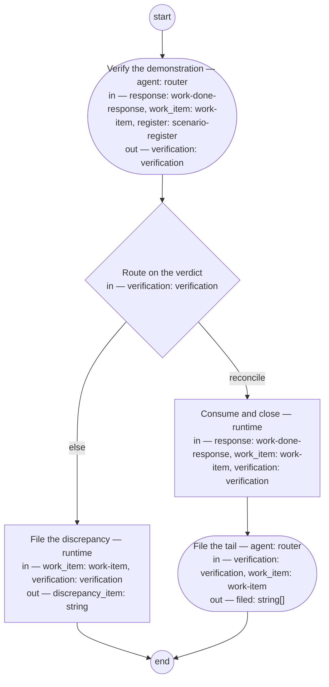

# Process: Reconcile and close

**Purpose:** Convert a BC's completed dispatch into reconciled shop state:
the response consumed, the work item closed with a traceable reason, the
scenario contract confirmed, and follow-ups filed.

**Outcomes:**
- O1. The BC's `work_done` response is consumed (no longer pending) —
  witnessed by the atomic `consume-close` step.
- O2. The originating work item is closed with a reason that cites the
  demonstration evidence — witnessed by the same step's `run` template,
  which takes the reason from `verification.evidence`.
- O3. The scenario register and pinned hashes are confirmed consistent
  with what was dispatched — witnessed by the check on `verify`.
- O4. Every defect or follow-up the response reports exists as a filed
  work item — witnessed by the check on `file-tail`.

**Roles:** router (Accountable — executes); lead-architect (Consulted —
receives escalated register discrepancies).

**Carried by:** the existing `reconcile-and-close` skill + executable
wrapper (already an atomic consume+close — this definition is what that
carrier is conformance-checked against).

## Flow (compiled)

Generated from the steps below by `tools/compile_process.py`; do not
edit by hand.




## Data

Each entry names a process-local value. Simple types use JSON Schema
names inline; every structured shape is a `$ref` to a defined type,
never defined here. `verification` is a data type in
[`../types/`](../types/); `work-done-response` resolves to the shop-msg
catalog schema, and `work-item` and `scenario-register` to their owning
systems' schemas. Conditions are CEL expressions over these names.

```yaml
data:
  response: {$ref: work-done-response}
  work_item: {$ref: work-item}
  register: {$ref: scenario-register}
  verification: {$ref: verification}
  discrepancy_item: {type: string}
  filed: {type: array, items: {type: string}}
```

## Steps

```yaml
start: verify
steps:
  - id: verify
    name: Verify the demonstration
    run-by: {role: router, execution: agent}
    inputs: [response, work_item, register]
    outputs: [verification]
    checks:
      - size(verification.scenario_status) == size(work_item.scenarios)
    prompt: |
      Read the response. Check the demonstration against every dispatched
      scenario and record a status for each: done, blocked, or explicitly
      deferred. Silence on a scenario is a discrepancy, not a pass.
      Compare the pinned hashes in the response to the register. Verdict
      "reconcile" only if every scenario has a status and the hashes
      match; otherwise verdict "discrepancy", with the evidence stating
      exactly what differs.
    next: route
    annotations:
      fabro: {model: mid-tier}

  - id: route
    name: Route on the verdict
    run-by: {execution: runtime}
    inputs: [verification]
    branches:
      - label: "reconcile"
        when: verification.verdict == "reconcile"
        next: consume-close
      - else: escalate

  - id: consume-close
    name: Consume and close
    run-by: {execution: runtime}
    atomic: true
    inputs: [response, work_item, verification]
    run: |
      shop-msg consume outbox --bc ${response.bc} --work-id ${response.work_id}
      bd close ${work_item.id} --reason "${verification.evidence}"
    next: file-tail

  - id: escalate
    name: File the discrepancy
    run-by: {execution: runtime}
    inputs: [work_item, verification]
    outputs: [discrepancy_item]
    run: |
      bd create --type task --assign lead-architect \
        --title "Register discrepancy on ${work_item.id}" \
        --body "${verification.evidence}" --link ${work_item.id}
    next: end

  - id: file-tail
    name: File the tail
    run-by: {role: router, execution: agent}
    inputs: [verification, work_item]
    outputs: [filed]
    checks:
      - size(filed) == size(verification.reported_items)
    prompt: |
      File a follow-up work item for every entry in the reported items —
      each defect, observation, and deferred scenario — and link each new
      item to the closed work item.
    next: end
```

The `atomic: true` flag on `consume-close` binds its `run` lines into one
all-or-nothing act: a consumed-but-open or closed-but-pending split state
is the known failure this process exists to prevent, so a runtime that
cannot guarantee the pair rolls back the half it completed.

## Derived checks

| Outcome | Check | Kind | Where |
|---|---|---|---|
| O1+O2 | no consumed-but-open or closed-but-pending state after run | mechanical | `consume-close.atomic` |
| O2 | close reason cites demonstration evidence | mechanical presence + judged | `consume-close.run` |
| O3 | every dispatched scenario has a recorded status | mechanical | `verify.checks` |
| O4 | reported-vs-filed count match | mechanical | `file-tail.checks` |
