# Process: Request intake

**Purpose:** Take an ask — one expression of intent brought to the lead
shop by an originator — from the words it arose in to a request
recorded in the repository and routed by the lead-pm role: the
originator confirms that the words make an ask before anything is
recorded, the request records the words verbatim with the date, the
lead-pm decides the route — a discovery conversation, the small-change
lane, or a decline settled with the product authority — and says it
with its reason before it is acted on, and the run returns the request
carrying its route and, once the destination exists, where the route
led.

**Guiding statement:** The request is the record and the route is said
before it is acted on: nothing the originator did not confirm is
recorded, nothing the originator has not answered is acted on, and
what was asked is read from the request — never restated to the
originator and never from a transcript.

**Outcomes:** each names the feature scenarios of
[feat-request-routing](../../features/feat-request-routing.md) it
witnesses, by number in that feature's Scenarios section, and the
codes U, A, and C index that feature's usability acceptance criteria,
accessibility criteria, and architect's constraints in its
Contributors section.
- O1. Every ask is recorded as a request in the repository before any
  route is decided or acted on — the originator's words verbatim, the
  date, the originator, where the ask arose — and the originator hears
  the request's id in the same turn as the record, alongside the words
  and never in place of them — witnessed by `record`'s check and
  prompt (scenarios 1, 2, and 4; U1, U5, C2).
- O2. Words that make no ask leave no request: `record` is reachable
  only from the originator's own `yes` at `confirm`, after the lead-pm
  has said its reading; a `no`, and words the lead-pm reads as no ask,
  reach the no-request exit with nothing written — witnessed by
  `route-reading`'s and `route-confirm`'s branches (scenario 3; U3,
  A2).
- O3. Every recorded request has one route decided by the lead-pm
  role, written on the request with its reason as said, and no route
  is acted on before the originator has heard it and answered:
  `dispatch` is reachable only through `land`, from the originator's
  `accept` at `observe` or from the objection cap — witnessed by
  `decide-route`'s check and prompt and by `route-answer`'s branches
  (scenarios 6 and 7; U4, U6, C5).
- O4. An objection is answered before action: the objection returns
  to `decide-route` as its input, the route standing after it is the
  one recorded with a reason that answers it, and the loop closes at
  `round_cap` with the lead-pm's route standing and the objection
  recorded as the originator's answer — witnessed by `route-answer`'s
  objection and cap branches, `advance-round`, and `land`'s prompt
  (scenario 7; U4).
- O5. A route said but not answered is recorded as said and not acted
  on: `decide-route` writes the route with "not yet answered" as the
  originator's answer, and the run waits at `observe` with nothing
  dispatched, `hold-after` the cap of that wait — witnessed by
  `route-answer`'s held row, which returns to `observe`, and by
  `hold-after` (scenario 8; U4, A2).
- O6. A route is acted on only as its destination: the discovery
  conversation opens on the request as its input; the small-change
  lane takes the request, anchored to the work item `land` opens for
  it; a decline is recorded only with the product authority's ruling,
  returned as an ask from `decide-route`, and its record survives —
  the request stays readable, `declined`, with the ruling and the
  reason in the originator's natural language — witnessed by
  `dispatch`'s branches, `open-discovery`'s and `open-lane`'s inputs,
  `land`'s check, `decide-route`'s `asks`, and `decline`'s prompt
  (scenarios 9 and 15; U6, C4, C5).
- O7. Where the route led is on the request once the destination
  exists: on the discovery route the conversation's `frame` step
  writes it — the request typedef's writer rule — and `land-outcome`
  writes nothing twice; on the small-change route `land-result`
  writes `routed-to` from `change`, the Result section the lane
  returned, and is reachable only from `route-after-lane`'s success
  row — witnessed by `land-result`'s check (`change != ""`),
  `route-after-lane`'s branches, and `land-outcome`'s prompt
  (scenario 10; C3, C10).
- O8. A request already recorded — by a role that met the ask during
  a run of another process, left awaiting the authority's ruling when
  the decline ask defaulted, returned to awaiting by the lane or a
  discovery that framed nothing, or sent back by the lane with its
  route changed to discovery — is routed from the record alone: the
  run enters at `decide-route` with the request, and loads nothing of
  the conversation or run that produced it — witnessed by `enter`'s
  branch, `route-after-lane`'s not-simple and cap rows, and
  `decide-route`'s inputs (scenarios 4, 5, and 14; C5, C9).

**Roles:**
- lead-pm — [`../roles/lead-pm.md`](../roles/lead-pm.md): records and
  routes. Its agent steps say the reading (`recognize`), write the
  request (`record`), decide and say the route (`decide-route`), land
  the originator's answer and anchor the lane's run (`land`), settle
  the decline record (`decline`), and land what a destination returned
  (`land-outcome`, `land-result`); the route is this role's decision —
  "an extension of the human authority"
  ([adr-2026-09-04-request-front-end](../../decisions/adr-2026-09-04-request-front-end.md))
  — and the originator's objection changes it only through the role's
  own re-decision.
- originator — the [glossary](../glossary.md)'s term, a role a person
  holds for the run: whoever brought the ask. Today the product
  authority fills it in person; any human bringing the lead shop an
  ask fills it in that ask's run. Its human steps are `confirm`
  (whether the words make an ask) and `observe` (accept, object, or
  not now); it decides nothing about the route and is never asked to
  restate an ask the request holds.
- product-authority — rules on a decline, answering the ask
  `decide-route` returns; the answering activity is the authority's,
  defined where the authority answers, not here.
- Recording is any lead-shop role's act (C5): a role that meets an ask
  — brought to it, arising in open conversation, or arising during a
  run of another process — invokes this process with the words, where
  they arose, and the originator, and its own run continues without
  acting on the ask (U5); `record` is the one form of the record
  whichever role invoked the run.
- The definition of good sits outside the role that records and
  routes: the [request typedef](../artifacts/request.md) states the
  record's form and the feature names the behaviors, so the lead-pm
  neither defines nor checks its own work here.

**Carried by:** `.claude/skills/request-intake/SKILL.md` — generated
from this definition by
[`../tools/compile_process.py`](../tools/compile_process.py), never
edited by hand, and placed at the skills load point by the
[skill-rendering](skill-rendering.md) process once this definition
stands approved; skill-rendering's check is the check of that
correspondence, as it is for every approved process (C9).

## Flow (compiled)

Generated from the steps below by `tools/compile_process.py`; do not
edit by hand.

```mermaid
flowchart TD
  enter{"Enter on the words or on a recorded request<br/>in — request: string"}
  recognize(["Read the words and say the reading — agent: lead-pm<br/>in — statement: string, originator: string, arose_in: string<br/>out — reading: string, words: string"])
  route_reading{"Route on the reading<br/>in — reading: string"}
  confirm[["Originator confirms the reading — human: originator<br/>in — reading: string, words: string<br/>out — confirmation: string"]]
  route_confirm{"Route on the confirmation<br/>in — confirmation: string"}
  record(["Record the request — agent: lead-pm<br/>in — words: string, originator: string, arose_in: string<br/>out — request: string"])
  decide_route(["Decide and say the route — agent: lead-pm<br/>in — request: string, objection: string, reason: string, ask: ask<br/>out — route: string, reason: string, form: string, topic: string"])
  route_decided{"Route on whether a route was decided<br/>in — route: string"}
  observe[["Originator answers the route — human: originator<br/>in — request: string<br/>out — answer: string, objection: string"]]
  route_answer{"Route on the originator's answer<br/>in — answer: string, round: integer, round_cap: integer"}
  advance_round["Advance the round — runtime<br/>in — round: integer<br/>sets — round: integer"]
  land(["Land the answer and anchor the route — agent: lead-pm<br/>in — request: string, answer: string, objection: string, route: string, reason: string<br/>out — request: string, work_item: string"])
  dispatch{"Dispatch to the route's destination<br/>in — route: string"}
  open_discovery{{"Open the discovery conversation on the request — sub-process: discovery-conversation-process<br/>in — topic: string, form: string, request: string<br/>out — initiative: string"}}
  land_outcome(["Land what the discovery returned — agent: lead-pm<br/>in — request: string, initiative: string<br/>out — request: string"])
  open_lane{{"Hand the request to the small-change lane — sub-process: small-change-process<br/>in — request: string<br/>out — change: string"}}
  read_route["Read the route the lane left — runtime<br/>in — request: string<br/>out — route: string"]
  read_reason["Read the reason the lane left — runtime<br/>in — request: string<br/>out — reason: string"]
  route_after_lane{"Route on what the lane left<br/>in — route: string, round: integer, round_cap: integer"}
  clear_objection["Clear the objection for a re-decision — runtime<br/>in — objection: string<br/>sets — objection: string"]
  land_result(["Record where the route led — agent: lead-pm<br/>in — request: string, change: string<br/>out — request: string"])
  decline(["Settle the declined record — agent: lead-pm<br/>in — request: string, reason: string<br/>out — request: string"])
  __end(("end<br/>result — request: string"))
  __start(("start")) --> enter
  enter -->|a recorded request awaits its route — route it| decide_route
  enter -->|else| recognize
  recognize --> route_reading
  route_reading -->|no-request exit: the words make no ask — nothing recorded| __end
  route_reading -->|else| confirm
  confirm --> route_confirm
  route_confirm -->|success exit: the originator confirms — record the request| record
  route_confirm -->|no-request exit: the originator's no leaves no request| __end
  route_confirm -->|else| __end
  record --> decide_route
  decide_route --> route_decided
  route_decided -->|held exit: the decline awaits the authority's ruling — the request stays recorded, its route awaiting| __end
  route_decided -->|else| observe
  observe --> route_answer
  route_answer -->|success exit: accepted — land the answer and act on the route| land
  route_answer -->|failsafe exit: round >= round_cap — the route stands, the objection recorded| land
  route_answer -->|objected — decide again with the objection| advance_round
  route_answer -->|held exit — hold-after caps the wait| observe
  route_answer -->|else| observe
  advance_round --> decide_route
  land --> dispatch
  dispatch -->|discovery — open the conversation on the request| open_discovery
  dispatch -->|small-change — the lane takes the request| open_lane
  dispatch -->|else| decline
  open_discovery --> land_outcome
  land_outcome --> __end
  open_lane --> read_route
  read_route --> read_reason
  read_reason --> route_after_lane
  route_after_lane -->|success exit: done — record where the route led| land_result
  route_after_lane -->|failsafe exit: round >= round_cap — the lane's route stands| land
  route_after_lane -->|not simple — decide again from the request| clear_objection
  route_after_lane -->|failed exit — returned to awaiting| __end
  route_after_lane -->|else| __end
  clear_objection --> advance_round
  land_result --> __end
  decline --> __end
```




## Data

Each entry names a process-local value. Simple types use JSON Schema
names inline; every structured shape is a `$ref` to a defined type
with an explicit source. Paths are relative to the lead shop's
repository root, the run's working directory. The declared list of
each step is its context load list (least-context): `statement`,
`originator`, and `arose_in` come from the conversation or the process
run in which the words arose, supplied at instantiation — the words
alone, never the transcript; `request` is the path of an instance of
the [request typedef](../artifacts/request.md)'s received-ask path,
standing in `requests/` from the moment `record` writes it, and is the
only thing `decide-route` reads of what was asked; a run that leaves
the no-request exit returns `request` empty. `ask` is the
[ask type](../types/ask.md): `decide-route` returns one to
product-authority to decline, with a default and a checkpoint — the
ask type's word for the partial output sufficient to resume from —
and resumes, in a fresh context, with the ask in its inputs; the
resumed step writes the ask's `answer` — the authority's ruling — to
the request's section 3, so the ruling has its home on the record and
a later run entered with the request reads it there. The work
register is `bd`, the beads tracker, whose items anchor runs
(introduced in
[adr-2026-09-04-request-front-end](../../decisions/adr-2026-09-04-request-front-end.md));
lead-4kymc is the register item tracking the lead shop's operational
contract, which has no artifact yet: the note `record` writes on each
request is temporary until that item closes. `work_item` is the id of
the register item `land` opens on the small-change route — the item the small-change process anchors its
run to, titled with the request's id so the item points at the
request and never the reverse (C4). The discovery conversation opens
its own item, and a decline needs none, the request being the record.
The lane closes the item it runs on at each of its three exits
(`close-done`, `close-not-simple`, `close-failed`); this process closes
none. The list of requests awaiting a route, which the feature's
scenario 5 names, is `requests/` read for `route: awaiting`; it is
what a run entered with `request` is started from, not a step of this
process. A *simple change* is the [glossary](../glossary.md)'s term,
judged by `decide-route`. `route` takes the four values the request
typedef's `route` field takes: `awaiting` leaves `decide-route` only
when the decline ask resolved defaulted, and `route-decided` ends the
run there with the request still `recorded`; after the lane returns,
`read-route` and `read-reason` read the route and its reason the lane
left on the request, and `clear-objection` empties `objection` and
advances `round` so a re-decision after the lane starts from the
request's sections 3 and 4 alone: `round` counts every re-decision —
an objection's or the lane's not-simple return — and `round_cap`
bounds both together, so a request cannot cycle between routing and
the lane unbounded; at the cap the lane's route, discovery with the
lane's reason, stands and `land` acts on it. The wait at `observe` for an originator who has not answered
is a cycle whose cap is `hold-after`: the runtime holds the run after
the window, and a held run is resumed at `observe` or cancelled with a
reason. `form` and `topic` are the discovery conversation's
parameters, named by `decide-route` on the discovery route;
`open-discovery` maps `request`, `form`, and `topic` to that
process's parameters of the same names and receives its result as
`initiative` — empty when the conversation closed without convergence
or was cancelled. `open-lane` maps `request` to the small-change
process's parameter of the same name and receives its result as
`change` — the request's Result section by fragment,
`<request>#result`, which `land-result` writes into `routed-to`; the
lane writes everything else it leaves on the request itself. A `run`
step that exits nonzero is a failed step, not an empty result: the
run halts at that step and the failure is reported to the lead-pm
role. The run's result is `request`: the artifact the run exists to
produce, carrying its route and where it led.

```yaml
data:
  statement: {type: string, initial: ""}
  arose_in: {type: string, initial: "open conversation"}
  originator: {type: string, initial: ""}
  request: {type: string, format: uri-reference, initial: ""}
  reading: {type: string, enum: [ask, unclear, none]}
  words: {type: string, initial: ""}
  confirmation: {type: string, enum: ["yes", "no"]}
  route: {type: string, enum: [awaiting, discovery, small-change, declined], initial: awaiting}
  reason: {type: string, initial: ""}
  form: {type: string, enum: [brainstorm, interview, review-of-evidence], initial: interview}
  topic: {type: string, initial: ""}
  answer: {type: string, enum: [accept, object, not-answered]}
  objection: {type: string, initial: ""}
  round: {type: integer, initial: 1}
  round_cap: {type: integer, initial: 3}
  ask: {$ref: ask, from: ../types/ask.md, initial: null}
  work_item: {type: string, initial: ""}
  initiative: {type: string, format: uri-reference, initial: ""}
  change: {type: string, format: uri-reference, initial: ""}
```

## Steps

```yaml
start: enter
parameters: [statement, arose_in, originator, request]
result: request
steps:
  - id: enter
    name: Enter on the words or on a recorded request
    run-by: {execution: runtime}
    inputs: [request]
    branches:
      - label: "a recorded request awaits its route — route it"
        when: request != ""
        next: decide-route
      - else: recognize

  - id: recognize
    name: Read the words and say the reading
    run-by: {role: lead-pm, execution: agent}
    inputs: [statement, originator, arose_in]
    outputs: [reading, words]
    checks:
      - reading == "none" || words != ""
    prompt: |
      Read statement — the words as they arose, from originator, in
      arose_in. Decide whether they make an ask: an expression of
      intent the lead shop could act on. Say your reading to the
      originator before anything is recorded, in text. "ask": quote
      the words you read as the ask, verbatim, into words, and say
      that a request will record them once the originator confirms.
      "unclear": say you cannot tell and put the question in one
      turn, with the words you would record in words. "none": say the
      words make no ask and nothing will be recorded. Do not record;
      silence is not a yes. When asked what this process can do, say
      that an ask is recorded on arrival as a request and takes one of
      three routes: discovery — the ask is large enough to frame an
      initiative and bet on, so a discovery conversation opens on the
      request; small-change — a simple change, one the lead shop makes
      within its own definitions or one instance of them, demonstrable
      in one session, spending no appetite worth a bet; declined — the
      lead shop will not act, on the product authority's ruling, and
      the record survives.
    next: route-reading

  - id: route-reading
    name: Route on the reading
    run-by: {execution: runtime}
    inputs: [reading]
    branches:
      - label: "no-request exit: the words make no ask — nothing recorded"
        when: reading == "none"
        next: end
      - else: confirm

  - id: confirm
    name: Originator confirms the reading
    run-by: {role: originator, execution: human}
    inputs: [reading, words]
    outputs: [confirmation]
    prompt: |
      The lead-pm's reading is in front of you with the words it would
      record. If the reading is "ask": yes records those words as a
      request; no leaves no request. If the reading is "unclear": say
      whether you are making an ask — yes records the words, no leaves
      no request. Nothing is recorded until you answer; silence holds
      the run after the declared window and records nothing.
    next: route-confirm

  - id: route-confirm
    name: Route on the confirmation
    run-by: {execution: runtime}
    inputs: [confirmation]
    branches:
      - label: "success exit: the originator confirms — record the request"
        when: confirmation == "yes"
        next: record
      - label: "no-request exit: the originator's no leaves no request"
        when: confirmation == "no"
        next: end
      - else: end

  - id: record
    name: Record the request
    run-by: {role: lead-pm, execution: agent}
    inputs: [words, originator, arose_in]
    outputs: [request]
    checks:
      - request != ""
    prompt: |
      Write the request as a file in requests/, id
      req-YYYY-MM-DD-<slug> — today's date, then a short slug of what
      was asked — with this frontmatter: type request; id; status
      recorded; version 1; date today; reader lead-pm; owner lead-pm;
      created and updated today; originator from originator, by role
      or by name; received-through operational-contract, with the
      note that the lead shop's operational contract has no artifact
      yet (lead-4kymc); arose-in from arose_in when it names a process
      run or a conversation, omitted when the ask arrived directly;
      route awaiting; route-reason empty; routed-to empty; no
      work-item. Sections: 1 What is requested — the words verbatim,
      quoted and dated, never a paraphrase; 2 From whom — the lead-pm
      role as reader and the originator; 3 Route and 4 Result empty.
      Write nothing of what was asked anywhere else. Confirm to the
      originator in one turn, in text: the words as recorded, with the
      request's id alongside them and never in place of them, and that
      the route follows. When arose_in names a process run, say in the
      same turn that that run continues without acting on the ask.
      Return the request's path.
    next: decide-route

  - id: decide-route
    name: Decide and say the route
    run-by: {role: lead-pm, execution: agent}
    inputs: [request, objection, reason, ask]
    outputs: [route, reason, form, topic]
    asks: [product-authority]
    checks:
      - reason != ""
      - route != "discovery" || topic != ""
    prompt: |
      Read the request only — what was asked is its section 1, never
      restated to the originator and never read from a transcript;
      what the lane, a conversation, or an earlier run left on it is
      in its sections 3 and 4. When objection is empty and reason is
      non-empty, reason is the lane's reason for changing the route;
      when objection is non-empty, reason is your own last reason,
      which the objection answers. Decide the route.
      small-change: the change is simple — it stays within the lead
      shop's own definitions or one instance of them, touches no
      Bounded Context, its effect is demonstrable in the running
      system in one session, and it spends no appetite worth a bet.
      discovery: the ask is larger than that, or its shape needs the
      authority's exploration; name in form the form the conversation
      takes and in topic its one-line topic, from the request's words,
      with the request's id — afresh on every decision. declined: only
      with the product authority's ruling. On a run entered with the
      request, the ruling is read from the request's section 3, where
      the resumed ask wrote it; when none stands there, and on the
      first pass, ask is absent: to decline, return an ask to
      product-authority, kind reserved-decision, the question carrying
      the request's id, its words, and your reason to decline, default
      "hold as recorded — the request stays recorded, its route
      awaiting, for the authority's ruling", checkpoint the route and
      reason drafted; returning it again on a later run is intended.
      If ask carries an answer, write it to the request's section 3
      as the authority's ruling, the route is as the authority ruled,
      and reason is the ruling's reason. If ask resolved defaulted,
      write on the request that the decline awaits the authority's
      ruling, leave status recorded and route awaiting, output route
      awaiting with that as reason, and say so to the originator. When
      objection is non-empty this is a re-decision: answer it — the
      route standing after it is yours to decide, and reason answers
      the objection; a decline already ruled stands, its reason the
      ruling's. Write the route and its reason on the request as said
      — section 3 with the originator's answer "not yet answered",
      frontmatter route and route-reason, status routed, a history
      row — and say the route and its reason to the originator in
      natural language before any action is taken: which of the three
      routes, what it means, why; for a decline, that the ask was
      declined, that the authority ruled, the reason, and what the
      originator can do next — never a code, a work-item id, or a
      route name alone. Return route, reason, form, and topic.
    next: route-decided

  - id: route-decided
    name: Route on whether a route was decided
    run-by: {execution: runtime}
    inputs: [route]
    branches:
      - label: "held exit: the decline awaits the authority's ruling — the request stays recorded, its route awaiting"
        when: route == "awaiting"
        next: end
      - else: observe

  - id: observe
    name: Originator answers the route
    run-by: {role: originator, execution: human}
    inputs: [request]
    outputs: [answer, objection]
    prompt: |
      The request is in front of you with its route and the reason, as
      the lead-pm said them. Accept: the route is acted on. Object: say
      why in objection; the lead-pm decides again and answers you
      before anything is acted on, and the route standing after that
      is the one recorded. Not answered: the route stands as said and
      nothing is acted on until you answer. Silence holds the run after
      the declared window; the request carries the route as said and
      nothing is acted on.
    next: route-answer

  - id: route-answer
    name: Route on the originator's answer
    run-by: {execution: runtime}
    inputs: [answer, round, round_cap]
    branches:
      - label: "success exit: accepted — land the answer and act on the route"
        when: answer == "accept"
        next: land
      - label: "failsafe exit: round >= round_cap — the route stands, the objection recorded"
        when: answer == "object" && round >= round_cap
        next: land
      - label: "objected — decide again with the objection"
        when: answer == "object"
        next: advance-round
      - label: "held exit — hold-after caps the wait"
        when: answer == "not-answered"
        next: observe
      - else: observe

  - id: advance-round
    name: Advance the round
    run-by: {execution: runtime}
    inputs: [round]
    set:
      round: round + 1
    next: decide-route

  - id: land
    name: Land the answer and anchor the route
    run-by: {role: lead-pm, execution: agent}
    inputs: [request, answer, objection, route, reason]
    outputs: [request, work_item]
    checks:
      - route != "small-change" || work_item != ""
    prompt: |
      Write the originator's answer in the request's section 3: when
      answer is accept, "accepted"; when it is object — the objection
      loop reached its cap — "objected", with objection as the answer
      given and the route standing as said with reason, and say to the
      originator in natural language that the route stands, why, and
      what they can do next — bring the question to the product
      authority. A history row. When route is small-change, open the
      register work item the lane runs on — run `bd create --title
      "Request <id>: <slug>"` with the request's id and slug — and
      write the item's id in the request's work-item field, replacing
      the id of an item an earlier run closed; the item points at the
      request and carries nothing of what was asked. Return the
      request and, on the small-change route, the item's id; otherwise
      an empty work_item.
    next: dispatch

  - id: dispatch
    name: Dispatch to the route's destination
    run-by: {execution: runtime}
    inputs: [route]
    branches:
      - label: "discovery — open the conversation on the request"
        when: route == "discovery"
        next: open-discovery
      - label: "small-change — the lane takes the request"
        when: route == "small-change"
        next: open-lane
      - else: decline

  - id: open-discovery
    name: Open the discovery conversation on the request
    run-by: {execution: sub-process, process: discovery-conversation-process, from: discovery-conversation.md}
    inputs: [topic, form, request]
    outputs: [initiative]
    next: land-outcome

  - id: land-outcome
    name: Land what the discovery returned
    run-by: {role: lead-pm, execution: agent}
    inputs: [request, initiative]
    outputs: [request]
    prompt: |
      The discovery conversation returned. When initiative is set, its
      frame step wrote on the request where the route led — routed-to
      linking the initiative, section 4 naming it, status done:
      confirm they stand and write nothing twice. When initiative is
      empty — the conversation closed without convergence or was
      cancelled — write on the request that the conversation framed
      nothing, set route awaiting with that as route-reason and status
      recorded, so the request is again visible as awaiting its route,
      with a history row. Return the request.
    next: end

  - id: open-lane
    name: Hand the request to the small-change lane
    run-by: {execution: sub-process, process: small-change-process, from: small-change.md}
    inputs: [request]
    outputs: [change]
    next: read-route

  - id: read-route
    name: Read the route the lane left
    run-by: {execution: runtime}
    inputs: [request]
    outputs: [route]
    run: |
      sed -n 's/^route: //p' ${request} | head -1 | grep .
    next: read-reason

  - id: read-reason
    name: Read the reason the lane left
    run-by: {execution: runtime}
    inputs: [request]
    outputs: [reason]
    run: |
      sed -n 's/^route-reason: //p' ${request} | head -1
    next: route-after-lane

  - id: route-after-lane
    name: Route on what the lane left
    run-by: {execution: runtime}
    inputs: [route, round, round_cap]
    branches:
      - label: "success exit: done — record where the route led"
        when: route == "small-change"
        next: land-result
      - label: "failsafe exit: round >= round_cap — the lane's route stands"
        when: route == "discovery" && round >= round_cap
        next: land
      - label: "not simple — decide again from the request"
        when: route == "discovery"
        next: clear-objection
      - label: "failed exit — returned to awaiting"
        when: route == "awaiting"
        next: end
      - else: end

  - id: clear-objection
    name: Clear the objection for a re-decision
    run-by: {execution: runtime}
    inputs: [objection]
    set:
      objection: '""'
    next: advance-round

  - id: land-result
    name: Record where the route led
    run-by: {role: lead-pm, execution: agent}
    inputs: [request, change]
    outputs: [request]
    checks:
      - change != ""
    prompt: |
      The lane returned change — the request's Result section by
      fragment, where the definition, the check, and the verified
      result stand — and left the request done. Write change into the
      request's routed-to, with a history row; write nothing the lane
      wrote twice. Return the request.
    next: end

  - id: decline
    name: Settle the declined record
    run-by: {role: lead-pm, execution: agent}
    inputs: [request, reason]
    outputs: [request]
    prompt: |
      The route on the request is declined with the authority's ruling
      and reason, said and answered. Write status declined and section
      4: that the ask was declined, that the product authority ruled,
      the reason in the originator's natural language, and what the
      originator can do next; routed-to the request's own section 4,
      which carries the ruling; a history row. Remove nothing — the
      request remains readable as the record of the decline. Return
      the request.
    next: end
```

## Derived checks

| Outcome | Check | Kind | Where |
|---|---|---|---|
| O1 | `request != ""` on record; the prompt writes the words verbatim, status recorded, route awaiting, and says the id alongside the words in one turn | mechanical + judged | `record.checks`, `record.prompt` |
| O2 | `record` reachable only via `confirmation == "yes"`; `reading == "none"` and `confirmation == "no"` reach `end` with no record step run | mechanical | `route-reading.branches`, `route-confirm.branches` |
| O3 | `reason != ""` on decide; `land` reachable only from `answer == "accept"` or the cap row, and `dispatch` only from `land`; the route is said in the prompt before `observe` | mechanical + judged | `decide-route.checks`, `route-answer.branches`, `land.next`, `decide-route.prompt` |
| O4 | the objection row returns through `advance-round` to `decide-route` with `objection` in its inputs; `round >= round_cap` routes to `land`, whose prompt records the objection | mechanical + judged | `route-answer.branches`, `advance-round`, `land.prompt` |
| O5 | `answer == "not-answered"` returns to `observe`, never to `land`; `decide-route` writes "not yet answered" as the answer; inactivity holds the run | mechanical + judged | `route-answer.branches`, `decide-route.prompt`, `hold-after` |
| O6 | `open-discovery` and `open-lane` list `request` as input; `work_item != ""` on the small-change route; `decide-route` carries `asks: [product-authority]`, the process `ask-cap`, `ask` in its inputs; `decline` removes nothing | mechanical + judged | `open-discovery`, `open-lane`, `land.checks`, `decide-route`, frontmatter, `decline.prompt` |
| O7 | `land-result` reachable only from `route == "small-change"` after the lane and requires `change != ""` before writing `routed-to`; `land-outcome` writes nothing `frame` wrote | mechanical + judged | `route-after-lane.branches`, `land-result.checks`, `land-outcome.prompt` |
| O8 | `request != ""` enters at `decide-route`; the not-simple row reaches `decide-route` through `clear-objection` and `advance-round`, and `round >= round_cap` routes to `land` instead; `decide-route` lists the request and nothing of the originating conversation | mechanical | `enter.branches`, `route-after-lane.branches`, `clear-objection.set`, `advance-round.set`, `decide-route.inputs` |

## Document History

| Version | Date | Kind | Entry |
|---|---|---|---|
| 1 | 2026-09-04 | update | Authored under init-request-routing / feat-request-routing (assigned, v7) per adr-2026-09-04-request-front-end, on the authority's standing direction of 2026-09-04, as a sibling of the conversation processes: human steps with a classification, runtime routes with labeled exits, the decline as a held-and-resumed ask to product-authority, `bd` opened for the work in motion. Adaptations of the sibling form, disclosed: the originator's confirmation of the reading is a human step (`confirm`), so the record is reachable only from the originator's own yes (U3); the process admits a `request` parameter and enters at `decide-route` for a request already recorded — by a role that met the ask during another run, left awaiting when the decline ask defaulted, or returned to awaiting by the lane or a discovery that framed nothing — so every recorded request has a run that routes it (scenarios 4, 5); "not answered" holds the run at `observe` rather than ending it, so the originator's later answer has a step to reach; the objection loop caps at three rounds with the route standing and the objection recorded (`land`); the register item is opened by `land` only on the small-change route — the item the small-change process anchors to and closes — since the discovery conversation opens its own and a decline needs none (C4), and this process closes no item. Fitted to the definitions that landed alongside: the request typedef v3 (the received-ask path; `routed-to` and `done` written by the destination's step, so `land-outcome` writes nothing twice), discovery-conversation v11 (`request` parameter, `frame` writes where the route led), and small-change v1 (parameter `request`, result `request`; its three exits read back by `read-route`, a not-simple reroute put before the originator at `observe`). Draft, not screened: the lead-pm orchestrates the cold reviewer. |
| 2 | 2026-09-04 | review | Round 1 (judge: claude-fable-5-1 / screen prompt v6; criteria process-definition.fitness.md): three confident — `decline`'s routed-to pointed at a decision record that need not exist (now the request's own section 4); `recognize` named the three routes without their meaning and said "the door" (each route's one-line meaning inlined; "this process"); the U/A/C codes in Outcomes indexed nothing stated (the Outcomes head now says what they index, with the feature linked) — and eight wobbly, ruled by the lead-pm: the lane's not-simple return re-enters at `decide-route`, not `observe` (`read-reason` reads the lane's reason, `clear-objection` empties the objection, `decide-route` re-decides from the request's sections 3–4 and derives topic and form afresh); `record` and `land-outcome` no longer point at the typedef (the received-ask field set and the status and route values inlined); the not-answered row relabeled "held — the run waits at observe; hold-after is this cycle's cap", stated in Data; the decline ask on re-entry (the ruling read from section 3 where the resumed ask wrote it, the ask returned again when none stands — intended; Data states how the resumed ask's answer reaches the request, citing the ask type); O7 narrowed — against small-change v2's contract, "`routed-to` is intake's to write, on the lane's return", the lane's result `change` (`<request>#result`) is written into `routed-to` by a new `land-result` step reachable only from the success row, its check `change != ""` the witness, in place of reading `routed-to` back; the register and `bd` introduced once in Data with the ADR linked, "checkpoint" glossed with the ask type's word; the prose paragraph after the steps block deleted; Data states that a no-request run returns an empty `request`; Roles split one line per role. Aligned with small-change v2 (17 steps): the lane closes its item at `close-done`, `close-not-simple`, and `close-failed`; `open-lane` receives `change`. Repaired. |
| 3 | 2026-09-04 | review | Round 2 (judge: claude-fable-5-1 / screen prompt v6): one confident — `decide-route`'s reason sentence did not say which reason it named (qualified: with objection empty, the lane's; with objection non-empty, the role's own last reason, which the objection answers) — and seven wobbly, ruled by the lead-pm: the routing↔lane cycle had no cap (the mechanical option taken: `clear-objection` now advances `round` through `advance-round`, and `route-after-lane` routes `discovery && round >= round_cap` to `land`, so the lane's route stands at the cap; stated in Data and O8); O6 and O7 witness lists matched to the Derived checks table (`land`'s check; `land-outcome`'s prompt); the absent carrier deferred as ruled for the sibling; `round` and `round_cap` dropped from `decide-route`'s inputs; lead-4kymc introduced in Data as the register item tracking the operational contract, the note on each request temporary until it closes; `decide-route` gains the check `route != "discovery" \|\| topic != ""`; the two explanatory branch labels shortened to exit name and condition. Repaired. |
