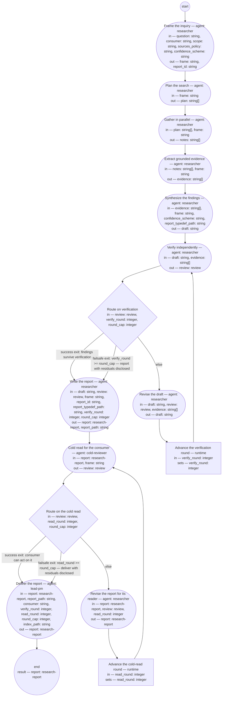

# Process: Research inquiry

**Purpose:** Answer a question with a research report: the researcher
frames and plans, gathers in parallel, extracts grounded evidence,
synthesizes findings with confidence and alternatives, verifies the
claims in a fresh context, and delivers a report the consumer can act
on — stored on the `research` branch and registered in the research
index.

**Guiding statement:** Every claim is grounded or marked. A reference
the run did not open is not a source; a number without a checkable
quote is not a finding; a persona is not evidence.

**Outcomes:**
- O1. The question, its consumer, its scope, and the confidence
  scheme are fixed before any source is read — witnessed by `frame`'s
  output and the check on `plan`.
- O2. Every finding carries a confidence level and an opened source,
  or a knowledge-only label — witnessed by `extract` (quotes before
  claims) and the `verify` step's independent pass.
- O3. Verification is factored from drafting: the verifier sees the
  claims and sources, never the draft's reasoning — witnessed by
  `verify`'s `fresh-context: true` and its declared inputs.
- O4. Neither loop runs unbounded — witnessed by the labeled failsafe
  branches of `route-verify` (`verify_round`) and `route-read`
  (`read_round`), each loop on its own counter.
- O5. The report is delivered only after a cold read confirms its
  consumer can act on it, and residuals from a capped loop are
  disclosed in its Limitations — witnessed by `cold-read`,
  `route-read`, and the `deliver` prompt.

**Roles:** researcher —
[`../roles/researcher.md`](../roles/researcher.md) (Accountable;
frames, gathers, synthesizes, reports; decides each finding's
confidence). verifier — the researcher role filled fresh
(`fresh-context: true`), reading claims and sources only. cold
reader — [`../roles/cold-reviewer.md`](../roles/cold-reviewer.md)
(Verifier; judges decidability for the consumer). deliverer —
[`../roles/lead-pm.md`](../roles/lead-pm.md)'s assisting agent (registers,
pushes, and delivers the report; the product authority, holding lead-pm,
decides what to do with it). consumer — the
role that asked (parameter `consumer`); receives the report.

**Carried by:**
[`../../.claude/skills/research-inquiry/SKILL.md`](../../.claude/skills/research-inquiry/SKILL.md)
— generated from this definition by
[`../tools/compile_process.py`](../tools/compile_process.py), never
edited by hand.

## Flow (compiled)

Generated from the steps below by `tools/compile_process.py`; do not
edit by hand.




## Data

Each entry names a process-local value. Simple types use JSON Schema
names inline; every structured shape is a `$ref` to a defined type
with an explicit source. `sources_policy` is the admissible-evidence
rule for this run (which source kinds count, which are excluded);
`confidence_scheme` names the defined labels and their meanings.
Together with `question`, `consumer`, and `scope` they are `frame`'s
declared context load list per `least-context`.

```yaml
data:
  question: {type: string}
  consumer: {type: string}
  scope: {type: string}
  sources_policy: {type: string, initial: "sources opened this run, identifiable by URL, DOI, or repository path; abstracts labeled as abstracts; the frozen main tree via git show; model knowledge only when labeled knowledge-only"}
  confidence_scheme: {type: string, initial: "high — multiple opened sources agree, primary among them; medium — one opened source, or secondary sources only; low — knowledge-only or an unreadable primary"}
  frame: {type: string}
  plan: {type: array, items: {type: string}}
  notes: {type: array, items: {type: string}}
  evidence: {type: array, items: {type: string}}
  draft: {type: string}
  report: {$ref: research-report, from: ../artifacts/research-report.md}
  review: {$ref: review, from: ../types/review.md}
  report_id: {type: string}
  report_path: {type: string}
  report_typedef_path: {type: string, initial: ../artifacts/research-report.md}
  index_path: {type: string, initial: research/index.md}
  verify_round: {type: integer, initial: 1}
  read_round: {type: integer, initial: 1}
  round_cap: {type: integer, initial: 3}
```

## Steps

```yaml
start: frame
parameters: [question, consumer, scope]
result: report
steps:
  - id: frame
    name: Frame the inquiry
    run-by: {role: researcher, execution: agent}
    inputs: [question, consumer, scope, sources_policy, confidence_scheme]
    outputs: [frame, report_id]
    prompt: |
      Assign the report id — a slug of the topic and the date — then
      write the frame before reading any source: the question
      verbatim, who consumes the answer and what decision it serves,
      the scope boundary, the sources policy as it applies here, and
      the confidence scheme with each label's meaning. State the
      assumptions the question carries. If the answer would rest
      mainly on knowledge the run cannot verify, say so here — that
      returns to the consumer as a scoping question.
    next: plan

  - id: plan
    name: Plan the search
    run-by: {role: researcher, execution: agent}
    inputs: [frame]
    outputs: [plan]
    checks:
      - size(plan) > 0
    prompt: |
      Decompose the framed question into sub-questions, and each
      sub-question into search tasks that can run independently: the
      query, the source kinds expected, and what a good result looks
      like. Cover more than one angle per sub-question so a single
      search path cannot decide the answer alone.
    next: gather

  - id: gather
    name: Gather in parallel
    run-by: {role: researcher, execution: agent}
    inputs: [plan, frame]
    outputs: [notes]
    prompt: |
      Run the plan's search tasks, in parallel where the runtime
      allows, each in a fresh worker context. A worker returns
      distilled notes, not raw pages: for each source, its identifier
      (URL, DOI, or repository path), whether it was opened in full or
      as an abstract, and the passages relevant to its task, quoted.
      A source that could not be opened is recorded as unopened, never
      summarized from memory.
    next: extract

  - id: extract
    name: Extract grounded evidence
    run-by: {role: researcher, execution: agent}
    inputs: [notes, frame]
    outputs: [evidence]
    prompt: |
      From the notes, extract the evidence: one entry per claim the
      sources support, carrying the quote or close paraphrase, the
      source identifier, and whether the source is primary or
      secondary. Quotes come before claims — no claim enters the
      evidence without the passage it rests on. Note where sources
      conflict.
    next: synthesize

  - id: synthesize
    name: Synthesize the findings
    run-by: {role: researcher, execution: agent}
    inputs: [evidence, frame, confidence_scheme, report_typedef_path]
    outputs: [draft]
    prompt: |
      Write the draft report in the form the typedef at
      report_typedef_path requires: executive
      summary answer-first; method; findings each with a confidence
      label from the scheme and its sources; alternatives considered
      and why the findings stand; limitations; sources with their
      opened status. Keep facts, assumptions, and judgments
      distinguishable. State confidence and likelihood in separate
      phrases, never one. Mark any claim resting on model knowledge
      as knowledge-only with lowered confidence.
    next: verify

  - id: verify
    name: Verify independently
    run-by: {role: researcher, execution: agent, fresh-context: true}
    inputs: [draft, evidence]
    outputs: [review]
    prompt: |
      You have not seen how this draft was reasoned — that is the
      point. For each finding, write the verification question it
      must survive, answer it from the evidence entries and by
      reopening the sources those entries identify, and check every
      reference exists
      and says what the finding claims. A finding whose source does
      not exist, does not say it, or was never opened is a finding:
      it must be retracted or marked UNVERIFIED. Verdict "clean" only
      if every finding survives; otherwise "findings", with the top
      changes.
    next: route-verify

  - id: route-verify
    name: Route on verification
    run-by: {execution: runtime}
    inputs: [review, verify_round, round_cap]
    branches:
      - label: "success exit: findings survive verification"
        when: review.verdict == "clean"
        next: report
      - label: "failsafe exit: verify_round >= round_cap — report with residuals disclosed"
        when: verify_round >= round_cap
        next: report
      - else: revise

  - id: revise
    name: Revise the draft
    run-by: {role: researcher, execution: agent}
    inputs: [draft, review, evidence]
    outputs: [draft]
    prompt: |
      Repair every finding in the review: retract claims whose sources
      failed, mark UNVERIFIED what could not be checked, lower
      confidence where the evidence thinned, and add the reviewer's
      unanswered verification questions to Limitations. Do not add
      new sources here — a new source is a new gather.
    next: advance-round

  - id: advance-round
    name: Advance the verification round
    run-by: {execution: runtime}
    inputs: [verify_round]
    set:
      verify_round: verify_round + 1
    next: verify

  - id: report
    name: Write the report
    run-by: {role: researcher, execution: agent}
    inputs: [draft, review, frame, report_id, report_typedef_path, verify_round, round_cap]
    outputs: [report, report_path]
    prompt: |
      Finalize the draft as the research report: frontmatter per the
      typedef at report_typedef_path, id set to report_id, Document
      History opened, and — when verify_round reached round_cap — the
      review's open findings stated in Limitations as residuals. Write
      it to the research branch at research/ followed by report_id
      and .md, and return that path.
    next: cold-read

  - id: cold-read
    name: Cold read for the consumer
    run-by: {role: cold-reviewer, execution: agent, fresh-context: true}
    inputs: [report, frame]
    outputs: [review]
    prompt: |
      Read the report alone, as its consumer named in the frame. Can
      you act on the executive summary without the body? Report
      stumbles in reading order with quotes, every term that arrives
      before the report explains it, and whether each finding's
      confidence label is reproducible from its stated sources.
      Verdict "clean" if the consumer can act on it; otherwise
      "findings" with the top three changes.
    next: route-read

  - id: route-read
    name: Route on the cold read
    run-by: {execution: runtime}
    inputs: [review, read_round, round_cap]
    branches:
      - label: "success exit: consumer can act on it"
        when: review.verdict == "clean"
        next: deliver
      - label: "failsafe exit: read_round >= round_cap — deliver with residuals disclosed"
        when: read_round >= round_cap
        next: deliver
      - else: revise-report

  - id: revise-report
    name: Revise the report for its reader
    run-by: {role: researcher, execution: agent}
    inputs: [report, review, read_round]
    outputs: [report]
    prompt: |
      Repair the cold read's findings in the report's presentation —
      wording, ordering, unintroduced terms, confidence labels the
      reader could not reproduce — without changing any finding's
      substance; a finding the reader could not reproduce is recorded
      as a residual in Limitations. Record read_round in the report's
      Document History.
    next: advance-round-read

  - id: advance-round-read
    name: Advance the cold-read round
    run-by: {execution: runtime}
    inputs: [read_round]
    set:
      read_round: read_round + 1
    next: cold-read

  - id: deliver
    name: Deliver the report
    run-by: {role: lead-pm, execution: agent}
    inputs: [report, report_path, consumer, verify_round, read_round, round_cap, index_path]
    outputs: [report]
    prompt: |
      Set the report's status to delivered, push the research branch,
      and add or update the report's row in the research index at
      index_path (id, question, date, status, location). Deliver the executive summary
      to the consumer with report_path; if verify_round or read_round
      reached round_cap, say so first and point at the Limitations
      section that discloses the residuals.
    next: end
```

## Derived checks

| Outcome | Check | Kind | Where |
|---|---|---|---|
| O1 | frame written before gather; plan non-empty | mechanical | step order; `plan.checks` |
| O2 | every finding carries confidence and an opened source or a knowledge-only label | judged | `verify` prompt; research-report checklist |
| O3 | verifier reads only draft and evidence, fresh | mechanical | `verify` inputs and `fresh-context` |
| O4 | both loops carry labeled caps on separate counters | mechanical | `route-verify`, `route-read` failsafe branches |
| O5 | delivery only after cold read; residuals disclosed | mechanical + judged | `route-read` branches; `deliver` prompt |

## Sources

The research report this process is derived from
(`research:research/research-prompting-2026-08.md`): the plan →
gather → extract → synthesize → verify → report shape from
deep-research agent practice and vendor context-engineering guidance;
factored verification from Chain-of-Verification; quotes-before-claims
and permitted abstention from vendor hallucination-reduction guidance;
the report's required content from ICD 203. Format provenance (ISO
24774 header, GitHub-Actions-shaped steps, CEL, the dual-exit rule)
lives in the process-definition typedef.

## Document History

| Version | Date | Kind | Entry |
|---|---|---|---|
| 1 | 2026-08-23 | update | Authored through the approved process-definition chain from the research report on research prompting; its compiled skill is the shop's research skill. |
| 1 | 2026-08-23 | review | Screened against the process-definition fitness set: findings — undeclared loads in report, deliver, and synthesize prompts; an unreachable "returns to revise"; one counter serving two loops. |
| 2 | 2026-08-23 | update | Repairs: separate verify_round and read_round; report_id, report_typedef_path, and pointer_paths declared as data and inputs; the unreachable sentence replaced with a residual-recording rule; deliver decides cap disclosure from declared counters. |
| 2 | 2026-08-23 | review | Re-screened: findings — the loop cap was a literal, undeclared where prompts referenced it; revise-report read an undeclared round. |
| 3 | 2026-08-23 | update | round_cap declared as data and used by both failsafe branches, report, and deliver; read_round declared as revise-report's input. |
| 3 | 2026-08-23 | review | Final screen: clean — all six scenarios pass; two stumbles (lead-pm not introduced in Roles; verify's reopened sources), polished in place without a version bump. |
| 4 | 2026-08-23 | update | Owner direction: deliver registers the report in the typed research index (index_path) instead of README pointer rows. |
| 5 | 2026-08-23 | update | Owner direction: the research index instance lives on `rebaseline` at `research/index.md`, not on `main`. |
| 5 | 2026-08-23 | state | draft → approved by the owner. The compiled skill is the shop's research skill. |
| 6 | 2026-08-25 | update | Owner direction: a near-synonym of "role" retired and banned. |
| 7 | 2026-08-26 | update | Owner decision: lead-pm is held by the authority in person; the Roles header now names what the role's agent steps prepare and what the authority decides, per the lead-pm role's Interfaces. |
| 7 | 2026-08-26 | review | Assist re-basing screened: clean; the authority named at first use. |
| 8 | 2026-09-02 | update | Carried-by reference repointed to the load point (.claude/skills/) — the skill-rendering process's first run removed the retired home basis/skills/; the owner's sweep per its second-home escalation. |
