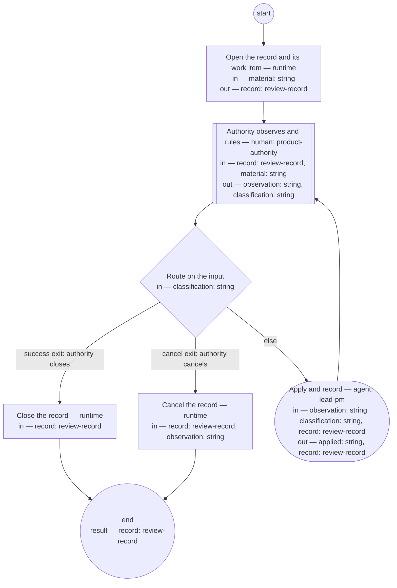

# Process: Review conversation

**Purpose:** Conduct a bounded review: the authority examines material
and issues rulings; each ruling is applied and recorded before the next
exchange; the conversation ends only when the authority closes or
cancels it, and parks itself on inactivity.

**Guiding statement:** Everything binding lands in the record; nothing
binding lives only in the transcript.

**Outcomes:**
- O1. Every ruling is applied and recorded in the anchor before the next
  observation is taken — witnessed by the check on `apply`.
- O2. The record's State section always names the next ready action or
  the outcome — witnessed by the `apply` prompt and the close steps.
- O3. Only the authority closes or cancels the conversation — witnessed
  by the `route` branches, which act only on the authority's classified
  input.
- O4. An inactive conversation holds instead of dangling — witnessed by
  `hold-after` and the run lifecycle it invokes.

**Roles:** product-authority (human seat — observes, rules, and owns the
exclusive right to close or cancel). lead-pm (applies rulings and keeps
the record current).

**Scope note:** other processes invoke this one as a sub-process step
(`execution: sub-process`) — e.g. the migration process's
authority-review is this conversation with the chain and exemplar as
material. A conversation started that way is a branched conversation:
its record carries `branched-from`.

## Flow (compiled)

Generated from the steps below by `tools/compile_process.py`; do not
edit by hand.




## Data

Each entry names a process-local value. Simple types use JSON Schema
names inline; every structured shape is a `$ref` to a defined type with
an explicit source.

```yaml
data:
  material: {type: string}
  record: {$ref: review-record, from: ../artifacts/review-record.md}
  observation: {type: string}
  classification: {type: string, enum: [ruling, question, close, cancel]}
  applied: {type: string}
```

## Steps

```yaml
start: open
parameters: [material]
result: record
steps:
  - id: open
    name: Open the record and its work item
    run-by: {execution: runtime}
    inputs: [material]
    outputs: [record]
    run: |
      bd create --title "Review conversation: ${material}"
    next: observe

  - id: observe
    name: Authority observes and rules
    run-by: {role: product-authority, execution: human}
    inputs: [record, material]
    outputs: [observation, classification]
    prompt: |
      The material and the record's current state are in front of you.
      Your message is one of: a ruling to apply, a question to answer, a
      close (the review is complete), or a cancel (the review is
      abandoned). Silence holds the conversation after the declared
      window — nothing is lost; the record carries the resume point.
    next: route

  - id: route
    name: Route on the input
    run-by: {execution: runtime}
    inputs: [classification]
    branches:
      - label: "success exit: authority closes"
        when: classification == "close"
        next: close-record
      - label: "cancel exit: authority cancels"
        when: classification == "cancel"
        next: cancel-record
      - else: apply

  - id: apply
    name: Apply and record
    run-by: {role: lead-pm, execution: agent}
    inputs: [observation, classification, record]
    outputs: [applied, record]
    checks:
      - applied != ""
    prompt: |
      Apply the observation. A ruling lands as the change it demands plus
      a numbered ledger entry — Rn, date, the ruling in one or two
      sentences, a link to the application. A question gets an answer
      grounded in the corpus; if answering produced a decision, it is a
      ruling and enters the ledger. Update the record's State to name the
      next ready action. Nothing binding stays only in the transcript.
    next: observe

  - id: close-record
    name: Close the record
    run-by: {execution: runtime}
    inputs: [record]
    run: |
      bd close ${record.work_item} --reason "Review closed: ${record.id}"
    next: end

  - id: cancel-record
    name: Cancel the record
    run-by: {execution: runtime}
    inputs: [record, observation]
    run: |
      bd close ${record.work_item} --reason "Review cancelled: ${observation}"
    next: end
```

The observe–apply loop's success exit is the authority's close; the
cancel branch is its second exit; `hold-after: P7D` is the failsafe — an
inactive run holds with its resume point in the record's State section,
per the run lifecycle.

## Derived checks

| Outcome | Check | Kind | Where |
|---|---|---|---|
| O1 | `applied` non-empty before the loop returns to `observe` | mechanical | `apply.checks` |
| O2 | State section never empty (resume point or outcome) | mechanical presence + judged | review-record checklist |
| O3 | close and cancel reachable only from the authority's classification | mechanical | `route.branches` |
| O4 | inactivity holds the run | mechanical | `hold-after` + run lifecycle |
