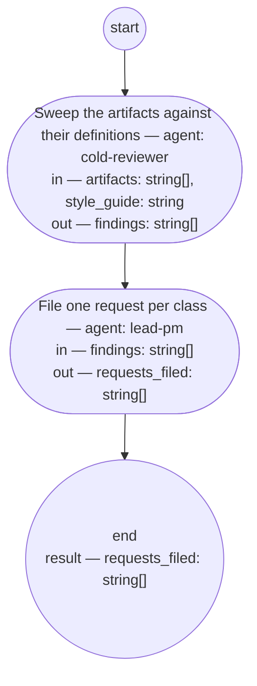

# Process: Review sweep

**Purpose:** Read a set of delivered artifacts against their own
definitions and the base writing style, and write one request per
finding class — never a repair to one artifact. Runs only when the
authority asks for it.

**Guiding statement:** A class, not an instance. A rule that fails
once is that artifact's to fix on its own next pass; a rule that fails
across artifacts is the definition's gap, and only that gap is worth a
request.

**Outcomes:**
- O1. The sweep reads only the given artifacts, the definition each
  one's own type points to, and the style guide — witnessed by
  `sweep`'s inputs.
- O2. Findings are grouped into classes — a definition gap or a prompt
  gap — never reported per instance — witnessed by `sweep`'s prompt
  and output.
- O3. One request is filed per finding class, never a repair to an
  artifact — witnessed by `file`'s prompt and output.
- O4. The sweep has no trigger of its own: it runs only on request,
  and no other process definition calls it — witnessed by this
  process carrying no `hold-after` and no caller among the approved
  process definitions.

**Roles:** sweeper — [`../roles/cold-reviewer.md`](../roles/cold-reviewer.md)
(fresh context; judges each artifact against its own definition and
the style guide). filer — [`../roles/lead-pm.md`](../roles/lead-pm.md)
(writes one request per class; never repairs an artifact).

**Carried by:**
[`../../.claude/skills/review-sweep/SKILL.md`](../../.claude/skills/review-sweep/SKILL.md)
— generated from this definition by
[`../tools/compile_process.py`](../tools/compile_process.py), never
edited by hand.

## Flow (compiled)

Generated from the steps below by `tools/compile_process.py`; do not
edit by hand.




## Data

`artifacts` is the set of delivered artifact paths the authority names
for the sweep. `style_guide` is the
[base writing style](../guidelines/base-writing-style.md).

```yaml
data:
  artifacts: {type: array, items: {type: string, format: uri-reference}}
  style_guide: {type: string, format: uri-reference, initial: basis/guidelines/base-writing-style.md}
  findings: {type: array, items: {type: string}, initial: []}
  requests_filed: {type: array, items: {type: string}, initial: []}
```

## Steps

```yaml
start: sweep
parameters: [artifacts, style_guide]
result: requests_filed
steps:
  - id: sweep
    name: Sweep the artifacts against their definitions
    run-by: {role: cold-reviewer, execution: agent, fresh-context: true}
    inputs: [artifacts, style_guide]
    outputs: [findings]
    prompt: |
      Read every path in artifacts and the definition each one's own
      type points to — its typedef, process definition, fitness set,
      or guideline — and the style guide at style_guide. Judge each
      artifact against its own definition and the style guide's word
      targets and plain-voice rules. Group what you find into finding
      classes: one class per distinct definition gap (the definition
      is wrong or missing something) or prompt gap (a prompt exceeds
      its word target or reads unclear) — never one class per
      instance. Name each class, the rule it fails, and every artifact
      it touches. Return the classes as findings.
    next: file

  - id: file
    name: File one request per class
    run-by: {role: lead-pm, execution: agent}
    inputs: [findings]
    outputs: [requests_filed]
    prompt: |
      For each class in findings, write one request into requests/
      per the request typedef: originator "review-sweep", the class
      and the artifacts it touches in section 1, status "received",
      route left open for a later discovery or small-change
      conversation to take up. Never write a request that repairs one
      artifact instance. Return the paths written.
    next: end
```

## Derived checks

| Outcome | Check | Kind | Where |
|---|---|---|---|
| O1 | `sweep` reads only `artifacts` and `style_guide` | judged | `sweep.prompt` and inputs |
| O2 | `sweep`'s output is class-shaped, named by rule and artifacts touched | judged | `sweep.prompt` |
| O3 | `file` writes one request per class, never per artifact | judged | `file.prompt` |
| O4 | no `hold-after` in frontmatter; no other approved process names `review-sweep-process` as a sub-process | mechanical | frontmatter, corpus scan |

## Document History

| Version | Date | Kind | Entry |
|---|---|---|---|
| 1 | 2026-09-08 | update | Authored under feat-flow-simplification, on the authority's word ("Quality checks will need to move into a review sweep mechanism"; "Session reviews on request only"): a cold-reviewer sweep reads a named set of delivered artifacts against their own definitions and the style guide, groups findings into classes, and the PM role files one request per class — never a repair to an instance. Runs only on request; session-handoff carries no check at close. |
