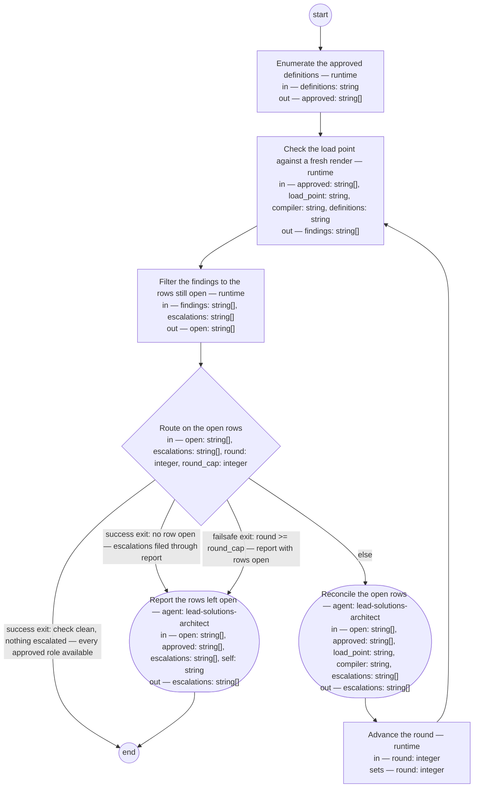

# Process: Role rendering

**Purpose:** Make every approved role definition of the lead shop
available at the agent's load point — the `.claude/agents/` directory
the harness instantiates subagents from — by checking what stands
there against a fresh render of each approved definition and
reconciling every difference through the compiler, so that an agent
filling a named role in a process step operates from the approved
definition of that role: placement at the load point is what makes
the role instantiable, and a clean check is the shop's evidence that
every approved role is available.

**Guiding statement:** A rendering is never the source of truth.
Whatever stands at the load point that a fresh render of an approved
definition would not put there is a finding, and every finding
resolves toward the definition — a re-render, a removal, or the
owner's decision on the definition — never an edit to a rendered role.

**Outcomes:**
- O1. Every approved role definition has its loadable form at the load
  point, byte-equal to a fresh render of that definition, and the
  check reports no divergence, no missing role, and no role without an
  approved definition — witnessed by `route`'s first success exit, on
  empty `open` with empty `escalations` (feature scenarios 1 and 8).
- O2. Placement is availability: a rendered role stands at the load
  point as `<load_point>/<name>.md`, where the harness reads its
  front-matter as the contract and its body as the role's prompt, and
  a role absent from it is a `missing` finding, never assumed
  instantiable — witnessed by `check`'s run and `reconcile`'s renders
  into `load_point`. This process witnesses placement only; the
  feature's scenario 2 — an agent filling a role instantiates it from
  the load point — is witnessed at delivery by a recorded instantiation
  of a role from the load point, in the feature's Document History, not
  by a step of this process.
- O3. A definition that does not stand approved yields no instantiable
  role: `enumerate` admits only approved definitions and its list is
  the set `check` renders against — the compiler refuses any listed
  definition that does not stand approved — and a `stale` rendering
  (O4) is removed at reconciliation — witnessed by `enumerate`'s run,
  its `approved` read by `check`, and the stale rows of `open` consumed
  by `reconcile` (feature scenario 3).
- O4. The check reports every defect as a row of one of five kinds,
  named here and nowhere else; the row's first word is the kind and
  its second word its subject; for `diverged`, `missing`, and `stale`
  the third word is the path the reconciliation acts on,
  `will-not-compile` carries the reason as the remainder of the row,
  and `unrecognized` has no third word: `diverged <name> <definition>`
  — a rendered role not byte-equal to a fresh render of its definition,
  whatever the cause, a hand edit or a definition amended after its
  render; `missing <name> <definition>` — an approved definition with
  nothing at the load point; `will-not-compile <definition> <reason>`
  — a definition in `approved` the compiler does not render, a refusal
  included, and for which it writes no `missing` or `diverged` row, so
  an unrenderable definition never also burns the run toward the cap;
  `stale <source> <path>` — a rendered role whose source is
  under `definitions` but not in `approved`; `unrecognized <path>` — a
  file at the load point whose source is not under `definitions`, or
  that is no rendering of its named source. `stale` and `unrecognized`
  are the two faces of a role with no approved definition — witnessed
  by the rows of `findings` that `check` writes (feature scenarios 4,
  5, and 6).
- O5. Every finding reaches its consumer and resolves toward the
  definition: `diverged` and `missing` are re-rendered, so the role
  the runtime instantiates is current with its approved definition
  after reconciliation; `stale` is removed; `unrecognized` is
  escalated by its path, never removed; `will-not-compile` lands as a
  review entry in that definition's Document History. An escalation
  never ends with the run and never burns it: a row whose subject is
  already named in `escalations` is not open, so a check clean of open
  rows with escalations standing routes through `report`, which files
  each row into the governed record the owner reads — witnessed by
  `filter`'s run, `reconcile`'s prompt, `route`'s clean-with-escalations
  branch, and `report`'s prompt (feature scenario 7).

**Roles:** reconciler and reporter —
[`../roles/lead-solutions-architect.md`](../roles/lead-solutions-architect.md)
(the compilers and the lint are this role's apparatus; it consumes the
check's findings, and its resulting action per finding is a re-render,
a removal, or an escalation). The owner — the product authority —
decides every escalated definition change; that decision lands through
governed evolution, not through a step of this process. The check
itself is mechanical and runs by the runtime against the approved
definitions and the compiler's rendering contract, so the definition
of good sits outside the role that reconciles.

**Carried by:** `.claude/skills/role-rendering/SKILL.md` — generated
from this definition by
[`../tools/compile_process.py`](../tools/compile_process.py), never
edited by hand, and placed at the skills load point by the
[skill-rendering](skill-rendering.md) process once this definition
stands approved. Until that run the carrier does not exist, so its
correspondence to this definition cannot be walked at screening time:
skill-rendering's own check — a fresh render diffed against what
stands — is the check of that correspondence, as it is for every
approved process.

## Flow (compiled)

Generated from the steps below by `tools/compile_process.py`; do not
edit by hand.




## Data

Each entry names a process-local value. Simple types use JSON Schema
names inline; conditions are CEL expressions over these names. Paths
are relative to the lead shop's repository root, the run's working
directory. The definition of good for this process is the feature
[feat-roles-availability](../../features/feat-roles-availability.md);
each outcome names the scenarios it witnesses. The *loadable form* of
a role definition is the subagent file the compiler generates from it:
front-matter carrying only the runtime keys the harness honors —
`name`, `description`, `tools`, `maxTurns`, and the optional keys a
definition may carry — plus `source` and `source-digest`, with the
shop's identity keys stripped; then a generated-file notice and the
definition's body with its Document History removed and every relative
link resolved for the load point; the term's glossary entry stands
with the loadable-form gap (lead-36apr). The harness instantiates a
subagent from `<load_point>/<name>.md`, reading the front-matter as
its contract and the body as the role's prompt, so a rendering placed
there is what an agent filling that role operates from. `definitions`
names the directory of the lead shop's role definitions and nothing
else; `load_point` is the one rendering home — the feature's *approved
source*; `self` is this definition, the governed record a path-only
escalation lands in. A write to a definition whose path is listed in
`approved` — the review entry `reconcile` or `report` puts in its
Document History — is a write to a declared input, as skill-rendering's
steps of the same names make; no output is declared for it.
`approved` is the one enumeration of what stands approved: `check`
hands it to the compiler, which renders against that list and no
other, so no second reading of "approved" can disagree with
`enumerate`. `findings` holds every row the check writes, one per
line, in the five kinds O4 names — one row per definition in
`approved` (a `will-not-compile` row stands alone; the compiler writes
no `missing` or `diverged` row for that definition) plus one per file
at the load point that is no current rendering. A `string[]` value
interpolates newline-joined into a `run` script — one row per line, so
rows may carry spaces and word-splitting is never the contract for a
row list; `filter.run` quotes its two interpolations for that reason,
while `check.run`'s `${approved}` stands unquoted because there the
split into arguments is the intent and the paths carry no spaces.
`open` holds the rows still to act
on — a row is open until its subject, the row's second word, is the
first word of a row of `escalations`, matched whole, so a row already
filed to the owner recurs in `findings` every round without recurring
in `open`. Every row of `escalations` therefore begins with the subject
it settles — a definition's path, a role name, or a path at the load
point — followed by what was filed. The compiler
renders in memory for its check and writes only where `--agent`
names, so `check` never mutates its subjects or the load point; the
load point is written only at reconciliation's re-render, where that
write is the point. A `run` step that exits nonzero is a failed step,
not an empty result: the run halts at that step and the failure is
reported to the reconciler role — it is never read as empty
`findings` and never routed as a clean check. The banned vocabulary
a rendered role's body closes with — the line "Do not use these
words:" and the list — is loaded by the compiler from the lint at
`basis/tools/lint_basis.py`, its one home, under the name `BANNED`;
neither the compiler nor this definition holds a copy, so a change to
the lint's list reaches every rendered role at the next re-render. The
check sweeps this tree's load point: a role
copied there from the frozen corpus is `unrecognized`; the corpus's
own load, in its own checkout, is outside this tree and outside the
sweep — the initiative's no-go. The run declares no `result`:
`produces` is empty because the run's value is state change — every
approved role available at the load point — and O1's witness pins it.

```yaml
data:
  definitions: {type: string, format: uri-reference, initial: basis/roles}
  compiler: {type: string, format: uri-reference, initial: basis/tools/compile_role.py}
  load_point: {type: string, format: uri-reference, initial: .claude/agents}
  self: {type: string, format: uri-reference, initial: basis/processes/role-rendering.md}
  approved: {type: array, items: {type: string}, initial: []}
  findings: {type: array, items: {type: string}, initial: []}
  open: {type: array, items: {type: string}, initial: []}
  escalations: {type: array, items: {type: string}, initial: []}
  round: {type: integer, initial: 1}
  round_cap: {type: integer, initial: 3}
```

## Steps

```yaml
start: enumerate
steps:
  - id: enumerate
    name: Enumerate the approved definitions
    run-by: {execution: runtime}
    inputs: [definitions]
    outputs: [approved]
    run: |
      for def in ${definitions}/*.md; do
        awk 'NR == 1 && !/^---$/ {exit 1} NR > 1 && /^---$/ {exit} NR > 1 && /^status: approved$/ {f = 1} END {exit !f}' "$def" \
          && printf '%s\n' "$def"
      done | sort
    next: check

  - id: check
    name: Check the load point against a fresh render
    run-by: {execution: runtime}
    inputs: [approved, load_point, compiler, definitions]
    outputs: [findings]
    run: |
      # the compiler is the last command, so its exit is this step's exit:
      # nonzero is a failed step (see Data), never empty findings
      python3 ${compiler} --check ${load_point} --roles ${definitions} --findings ${approved}
    next: filter

  - id: filter
    name: Filter the findings to the rows still open
    run-by: {execution: runtime}
    inputs: [findings, escalations]
    outputs: [open]
    run: |
      printf '%s\n' "${findings}" | while IFS= read -r row; do
        [ -n "$row" ] || continue
        subject=$(printf '%s\n' "$row" | cut -d' ' -f2)
        printf '%s\n' "${escalations}" | cut -d' ' -f1 | grep -qxF -- "$subject" \
          || printf '%s\n' "$row"
      done
    next: route

  - id: route
    name: Route on the open rows
    run-by: {execution: runtime}
    inputs: [open, escalations, round, round_cap]
    branches:
      - label: "success exit: check clean, nothing escalated — every approved role available"
        when: size(open) == 0 && size(escalations) == 0
        next: end
      - label: "success exit: no row open — escalations filed through report"
        when: size(open) == 0
        next: report
      - label: "failsafe exit: round >= round_cap — report with rows open"
        when: round >= round_cap
        next: report
      - else: reconcile

  - id: reconcile
    name: Reconcile the open rows
    run-by: {role: lead-solutions-architect, execution: agent}
    inputs: [open, approved, load_point, compiler, escalations]
    outputs: [escalations]
    prompt: |
      Act on each row of open by its kind, the first word; the second
      word is its subject. Every row you add to escalations begins with
      that subject as its first word, then what you filed. "diverged"
      or "missing": re-render — run `python3 ${compiler} <definition>
      --agent <load_point>/<name>.md`, <definition> the row's third
      word (the definition's path, listed in approved) and <name> the
      subject; the render overwrites whatever stands, a hand edit
      included — reconciliation is the re-render, never an edit to the
      rendered role. "stale": remove the file at the row's third word
      from the load point; nothing of a definition that does not stand
      approved stays instantiable. "unrecognized": do not remove; add a
      row to escalations — the subject (the file's path), then "for the
      owner to decide". "will-not-compile": do not retry; write a
      review entry into the Document History of the definition at the
      subject — its path, listed in approved — naming this process and
      the defect, and add a row to escalations — the subject, then the
      entry. Return escalations.
    next: advance-round

  - id: advance-round
    name: Advance the round
    run-by: {execution: runtime}
    inputs: [round]
    set:
      round: round + 1
    next: check

  - id: report
    name: Report the rows left open
    run-by: {role: lead-solutions-architect, execution: agent}
    inputs: [open, approved, escalations, self]
    outputs: [escalations]
    prompt: |
      This step files what leaves the run for the owner; it runs at
      the round cap with rows open, or with no row open and
      escalations standing. Every row you add to escalations begins
      with the open row's subject — its second word — as its first
      word, then what you filed. For each row of open whose subject is
      a path in approved, write a review entry into that definition's
      Document History naming this process and the row, and add to
      escalations the subject then the entry; a row whose subject is a
      role name or a path at the load point goes to escalations as the
      subject then the row's kind. Then confirm every row of
      escalations stands in a governed record the owner reads: a row
      naming a definition, as the review entry in that definition's
      Document History; every other row, in a Document History entry
      for this run written into the definition at self. The resulting
      action on each escalated row is the owner's decision. Return
      escalations.
    next: end
```

## Derived checks

| Outcome | Check | Kind | Where |
|---|---|---|---|
| O1 | the run's first exit requires `size(open) == 0 && size(escalations) == 0`; with `escalations` standing an open-clean check routes through `report` | mechanical | `route` branches |
| O2 | every approved definition without its rendering at the load point yields a `missing` row; renders land only under `load_point`, as `<load_point>/<name>.md` | mechanical | `check.run`, `reconcile.prompt` |
| O3 | `enumerate` admits only a `status: approved` line inside the front-matter block; `check` passes `approved` to the compiler, which refuses any listed definition not approved and marks `stale` a source under `definitions` outside the list; `reconcile` removes each `stale` row | mechanical | `enumerate.run`, `check.run`, `reconcile.prompt` |
| O4 | every row's first word is one of the five kinds O4 names, its second word its subject, and its third word — for `diverged`, `missing`, `stale` — the path acted on, `will-not-compile` carrying the reason as the remainder; the kinds are defined in O4 alone and referenced by name everywhere else | mechanical | `check.run` |
| O5 | `filter` drops each row whose subject equals the first word of a row of `escalations`, whole-word, and `reconcile` and `report` write that word first; a `will-not-compile` definition yields no `missing` or `diverged` row, so once escalated it leaves nothing open; `diverged` and `missing` re-rendered, `stale` removed, `unrecognized` escalated by path and never removed, `will-not-compile` filed as a review entry; every escalation row lands in a governed record — the named definition's Document History, or the run entry in `self` | judged | `filter.run`, `reconcile` and `report` prompts, `route` branches |

## Document History

| Version | Date | Kind | Entry |
|---|---|---|---|
| 1 | 2026-09-03 | update | Authored under init-roles-availability's feature feat-roles-availability as the initiative's deliverable, a sibling of skill-rendering for roles: the load point `.claude/agents/`, the source `basis/roles/`, the compiler `basis/tools/compile_role.py` (authored with this definition; the harness's runtime keys pass through, the shop's identity keys and Document History are stripped, links are resolved for the load point, only `status: approved` compiles). Finding kinds taken from skill-rendering so the two processes share one vocabulary — `diverged` for a rendering not byte-equal to a fresh render, `stale` for a source that does not stand approved. Each outcome names the feature scenarios it witnesses. No second rendering home exists for roles, so no `second-home` finding. Draft, not yet run: nothing rendered at the load point until the owner approves. |
| 2 | 2026-09-03 | review | Round 1 (judge: claude-fable-5-1 / screen prompt v6; criteria process-definition.fitness.md, framing the feature): findings — F1 the clean exits tested every finding, so an escalated row recurring each round made the clean-with-escalations exit unreachable and runs burned to the cap (a runtime `filter` step now yields `open`, the rows whose subject is not yet in `escalations`; `route`, `reconcile`, and `report` work from `open`; the cap stays for rows genuinely unresolved); F2 O4 listed four kinds while `will-not-compile` was a fifth consumed by O5 (O4 is now the one home of the five kinds with their triggers, referenced by name elsewhere; the compiler's `will-not-compile` row carries the definition's path as its subject); F3 O2 cited feature scenario 2 as witnessed by this process, which has no demonstration step (PM ruling: scenario 2 is witnessed at delivery by a recorded instantiation of a role from the load point in the feature's Document History; O2 witnesses placement only); F4 the carrier's disclosed deferral (PM ruling: stands, as skill-rendering's approval accepted the same); F5 `report` wrote a path-only row to a location no input declared (`self` declared as data and listed as `report`'s input); F6 `check` computed "approved" on its own, so `enumerate` gated only `reconcile` (`approved` is `check`'s input, handed to the compiler's `--check` as the set to render against — the compiler now takes it — so `enumerate`'s run witnesses O3). Repaired; F3 and F4 ruled by the PM role as recorded. |
| 3 | 2026-09-03 | review | Round 2 (judge: claude-fable-5-1 / screen prompt v6): findings — F1 `filter.run` word-split `${findings}` and matched the subject by substring (rows now iterated as lines with `while IFS= read -r`; the subject matched whole against the first word of each escalation row; `reconcile` and `report` directed to write the subject as the escalation row's first word); F2 `reconcile` and `report` write review entries into definitions with no output declared (PM ruling: a write to a file whose path is listed in the declared `approved` input is a write to a declared input, as skill-rendering's steps of the same names make — stated in Data, no new outputs); F3 the feature's *approved source* had no equivalence in Data (added: `load_point` is the one rendering home — the feature's approved source); F4 `enumerate`'s grep admitted a `status: approved` line anywhere in a file (restricted to the front-matter block by awk — a file not opening with `---` is not admitted; skill-rendering keeps its grep — this tightening stands on its own); F5 (round-1 ruling stands); F6 the role-name-to-definition mapping for re-renders was unstated (the compiler writes the definition's path as the third word of `diverged` and `missing` rows, as `stale` carries its path; the prompt uses it). Repaired; F2 ruled by the PM role as recorded; F5 stands on the round-1 ruling. |
| 4 | 2026-09-03 | review | Round 3, the cap (judge: claude-fable-5-1 / screen prompt v6): one confident and three wobbly findings — F1 `filter.run` interpolated `${findings}` and `${escalations}` unquoted, word-splitting rows that carry spaces (both quoted; Data states that a `string[]` interpolates newline-joined into a `run` script, so word-splitting is never the contract for a row list, while `check.run`'s `${approved}` stays unquoted because the split into arguments is the intent there); F2 a definition that will not compile could also yield a `missing` row and burn the run to the cap (the compiler writes no `missing` or `diverged` row for a `will-not-compile` definition — stated in O4 and Data, added to O5's derived check, tested); F3 O4's third-word sentence did not match its own row shapes (aligned: the third word is the path for `diverged`, `missing`, and `stale`; `will-not-compile` carries the reason as the remainder; `unrecognized` has none); F4 `reconcile`'s unrecognized clause read as writing the path twice (reworded: the subject (the file's path), then "for the owner to decide"). Repaired post-cap by the PM role's direction, disclosed. |
| 5 | 2026-09-03 | state | draft → approved by the owner, on the authority's standing direction for this session ("run this through to the end since it is low-risk"), recorded by the lead-pm: three screen rounds against the process-definition fitness set (judge claude-fable-5-1 / v6), the confident findings of each round repaired, the post-cap repairs disclosed in the round-3 row; the definition of good the feature feat-roles-availability. Bootstrap disclosed: the carrier is rendered by skill-rendering after this approval; the check that follows is the correspondence check. |
| 5 | 2026-09-03 | update | First run over the corpus, invoked through its own carrier at the load point: round 1 — enumerate admitted 6 definitions, check found 6 `missing` (the load point `.claude/agents/` did not exist), filter left all 6 open, reconcile rendered each with `compile_role.py --agent` (the render created the load point); round 2 — check clean, no row open, nothing escalated: the first success exit. Every approved role is available: 6 of 6, zero divergence. No stale, unrecognized, or will-not-compile row. Observed in the run's harness, filed for the owner: a check whose compiler exits without rows — a crash, not a clean result — reads as empty `findings` and routes to the clean exit; the definition (skill-rendering's check has the same shape) does not distinguish an empty result from a failed step. |
| 6 | 2026-09-04 | update | Owner's ruling of 2026-09-04 on brief-034 ask 4 (lead-xmuft), applied: a nonzero step exit is a failed step, not an empty result; compilers emit a will-not-compile row for a path they cannot read instead of crashing. |
| 7 | 2026-09-05 | update | req-2026-09-05-banned-words-inlined, applied at the small-change lane's make step: the compiler inlines the banned line — "Do not use these words: " and the lint's list — into the body of every rendered role, at its end; the list is loaded from the lint at basis/tools/lint_basis.py, its one home, named in Data. |
